# Merk 트리 -- 머클 AVL 트리

Merk 트리는 GroveDB의 기본 구성 요소입니다. 그로브의 모든 서브트리는 Merk 트리입니다. Merk 트리는 모든 노드가 암호학적으로 해시되어 전체 트리의 내용을 인증하는 단일 루트 해시를 생성하는 자기 균형 이진 검색 트리입니다.

## Merk 노드란?

많은 머클 트리 구현체에서 데이터가 리프에만 존재하는 것과 달리, Merk 트리에서는 **모든 노드가 키-값 쌍을 저장**합니다. 즉, "빈" 내부 노드가 없습니다 -- 트리는 검색 구조이자 데이터 저장소입니다.

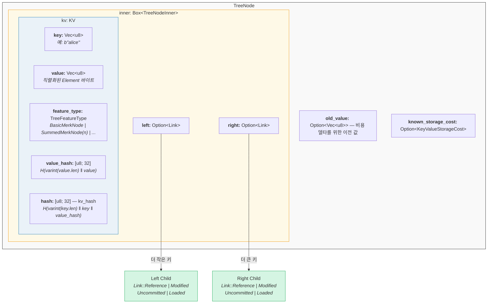

코드 (`merk/src/tree/mod.rs`):

```rust
pub struct TreeNode {
    pub(crate) inner: Box<TreeNodeInner>,
    pub(crate) old_value: Option<Vec<u8>>,        // 비용 추적을 위한 이전 값
    pub(crate) known_storage_cost: Option<KeyValueStorageCost>,
}

pub struct TreeNodeInner {
    pub(crate) left: Option<Link>,    // 왼쪽 자식 (더 작은 키)
    pub(crate) right: Option<Link>,   // 오른쪽 자식 (더 큰 키)
    pub(crate) kv: KV,               // 키-값 페이로드
}
```

`Box<TreeNodeInner>`는 노드를 힙에 유지하는데, 자식 링크가 재귀적으로 전체 `TreeNode` 인스턴스를 포함할 수 있기 때문에 이것이 필수적입니다.

## KV 구조체

`KV` 구조체는 원시 데이터와 암호학적 다이제스트를 모두 보유합니다
(`merk/src/tree/kv.rs`):

```rust
pub struct KV {
    pub(super) key: Vec<u8>,                        // 조회 키
    pub(super) value: Vec<u8>,                      // 저장된 값
    pub(super) feature_type: TreeFeatureType,       // 집계 동작
    pub(crate) value_defined_cost: Option<ValueDefinedCostType>,
    pub(super) hash: CryptoHash,                    // kv_hash
    pub(super) value_hash: CryptoHash,              // H(value)
}
```

두 가지 중요한 점:

1. **키는 인코딩된 노드의 일부로 디스크에 저장되지 않습니다.** RocksDB 키로 저장됩니다. 노드가 스토리지에서 디코딩될 때 키는 외부에서 주입됩니다. 이렇게 하면 키 바이트의 중복을 방지합니다.

2. **두 개의 해시 필드가 유지됩니다.** `value_hash`는 `H(value)`이고 `hash`(kv_hash)는 `H(key, value_hash)`입니다. 둘 다 유지하면 증명 시스템이 얼마나 많은 정보를 공개할지 선택할 수 있습니다.

## 준균형 특성 -- AVL의 "흔들림"

Merk 트리는 **AVL 트리**입니다 -- Adelson-Velsky와 Landis가 발명한 고전적인 자기 균형 이진 검색 트리입니다. 핵심 불변식(invariant)은:

> 모든 노드에서 왼쪽 서브트리와 오른쪽 서브트리의 높이 차이는 최대 1입니다.

이것은 **균형 인수(balance factor)**로 표현됩니다:

```text
balance_factor = right_height - left_height
```

유효한 값: **{-1, 0, 1}**

```rust
// merk/src/tree/mod.rs
pub const fn balance_factor(&self) -> i8 {
    let left_height = self.child_height(true) as i8;
    let right_height = self.child_height(false) as i8;
    right_height - left_height
}
```

여기서 미묘한 점은: 각 개별 노드는 한 레벨만 기울 수 있지만, 이러한 기울기가 트리 전체에서 **누적**될 수 있다는 것입니다. 이것이 "준균형(semi-balanced)"이라고 부르는 이유입니다 -- 트리가 완전 이진 트리처럼 완벽하게 균형잡혀 있지는 않습니다.

10개 노드의 트리를 생각해 봅시다. 완벽하게 균형잡힌 트리의 높이는 4(ceil(log2(10+1)))입니다. 하지만 AVL 트리의 높이는 5일 수 있습니다:

**완벽하게 균형잡힌 (높이 4)** -- 모든 레벨이 완전히 채워짐:

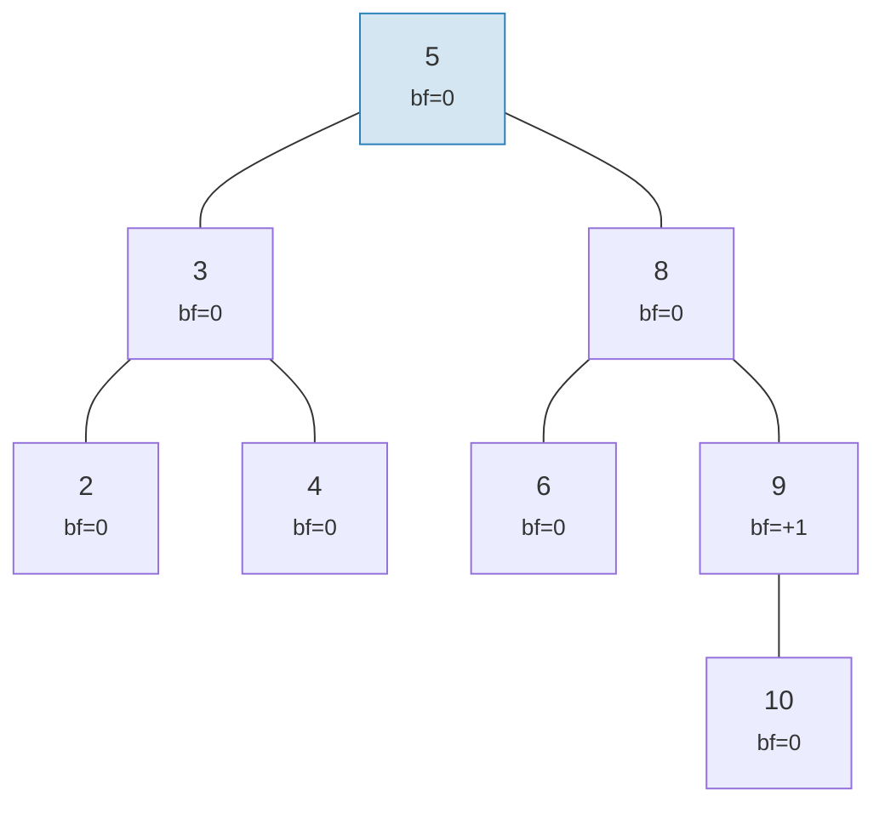

**AVL-유효 "흔들림" (높이 5)** -- 각 노드가 최대 1 기울어지지만 누적됨:

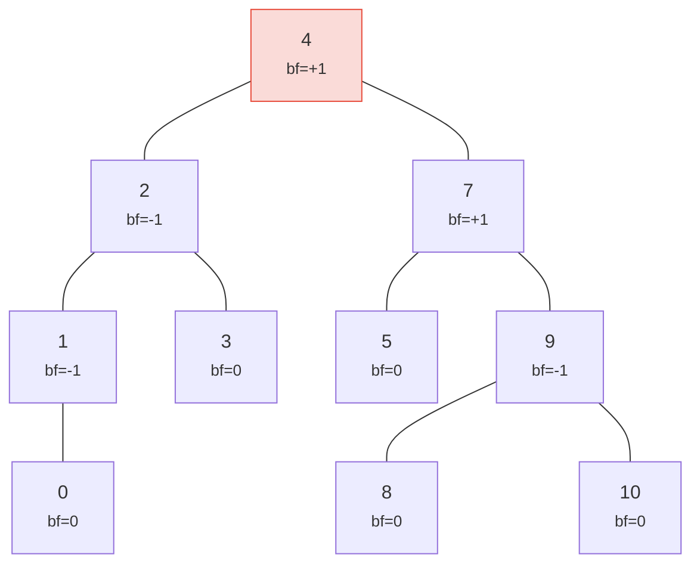

> 높이 5 대 완벽한 4 -- 이것이 "흔들림"입니다. 최악의 경우: h <= 1.44 x log2(n+2).

두 트리 모두 유효한 AVL 트리입니다! AVL 트리의 최악 높이는:

```text
h <= 1.4404 x log2(n + 2) - 0.3277
```

따라서 **n = 1,000,000** 노드의 경우:
- 완벽한 균형: 높이 20
- AVL 최악: 높이 약 29

이 약 44% 오버헤드가 AVL의 간단한 회전 규칙의 대가입니다. 실제로 무작위 삽입은 완벽하게 균형잡힌 것에 훨씬 가까운 트리를 생성합니다.

유효한 트리와 유효하지 않은 트리의 모습은 다음과 같습니다:

**유효** -- 모든 균형 인수가 {-1, 0, +1} 범위:

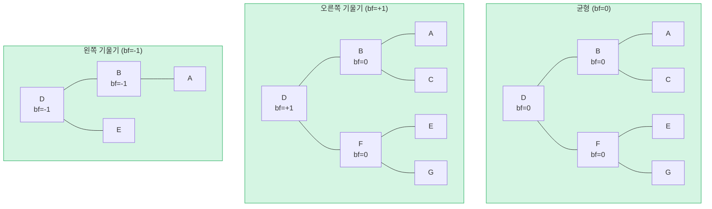

**유효하지 않음** -- 균형 인수 = +2 (회전 필요!):

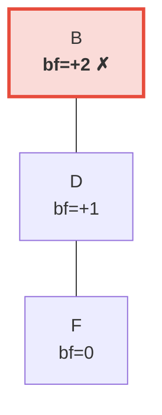

> 오른쪽 서브트리가 왼쪽(비어있음)보다 2레벨 더 높습니다. 이것은 AVL 불변식을 복원하기 위해 **왼쪽 회전**을 트리거합니다.

## 회전 -- 균형 복원

삽입이나 삭제로 인해 균형 인수가 +/-2에 도달하면, 트리는 AVL 불변식을 복원하기 위해 **회전**해야 합니다. 네 가지 경우가 있으며, 두 가지 기본 연산으로 축소됩니다.

### 단순 왼쪽 회전

노드가 **오른쪽 과중**(bf = +2)이고 오른쪽 자식이 **오른쪽 과중이거나 균형**(bf >= 0)일 때 사용됩니다:

**이전** (bf=+2):

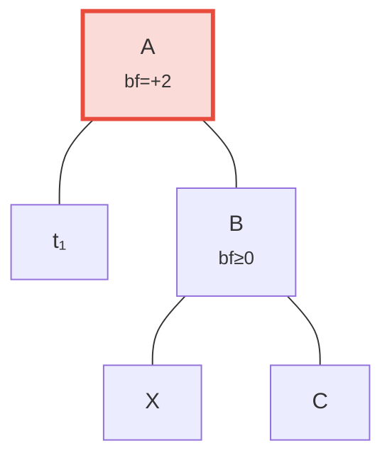

**이후** 왼쪽 회전 -- B가 루트로 승격:

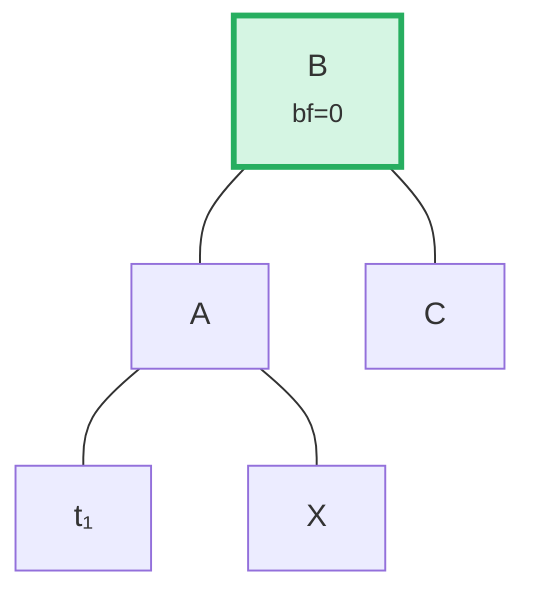

> **단계:** (1) A에서 B를 분리합니다. (2) X(B의 왼쪽 자식)를 분리합니다. (3) X를 A의 오른쪽 자식으로 연결합니다. (4) A를 B의 왼쪽 자식으로 연결합니다. B를 루트로 하는 서브트리가 이제 균형잡혔습니다.

코드 (`merk/src/tree/ops.rs`):

```rust
fn rotate<V>(self, left: bool, ...) -> CostResult<Self, Error> {
    // 과중한 쪽의 자식 분리
    let (tree, child) = self.detach_expect(left, ...);
    // 자식의 반대쪽 손자 분리
    let (child, maybe_grandchild) = child.detach(!left, ...);

    // 손자를 원래 루트에 연결
    tree.attach(left, maybe_grandchild)
        .maybe_balance(...)
        .flat_map_ok(|tree| {
            // 원래 루트를 승격된 노드의 자식으로 연결
            child.attach(!left, Some(tree))
                .maybe_balance(...)
        })
}
```

`maybe_balance`가 재귀적으로 호출되는 것에 주목하세요 -- 회전 자체가 추가 수정이 필요한 새로운 불균형을 만들 수 있습니다.

### 이중 회전 (왼쪽-오른쪽)

노드가 **왼쪽 과중**(bf = -2)이지만 왼쪽 자식이 **오른쪽 과중**(bf > 0)일 때 사용됩니다. 단순 회전으로는 이 문제를 해결할 수 없습니다:

**0단계: 이전** -- C가 왼쪽 과중(bf=-2)이지만 왼쪽 자식 A가 오른쪽으로 기울어짐(bf=+1). 단순 회전으로는 해결 불가:

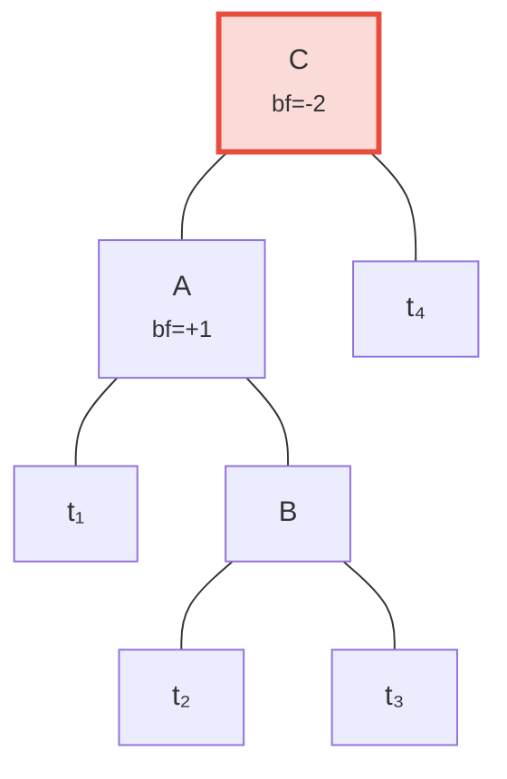

**1단계: 자식 A를 왼쪽 회전** -- 이제 C와 B 모두 왼쪽으로 기울어져 단순 회전으로 해결 가능:

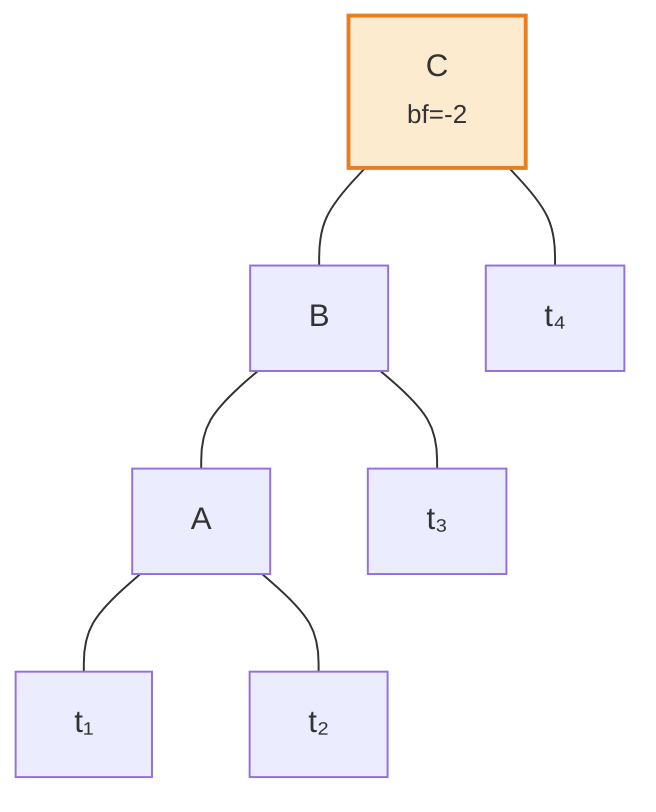

**2단계: 루트 C를 오른쪽 회전** -- 균형 달성!

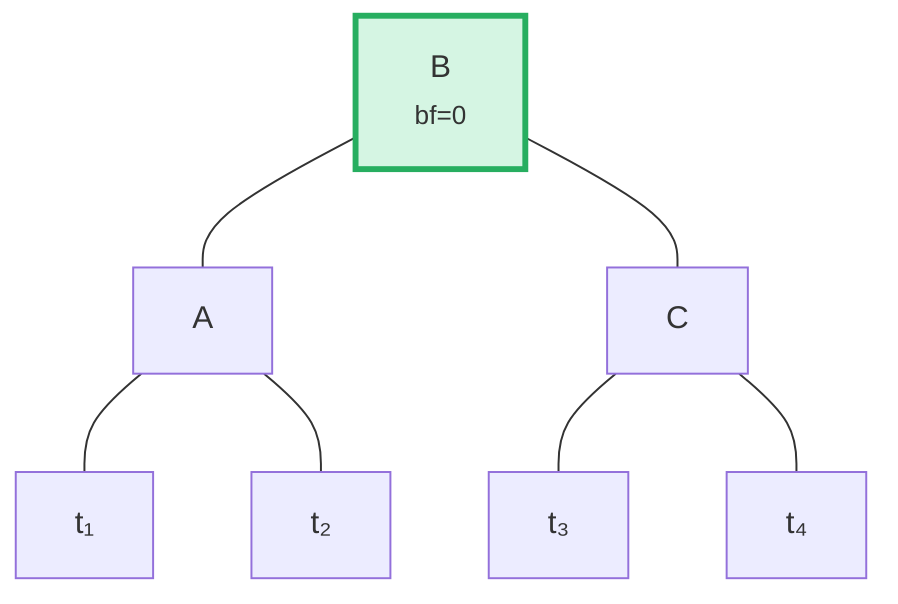

알고리즘은 부모의 기울기 방향과 자식의 균형 인수를 비교하여 이 경우를 감지합니다:

```rust
fn maybe_balance<V>(self, ...) -> CostResult<Self, Error> {
    let balance_factor = self.balance_factor();
    if balance_factor.abs() <= 1 {
        return Ok(self);  // 이미 균형잡힘
    }

    let left = balance_factor < 0;  // 왼쪽 과중이면 true

    // 자식이 부모와 반대로 기울어져 있으면 이중 회전 필요
    let tree = if left == (self.tree().link(left).unwrap().balance_factor() > 0) {
        // 첫 번째 회전: 자식을 반대 방향으로 회전
        self.walk_expect(left, |child|
            child.rotate(!left, ...).map_ok(Some), ...
        )
    } else {
        self
    };

    // 두 번째 (또는 유일한) 회전
    tree.rotate(left, ...)
}
```

## 배치 연산 -- 구축과 적용

요소를 하나씩 삽입하는 대신, Merk는 여러 변경 사항을 한 번의 패스로 적용하는 배치 연산을 지원합니다. 이것은 효율성에 매우 중요합니다: M개 요소의 트리에 대한 N개 연산의 배치는 **O((M + N) log(M + N))** 시간이 걸리며, 순차 삽입의 O(N log M)과 비교됩니다.

### MerkBatch 타입

```rust
type MerkBatch<K> = [(K, Op)];

enum Op {
    Put(Vec<u8>, TreeFeatureType),  // 값과 기능 타입으로 삽입 또는 업데이트
    PutWithSpecializedCost(...),     // 사전 정의된 비용으로 삽입
    PutCombinedReference(...),       // 결합 해시를 가진 참조 삽입
    Replace(Vec<u8>, TreeFeatureType),
    Patch { .. },                    // 부분 값 업데이트
    Delete,                          // 키 제거
    DeleteLayered,                   // 레이어드 비용으로 제거
    DeleteMaybeSpecialized,          // 선택적 특수 비용으로 제거
}
```

### 전략 1: build() -- 처음부터 구축

트리가 비어있을 때, `build()`는 **중앙값 분할(median-split)** 알고리즘을 사용하여 정렬된 배치에서 직접 균형잡힌 트리를 구성합니다:

입력 배치 (정렬됨): `[A, B, C, D, E, F, G]` -- 중간값(D)을 루트로 선택하고 각 절반에 대해 재귀:

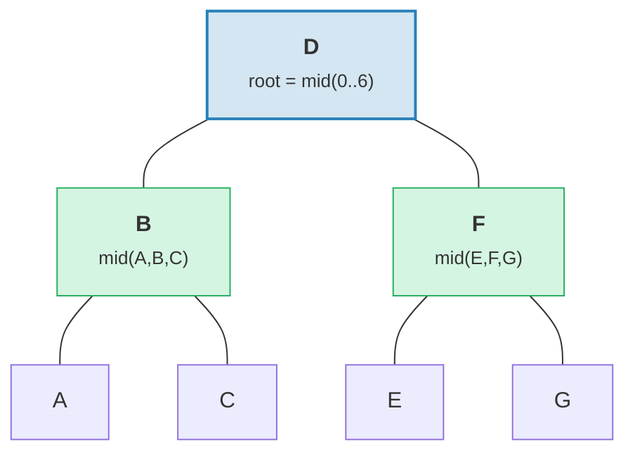

> 결과: 높이 = 3 = ceil(log2(7))인 완벽하게 균형잡힌 트리.

```rust
fn build(batch: &MerkBatch<K>, ...) -> CostResult<Option<TreeNode>, Error> {
    let mid_index = batch.len() / 2;
    let (mid_key, mid_op) = &batch[mid_index];

    // 중간 요소에서 루트 노드 생성
    let mid_tree = TreeNode::new(mid_key.clone(), value.clone(), None, feature_type)?;

    // 왼쪽과 오른쪽 서브트리를 재귀적으로 구축
    let left = Self::build(&batch[..mid_index], ...);
    let right = Self::build(&batch[mid_index + 1..], ...);

    // 자식 연결
    mid_tree.attach(true, left).attach(false, right)
}
```

이것은 높이 ceil(log2(n))인 트리를 생성합니다 -- 완벽하게 균형잡힘.

### 전략 2: apply_sorted() -- 기존 트리에 병합

트리에 이미 데이터가 있을 때, `apply_sorted()`는 **이진 검색**을 사용하여 각 배치 연산이 속하는 위치를 찾은 다음, 왼쪽과 오른쪽 서브트리에 재귀적으로 연산을 적용합니다:

배치 `[(B, Put), (F, Delete)]`가 있는 기존 트리:

이진 검색: B < D (왼쪽으로), F > D (오른쪽으로).

**이전:**
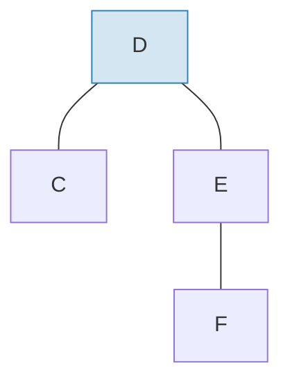

**이후** 배치 적용 및 재균형:
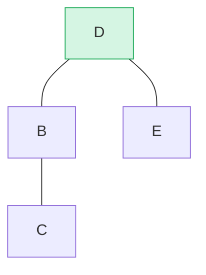

> B가 왼쪽 서브트리에 삽입되고, F가 오른쪽 서브트리에서 삭제되었습니다. `maybe_balance()`가 bf(D) = 0임을 확인합니다.

```rust
fn apply_sorted(self, batch: &MerkBatch<K>, ...) -> CostResult<...> {
    let search = batch.binary_search_by(|(key, _)| key.cmp(self.tree().key()));

    match search {
        Ok(index) => {
            // 이 노드와 키가 일치 -- 연산을 직접 적용
            // (Put은 값을 교체, Delete는 노드를 제거)
        }
        Err(mid) => {
            // 키를 찾지 못함 -- mid가 분할 지점
            // left_batch[..mid]와 right_batch[mid..]에 대해 재귀
        }
    }

    self.recurse(batch, mid, exclusive, ...)
}
```

`recurse` 메서드는 배치를 분할하고 왼쪽과 오른쪽으로 순회합니다:

```rust
fn recurse(self, batch: &MerkBatch<K>, mid: usize, ...) {
    let left_batch = &batch[..mid];
    let right_batch = &batch[mid..];  // exclusive이면 mid+1

    // 왼쪽 서브트리에 왼쪽 배치 적용
    let tree = self.walk(true, |maybe_left| {
        Self::apply_to(maybe_left, left_batch, ...)
    });

    // 오른쪽 서브트리에 오른쪽 배치 적용
    let tree = tree.walk(false, |maybe_right| {
        Self::apply_to(maybe_right, right_batch, ...)
    });

    // 수정 후 재균형
    tree.maybe_balance(...)
}
```

### 노드 제거

두 자식이 있는 노드를 삭제할 때, Merk는 더 높은 서브트리에서 **가장자리 노드(edge node)**를 승격시킵니다. 이것은 추가 회전이 필요할 가능성을 최소화합니다:

**이전** -- D 삭제 (두 자식이 있고, 오른쪽 서브트리 높이 >= 왼쪽):

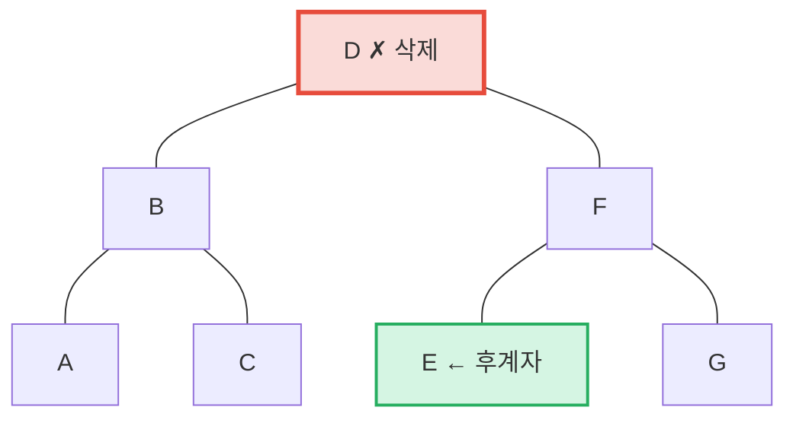

**이후** -- E(오른쪽 서브트리에서 가장 왼쪽 = 중위 후계자)가 D의 위치로 승격:

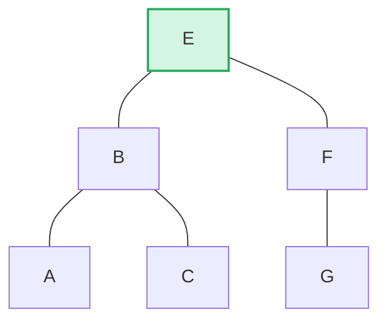

> **규칙:** 왼쪽 높이 > 오른쪽이면 왼쪽 서브트리의 오른쪽 가장자리를 승격합니다. 오른쪽 높이 >= 왼쪽이면 오른쪽 서브트리의 왼쪽 가장자리를 승격합니다. 이것은 삭제 후 재균형을 최소화합니다.

```rust
pub fn remove(self, ...) -> CostResult<Option<Self>, Error> {
    let has_left = tree.link(true).is_some();
    let has_right = tree.link(false).is_some();
    let left = tree.child_height(true) > tree.child_height(false);

    if has_left && has_right {
        // 두 자식: 더 높은 자식의 가장자리를 승격
        let (tree, tall_child) = self.detach_expect(left, ...);
        let (_, short_child) = tree.detach_expect(!left, ...);
        tall_child.promote_edge(!left, short_child, ...)
    } else if has_left || has_right {
        // 한 자식: 직접 승격
        self.detach_expect(left, ...).1
    } else {
        // 리프 노드: 그냥 제거
        None
    }
}
```

---
