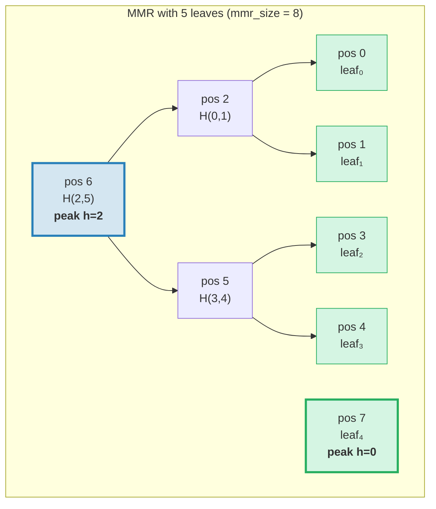
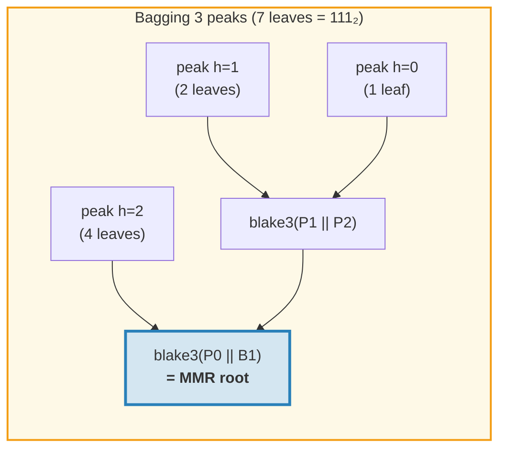
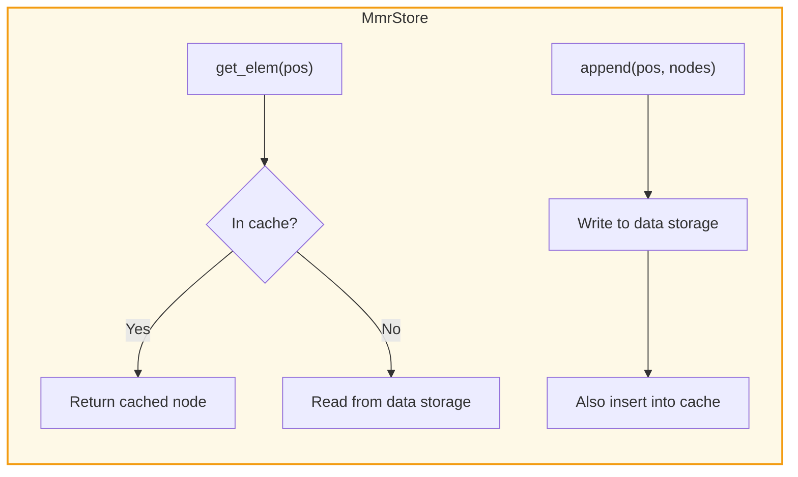
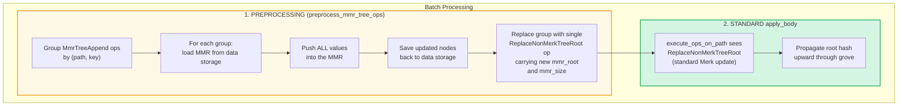
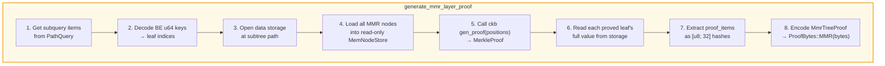
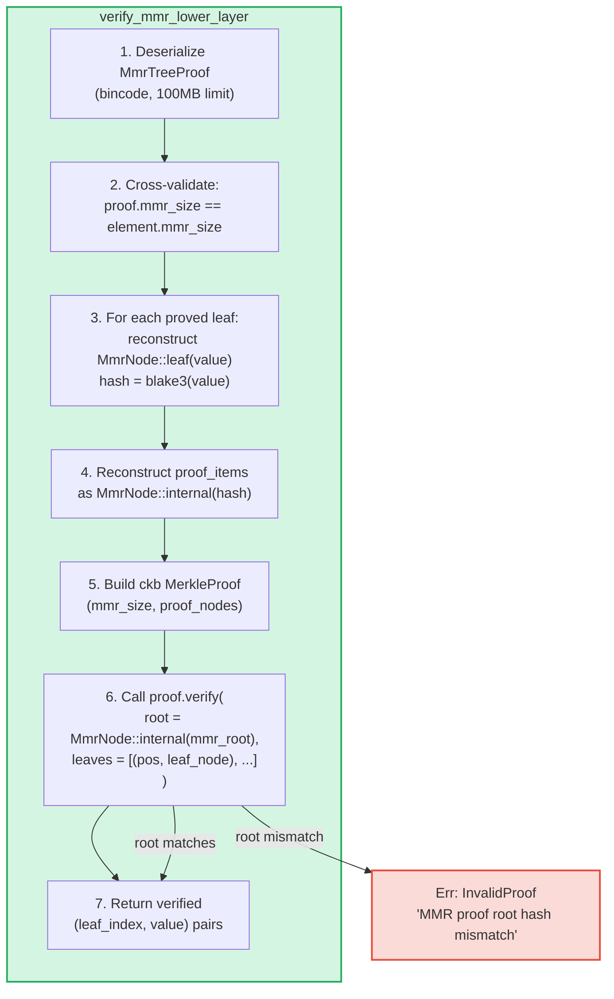

# MMR 트리 -- 추가 전용 인증 로그

**MmrTree**는 Blake3 해싱을 사용하는 머클 산맥(Merkle Mountain Range, MMR) 위에 구축된 GroveDB의 추가 전용 인증 데이터 구조입니다. Merk AVL 트리(2장)가 O(log N) 업데이트를 가진 임의 키-값 연산에 뛰어난 반면, MMR은 추가 전용 사용 사례를 위해 특별히 설계되었습니다: 회전이 없고, 추가당 O(1) 상각 해시 비용, 그리고 순차적 I/O 패턴을 제공합니다.

이 장에서는 MMR 데이터 구조를 깊이 다룹니다 -- 어떻게 성장하는지, 노드가 어떻게 저장되는지, 추가가 어떻게 연쇄되는지, 그리고 증명 시스템이 어떻게 제3자가 특정 값이 특정 위치에 추가되었음을 검증할 수 있게 하는지를 설명합니다.

## 별도의 트리 타입이 필요한 이유

GroveDB의 표준 Merk 트리는 정렬된 키-값 데이터를 잘 처리하지만, 추가 전용 로그는 다른 요구사항을 가집니다:

| 속성 | Merk AVL 트리 | MMR |
|----------|--------------|-----|
| 연산 | 삽입, 업데이트, 삭제 | 추가만 |
| 리밸런싱 | 쓰기당 O(log N) 회전 | 없음 |
| I/O 패턴 | 랜덤 (리밸런싱이 많은 노드를 건드림) | 순차적 (새 노드는 항상 끝에) |
| N회 삽입의 총 해시 | O(N log N) | O(N) |
| 구조 | 삽입 순서에 의해 결정 | 리프 수에 의해서만 결정 |
| 증명 | 루트에서 리프까지의 경로 | 형제 + 피크 해시 |

트랜잭션 로그, 이벤트 스트림, 또는 단조 증가하는 데이터와 같은 사용 사례에서 MMR이 엄밀히 더 우수합니다: 더 단순하고, 빠르며, 예측 가능합니다.

## MMR 데이터 구조

MMR은 좌에서 우로 성장하는 **완전 이진 트리의 숲**(피크(peak)라 불림)입니다. 각 피크는 높이 *h*의 완전 이진 트리로, 정확히 2^h개의 리프를 포함합니다.

핵심 통찰: **리프 수의 이진 표현이 피크 구조를 결정합니다**. 이진 형태의 각 1-비트가 하나의 피크에 대응합니다:

```text
Leaf count    Binary    Peaks
─────────     ──────    ─────
1             1         one peak h=0
2             10        one peak h=1
3             11        peaks h=1, h=0
4             100       one peak h=2
5             101       peaks h=2, h=0
6             110       peaks h=2, h=1
7             111       peaks h=2, h=1, h=0
8             1000      one peak h=3
```

이것은 MMR 구조가 단일 숫자 -- 리프 수에 의해 완전히 결정된다는 것을 의미합니다. 같은 수의 리프를 가진 두 MMR은 어떤 값이 추가되었는지에 관계없이 항상 같은 형태를 가집니다.

## MMR이 채워지는 방식

MMR의 각 노드는 **위치(position)**(0-인덱스)를 가집니다. 리프와 내부 노드가 특정 패턴으로 교차 배치됩니다. 단계별 성장은 다음과 같습니다:

**1개 리프 후 (mmr_size = 1):**
```text
pos:  0
      leaf₀        ← one peak at height 0
```

**2개 리프 후 (mmr_size = 3):**
```text
pos:     2          ← internal: blake3(leaf₀.hash || leaf₁.hash)
        / \
       0   1        ← leaves

One peak at height 1. Positions 0 and 1 are leaves, position 2 is internal.
```
leaf₁이 추가되었을 때, 높이-0 피크가 생성되었습니다. 하지만 이미 높이-0 피크(leaf₀)가 있었으므로, 둘이 높이-1 피크로 **병합**되었습니다.

**3개 리프 후 (mmr_size = 4):**
```text
pos:     2     3    ← peak h=1, peak h=0
        / \
       0   1

Two peaks. No merge — heights 1 and 0 are different.
(Binary: 3 = 11₂ → one peak per 1-bit)
```

**4개 리프 후 (mmr_size = 7):**
```text
pos:         6              ← internal: merge of nodes 2 and 5
           /   \
         2       5          ← internal nodes
        / \     / \
       0   1   3   4        ← leaves

One peak at height 2.
```
여기서 흥미로운 점이 있습니다. leaf₃(위치 4)를 추가하면 node₅가 생성됩니다(위치 3과 4의 병합). 하지만 이제 node₅(높이 1)와 node₂(높이 1)가 같은 높이의 인접 피크이므로, node₆으로 병합됩니다. **단일 추가에서 두 번의 연쇄 병합이 발생합니다.**

**5개 리프 후 (mmr_size = 8):**
```text
pos:         6         7    ← peak h=2, peak h=0
           /   \
         2       5
        / \     / \
       0   1   3   4

Two peaks. (Binary: 5 = 101₂)
```

**7개 리프 후 (mmr_size = 11):**
```text
pos:         6         10    ← peak h=2, peak h=1, peak h=0
           /   \      / \
         2       5   8   9    7
        / \     / \
       0   1   3   4

Three peaks. (Binary: 7 = 111₂)
```

**8개 리프 후 (mmr_size = 15):**
```text
pos:              14                     ← single peak h=3
               /      \
            6            13
          /   \        /    \
        2       5    9       12
       / \     / \  / \     / \
      0   1   3  4 7   8  10  11

One peak at height 3. Three cascading merges from appending leaf₇.
```



> **파란색** = 피크(완전 이진 서브트리의 루트). **초록색** = 리프 노드.

## 병합 연쇄

새 리프가 추가되면 병합 체인이 트리거될 수 있습니다. 병합 횟수는 현재 리프 수의 이진 표현에서 **후행 1-비트(trailing 1-bits)** 수와 같습니다:

| 리프 수 (push 전) | 이진 | 후행 1 수 | 병합 | 총 해시 |
|--------------------------|--------|-------------|--------|--------------|
| 0 | `0` | 0 | 0 | 1 (리프만) |
| 1 | `1` | 1 | 1 | 2 |
| 2 | `10` | 0 | 0 | 1 |
| 3 | `11` | 2 | 2 | 3 |
| 4 | `100` | 0 | 0 | 1 |
| 5 | `101` | 1 | 1 | 2 |
| 6 | `110` | 0 | 0 | 1 |
| 7 | `111` | 3 | 3 | 4 |

**push당 총 해시** = `1 + trailing_ones(leaf_count)`:
- 리프 자체를 위한 1회 해시: `blake3(value)`
- 병합 연쇄를 위한 N회 해시: 각 병합마다 `blake3(left.hash || right.hash)`

이것이 GroveDB가 각 추가의 해시 비용을 추적하는 방식입니다. 구현:
```rust
pub fn hash_count_for_push(leaf_count: u64) -> u32 {
    1 + leaf_count.trailing_ones()
}
```

## MMR 크기 대 리프 수

MMR은 리프와 내부 노드를 모두 평탄한 위치 공간에 저장하므로, `mmr_size`는 항상 리프 수보다 큽니다. 정확한 관계는:

```text
mmr_size = 2 * leaf_count - popcount(leaf_count)
```

여기서 `popcount`는 1-비트의 수(즉, 피크의 수)입니다. 각 내부 노드는 두 서브트리를 병합하여, 병합당 노드 수를 하나씩 줄입니다.

역 계산 -- mmr_size에서 리프 수를 구하기 -- 은 피크 위치를 사용합니다:

```rust
fn mmr_size_to_leaf_count(mmr_size: u64) -> u64 {
    // Each peak at height h contains 2^h leaves
    get_peaks(mmr_size).iter()
        .map(|&peak_pos| 1u64 << pos_height_in_tree(peak_pos))
        .sum()
}
```

| mmr_size | leaf_count | 피크 |
|----------|-----------|-------|
| 0 | 0 | (비어있음) |
| 1 | 1 | h=0 |
| 3 | 2 | h=1 |
| 4 | 3 | h=1, h=0 |
| 7 | 4 | h=2 |
| 8 | 5 | h=2, h=0 |
| 10 | 6 | h=2, h=1 |
| 11 | 7 | h=2, h=1, h=0 |
| 15 | 8 | h=3 |

GroveDB는 엘리먼트에 `mmr_size`를 저장합니다(리프 수가 아님). ckb MMR 라이브러리가 내부적으로 위치를 사용하기 때문입니다. `mmr_tree_leaf_count` 연산은 리프 수를 즉석에서 도출합니다.

## MMR 루트 해시 -- 피크 합산(Bagging)

MMR은 여러 피크를 가집니다(리프 수의 1-비트당 하나). 단일 32바이트 루트 해시를 생성하기 위해, 피크들이 우에서 좌로 **"합산(bagging)"**됩니다:

```text
root = bag_rhs_peaks(peaks):
    start with rightmost peak
    fold leftward: blake3(left_peak || accumulated_right)
```

1개 피크이면 루트는 그 피크의 해시입니다. 3개 피크인 경우:



> 루트 해시는 병합이 발생하지 않더라도 **모든** 추가마다 변경됩니다. 가장 오른쪽 피크가 변경되고 합산이 재계산되어야 하기 때문입니다.

## 노드 구조와 직렬화

각 MMR 노드는 `MmrNode`입니다:

```rust
struct MmrNode {
    hash: [u8; 32],           // Blake3 hash
    value: Option<Vec<u8>>,   // Some for leaves, None for internal nodes
}
```

**리프 노드:** `hash = blake3(value_bytes)`, `value = Some(value_bytes)`
**내부 노드:** `hash = blake3(left.hash || right.hash)`, `value = None`

병합 함수는 간단합니다 -- 두 개의 32바이트 해시를 연결하고 Blake3로 해싱합니다:

```rust
fn blake3_merge(left: &[u8; 32], right: &[u8; 32]) -> [u8; 32] {
    let mut input = [0u8; 64];
    input[..32].copy_from_slice(left);
    input[32..].copy_from_slice(right);
    *blake3::hash(&input).as_bytes()
}
```

> **PartialEq 참고:** `MmrNode`는 값이 아닌 **해시 필드만** 비교하는 `PartialEq`를 구현합니다. 이것은 증명 검증에 매우 중요합니다: ckb 검증자는 재구성된 루트(value = None)를 예상 루트와 비교합니다. PartialEq가 값 필드를 비교했다면, 단일 리프 MMR 증명은 리프가 `value: Some(...)`을 가지지만 루트 재구성은 `value: None`을 생성하기 때문에 항상 실패할 것입니다.

**직렬화 형식:**
```text
Internal: [0x00] [hash: 32 bytes]                                = 33 bytes
Leaf:     [0x01] [hash: 32 bytes] [value_len: 4 BE] [value...]   = 37 + len bytes
```

플래그 바이트가 내부 노드와 리프를 구별합니다. 역직렬화는 정확한 길이를 검증합니다 -- 후행 바이트가 허용되지 않습니다.

## 스토리지 아키텍처

MmrTree는 노드를 자식 Merk 서브트리가 아닌 **데이터(data)** 컬럼(Merk 노드가 사용하는 것과 같은 컬럼 패밀리)에 저장합니다. 엘리먼트에는 `root_key` 필드가 없습니다 -- MMR 루트 해시는 `insert_subtree(subtree_root_hash)`를 통해 Merk **자식 해시**로 흐르며, MMR 상태를 인증합니다.

**스토리지 키**는 위치 기반입니다:
```text
key = 'm' || position_as_be_u64    (9 bytes: prefix + u64 BE)
```

따라서 위치 42는 키 `[0x6D, 0x00, 0x00, 0x00, 0x00, 0x00, 0x00, 0x00, 0x2A]`에 저장됩니다.

리프 *i*를 조회하려면 먼저 MMR 위치를 계산해야 합니다: `pos = leaf_index_to_pos(i)`, 그런 다음 데이터 키 `m{pos}`를 읽습니다.

**쓰기 투과 캐시(Write-through cache):** 추가 중에 새로 기록된 노드는 같은 push 내의 후속 병합을 위해 즉시 읽을 수 있어야 합니다. GroveDB의 트랜잭션 스토리지는 쓰기를 배치로 연기하므로(커밋할 때까지 읽기에 보이지 않음), `MmrStore` 어댑터가 스토리지 컨텍스트를 인메모리 `HashMap` 캐시로 래핑합니다:



이것은 leaf₃를 추가할 때 병합 연쇄가 트리거되어(위치 5와 6에 내부 노드 생성) node₅가 node₆을 계산할 때 즉시 사용 가능하도록 보장합니다. node₅가 아직 RocksDB에 커밋되지 않았더라도 말입니다.

**GroveDB 상태 루트로의 루트 해시 전파:**

```text
combined_value_hash = blake3(
    blake3(varint(len) || element_bytes),   ← value_hash from serialized Element
    mmr_root_hash                           ← child_hash = type-specific root
)
```

MMR 루트 해시는 `insert_subtree`를 통해 Merk 자식 해시로 흐릅니다. MMR 상태의 어떤 변경이든 다른 `combined_value_hash`를 생성하고, 이것이 부모 Merk 계층 구조를 통해 GroveDB 상태 루트까지 전파됩니다.

## GroveDB 연산

MmrTree는 네 가지 연산을 제공합니다:

```rust
// Append a value — returns (new_mmr_root, leaf_index)
db.mmr_tree_append(path, key, value, tx, version)

// Read the current root hash (from Element, no storage access)
db.mmr_tree_root_hash(path, key, tx, version)

// Get a leaf value by 0-based index
db.mmr_tree_get_value(path, key, leaf_index, tx, version)

// Get the number of leaves appended
db.mmr_tree_leaf_count(path, key, tx, version)
```

### 추가 흐름

추가 연산은 가장 복잡하며, 8단계를 수행합니다:

```mermaid
graph TD
    subgraph append["mmr_tree_append(path, key, value, tx)"]
        A1["1. Read Element at path/key<br/>→ get mmr_size, flags"]
        A2["2. Open data storage at<br/>path/key subtree"]
        A3["3. Create MmrNode::leaf(value)<br/>hash = blake3(value)"]
        A4["4. Push leaf into ckb MMR<br/>→ cascading merges write<br/>new internal nodes"]
        A5["5. Commit → flush new<br/>nodes to storage"]
        A6["6. Bag peaks → new mmr_root"]
        A7["7. Update Element with<br/>new mmr_root and mmr_size"]
        A8["8. Propagate changes up<br/>through GroveDB Merk<br/>hierarchy + commit tx"]

        A1 --> A2 --> A3 --> A4 --> A5 --> A6 --> A7 --> A8
    end

    style append fill:#d5f5e3,stroke:#27ae60,stroke-width:2px
    style A6 fill:#d4e6f1,stroke:#2980b9,stroke-width:2px
```



4단계는 1개 노드(리프만) 또는 1 + N개 노드(리프 + N개 내부 병합 노드)를 쓸 수 있습니다. 5단계는 `mmr.commit()`을 호출하여 ckb MemStore를 MmrStore로 플러시합니다. 7단계는 MmrTree에 자식 Merk가 없으므로, 새 MMR 루트를 자식 해시로(`subtree_root_hash`를 통해) `insert_subtree`를 호출합니다.

### 읽기 연산

`mmr_tree_root_hash`는 스토리지의 MMR 데이터로부터 루트를 계산합니다.
`mmr_tree_leaf_count`는 엘리먼트의 `mmr_size`로부터 리프 수를 도출합니다.
데이터 스토리지 접근이 필요 없습니다.

`mmr_tree_get_value`는 `pos = leaf_index_to_pos(leaf_index)`를 계산하고, `m{pos}`의 단일 데이터 스토리지 항목을 읽고, `MmrNode`를 역직렬화하여, `node.value`를 반환합니다.

## 배치 연산

여러 MMR 추가를 `GroveOp::MmrTreeAppend { value }`를 사용하여 배치할 수 있습니다. 표준 배치 `execute_ops_on_path` 함수는 Merk에만 접근할 수 있고(MMR의 스토리지 컨텍스트에는 접근 불가), MMR 추가는 **전처리 단계**를 사용합니다:



예시: 같은 MMR에 대한 3개 추가가 있는 배치:
```rust
vec![
    QualifiedGroveDbOp { path: p, key: k, op: MmrTreeAppend { value: v1 } },
    QualifiedGroveDbOp { path: p, key: k, op: MmrTreeAppend { value: v2 } },
    QualifiedGroveDbOp { path: p, key: k, op: MmrTreeAppend { value: v3 } },
]
```

전처리는 MMR을 한 번 로드하고, v1, v2, v3를 push하며(모든 중간 노드를 생성), 모든 것을 데이터 스토리지에 저장한 다음, 최종 `mmr_root`와 `mmr_size`를 가진 단일 `ReplaceNonMerkTreeRoot`를 출력합니다. 표준 배치 기계가 나머지를 처리합니다.

## 증명 생성

MMR 증명은 **V1 증명**입니다 -- 계층화된 증명 구조에서 `ProofBytes::MMR` 변형을 사용합니다(9.6절 참조). 증명은 특정 리프 값이 MMR 내의 특정 위치에 존재하며, 그들의 해시가 부모 엘리먼트에 저장된 `mmr_root`와 일관성이 있음을 보여줍니다.

### 쿼리 인코딩

쿼리 키는 위치를 **빅엔디안 u64 바이트**로 인코딩합니다. 이것은 사전식 정렬 순서를 보존합니다(BE 인코딩이 단조이므로), 모든 표준 `QueryItem` 변형이 작동합니다:

```text
QueryItem::Key([0,0,0,0,0,0,0,5])            → leaf index 5
QueryItem::RangeInclusive([..2]..=[..7])      → leaf indices [2, 3, 4, 5, 6, 7]
QueryItem::RangeFrom([..10]..)                → leaf indices [10, 11, ..., N-1]
QueryItem::RangeFull                          → all leaves [0..leaf_count)
```

메모리 고갈을 방지하기 위해 제한 없는 범위 쿼리에 **10,000,000개 인덱스**의 안전 상한이 적용됩니다. 빈 MMR(리프 0개)은 빈 증명을 반환합니다.

### MmrTreeProof 구조

```rust
struct MmrTreeProof {
    mmr_size: u64,                 // MMR size at proof time
    leaves: Vec<(u64, Vec<u8>)>,   // (leaf_index, value) for each proved leaf
    proof_items: Vec<[u8; 32]>,    // Sibling/peak hashes for verification
}
```

`proof_items`는 증명된 리프에서 MMR 루트까지의 경로를 재구성하는 데 필요한 최소한의 해시 집합을 포함합니다. 이것은 각 레벨의 형제 노드와 관련 없는 피크 해시입니다.

### 생성 흐름



4단계는 `MemNodeStore`를 사용합니다 -- 데이터 스토리지에서 모든 MMR 노드를 미리 로드하는 읽기 전용 BTreeMap입니다. ckb 증명 생성기는 랜덤 접근이 필요하므로, 모든 노드가 메모리에 있어야 합니다.

5단계에서 ckb 라이브러리가 핵심 작업을 수행합니다: MMR 크기와 증명할 위치가 주어지면, 어떤 형제 및 피크 해시가 필요한지 결정합니다.

### 구체적 예시

**5-리프 MMR(mmr_size = 8)에서 리프 2 증명:**

```text
MMR structure:
pos:         6         7
           /   \
         2       5
        / \     / \
       0   1   3   4

Leaf index 2 → MMR position 3

To verify leaf at position 3:
  1. Hash the claimed value: leaf_hash = blake3(value)
  2. Sibling at position 4:  node₅ = blake3(leaf_hash || proof[pos 4])
  3. Sibling at position 2:  node₆ = blake3(proof[pos 2] || node₅)
  4. Peak at position 7:     root  = bag(node₆, proof[pos 7])
  5. Compare: root == expected mmr_root ✓

proof_items = [hash(pos 4), hash(pos 2), hash(pos 7)]
leaves = [(2, original_value_bytes)]
```

이 예시의 증명 크기는: 3개 해시(96바이트) + 1개 리프 값 + 메타데이터입니다. 일반적으로, N-리프 MMR에서 K개 리프를 증명하려면 O(K * log N)개의 형제 해시가 필요합니다.

## 증명 검증

검증은 **순수**합니다 -- 데이터베이스 접근이 필요 없습니다. 검증자는 증명 바이트와 예상 MMR 루트 해시(상위 Merk 레이어에서 증명된 부모 엘리먼트에서 추출)만 필요합니다.

### 검증 단계



ckb `MerkleProof::verify` 함수는 리프와 증명 항목으로부터 루트를 재구성한 다음, 예상 루트와 비교합니다(`PartialEq`를 사용하며, 해시만 확인).

### 신뢰 체인

GroveDB 상태 루트에서 검증된 리프 값까지의 전체 체인:

```text
GroveDB state_root (known/trusted)
│
├─ V0 Merk proof layer 0: proves subtree exists at root
│   └─ root_hash matches state_root ✓
│
├─ V0 Merk proof layer 1: proves MmrTree element at path/key
│   └─ KVValueHash node: element_bytes contain mmr_root
│   └─ combined_hash = combine_hash(H(element_bytes), mmr_root)
│   └─ root_hash matches parent layer ✓
│
└─ V1 MMR proof: proves leaf values are in the MMR
    └─ Reconstruct paths from leaves through siblings to peaks
    └─ Bag peaks → reconstructed root
    └─ reconstructed root == mmr_root from element_bytes ✓
    └─ Result: leaf₂ = [verified value bytes]
```

### 보안 속성

- **mmr_size 교차 검증:** 증명의 `mmr_size`는 엘리먼트의 `mmr_size`와 일치해야 합니다. 불일치는 증명이 다른 상태에 대해 생성되었음을 나타내며 거부됩니다.
- **Bincode 크기 제한:** 역직렬화는 조작된 길이 헤더가 거대한 할당을 유발하는 것을 방지하기 위해 100MB 제한을 사용합니다.
- **제한 회계:** 각 증명된 리프는 언더플로를 방지하기 위해 `saturating_sub`를 사용하여 전체 쿼리 제한을 1씩 감소시킵니다.
- **자식 해시 반환:** 검증자는 부모 레이어의 combine_hash 계산을 위해 계산된 MMR 루트를 자식 해시로 반환합니다.
- **V0 거부:** V0 증명으로 MmrTree에 하위 쿼리를 시도하면 `Error::NotSupported`를 반환합니다. V1 증명만이 비-Merk 트리로 하강할 수 있습니다.

## 비용 추적

MMR 연산은 정밀하게 비용을 추적합니다:

| 연산 | 해시 호출 | 스토리지 연산 |
|-----------|-----------|-------------------|
| 1개 리프 추가 | `1 + trailing_ones(leaf_count)` | 1회 리프 쓰기 + N회 내부 쓰기 |
| 루트 해시 | 0 (엘리먼트에 캐시됨) | 1회 엘리먼트 읽기 |
| 값 조회 | 0 | 1회 엘리먼트 읽기 + 1회 데이터 읽기 |
| 리프 수 | 0 | 1회 엘리먼트 읽기 |

해시 수 공식 `1 + trailing_ones(N)`은 정확한 Blake3 호출 수를 제공합니다: 리프 해시 1회, 연쇄 레벨당 병합 해시 1회.

**상각 분석:** N회 추가에 걸쳐 총 해시 수는:

```text
Σ (1 + trailing_ones(i)) for i = 0..N-1
= N + Σ trailing_ones(i) for i = 0..N-1
= N + (N - popcount(N))
≈ 2N
```

따라서 추가당 상각 비용은 약 **2회 Blake3 해시 호출** -- 트리 크기와 무관한 상수입니다. 각 삽입마다 경로를 위한 O(log N) 해시와 잠재적 회전 해시를 필요로 하는 Merk AVL 트리와 비교됩니다.

**스토리지 비용:** 각 추가는 1개 리프 노드(37 + value_len 바이트)와 0~log₂(N)개 내부 노드(각 33바이트)를 씁니다. 추가당 상각 스토리지 쓰기는 약 33 + 37 + value_len 바이트 = 약 70 + value_len 바이트입니다.

## 구현 파일

| 파일 | 목적 |
|------|---------|
| `grovedb-mmr/src/node.rs` | `MmrNode` 구조체, Blake3 병합, 직렬화 |
| `grovedb-mmr/src/grove_mmr.rs` | ckb MMR을 래핑하는 `GroveMmr` |
| `grovedb-mmr/src/util.rs` | `mmr_node_key`, `hash_count_for_push`, `mmr_size_to_leaf_count` |
| `grovedb-mmr/src/proof.rs` | `MmrTreeProof` 생성 및 검증 |
| `grovedb-mmr/src/dense_merkle.rs` | 조밀 머클 트리 루트 (BulkAppendTree에서 사용) |
| `grovedb/src/operations/mmr_tree.rs` | GroveDB 연산 + `MmrStore` 어댑터 + 배치 전처리 |
| `grovedb/src/operations/proof/generate.rs` | V1 증명 생성: `generate_mmr_layer_proof`, `query_items_to_leaf_indices` |
| `grovedb/src/operations/proof/verify.rs` | V1 증명 검증: `verify_mmr_lower_layer` |
| `grovedb/src/tests/mmr_tree_tests.rs` | 28개 통합 테스트 |

## 다른 인증 구조와의 비교

| | MMR (MmrTree) | Merk AVL (Tree) | Sinsemilla (CommitmentTree) |
|---|---|---|---|
| **사용 사례** | 추가 전용 로그 | 키-값 저장소 | ZK 호환 커밋먼트 |
| **해시 함수** | Blake3 | Blake3 | Sinsemilla (Pallas 곡선) |
| **연산** | 추가, 인덱스로 읽기 | 삽입, 업데이트, 삭제, 쿼리 | 추가, 증인 |
| **쓰기당 상각 해시** | ~2 | O(log N) | ~33 (32 레벨 + 오머) |
| **증명 타입** | V1 (MMR 형제 해시) | V0 (Merk 경로 증명) | 증인 (머클 인증 경로) |
| **ZK 호환** | 아니오 | 아니오 | 예 (Halo 2 회로) |
| **리밸런싱** | 없음 | AVL 회전 | 없음 |
| **삭제 지원** | 아니오 | 예 | 아니오 |

---
