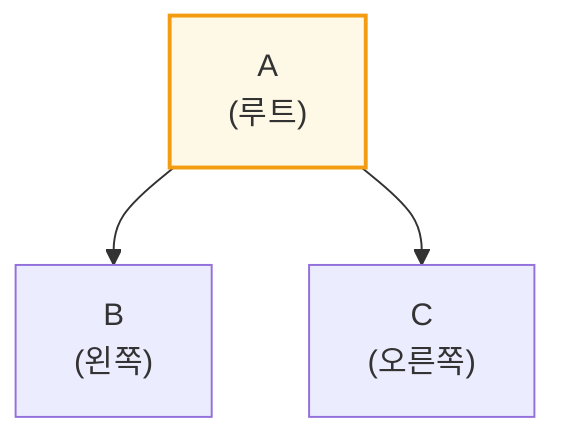
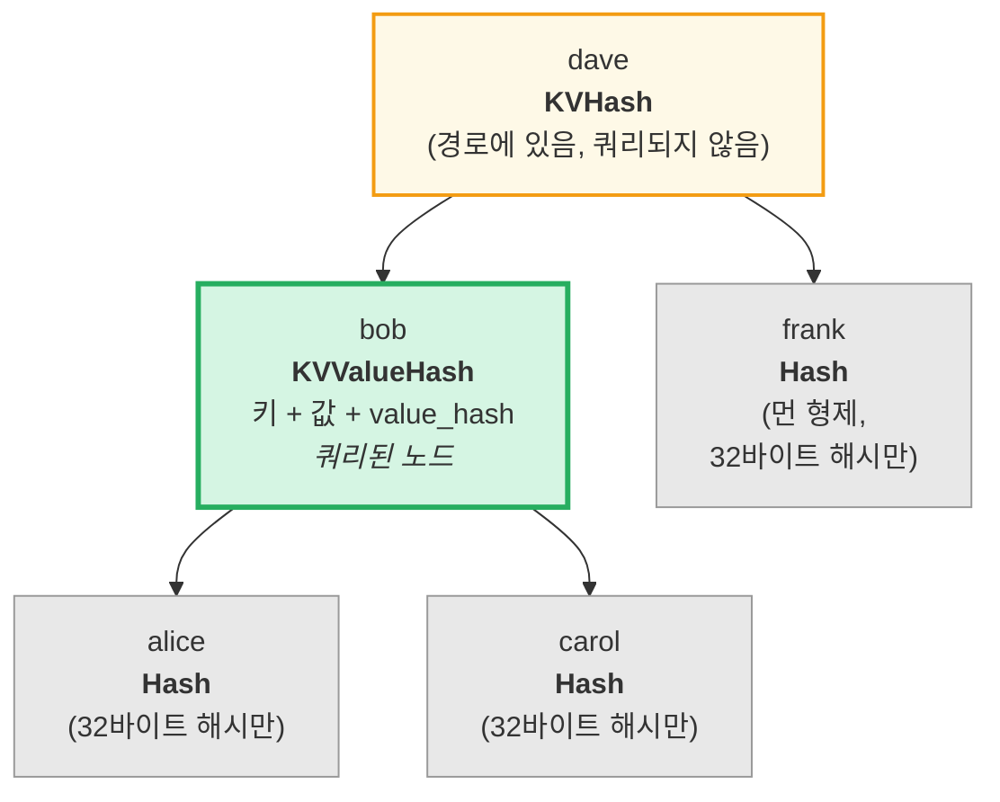
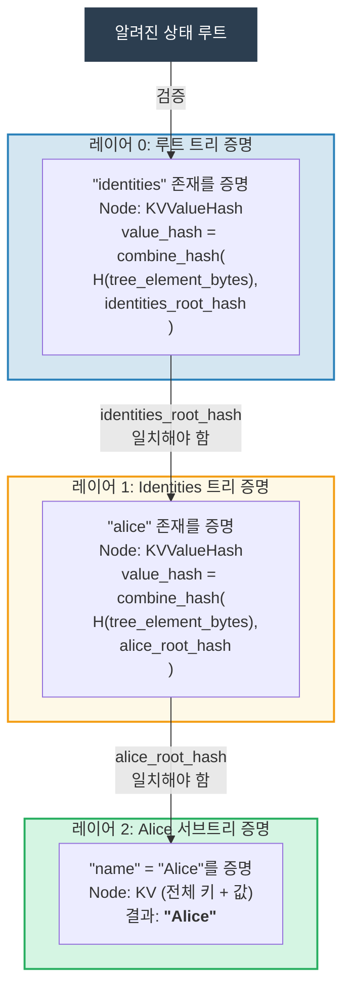
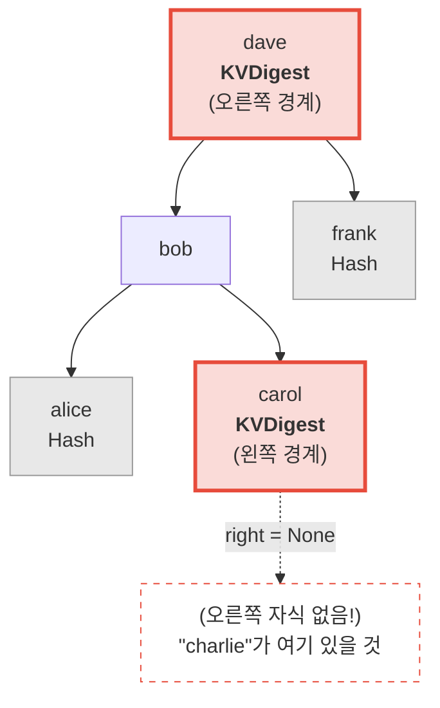
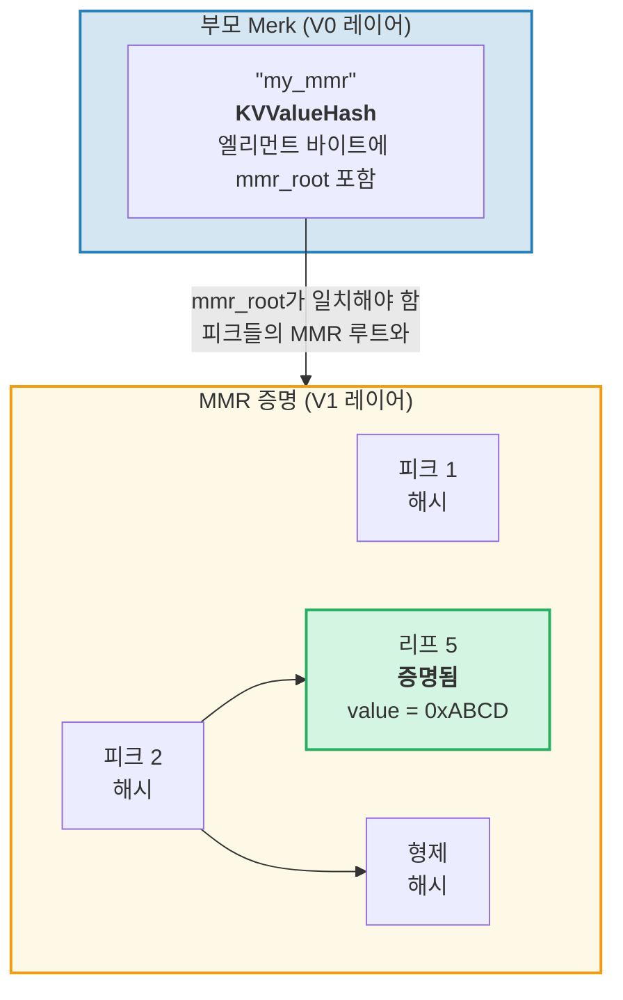
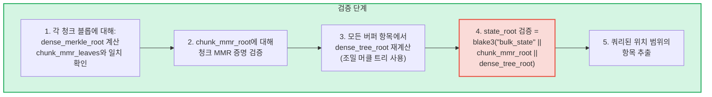
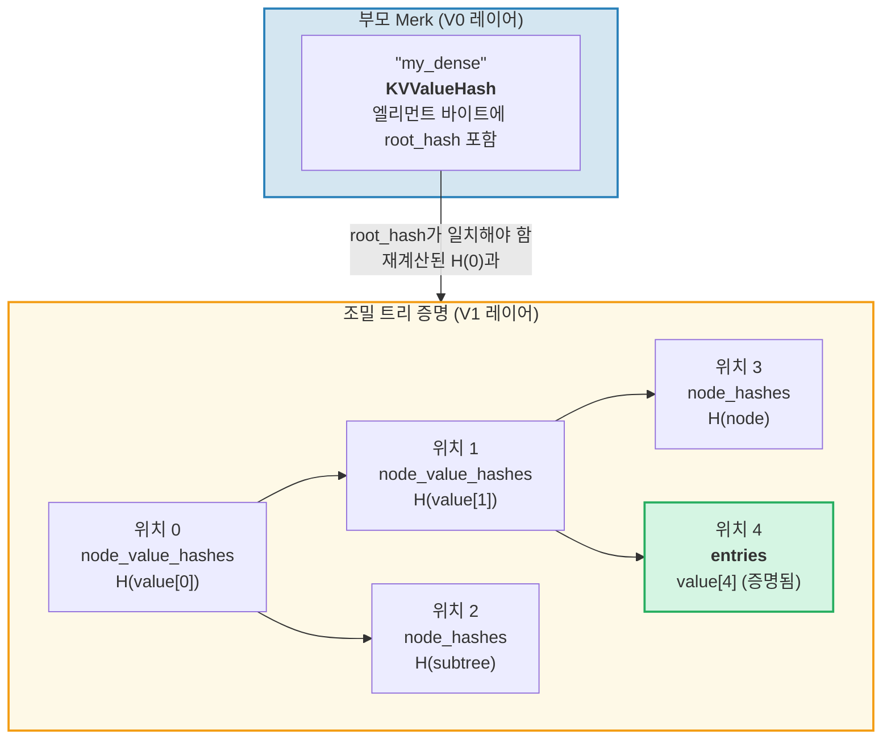

# 증명 시스템

GroveDB의 증명 시스템은 전체 데이터베이스 없이도 어떤 당사자가 쿼리 결과의 정확성을 검증할 수 있게 합니다. 증명은 루트 해시의 재구성을 가능하게 하는 관련 트리 구조의 간결한 표현입니다.

## 스택 기반 증명 연산

증명은 스택 머신을 사용하여 부분 트리를 재구성하는 **연산** 시퀀스로 인코딩됩니다:

```rust
// merk/src/proofs/mod.rs
pub enum Op {
    Push(Node),        // 노드를 스택에 푸시 (오름차순 키 순서)
    PushInverted(Node),// 노드를 푸시 (내림차순 키 순서)
    Parent,            // 부모를 팝, 자식을 팝 → 자식을 부모의 왼쪽에 연결
    Child,             // 자식을 팝, 부모를 팝 → 자식을 부모의 오른쪽에 연결
    ParentInverted,    // 부모를 팝, 자식을 팝 → 자식을 부모의 오른쪽에 연결
    ChildInverted,     // 자식을 팝, 부모를 팝 → 자식을 부모의 왼쪽에 연결
}
```

실행은 스택을 사용합니다:

증명 연산: `Push(B), Push(A), Parent, Push(C), Child`

| 단계 | 연산 | 스택 (상단→오른쪽) | 동작 |
|------|------|-------------------|------|
| 1 | Push(B) | [ B ] | B를 스택에 푸시 |
| 2 | Push(A) | [ B , A ] | A를 스택에 푸시 |
| 3 | Parent | [ A{left:B} ] | A(부모) 팝, B(자식) 팝, B → A의 왼쪽 |
| 4 | Push(C) | [ A{left:B} , C ] | C를 스택에 푸시 |
| 5 | Child | [ A{left:B, right:C} ] | C(자식) 팝, A(부모) 팝, C → A의 오른쪽 |

최종 결과 -- 스택에 하나의 트리:



> 검증자가 `node_hash(A) = Blake3(kv_hash_A || node_hash_B || node_hash_C)`를 계산하고 예상 루트 해시와 일치하는지 확인합니다.

이것이 `execute` 함수입니다 (`merk/src/proofs/tree.rs`):

```rust
pub fn execute<I, F>(ops: I, collapse: bool, mut visit_node: F) -> CostResult<Tree, Error>
where
    I: IntoIterator<Item = Result<Op, Error>>,
    F: FnMut(&Node) -> Result<(), Error>,
{
    let mut stack: Vec<Tree> = Vec::with_capacity(32);

    for op in ops {
        match op? {
            Op::Parent => {
                let (mut parent, child) = (try_pop(&mut stack), try_pop(&mut stack));
                parent.left = Some(Child { tree: Box::new(child), hash: child.hash() });
                stack.push(parent);
            }
            Op::Child => {
                let (child, mut parent) = (try_pop(&mut stack), try_pop(&mut stack));
                parent.right = Some(Child { tree: Box::new(child), hash: child.hash() });
                stack.push(parent);
            }
            Op::Push(node) => {
                visit_node(&node)?;
                stack.push(Tree::from(node));
            }
            // ... Inverted 변형은 왼쪽/오른쪽을 교환
        }
    }
    // 스택의 최종 항목이 루트
}
```

## 증명에서의 노드 타입

각 `Push`는 검증에 충분한 정보만 담긴 `Node`를 전달합니다:

```rust
pub enum Node {
    // 최소 정보 — 해시만. 먼 형제에 사용.
    Hash(CryptoHash),

    // 경로에 있지만 쿼리되지 않은 노드의 KV 해시.
    KVHash(CryptoHash),

    // 쿼리된 항목의 전체 키-값.
    KV(Vec<u8>, Vec<u8>),

    // 키, 값, 미리 계산된 value_hash.
    // value_hash = combine_hash(...)인 서브트리에 사용
    KVValueHash(Vec<u8>, Vec<u8>, CryptoHash),

    // 기능 타입이 포함된 KV — ProvableCountTree 또는 청크 복원용.
    KVValueHashFeatureType(Vec<u8>, Vec<u8>, CryptoHash, TreeFeatureType),

    // 참조: 키, 역참조된 값, 참조 엘리먼트의 해시.
    KVRefValueHash(Vec<u8>, Vec<u8>, CryptoHash),

    // ProvableCountTree의 항목용.
    KVCount(Vec<u8>, Vec<u8>, u64),

    // 쿼리되지 않은 ProvableCountTree 노드의 KV 해시 + 카운트.
    KVHashCount(CryptoHash, u64),

    // ProvableCountTree의 참조.
    KVRefValueHashCount(Vec<u8>, Vec<u8>, CryptoHash, u64),

    // ProvableCountTree의 경계/부재 증명용.
    KVDigestCount(Vec<u8>, CryptoHash, u64),

    // 일반 트리의 부재 증명용 키 + value_hash.
    KVDigest(Vec<u8>, CryptoHash),
}
```

Node 타입의 선택이 검증자가 필요한 정보를 결정합니다:

**쿼리: "키 'bob'의 값 가져오기"**



> 녹색 = 쿼리된 노드 (전체 데이터 공개). 노란색 = 경로에 있음 (kv_hash만). 회색 = 형제 (32바이트 노드 해시만).

증명 연산으로 인코딩:

| # | 연산 | 효과 |
|---|------|------|
| 1 | Push(Hash(alice_node_hash)) | alice 해시 푸시 |
| 2 | Push(KVValueHash("bob", value, value_hash)) | 전체 데이터와 함께 bob 푸시 |
| 3 | Parent | alice가 bob의 왼쪽 자식이 됨 |
| 4 | Push(Hash(carol_node_hash)) | carol 해시 푸시 |
| 5 | Child | carol이 bob의 오른쪽 자식이 됨 |
| 6 | Push(KVHash(dave_kv_hash)) | dave kv_hash 푸시 |
| 7 | Parent | bob 서브트리가 dave의 왼쪽이 됨 |
| 8 | Push(Hash(frank_node_hash)) | frank 해시 푸시 |
| 9 | Child | frank가 dave의 오른쪽 자식이 됨 |

## 다중 레이어 증명 생성

GroveDB는 트리의 트리이므로, 증명은 여러 레이어에 걸칩니다. 각 레이어는 하나의 Merk 트리의 관련 부분을 증명하며, 레이어들은 결합된 value_hash 메커니즘으로 연결됩니다:

**쿼리:** `Get ["identities", "alice", "name"]`



> **신뢰 체인:** `알려진_상태_루트 → 레이어 0 검증 → 레이어 1 검증 → 레이어 2 검증 → "Alice"`. 각 레이어의 재구성된 루트 해시가 상위 레이어의 value_hash와 일치해야 합니다.

검증자는 각 레이어를 확인하며 다음을 확인합니다:
1. 레이어 증명이 예상 루트 해시로 재구성됨
2. 루트 해시가 부모 레이어의 value_hash와 일치
3. 최상위 루트 해시가 알려진 상태 루트와 일치

## 증명 검증

검증은 `execute` 함수를 사용하여 각 레이어의 트리를 재구성하며, 증명 레이어를 하향식 또는 상향식으로 따릅니다. 증명 트리의 `Tree::hash()` 메서드는 노드 타입에 기반하여 해시를 계산합니다:

```rust
impl Tree {
    pub fn hash(&self) -> CostContext<CryptoHash> {
        match &self.node {
            Node::Hash(hash) => *hash,  // 이미 해시, 직접 반환

            Node::KVHash(kv_hash) =>
                node_hash(kv_hash, &self.child_hash(true), &self.child_hash(false)),

            Node::KV(key, value) =>
                kv_hash(key, value)
                    .flat_map(|kv_hash| node_hash(&kv_hash, &left, &right)),

            Node::KVValueHash(key, _, value_hash) =>
                kv_digest_to_kv_hash(key, value_hash)
                    .flat_map(|kv_hash| node_hash(&kv_hash, &left, &right)),

            Node::KVValueHashFeatureType(key, _, value_hash, feature_type) => {
                let kv = kv_digest_to_kv_hash(key, value_hash);
                match feature_type {
                    ProvableCountedMerkNode(count) =>
                        node_hash_with_count(&kv, &left, &right, *count),
                    _ => node_hash(&kv, &left, &right),
                }
            }

            Node::KVRefValueHash(key, referenced_value, ref_element_hash) => {
                let ref_value_hash = value_hash(referenced_value);
                let combined = combine_hash(ref_element_hash, &ref_value_hash);
                let kv = kv_digest_to_kv_hash(key, &combined);
                node_hash(&kv, &left, &right)
            }
            // ... 기타 변형
        }
    }
}
```

## 부재 증명

GroveDB는 키가 **존재하지 않음**을 증명할 수 있습니다. 이것은 경계 노드 -- 해당 키가 존재했다면 인접했을 노드 -- 를 사용합니다:

**증명:** "charlie"가 존재하지 않음



> **이진 검색:** alice < bob < carol < **"charlie"** < dave < frank. "charlie"는 carol과 dave 사이에 있을 것입니다. Carol의 오른쪽 자식이 `None`이므로, carol과 dave 사이에 아무것도 존재하지 않음을 증명합니다. 따라서 "charlie"는 이 트리에 존재할 수 없습니다.

범위 쿼리의 경우, 부재 증명은 쿼리 범위 내에 결과 집합에 포함되지 않은 키가 없음을 보여줍니다.

## V1 증명 -- 비-Merk 트리

V0 증명 시스템은 Merk 서브트리에서만 작동하며, 그로브 계층 구조를 레이어별로 하강합니다. 그러나 **CommitmentTree**, **MmrTree**, **BulkAppendTree**, **DenseAppendOnlyFixedSizeTree** 엘리먼트는 자식 Merk 트리 외부에 데이터를 저장합니다. 이들은 하강할 자식 Merk가 없습니다 -- 타입별 루트 해시가 대신 Merk 자식 해시로 흐릅니다.

**V1 증명 형식**은 타입별 증명 구조로 이러한 비-Merk 트리를 처리하도록 V0을 확장합니다:

```rust
/// 레이어가 사용하는 증명 형식.
pub enum ProofBytes {
    Merk(Vec<u8>),            // 표준 Merk 증명 연산
    MMR(Vec<u8>),             // MMR 멤버십 증명
    BulkAppendTree(Vec<u8>),  // BulkAppendTree 범위 증명
    DenseTree(Vec<u8>),       // 조밀 트리 포함 증명
    CommitmentTree(Vec<u8>),  // Sinsemilla 루트 (32 바이트) + BulkAppendTree 증명
}

/// V1 증명의 한 레이어.
pub struct LayerProof {
    pub merk_proof: ProofBytes,
    pub lower_layers: BTreeMap<Vec<u8>, LayerProof>,
}
```

**V0/V1 선택 규칙:** 증명의 모든 레이어가 표준 Merk 트리이면, `prove_query`는 `GroveDBProof::V0`을 생성합니다(하위 호환). 어떤 레이어든 MmrTree, BulkAppendTree 또는 DenseAppendOnlyFixedSizeTree를 포함하면 `GroveDBProof::V1`을 생성합니다.

### 비-Merk 트리 증명이 루트 해시에 바인딩되는 방식

부모 Merk 트리는 표준 Merk 증명 노드(`KVValueHash`)를 통해 엘리먼트의 직렬화된 바이트를 증명합니다. 타입별 루트(예: `mmr_root` 또는 `state_root`)는 Merk **자식 해시**로 흐릅니다 -- 엘리먼트 바이트에 내장되지 않습니다:

```text
combined_value_hash = combine_hash(
    Blake3(varint(len) || element_bytes),   ← count, height 등 포함
    type_specific_root                      ← mmr_root / state_root / dense_root
)
```

그런 다음 타입별 증명은 쿼리된 데이터가 자식 해시로 사용된 타입별 루트와 일관됨을 증명합니다.

### MMR 트리 증명

MMR 증명은 특정 리프가 MMR 내 알려진 위치에 존재하며, MMR의 루트 해시가 부모 Merk 노드에 저장된 자식 해시와 일치함을 보여줍니다:

```rust
pub struct MmrProof {
    pub mmr_size: u64,
    pub proof: MerkleProof,  // ckb_merkle_mountain_range::MerkleProof
    pub leaves: Vec<MmrProofLeaf>,
}

pub struct MmrProofLeaf {
    pub position: u64,       // MMR 위치
    pub leaf_index: u64,     // 논리적 리프 인덱스
    pub hash: [u8; 32],      // 리프 해시
    pub value: Vec<u8>,      // 리프 값 바이트
}
```



**쿼리 키는 위치입니다:** 쿼리 항목은 위치를 빅 엔디안 u64 바이트로 인코딩합니다(정렬 순서를 보존합니다). `QueryItem::RangeInclusive`로 BE 인코딩된 시작/끝 위치를 사용하면 연속된 범위의 MMR 리프를 선택합니다.

**검증:**
1. 증명에서 `MmrNode` 리프를 재구성
2. 부모 Merk 자식 해시에서 가져온 예상 MMR 루트에 대해 ckb `MerkleProof` 검증
3. `proof.mmr_size`가 엘리먼트에 저장된 크기와 일치하는지 교차 검증
4. 증명된 리프 값 반환

### BulkAppendTree 증명

BulkAppendTree 증명은 데이터가 두 곳에 존재하기 때문에 더 복잡합니다: 봉인된 청크 블롭과 진행 중인 버퍼. 범위 증명은 다음을 반환해야 합니다:

- 쿼리 범위와 겹치는 완료된 청크의 **전체 청크 블롭**
- 아직 버퍼에 있는 위치의 **개별 버퍼 항목**

```rust
pub struct BulkAppendTreeProof {
    pub chunk_power: u8,
    pub total_count: u64,
    pub chunk_blobs: Vec<(u64, Vec<u8>)>,       // (chunk_index, blob_bytes)
    pub chunk_mmr_size: u64,
    pub chunk_mmr_proof_items: Vec<[u8; 32]>,    // MMR 형제 해시
    pub chunk_mmr_leaves: Vec<(u64, [u8; 32])>,  // (mmr_pos, dense_merkle_root)
    pub buffer_entries: Vec<Vec<u8>>,             // 현재 버퍼(조밀 트리)의 모든 항목
    pub chunk_mmr_root: [u8; 32],
}
```



> **모든 버퍼 항목을 포함하는 이유:** 버퍼는 모든 항목에 대해 커밋하는 루트 해시를 가진 조밀 머클 트리입니다. `dense_tree_root`를 검증하려면 검증자가 모든 항목에서 트리를 재구축해야 합니다. 버퍼가 `capacity`개 항목(최대 65,535개)으로 제한되므로, 이것은 허용 가능합니다.

**제한 계산:** 각 개별 값(청크 또는 버퍼 내)이 쿼리 제한에 카운트됩니다. 청크 블롭 전체가 아닙니다. 쿼리에 `limit: 100`이 있고 청크에 1024개 항목이 있으며 그 중 500개가 범위와 겹치면, 500개 항목 모두 제한에 카운트됩니다.

### DenseAppendOnlyFixedSizeTree 증명

조밀 트리 증명은 특정 위치가 특정 값을 보유하고 있으며, 트리의 루트 해시(Merk 자식 해시로 흐르는)에 의해 인증됨을 보여줍니다. 모든 노드가 `blake3(H(value) || H(left) || H(right))`을 사용하므로, 인증 경로의 조상 노드는 전체 값이 아닌 32바이트 **value hash**만 필요합니다.

```rust
pub struct DenseTreeProof {
    pub entries: Vec<(u16, Vec<u8>)>,            // 증명된 (position, value)
    pub node_value_hashes: Vec<(u16, [u8; 32])>, // 인증 경로의 조상 value hash
    pub node_hashes: Vec<(u16, [u8; 32])>,       // 미리 계산된 형제 서브트리 해시
}
```

> `height`와 `count`는 부모 Element에서 옵니다(Merk 계층 구조에 의해 인증됨), 증명에서 오지 않습니다.



**검증**은 스토리지가 필요 없는 순수 함수입니다:
1. `entries`, `node_value_hashes`, `node_hashes`에서 조회 맵 구축
2. 위치 0에서 루트 해시를 재귀적으로 재계산:
   - `node_hashes`에 미리 계산된 해시가 있는 위치 → 직접 사용
   - `entries`에 값이 있는 위치 → `blake3(blake3(value) || H(left) || H(right))`
   - `node_value_hashes`에 해시가 있는 위치 → `blake3(hash || H(left) || H(right))`
   - `>= count` 또는 `>= capacity`인 위치 → `[0u8; 32]`
3. 계산된 루트를 부모 엘리먼트의 예상 루트 해시와 비교
4. 성공 시 증명된 항목 반환

**다중 위치 증명**은 겹치는 인증 경로를 병합합니다: 공유된 조상과 그 값은 한 번만 나타나므로 독립적인 증명보다 더 간결합니다.

---
