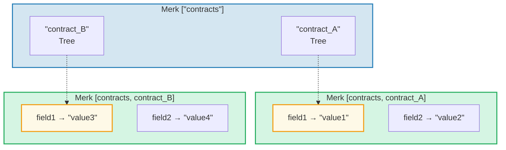
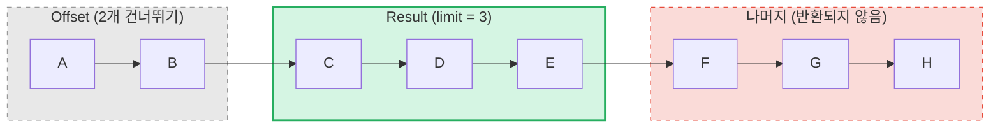

# 쿼리 시스템

## PathQuery 구조

GroveDB 쿼리는 경로(어디를 볼지)와 쿼리(무엇을 선택할지)를 결합하는 `PathQuery` 타입을 사용합니다:

```rust
pub struct PathQuery {
    pub path: Vec<Vec<u8>>,         // 그로브에서의 시작 경로
    pub query: SizedQuery,          // 선택 항목
}

pub struct SizedQuery {
    pub query: Query,               // 선택 기준
    pub limit: Option<u16>,         // 최대 결과 수
    pub offset: Option<u16>,        // 처음 N개 결과 건너뛰기
}
```

## Query 타입

```rust
pub struct Query {
    pub items: Vec<QueryItem>,              // 매칭 대상
    pub default_subquery_branch: SubqueryBranch,
    pub conditional_subquery_branches: Option<IndexMap<QueryItem, SubqueryBranch>>,
    pub left_to_right: bool,                // 반복 방향
    pub add_parent_tree_on_subquery: bool,  // 결과에 부모 트리 엘리먼트 포함 (v2)
}
```

> **`add_parent_tree_on_subquery`** (v2): `true`이면, 부모 트리 엘리먼트(예: CountTree 또는 SumTree)가 자식 값과 함께 쿼리 결과에 포함됩니다. 이를 통해 집계 값과 개별 엘리먼트를 하나의 쿼리로 가져올 수 있습니다.

## QueryItem -- 선택 대상

각 `QueryItem`은 매칭할 키 또는 범위를 지정합니다:

```rust
pub enum QueryItem {
    Key(Vec<u8>),                           // 정확한 키 매칭
    Range(Range<Vec<u8>>),                  // 배타적 범위 [start..end)
    RangeInclusive(RangeInclusive<Vec<u8>>),// 포함 범위 [start..=end]
    RangeFull(RangeFull),                   // 모든 키
    RangeFrom(RangeFrom<Vec<u8>>),          // [start..)
    RangeTo(RangeTo<Vec<u8>>),              // [..end)
    RangeToInclusive(RangeToInclusive<Vec<u8>>), // [..=end]
    RangeAfter(RangeFrom<Vec<u8>>),         // (start..) 배타적 시작
    RangeAfterTo(Range<Vec<u8>>),           // (start..end) 양쪽 배타적
    RangeAfterToInclusive(RangeInclusive<Vec<u8>>), // (start..=end]
}
```

쿼리 예시:

Merk 트리 (정렬됨): `alice  bob  carol  dave  eve  frank`

| 쿼리 | 선택 | 결과 |
|-------|------|------|
| `Key("bob")` | alice **[bob]** carol dave eve frank | bob |
| `RangeInclusive("bob"..="dave")` | alice **[bob carol dave]** eve frank | bob, carol, dave |
| `RangeAfter("carol"..)` | alice bob carol **[dave eve frank]** | dave, eve, frank |
| `RangeFull`, limit=2 | **[alice bob]** carol dave eve frank *(제한으로 중단)* | alice, bob |
| `RangeFull`, limit=2, 오른쪽→왼쪽 | alice bob carol dave **[eve frank]** *(제한으로 중단)* | frank, eve |

## 하위 쿼리와 조건부 분기

GroveDB 쿼리의 진정한 힘은 **하위 쿼리(subqueries)**입니다 -- 쿼리가 Tree 엘리먼트와 매칭되면, 쿼리가 자동으로 해당 서브트리로 하강할 수 있습니다:



> **PathQuery:** `path: ["contracts"], query: RangeFull` + `default_subquery: Key("field1")`
>
> **실행:**
> 1. ["contracts"]에서 `RangeFull` → contract_A, contract_B 매칭
> 2. 둘 다 Tree 엘리먼트 → 하위 쿼리 `Key("field1")`로 하강
> 3. contract_A → "value1", contract_B → "value3"
>
> **결과:** `["value1", "value3"]`

**조건부 하위 쿼리**는 어떤 키가 매칭되었는지에 따라 다른 하위 쿼리를 적용할 수 있습니다:

```rust
conditional_subquery_branches: Some(indexmap! {
    QueryItem::Key(b"contract_A".to_vec()) => SubqueryBranch {
        subquery: Some(Query { items: vec![Key(b"field1".to_vec())] }),
        ..
    },
    QueryItem::Key(b"contract_B".to_vec()) => SubqueryBranch {
        subquery: Some(Query { items: vec![Key(b"field2".to_vec())] }),
        ..
    },
})
```

이것은 `contract_A`에서는 `field1`을 가져오지만 `contract_B`에서는 `field2`를 가져옵니다.

## 크기 제한 쿼리 -- Limit과 Offset

`SizedQuery` 래퍼는 페이지네이션을 추가합니다:



> `SizedQuery { query: RangeFull, limit: Some(3), offset: Some(2) }` → 결과: **[C, D, E]**

`left_to_right: false`와 결합하면 반복이 역순이 됩니다:

```text
    SizedQuery {
        query: Query { items: [RangeFull], left_to_right: false, .. },
        limit: Some(3),
        offset: None
    }

    결과: [H, G, F]
```

## 쿼리 병합

여러 PathQuery를 효율성을 위해 단일 쿼리로 병합할 수 있습니다. 병합 알고리즘은 공통 경로 접두사를 찾아 쿼리 항목을 결합합니다:

```text
    쿼리 A: path=["users"], query=Key("alice")
    쿼리 B: path=["users"], query=Key("bob")

    병합:  path=["users"], query=items=[Key("alice"), Key("bob")]
```

---
