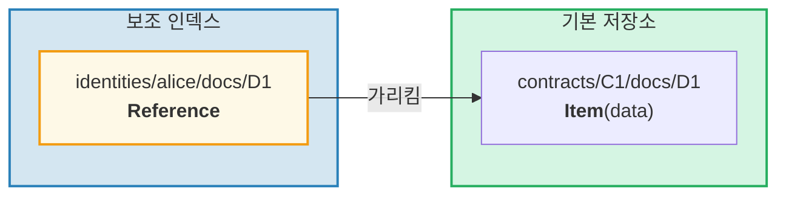
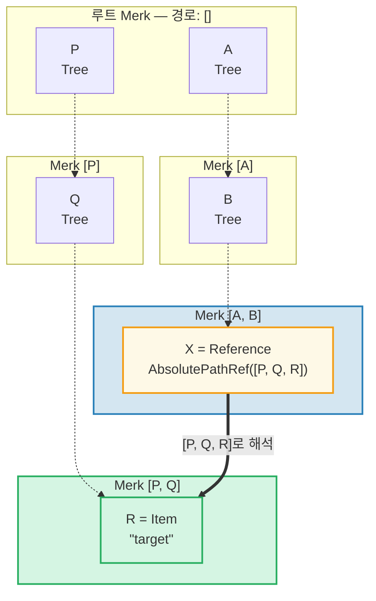
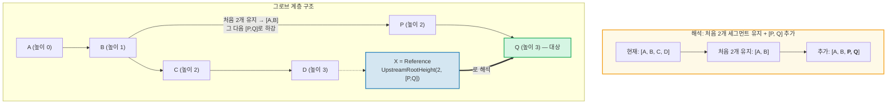
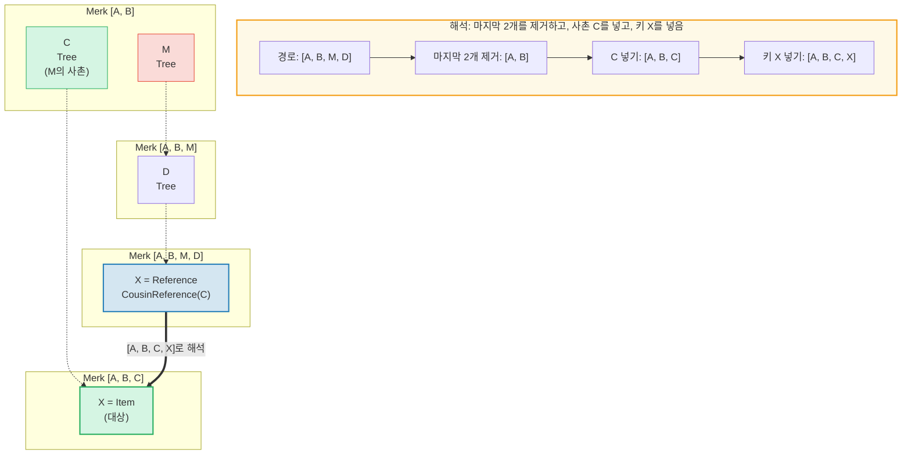
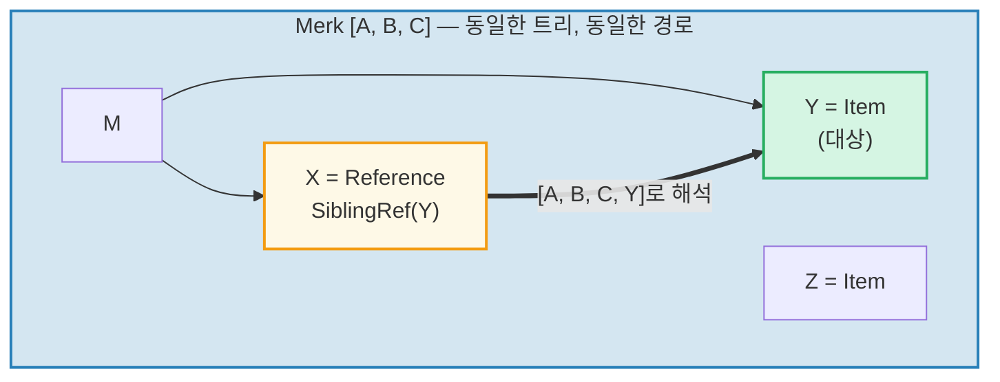
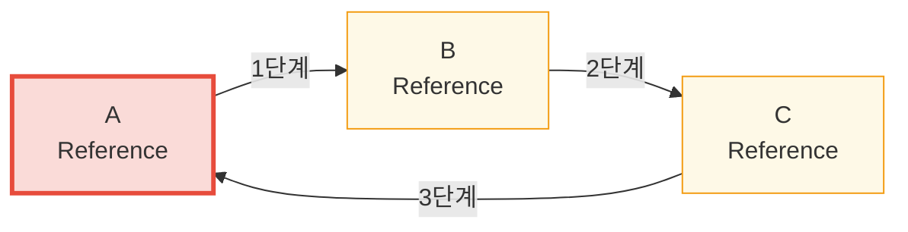

# 참조 시스템

## 참조가 존재하는 이유

계층적 데이터베이스에서는 동일한 데이터에 여러 경로에서 접근해야 하는 경우가 자주 있습니다. 예를 들어, 문서가 계약 아래에 저장되지만 소유자 ID로도 쿼리 가능해야 할 수 있습니다. **참조(Reference)**는 GroveDB의 해답입니다 -- 한 위치에서 다른 위치를 가리키는 포인터로, 파일시스템의 심볼릭 링크와 유사합니다.



주요 속성:
- 참조는 **인증됨** -- 참조의 value_hash가 참조 자체와 참조된 엘리먼트를 모두 포함
- 참조는 **체인 연결** 가능 -- 참조가 다른 참조를 가리킬 수 있음
- 순환 감지로 무한 루프를 방지
- 구성 가능한 홉 제한으로 자원 고갈 방지

## 7가지 참조 타입

```rust
// grovedb-element/src/reference_path/mod.rs
pub enum ReferencePathType {
    AbsolutePathReference(Vec<Vec<u8>>),
    UpstreamRootHeightReference(u8, Vec<Vec<u8>>),
    UpstreamRootHeightWithParentPathAdditionReference(u8, Vec<Vec<u8>>),
    UpstreamFromElementHeightReference(u8, Vec<Vec<u8>>),
    CousinReference(Vec<u8>),
    RemovedCousinReference(Vec<Vec<u8>>),
    SiblingReference(Vec<u8>),
}
```

각각을 다이어그램과 함께 살펴보겠습니다.

### AbsolutePathReference

가장 단순한 타입입니다. 대상으로의 전체 경로를 저장합니다:



> X가 전체 절대 경로 `[P, Q, R]`을 저장합니다. X가 어디에 위치하든 항상 동일한 대상으로 해석됩니다.

### UpstreamRootHeightReference

현재 경로의 처음 N개 세그먼트를 유지한 다음 새 경로를 추가합니다:



### UpstreamRootHeightWithParentPathAdditionReference

UpstreamRootHeight와 유사하지만 현재 경로의 마지막 세그먼트를 다시 추가합니다:

```text
    경로 [A, B, C, D, E]에 있는 참조, key=X
    UpstreamRootHeightWithParentPathAdditionReference(2, [P, Q])

    현재 경로:       [A, B, C, D, E]
    처음 2개 유지:    [A, B]
    [P, Q] 추가:     [A, B, P, Q]
    마지막 재추가:    [A, B, P, Q, E]   ← 원래 경로의 "E"가 다시 추가됨

    용도: 부모 키가 보존되어야 하는 인덱스
```

### UpstreamFromElementHeightReference

마지막 N개 세그먼트를 버린 다음 추가합니다:

```text
    경로 [A, B, C, D]에 있는 참조, key=X
    UpstreamFromElementHeightReference(1, [P, Q])

    현재 경로:        [A, B, C, D]
    마지막 1개 버림:   [A, B, C]
    [P, Q] 추가:      [A, B, C, P, Q]
```

### CousinReference

직접 부모만 새 키로 대체합니다:



> "사촌(cousin)"은 참조의 조부모의 형제 서브트리입니다. 참조가 두 레벨 위로 올라간 다음 사촌 서브트리로 하강합니다.

### RemovedCousinReference

CousinReference와 유사하지만 부모를 다중 세그먼트 경로로 대체합니다:

```text
    경로 [A, B, C, D]에 있는 참조, key=X
    RemovedCousinReference([M, N])

    현재 경로:     [A, B, C, D]
    부모 C 제거:   [A, B]
    [M, N] 추가:   [A, B, M, N]
    키 X 넣기:     [A, B, M, N, X]
```

### SiblingReference

가장 단순한 상대 참조 -- 같은 부모 내에서 키만 변경합니다:



> 가장 단순한 참조 타입입니다. X와 Y는 같은 Merk 트리의 형제 -- 해석 시 경로는 유지하고 키만 변경합니다.

## 참조 추적과 홉 제한

GroveDB가 Reference 엘리먼트를 만나면, 실제 값을 찾기 위해 **추적**해야 합니다. 참조가 다른 참조를 가리킬 수 있으므로, 이것은 루프를 포함합니다:

```rust
// grovedb/src/reference_path.rs
pub const MAX_REFERENCE_HOPS: usize = 10;

pub fn follow_reference(...) -> CostResult<ResolvedReference, Error> {
    let mut hops_left = MAX_REFERENCE_HOPS;
    let mut visited = HashSet::new();

    while hops_left > 0 {
        // 참조 경로를 절대 경로로 해석
        let target_path = current_ref.absolute_qualified_path(...);

        // 순환 검사
        if !visited.insert(target_path.clone()) {
            return Err(Error::CyclicReference);
        }

        // 대상의 엘리먼트 가져오기
        let element = Element::get(target_path);

        match element {
            Element::Reference(next_ref, ..) => {
                // 여전히 참조 -- 계속 추적
                current_ref = next_ref;
                hops_left -= 1;
            }
            other => {
                // 실제 엘리먼트를 찾음!
                return Ok(ResolvedReference { element: other, ... });
            }
        }
    }

    Err(Error::ReferenceLimit)  // 10 홉 초과
}
```

## 순환 감지

`visited` HashSet이 지금까지 본 모든 경로를 추적합니다. 이미 방문한 경로를 만나면 순환이 있습니다:



> **순환 감지 추적:**
>
> | 단계 | 추적 | visited 집합 | 결과 |
> |------|------|-------------|------|
> | 1 | A에서 시작 | { A } | A가 Ref → 추적 |
> | 2 | A → B | { A, B } | B가 Ref → 추적 |
> | 3 | B → C | { A, B, C } | C가 Ref → 추적 |
> | 4 | C → A | A가 이미 visited에 있음! | **Error::CyclicRef** |
>
> 순환 감지가 없으면 영원히 반복될 것입니다. `MAX_REFERENCE_HOPS = 10`도 긴 체인의 순회 깊이를 제한합니다.

## Merk에서의 참조 -- 결합된 값 해시

Reference가 Merk 트리에 저장될 때, 그 `value_hash`는 참조 구조와 참조된 데이터를 모두 인증해야 합니다:

```rust
// merk/src/tree/kv.rs
pub fn update_hashes_using_reference_value_hash(
    mut self,
    reference_value_hash: CryptoHash,
) -> CostContext<Self> {
    // 참조 엘리먼트의 자체 바이트를 해시
    let actual_value_hash = value_hash(self.value_as_slice());

    // 결합: H(reference_bytes) + H(referenced_data)
    let combined = combine_hash(&actual_value_hash, &reference_value_hash);

    self.value_hash = combined;
    self.hash = kv_digest_to_kv_hash(self.key(), self.value_hash());
    // ...
}
```

이것은 참조 자체를 변경하든 참조가 가리키는 데이터를 변경하든 루트 해시가 변경됨을 의미합니다 -- 둘 다 암호학적으로 바인딩됩니다.

---
