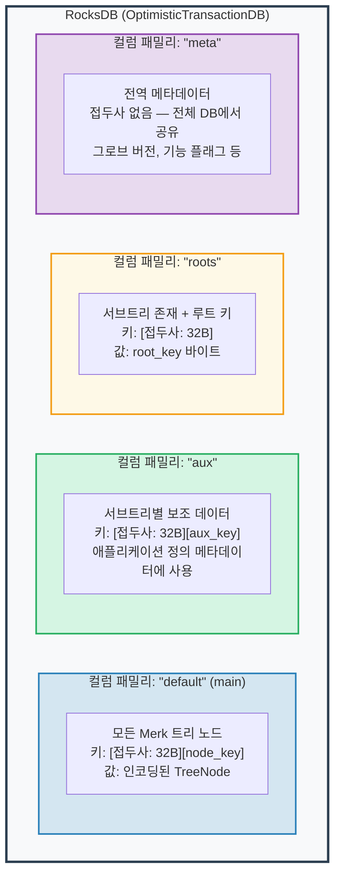
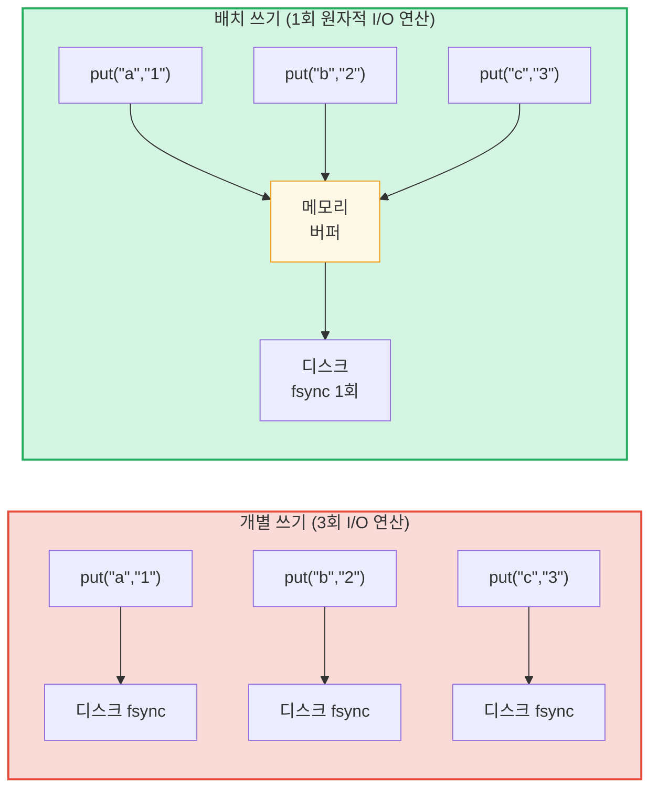

# 스토리지 레이어

## OptimisticTransactionDB를 사용하는 RocksDB

GroveDB는 **RocksDB**를 스토리지 백엔드로 사용하며, 구체적으로 트랜잭션을 지원하는 `OptimisticTransactionDB` 변형을 사용합니다:

```rust
// storage/src/rocksdb_storage/storage.rs
pub(crate) type Db = OptimisticTransactionDB;
pub(crate) type Tx<'db> = Transaction<'db, Db>;

pub struct RocksDbStorage {
    db: OptimisticTransactionDB,
}
```

**낙관적 트랜잭션(Optimistic transactions)**은 충돌이 없을 것이라 가정하고 작동합니다. 두 트랜잭션이 동일한 데이터를 수정하면, 두 번째로 커밋하는 트랜잭션이 실패하며 재시도할 수 있습니다. 이것은 충돌이 드문 워크로드에서 비관적 잠금보다 효율적입니다.

RocksDB 옵션은 GroveDB의 워크로드에 맞게 튜닝됩니다:

```rust
lazy_static! {
    static ref DEFAULT_OPTS: rocksdb::Options = {
        let mut opts = rocksdb::Options::default();
        opts.create_if_missing(true);
        opts.increase_parallelism(num_cpus::get() as i32);
        opts.set_allow_mmap_writes(true);
        opts.set_allow_mmap_reads(true);
        opts.create_missing_column_families(true);
        opts.set_atomic_flush(true);
        opts
    };
}
```

## 4개의 컬럼 패밀리

RocksDB 컬럼 패밀리(Column family)는 단일 데이터베이스 내에서 별도의 키-값 네임스페이스 역할을 합니다. GroveDB는 4개를 사용합니다:



> **예시:** "default" CF의 키 `[ab3fc2...][6e616d65]`는 `TreeNode{key:"name", val:"Al"}`에 매핑되며, `ab3fc2...`는 `Blake3(path)`이고 `6e616d65`는 바이트로 된 `"name"`입니다.

```rust
pub(crate) const AUX_CF_NAME: &str = "aux";
pub(crate) const ROOTS_CF_NAME: &str = "roots";
pub(crate) const META_CF_NAME: &str = "meta";
// 메인 데이터는 기본 컬럼 패밀리를 사용합니다
```

## 접두사 기반 스토리지 컨텍스트

각 서브트리는 자체 **접두사 기반 스토리지 컨텍스트**를 가집니다 -- 모든 키에 32바이트 Blake3 접두사를 자동으로 앞에 붙이는 래퍼:

```text
    서브트리 경로: ["identities", "alice"]
    접두사: Blake3(path) = [0xab, 0x3f, 0xc2, ...]  (32 바이트)

    서브트리가 키 "name"에 값 "Alice"를 저장할 때:

    RocksDB 키:   [0xab 0x3f 0xc2 ... (32 바이트) | 0x6e 0x61 0x6d 0x65]
                    \________접두사________/       \_____"name"_____/

    RocksDB 값: [값 "Alice"가 포함된 인코딩된 TreeNode]
```

컨텍스트 타입:

```text
    트랜잭션 없이:
    PrefixedRocksDbImmediateStorageContext
    └── 접두사를 사용하여 DB에 직접 읽기/쓰기

    트랜잭션과 함께:
    PrefixedRocksDbTransactionContext
    └── 접두사를 사용하여 Transaction을 통해 읽기/쓰기
```

둘 다 `StorageContext` 트레이트를 구현합니다:

```rust
pub trait StorageContext<'db> {
    fn get(&self, key: &[u8]) -> CostResult<Option<Vec<u8>>, Error>;
    fn get_aux(&self, key: &[u8]) -> CostResult<Option<Vec<u8>>, Error>;
    fn get_root(&self, key: &[u8]) -> CostResult<Option<Vec<u8>>, Error>;
    fn get_meta(&self, key: &[u8]) -> CostResult<Option<Vec<u8>>, Error>;
    fn put(&self, key: &[u8], value: &[u8], ...) -> CostResult<(), Error>;
    fn put_aux(&self, key: &[u8], value: &[u8], ...) -> CostResult<(), Error>;
    fn put_root(&self, key: &[u8], value: &[u8], ...) -> CostResult<(), Error>;
    fn put_meta(&self, key: &[u8], value: &[u8], ...) -> CostResult<(), Error>;
    fn delete(&self, key: &[u8], ...) -> CostResult<(), Error>;
    // ...
}
```

## 쓰기 배치와 트랜잭션 모델

성능을 위해 GroveDB는 쓰기를 배치로 누적합니다:



> 3회 디스크 동기화 대 1회 디스크 동기화 = 약 3배 빠름. 배치 쓰기는 또한 **원자적**(전부 또는 전무)입니다.

`StorageBatch`가 함께 플러시되는 연산을 누적합니다:

```rust
pub struct StorageBatch {
    operations: RefCell<Vec<AbstractBatchOperation>>,
}
```

## 필수적인 commit_local() 패턴

트랜잭션을 사용할 때 반드시 따라야 하는 중요한 패턴이 있습니다. 트랜잭션 내 쓰기는 버퍼링됩니다 -- 커밋할 때까지 보이지 않습니다:

```rust
// 올바른 패턴:
{
    let tx = db.start_transaction();
    let storage_ctx = db.get_transactional_storage_context(path, &tx);

    storage_ctx.put(key, value);  // 트랜잭션 버퍼에 쓰기

    drop(storage_ctx);            // tx에 대한 차용 해제
    tx.commit_local();            // 트랜잭션을 DB에 플러시
}

// 잘못된 패턴 — 데이터가 손실됩니다:
{
    let tx = db.start_transaction();
    let storage_ctx = db.get_transactional_storage_context(path, &tx);

    storage_ctx.put(key, value);  // 트랜잭션 버퍼에 쓰기

    // commit_local() 없이 tx가 드롭됩니다!
    // 모든 쓰기가 롤백됩니다!
}
```

이것은 `storage_ctx`가 트랜잭션을 차용하기 때문에 특히 중요합니다. `tx.commit_local()`을 호출하기 전에 `drop(storage_ctx)`를 해야 합니다.

---
