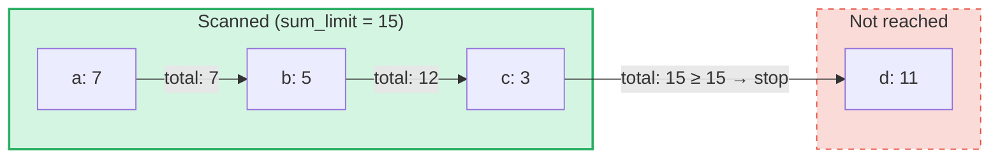

# Zapytania o sumy agregujace

## Przeglad

Zapytania o sumy agregujace to wyspecjalizowany typ zapytan przeznaczony dla **SumTrees** w GroveDB.
Podczas gdy zwykle zapytania pobieraja elementy wedlug klucza lub zakresu, zapytania o sumy agregujace
iteruja przez elementy i kumuluja ich wartosci sum, az do osiagniecia **limitu sumy**.

Jest to przydatne w przypadku pytan takich jak:
- "Daj mi transakcje, az laczna suma przekroczy 1000"
- "Ktore elementy skladaja sie na pierwszych 500 jednostek wartosci w tym drzewie?"
- "Zbierz elementy sum do budzetu N"

## Podstawowe koncepcje

### Czym rozni sie od zwyklych zapytan

| Cecha | PathQuery | AggregateSumPathQuery |
|-------|-----------|----------------------|
| **Cel** | Dowolny typ elementu | Elementy SumItem / ItemWithSumItem |
| **Warunek zatrzymania** | Limit (ilosc) lub koniec zakresu | Limit sumy (biezaca suma) **i/lub** limit elementow |
| **Zwraca** | Elementy lub klucze | Pary klucz-wartosc sumy |
| **Podzapytania** | Tak (zstepowanie do poddrzew) | Nie (pojedynczy poziom drzewa) |
| **Referencje** | Rozwiazywane przez warstwe GroveDB | Opcjonalnie sledzone lub ignorowane |

### Struktura AggregateSumQuery

```rust
pub struct AggregateSumQuery {
    pub items: Vec<QueryItem>,              // Keys or ranges to scan
    pub left_to_right: bool,                // Iteration direction
    pub sum_limit: u64,                     // Stop when running total reaches this
    pub limit_of_items_to_check: Option<u16>, // Max number of matching items to return
}
```

Zapytanie jest opakowane w `AggregateSumPathQuery`, aby okreslic, gdzie w gaju szukac:

```rust
pub struct AggregateSumPathQuery {
    pub path: Vec<Vec<u8>>,                 // Path to the SumTree
    pub aggregate_sum_query: AggregateSumQuery,
}
```

### Limit sumy — biezaca suma

`sum_limit` jest centralnym pojeciem. W miare skanowania elementow ich wartosci sum sa
kumulowane. Gdy biezaca suma osiagnie lub przekroczy limit sumy, iteracja zostaje zatrzymana:



> **Wynik:** `[(a, 7), (b, 5), (c, 3)]` — iteracja zatrzymuje sie, poniewaz 7 + 5 + 3 = 15 >= sum_limit

Ujemne wartosci sum sa obslugiwane. Ujemna wartosc zwieksza pozostaly budzet:

```text
sum_limit = 12, elements: a(10), b(-3), c(5)

a: total = 10, remaining = 2
b: total =  7, remaining = 5  ← negative value gave us more room
c: total = 12, remaining = 0  ← stop

Result: [(a, 10), (b, -3), (c, 5)]
```

## Opcje zapytania

Struktura `AggregateSumQueryOptions` kontroluje zachowanie zapytania:

```rust
pub struct AggregateSumQueryOptions {
    pub allow_cache: bool,                              // Use cached reads (default: true)
    pub error_if_intermediate_path_tree_not_present: bool, // Error on missing path (default: true)
    pub error_if_non_sum_item_found: bool,              // Error on non-sum elements (default: true)
    pub ignore_references: bool,                        // Skip references (default: false)
}
```

### Obsluga elementow niebedacych sumami

SumTrees moga zawierac mieszanke typow elementow: `SumItem`, `Item`, `Reference`, `ItemWithSumItem`
i inne. Domyslnie napotkanie elementu niebedacego suma ani referencja powoduje blad.

Gdy `error_if_non_sum_item_found` jest ustawione na `false`, elementy niebedace sumami sa **po cichu pomijane**
bez zuzycia slotu limitu uzytkownika:

```text
Tree contents: a(SumItem=7), b(Item), c(SumItem=3)
Query: sum_limit=100, limit_of_items_to_check=2, error_if_non_sum_item_found=false

Scan: a(7) → returned, limit=1
      b(Item) → skipped, limit still 1
      c(3) → returned, limit=0 → stop

Result: [(a, 7), (c, 3)]
```

Uwaga: Elementy `ItemWithSumItem` sa **zawsze** przetwarzane (nigdy pomijane), poniewaz zawieraja
wartosc sumy.

### Obsluga referencji

Domyslnie elementy `Reference` sa **sledzone** — zapytanie rozwiazuje lancuch referencji
(do 3 posrednich skokow), aby znalezc wartosc sumy elementu docelowego:

```text
Tree contents: a(SumItem=7), ref_b(Reference → a)
Query: sum_limit=100

ref_b is followed → resolves to a(SumItem=7)

Result: [(a, 7), (ref_b, 7)]
```

Gdy `ignore_references` jest ustawione na `true`, referencje sa po cichu pomijane bez zuzycia slotu
limitu, podobnie jak pomijane sa elementy niebedace sumami.

Lancuchy referencji glebsze niz 3 posrednie skoki powoduja blad `ReferenceLimit`.

## Typ wyniku

Zapytania zwracaja `AggregateSumQueryResult`:

```rust
pub struct AggregateSumQueryResult {
    pub results: Vec<(Vec<u8>, i64)>,       // Key-sum value pairs
    pub hard_limit_reached: bool,           // True if system limit truncated results
}
```

Flaga `hard_limit_reached` wskazuje, czy systemowy twardy limit skanowania (domyslnie: 1024
elementy) zostal osiagniety przed naturalnym zakonczeniem zapytania. Gdy wynosi `true`, moga
istniec dodatkowe wyniki poza tymi, ktore zostaly zwrocone.

## Dwa systemy limitow

Zapytania o sumy agregujace maja **trzy** warunki zatrzymania:

| Limit | Zrodlo | Co liczy | Efekt po osiagnieciu |
|-------|--------|----------|---------------------|
| **sum_limit** | Uzytkownik (zapytanie) | Biezaca suma wartosci sum | Zatrzymuje iteracje |
| **limit_of_items_to_check** | Uzytkownik (zapytanie) | Zwrocone pasujace elementy | Zatrzymuje iteracje |
| **Twardy limit skanowania** | System (GroveVersion, domyslnie 1024) | Wszystkie zeskanowane elementy (lacznie z pomijanymi) | Zatrzymuje iteracje, ustawia `hard_limit_reached` |

Twardy limit skanowania zapobiega nieograniczonej iteracji, gdy nie ustawiono limitu uzytkownika.
Pominiete elementy (elementy niebedace sumami z `error_if_non_sum_item_found=false` lub referencje z
`ignore_references=true`) licza sie do twardego limitu skanowania, ale **nie** do limitu
`limit_of_items_to_check` uzytkownika.

## Uzycie API

### Proste zapytanie

```rust
use grovedb::AggregateSumPathQuery;
use grovedb_merk::proofs::query::AggregateSumQuery;

// "Give me items from this SumTree until the total reaches 1000"
let query = AggregateSumQuery::new(1000, None);
let path_query = AggregateSumPathQuery {
    path: vec![b"my_tree".to_vec()],
    aggregate_sum_query: query,
};

let result = db.query_aggregate_sums(
    &path_query,
    true,   // allow_cache
    true,   // error_if_intermediate_path_tree_not_present
    None,   // transaction
    grove_version,
).unwrap().expect("query failed");

for (key, sum_value) in &result.results {
    println!("{}: {}", String::from_utf8_lossy(key), sum_value);
}
```

### Zapytanie z opcjami

```rust
use grovedb::{AggregateSumPathQuery, AggregateSumQueryOptions};
use grovedb_merk::proofs::query::AggregateSumQuery;

// Skip non-sum items and ignore references
let query = AggregateSumQuery::new(1000, Some(50));
let path_query = AggregateSumPathQuery {
    path: vec![b"mixed_tree".to_vec()],
    aggregate_sum_query: query,
};

let result = db.query_aggregate_sums_with_options(
    &path_query,
    AggregateSumQueryOptions {
        error_if_non_sum_item_found: false,  // skip Items, Trees, etc.
        ignore_references: true,              // skip References
        ..AggregateSumQueryOptions::default()
    },
    None,
    grove_version,
).unwrap().expect("query failed");

if result.hard_limit_reached {
    println!("Warning: results may be incomplete (hard limit reached)");
}
```

### Zapytania oparte na kluczach

Zamiast skanowac zakres, mozna zapytac o konkretne klucze:

```rust
// Check the sum value of specific keys
let query = AggregateSumQuery::new_with_keys(
    vec![b"alice".to_vec(), b"bob".to_vec(), b"carol".to_vec()],
    u64::MAX,  // no sum limit
    None,      // no item limit
);
```

### Zapytania malejace

Iteracja od najwyzszego klucza do najnizszego:

```rust
let query = AggregateSumQuery::new_descending(500, Some(10));
// Or: query.left_to_right = false;
```

## Referencja konstruktorow

| Konstruktor | Opis |
|-------------|------|
| `new(sum_limit, limit)` | Pelny zakres, rosnaco |
| `new_descending(sum_limit, limit)` | Pelny zakres, malejaco |
| `new_single_key(key, sum_limit)` | Wyszukiwanie pojedynczego klucza |
| `new_with_keys(keys, sum_limit, limit)` | Wiele konkretnych kluczy |
| `new_with_keys_reversed(keys, sum_limit, limit)` | Wiele kluczy, malejaco |
| `new_single_query_item(item, sum_limit, limit)` | Pojedynczy QueryItem (klucz lub zakres) |
| `new_with_query_items(items, sum_limit, limit)` | Wiele QueryItems |

---
