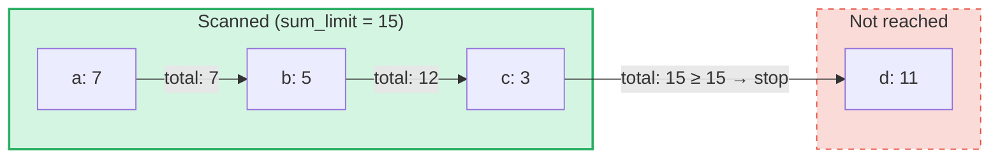

# Zapytania o sumy agregujące

## Przegląd

Zapytania o sumy agregujące to wyspecjalizowany typ zapytań przeznaczony dla **SumTrees** w GroveDB.
Podczas gdy zwykłe zapytania pobierają elementy według klucza lub zakresu, zapytania o sumy agregujące
iterują przez elementy i kumulują ich wartości sum, aż do osiągnięcia **limitu sumy**.

Jest to przydatne w przypadku pytań takich jak:
- "Daj mi transakcje, aż łączna suma przekroczy 1000"
- "Które elementy składają się na pierwszych 500 jednostek wartości w tym drzewie?"
- "Zbierz elementy sum do budżetu N"

## Podstawowe koncepcje

### Czym różni się od zwykłych zapytań

| Cecha | PathQuery | AggregateSumPathQuery |
|-------|-----------|----------------------|
| **Cel** | Dowolny typ elementu | Elementy SumItem / ItemWithSumItem |
| **Warunek zatrzymania** | Limit (ilość) lub koniec zakresu | Limit sumy (bieżąca suma) **i/lub** limit elementów |
| **Zwraca** | Elementy lub klucze | Pary klucz-wartość sumy |
| **Podzapytania** | Tak (zstępowanie do poddrzew) | Nie (pojedynczy poziom drzewa) |
| **Referencje** | Rozwiązywane przez warstwę GroveDB | Opcjonalnie śledzone lub ignorowane |

### Struktura AggregateSumQuery

```rust
pub struct AggregateSumQuery {
    pub items: Vec<QueryItem>,              // Keys or ranges to scan
    pub left_to_right: bool,                // Iteration direction
    pub sum_limit: u64,                     // Stop when running total reaches this
    pub limit_of_items_to_check: Option<u16>, // Max number of matching items to return
}
```

Zapytanie jest opakowane w `AggregateSumPathQuery`, aby określić, gdzie w gaju szukać:

```rust
pub struct AggregateSumPathQuery {
    pub path: Vec<Vec<u8>>,                 // Path to the SumTree
    pub aggregate_sum_query: AggregateSumQuery,
}
```

### Limit sumy — bieżąca suma

`sum_limit` jest centralnym pojęciem. W miarę skanowania elementów ich wartości sum są
kumulowane. Gdy bieżąca suma osiągnie lub przekroczy limit sumy, iteracja zostaje zatrzymana:



> **Wynik:** `[(a, 7), (b, 5), (c, 3)]` — iteracja zatrzymuje się, ponieważ 7 + 5 + 3 = 15 >= sum_limit

Ujemne wartości sum są obsługiwane. Ujemna wartość zwiększa pozostały budżet:

```text
sum_limit = 12, elements: a(10), b(-3), c(5)

a: total = 10, remaining = 2
b: total =  7, remaining = 5  ← negative value gave us more room
c: total = 12, remaining = 0  ← stop

Result: [(a, 10), (b, -3), (c, 5)]
```

## Opcje zapytania

Struktura `AggregateSumQueryOptions` kontroluje zachowanie zapytania:

```rust
pub struct AggregateSumQueryOptions {
    pub allow_cache: bool,                              // Use cached reads (default: true)
    pub error_if_intermediate_path_tree_not_present: bool, // Error on missing path (default: true)
    pub error_if_non_sum_item_found: bool,              // Error on non-sum elements (default: true)
    pub ignore_references: bool,                        // Skip references (default: false)
}
```

### Obsługa elementów niebędących sumami

SumTrees mogą zawierać mieszankę typów elementów: `SumItem`, `Item`, `Reference`, `ItemWithSumItem`
i inne. Domyślnie napotkanie elementu niebędącego sumą ani referencją powoduje błąd.

Gdy `error_if_non_sum_item_found` jest ustawione na `false`, elementy niebędące sumami są **po cichu pomijane**
bez zużycia slotu limitu użytkownika:

```text
Tree contents: a(SumItem=7), b(Item), c(SumItem=3)
Query: sum_limit=100, limit_of_items_to_check=2, error_if_non_sum_item_found=false

Scan: a(7) → returned, limit=1
      b(Item) → skipped, limit still 1
      c(3) → returned, limit=0 → stop

Result: [(a, 7), (c, 3)]
```

Uwaga: Elementy `ItemWithSumItem` są **zawsze** przetwarzane (nigdy pomijane), ponieważ zawierają
wartość sumy.

### Obsługa referencji

Domyślnie elementy `Reference` są **śledzone** — zapytanie rozwiązuje łańcuch referencji
(do 3 pośrednich skoków), aby znaleźć wartość sumy elementu docelowego:

```text
Tree contents: a(SumItem=7), ref_b(Reference → a)
Query: sum_limit=100

ref_b is followed → resolves to a(SumItem=7)

Result: [(a, 7), (ref_b, 7)]
```

Gdy `ignore_references` jest ustawione na `true`, referencje są po cichu pomijane bez zużycia slotu
limitu, podobnie jak pomijane są elementy niebędące sumami.

Łańcuchy referencji głębsze niż 3 pośrednie skoki powodują błąd `ReferenceLimit`.

## Typ wyniku

Zapytania zwracają `AggregateSumQueryResult`:

```rust
pub struct AggregateSumQueryResult {
    pub results: Vec<(Vec<u8>, i64)>,       // Key-sum value pairs
    pub hard_limit_reached: bool,           // True if system limit truncated results
}
```

Flaga `hard_limit_reached` wskazuje, czy systemowy twardy limit skanowania (domyślnie: 1024
elementy) został osiągnięty przed naturalnym zakończeniem zapytania. Gdy wynosi `true`, mogą
istnieć dodatkowe wyniki poza tymi, które zostały zwrócone.

## Trzy systemy limitów

Zapytania o sumy agregujące mają **trzy** warunki zatrzymania:

| Limit | Źródło | Co liczy | Efekt po osiągnięciu |
|-------|--------|----------|---------------------|
| **sum_limit** | Użytkownik (zapytanie) | Bieżąca suma wartości sum | Zatrzymuje iterację |
| **limit_of_items_to_check** | Użytkownik (zapytanie) | Zwrócone pasujące elementy | Zatrzymuje iterację |
| **Twardy limit skanowania** | System (GroveVersion, domyślnie 1024) | Wszystkie zeskanowane elementy (łącznie z pomijanymi) | Zatrzymuje iterację, ustawia `hard_limit_reached` |

Twardy limit skanowania zapobiega nieograniczonej iteracji, gdy nie ustawiono limitu użytkownika.
Pominięte elementy (elementy niebędące sumami z `error_if_non_sum_item_found=false` lub referencje z
`ignore_references=true`) liczą się do twardego limitu skanowania, ale **nie** do limitu
`limit_of_items_to_check` użytkownika.

## Użycie API

### Proste zapytanie

```rust
use grovedb::AggregateSumPathQuery;
use grovedb_merk::proofs::query::AggregateSumQuery;

// "Give me items from this SumTree until the total reaches 1000"
let query = AggregateSumQuery::new(1000, None);
let path_query = AggregateSumPathQuery {
    path: vec![b"my_tree".to_vec()],
    aggregate_sum_query: query,
};

let result = db.query_aggregate_sums(
    &path_query,
    true,   // allow_cache
    true,   // error_if_intermediate_path_tree_not_present
    None,   // transaction
    grove_version,
).unwrap().expect("query failed");

for (key, sum_value) in &result.results {
    println!("{}: {}", String::from_utf8_lossy(key), sum_value);
}
```

### Zapytanie z opcjami

```rust
use grovedb::{AggregateSumPathQuery, AggregateSumQueryOptions};
use grovedb_merk::proofs::query::AggregateSumQuery;

// Skip non-sum items and ignore references
let query = AggregateSumQuery::new(1000, Some(50));
let path_query = AggregateSumPathQuery {
    path: vec![b"mixed_tree".to_vec()],
    aggregate_sum_query: query,
};

let result = db.query_aggregate_sums_with_options(
    &path_query,
    AggregateSumQueryOptions {
        error_if_non_sum_item_found: false,  // skip Items, Trees, etc.
        ignore_references: true,              // skip References
        ..AggregateSumQueryOptions::default()
    },
    None,
    grove_version,
).unwrap().expect("query failed");

if result.hard_limit_reached {
    println!("Warning: results may be incomplete (hard limit reached)");
}
```

### Zapytania oparte na kluczach

Zamiast skanować zakres, można zapytać o konkretne klucze:

```rust
// Check the sum value of specific keys
let query = AggregateSumQuery::new_with_keys(
    vec![b"alice".to_vec(), b"bob".to_vec(), b"carol".to_vec()],
    u64::MAX,  // no sum limit
    None,      // no item limit
);
```

### Zapytania malejące

Iteracja od najwyższego klucza do najniższego:

```rust
let query = AggregateSumQuery::new_descending(500, Some(10));
// Or: query.left_to_right = false;
```

## Referencja konstruktorów

| Konstruktor | Opis |
|-------------|------|
| `new(sum_limit, limit)` | Pełny zakres, rosnąco |
| `new_descending(sum_limit, limit)` | Pełny zakres, malejąco |
| `new_single_key(key, sum_limit)` | Wyszukiwanie pojedynczego klucza |
| `new_with_keys(keys, sum_limit, limit)` | Wiele konkretnych kluczy |
| `new_with_keys_reversed(keys, sum_limit, limit)` | Wiele kluczy, malejąco |
| `new_single_query_item(item, sum_limit, limit)` | Pojedynczy QueryItem (klucz lub zakres) |
| `new_with_query_items(items, sum_limit, limit)` | Wiele QueryItems |

---
