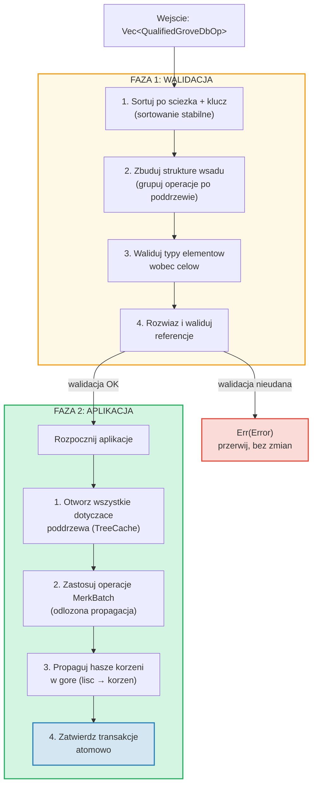
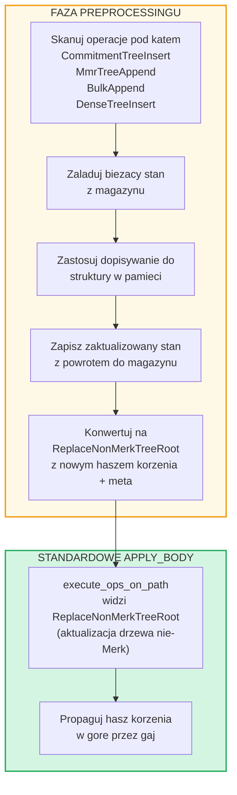

# Operacje wsadowe na poziomie gaju

## Warianty GroveOp

Na poziomie GroveDB operacje sa reprezentowane jako `GroveOp`:

```rust
pub enum GroveOp {
    // Operacje uzytkownika:
    InsertOnly { element: Element },
    InsertOrReplace { element: Element },
    Replace { element: Element },
    Patch { element: Element, change_in_bytes: i32 },
    RefreshReference { reference_path_type, max_reference_hop, flags, trust_refresh_reference },
    Delete,
    DeleteTree(TreeType),                          // Parametryzowane typem drzewa

    // Operacje dopisywania drzew nie-Merk (uzytkownika):
    CommitmentTreeInsert { cmx: [u8; 32], payload: Vec<u8> },
    MmrTreeAppend { value: Vec<u8> },
    BulkAppend { value: Vec<u8> },
    DenseTreeInsert { value: Vec<u8> },

    // Operacje wewnetrzne (tworzone przez preprocessing/propagacje, odrzucane przez from_ops):
    ReplaceTreeRootKey { hash, root_key, aggregate_data },
    InsertTreeWithRootHash { hash, root_key, flags, aggregate_data },
    ReplaceNonMerkTreeRoot { hash: [u8; 32], meta: NonMerkTreeMeta },
    InsertNonMerkTree { hash, root_key, flags, aggregate_data, meta: NonMerkTreeMeta },
}
```

**NonMerkTreeMeta** przenosi stan specyficzny dla typu drzewa przez przetwarzanie wsadowe:

```rust
pub enum NonMerkTreeMeta {
    CommitmentTree { total_count: u64, chunk_power: u8 },
    MmrTree { mmr_size: u64 },
    BulkAppendTree { total_count: u64, chunk_power: u8 },
    DenseTree { count: u16, height: u8 },
}
```

Kazda operacja jest opakowana w `QualifiedGroveDbOp` zawierajacy sciezke:

```rust
pub struct QualifiedGroveDbOp {
    pub path: KeyInfoPath,           // Gdzie w gaju
    pub key: Option<KeyInfo>,        // Ktory klucz (None dla operacji drzew append-only)
    pub op: GroveOp,                 // Co zrobic
}
```

> **Uwaga:** Pole `key` jest typu `Option<KeyInfo>` -- jest `None` dla operacji
> drzew append-only (`CommitmentTreeInsert`, `MmrTreeAppend`, `BulkAppend`, `DenseTreeInsert`),
> gdzie kluczem drzewa jest ostatni segment `path`.

## Przetwarzanie dwufazowe

Operacje wsadowe sa przetwarzane w dwoch fazach:



## TreeCache i odlozona propagacja

Podczas stosowania wsadu GroveDB uzywa **TreeCache** do odlozenia propagacji
hasza korzenia, az wszystkie operacje w poddrzewie zostana ukonczone:

```mermaid
graph TD
    subgraph without["BEZ TreeCache (naiwnie)"]
        w1["Op 1: Wstaw A do X"]
        w1p["Propaguj X → rodzic → korzen"]
        w2["Op 2: Wstaw B do X"]
        w2p["Propaguj X → rodzic → korzen"]
        w3["Op 3: Wstaw C do X"]
        w3p["Propaguj X → rodzic → korzen"]
        w1 --> w1p --> w2 --> w2p --> w3 --> w3p
    end

    subgraph with_tc["Z TreeCache (odlozone)"]
        t1["Op 1: Wstaw A do X<br/>→ zbuforowane"]
        t2["Op 2: Wstaw B do X<br/>→ zbuforowane"]
        t3["Op 3: Wstaw C do X<br/>→ zbuforowane"]
        tp["Propaguj X → rodzic → korzen<br/>(przejdz w gore RAZ)"]
        t1 --> t2 --> t3 --> tp
    end

    style without fill:#fadbd8,stroke:#e74c3c,stroke-width:2px
    style with_tc fill:#d5f5e3,stroke:#27ae60,stroke-width:2px
    style w1p fill:#fadbd8,stroke:#e74c3c
    style w2p fill:#fadbd8,stroke:#e74c3c
    style w3p fill:#fadbd8,stroke:#e74c3c
    style tp fill:#d5f5e3,stroke:#27ae60,stroke-width:2px
```



> **3 propagacje * O(glebokosc)** vs **1 propagacja * O(glebokosc)** = 3x szybciej dla tego poddrzewa.

Jest to znaczaca optymalizacja, gdy wiele operacji celuje w to samo poddrzewo.

## Atomowe operacje miedzy poddrzewami

Kluczowa wlasciwosc wsadow GroveDB to **atomowosc miedzy poddrzewami**. Pojedynczy
wsad moze modyfikowac elementy w wielu poddrzewach, a albo wszystkie zmiany sa
zatwierdzane, albo zadna:

```text
    Wsad:
    1. Usun ["balances", "alice"]       (usun saldo)
    2. Wstaw ["balances", "bob"] = 100   (dodaj saldo)
    3. Aktualizuj ["identities", "bob", "rev"] = 2  (aktualizuj rewizje)

    Trzy poddrzewa dotknięte: balances, identities, identities/bob

    Jezeli JAKAKOLWIEK operacja sie nie powiedzie → WSZYSTKIE sa wycofywane
    Jezeli WSZYSTKIE sie powioda → WSZYSTKIE sa zatwierdzane atomowo
```

Procesor wsadowy obsluguje to przez:
1. Zebranie wszystkich dotkniętych sciezek
2. Otwarcie wszystkich potrzebnych poddrzew
3. Zastosowanie wszystkich operacji
4. Propagacje wszystkich haszy korzeni w kolejnosci zaleznosci
5. Zatwierdzenie calej transakcji

## Preprocessing wsadu dla drzew nie-Merk

Operacje CommitmentTree, MmrTree, BulkAppendTree i DenseAppendOnlyFixedSizeTree
wymagaja dostepu do kontekstow magazynowania poza Merk, ktory nie jest dostepny
wewnatrz standardowej metody `execute_ops_on_path` (ma ona dostep tylko do Merk).
Te operacje uzywaja **wzorca preprocessingu**: przed glowna faza `apply_body`, punkty
wejscia skanuja w poszukiwaniu operacji drzew nie-Merk i konwertuja je na standardowe
operacje wewnetrzne.

```rust
pub enum GroveOp {
    // ... standardowe operacje ...

    // Operacje drzew nie-Merk (uzytkownika):
    CommitmentTreeInsert { cmx: [u8; 32], payload: Vec<u8> },
    MmrTreeAppend { value: Vec<u8> },
    BulkAppend { value: Vec<u8> },
    DenseTreeInsert { value: Vec<u8> },

    // Operacje wewnetrzne (tworzone przez preprocessing):
    ReplaceNonMerkTreeRoot { hash: [u8; 32], meta: NonMerkTreeMeta },
}
```



**Dlaczego preprocessing?** Funkcja `execute_ops_on_path` operuje na pojedynczym
poddrzewie Merk i nie ma dostepu do `self.db` ani szerszych kontekstow
magazynowania. Preprocessing w punktach wejscia (`apply_batch_with_element_flags_update`,
`apply_partial_batch_with_element_flags_update`) ma pelny dostep do bazy danych,
wiec moze ladowac/zapisywac dane, a nastepnie przekazac proste `ReplaceNonMerkTreeRoot`
do standardowej maszynerii wsadowej.

Kazda metoda preprocessingu podaza tym samym wzorcem:
1. **`preprocess_commitment_tree_ops`** -- Laduje frontier i BulkAppendTree z
   magazynu danych, dopisuje do obu, zapisuje z powrotem, konwertuje na `ReplaceNonMerkTreeRoot`
   z zaktualizowanym polaczonym korzeniem i meta `CommitmentTree { total_count, chunk_power }`
2. **`preprocess_mmr_tree_ops`** -- Laduje MMR z magazynu danych, dopisuje wartosci,
   zapisuje z powrotem, konwertuje na `ReplaceNonMerkTreeRoot` z zaktualizowanym korzeniem MMR
   i meta `MmrTree { mmr_size }`
3. **`preprocess_bulk_append_ops`** -- Laduje BulkAppendTree z magazynu danych,
   dopisuje wartosci (moze wywolac kompakcje chunkow), zapisuje z powrotem, konwertuje na
   `ReplaceNonMerkTreeRoot` z zaktualizowanym korzeniem stanu i meta `BulkAppendTree { total_count, chunk_power }`
4. **`preprocess_dense_tree_ops`** -- Laduje DenseFixedSizedMerkleTree z magazynu
   danych, wstawia wartosci sekwencyjnie, przelicza hasz korzenia, zapisuje z powrotem,
   konwertuje na `ReplaceNonMerkTreeRoot` z zaktualizowanym haszem korzenia i meta `DenseTree { count, height }`

Operacja `ReplaceNonMerkTreeRoot` przenosi nowy hasz korzenia i enumeracje `NonMerkTreeMeta`,
dzieki czemu element moze byc w pelni zrekonstruowany po przetworzeniu.

---
