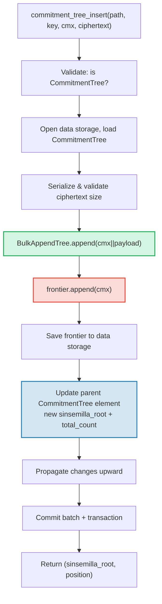

# CommitmentTree — Kotwice zobowiazan Sinsemilla

**CommitmentTree** to most GroveDB miedzy uwierzytelnionym magazynowaniem a systemami
dowodow wiedzy zerowej (zero-knowledge). Laczy **BulkAppendTree** (Rozdzial 14) do
wydajnego magazynowania danych z kompakcja chunkow z **frontierem Sinsemilla** w
przestrzeni nazw data dla kotwic kompatybilnych z ZK. Tak jak MmrTree i BulkAppendTree,
**nie ma potomnego Merk** — polaczony hasz korzenia przeplywa jako hasz potomny Merk.
Zarowno wpisy BulkAppendTree, jak i frontier Sinsemilla znajduja sie w **przestrzeni
nazw data**.

Ten rozdzial obejmuje funkcje haszowa Sinsemilla i dlaczego ma znaczenie dla obwodow
wiedzy zerowej, strukture danych frontier i jej zwiezla serializacje, dwuprzestrzenna
architekture magazynowania, operacje GroveDB, preprocessing wsadowy, generowanie
swiadkow po stronie klienta i jak dzialaja dowody.

## Dlaczego drzewo przyjazne ZK?

Standardowe drzewa GroveDB uzywaja haszowania Blake3. Blake3 jest szybki w oprogramowaniu,
ale **kosztowny wewnatrz obwodow wiedzy zerowej**. Gdy wydajca musi udowodnic "znam note
na pozycji P w drzewie zobowiazan" bez ujawniania P, musi ocenic funkcje haszujaca Merkle
32 razy (raz na poziom drzewa) wewnatrz obwodu ZK.

Sinsemilla (okreslona w ZIP-244 dla protokolu Zcash Orchard) jest zaprojektowana
dokladnie do tego zastosowania — zapewnia **wydajne haszowanie wewnatrz obwodu** na
krzywej eliptycznej Pallas, jednej polowie cyklu krzywych Pasta uzywanych przez system
dowodow Halo 2.

| Wlasciwosc | Blake3 | Sinsemilla |
|----------|--------|------------|
| **Koszt obwodu** | ~25 000 ograniczen na hasz | ~800 ograniczen na hasz |
| **Predkosc programowa** | Bardzo szybki (~2 GB/s) | Wolny (~10 000 haszy/s) |
| **Struktura algebraiczna** | Brak (bitowa) | Operacje na krzywej Pallas |
| **Glowne przeznaczenie** | Ogolne haszowanie, drzewa Merkle | Dowody Merkle wewnatrz obwodow |
| **Uzywane przez** | Drzewa Merk GroveDB, MMR, Bulk | Protokol chroniony Orchard |
| **Rozmiar wyjscia** | 32 bajty | 32 bajty (element ciala Pallas) |

CommitmentTree uzywa Sinsemilla dla drzewa Merkle, o ktorym rozumuja obwody ZK,
jednoczesnie uzywajac Blake3 dla hierarchii Merk GroveDB powyzej. Elementy wstawiane
do drzewa sa przechowywane poprzez BulkAppendTree w przestrzeni nazw data (kompaktowane
w chunki, dostepne po pozycji) i jednoczesnie dopisywane do frontieru Sinsemilla
(produkujac kotwice dowodliwe w ZK).

## Architektura przestrzeni nazw data

CommitmentTree przechowuje **wszystkie dane w przestrzeni nazw data** pod ta sama
sciezka poddrzewa. Tak jak MmrTree i BulkAppendTree, **nie ma potomnego Merk**
(brak pola `root_key` — korzen specyficzny dla typu przeplywa jako hasz potomny Merk).
Wpisy BulkAppendTree i frontier Sinsemilla wspolisnieja w przestrzeni nazw data
uzywajac odrebnych prefiksow kluczy:

```text
┌──────────────────────────────────────────────────────────────┐
│                       CommitmentTree                          │
│                                                               │
│  ┌─────────────────────────────────────────────────────────┐  │
│  │  Data Namespace                                         │  │
│  │                                                         │  │
│  │  BulkAppendTree storage (Chapter 14):                   │  │
│  │    Buffer entries → chunk blobs → chunk MMR             │  │
│  │    value = cmx (32 bytes) || ciphertext (216 bytes)     │  │
│  │                                                         │  │
│  │  Sinsemilla Frontier (~1KB):                            │  │
│  │    key: b"__ct_data__" (COMMITMENT_TREE_DATA_KEY)       │  │
│  │    Depth-32 incremental Merkle tree                     │  │
│  │    Stores only the rightmost path (leaf + ommers)       │  │
│  │    O(1) append, O(1) root computation                   │  │
│  │    Produces Orchard-compatible Anchor for ZK proofs     │  │
│  └─────────────────────────────────────────────────────────┘  │
│                                                               │
│  sinsemilla_root embedded in Element bytes                    │
│    → flows through Merk value_hash → GroveDB state root      │
└──────────────────────────────────────────────────────────────┘
```

**Dlaczego dwie struktury?** BulkAppendTree zapewnia wydajne, kompaktowane w chunki
magazynowanie i pobieranie potencjalnie milionow zaszyfrowanych not. Frontier
Sinsemilla zapewnia kotwice kompatybilne z ZK, ktore moga byc dowodzone wewnatrz
obwodu Halo 2. Oba sa aktualizowane synchronicznie przy kazdym dopisaniu.

Porownanie z innymi niestandardowymi typami drzew:

| | CommitmentTree | MmrTree | BulkAppendTree |
|---|---|---|---|
| **Potomny Merk** | Nie | Nie | Nie |
| **Przestrzen nazw data** | Wpisy BulkAppendTree + frontier | Wezly MMR | Bufor + chunki + MMR |
| **Przestrzen nazw aux** | — | — | — |
| **Elementy zapytywalne** | Poprzez dowody V1 | Poprzez dowody V1 | Poprzez dowody V1 |
| **Funkcja haszujaca** | Sinsemilla + Blake3 | Blake3 | Blake3 |

## Frontier Sinsemilla

Frontier to inkrementalne drzewo Merkle o glebokosci 32, zaimplementowane przez typ
`Frontier<MerkleHashOrchard, 32>` z crate `incrementalmerkletree`. Zamiast przechowywac
wszystkie 2^32 mozliwe liscie, przechowuje tylko informacje potrzebne do **dopisania
nastepnego liscia i obliczenia biezacego korzenia**: najdalszy z prawej lisc i jego
ommery (hasze rodzenstwa potrzebne do obliczenia korzenia).

```text
                         root (level 32)
                        /               \
                      ...               ...
                     /                     \
                  (level 2)             (level 2)
                  /     \               /     \
              (level 1) (level 1)   (level 1)  ?
              /    \    /    \      /    \
             L0    L1  L2    L3   L4    ?     ← frontier stores L4
                                              + ommers at levels
                                              where left sibling exists
```

Frontier przechowuje:
- **leaf** (lisc): ostatnio dopisana wartosc (element ciala Pallas)
- **ommers** (ommery): hasze lewego rodzenstwa na kazdym poziomie, gdzie sciezka
  frontieru skraca w prawo (najwyzej 32 ommery dla drzewa o glebokosci 32)
- **position** (pozycja): indeks liscia od 0

Kluczowe wlasciwosci:
- **Dopisywanie O(1)**: wstaw nowy lisc, zaktualizuj ommery, przelicz korzen
- **Korzen O(1)**: przejdz przechowywane ommery od liscia do korzenia
- **~1KB stalego rozmiaru**: niezaleznie od tego, ile lisci zostalo dopisanych
- **Deterministyczny**: dwa frontiery z ta sama sekwencja dopisywan produkuja
  ten sam korzen

Stala `EMPTY_SINSEMILLA_ROOT` to korzen pustego drzewa o glebokosci 32,
przeliczona jako `MerkleHashOrchard::empty_root(Level::from(32)).to_bytes()`:

```text
0xae2935f1dfd8a24aed7c70df7de3a668eb7a49b1319880dde2bbd9031ae5d82f
```

## Jak dziala dopisywanie — kaskada ommerow

Gdy nowe zobowiazanie jest dopisywane na pozycji N, liczba ommerow ktore musza
byc zaktualizowane rowna sie `trailing_ones(N)` — liczbie koncowych bitow 1
w reprezentacji binarnej N. Jest to ten sam wzorzec co kaskada laczenia MMR
(§13.4), ale operujacy na ommerach zamiast szczytow.

**Opracowany przyklad — dopisywanie 4 lisci:**

```text
Position 0 (binary: 0, trailing_ones: 0):
  frontier = { leaf: L0, ommers: [], position: 0 }
  Sinsemilla hashes: 32 (root computation) + 0 (no ommer merges) = 32

Position 1 (binary: 1, trailing_ones: 0 of PREVIOUS position 0):
  Before: position 0 has trailing_ones = 0
  frontier = { leaf: L1, ommers: [H(L0,L1) at level 1], position: 1 }
  Sinsemilla hashes: 32 + 0 = 32

Position 2 (binary: 10, trailing_ones: 0 of PREVIOUS position 1):
  Before: position 1 has trailing_ones = 1
  frontier = { leaf: L2, ommers: [level1_hash], position: 2 }
  Sinsemilla hashes: 32 + 1 = 33

Position 3 (binary: 11, trailing_ones: 0 of PREVIOUS position 2):
  Before: position 2 has trailing_ones = 0
  frontier = { leaf: L3, ommers: [level1_hash, level2_hash], position: 3 }
  Sinsemilla hashes: 32 + 0 = 32
```

**Calkowita liczba haszy Sinsemilla** na dopisanie wynosi:

```text
32 (root computation always traverses all 32 levels)
+ trailing_ones(current_position)  (ommer cascade)
```

Srednio `trailing_ones` wynosi ~1 (rozklad geometryczny), wiec sredni koszt
to **~33 hasze Sinsemilla na dopisanie**. Najgorszy przypadek (na pozycji
2^32 - 1, gdzie wszystkie bity sa 1) to **64 hasze**.

## Format serializacji frontieru

Frontier jest przechowywany w magazynie data pod kluczem `b"__ct_data__"`.
Format przewodowy to:

```text
┌──────────────────────────────────────────────────────────────────┐
│ has_frontier: u8                                                  │
│   0x00 → empty tree (no more fields)                             │
│   0x01 → non-empty (fields follow)                               │
├──────────────────────────────────────────────────────────────────┤
│ position: u64 BE (8 bytes)      — 0-indexed leaf position        │
├──────────────────────────────────────────────────────────────────┤
│ leaf: [u8; 32]                  — Pallas field element bytes     │
├──────────────────────────────────────────────────────────────────┤
│ ommer_count: u8                 — number of ommers (0..=32)      │
├──────────────────────────────────────────────────────────────────┤
│ ommers: [ommer_count × 32 bytes] — Pallas field elements        │
└──────────────────────────────────────────────────────────────────┘
```

**Analiza rozmiaru:**

| Stan | Rozmiar | Rozklad |
|-------|------|-----------|
| Pusty | 1 bajt | Tylko flaga `0x00` |
| 1 lisc, 0 ommerow | 42 bajty | 1 + 8 + 32 + 1 |
| ~16 ommerow (srednia) | 554 bajty | 1 + 8 + 32 + 1 + 16×32 |
| 32 ommery (maksimum) | 1066 bajtow | 1 + 8 + 32 + 1 + 32×32 |

Rozmiar frontieru jest ograniczony do ~1.1KB niezaleznie od tego, ile milionow
zobowiazan zostalo dopisanych. To sprawia, ze cykl ladowanie→modyfikacja→zapis
jest bardzo tani (1 szukanie do odczytu, 1 szukanie do zapisu).

## Reprezentacja elementu

```rust
CommitmentTree(
    u64,                  // total_count: number of appended items
    u8,                   // chunk_power: dense tree height for BulkAppendTree buffer
    Option<ElementFlags>, // flags: optional metadata
)
```

Parametr `chunk_power` kontroluje wysokosc gestego drzewa bufora BulkAppendTree;
`chunk_power` musi byc w zakresie 1..=16 (patrz §14.1 i §16).

**Identyfikatory typow:**

| Identyfikator | Wartosc |
|---|---|
| Dyskryminator elementu | 11 |
| `TreeType` | `CommitmentTree = 7` |
| `ElementType` | 11 |
| `COMMITMENT_TREE_COST_SIZE` | 12 bajtow (8 total_count + 1 chunk_power + 1 dyskryminator + 2 narzut) |

Korzen Sinsemilla NIE jest przechowywany w elemencie. Przeplywa jako hasz potomny Merk
poprzez mechanizm `insert_subtree`. Gdy nadrzedny Merk oblicza swoj
`combined_value_hash`, korzen wywodzacy sie z Sinsemilla jest wlaczany jako hasz potomny:

```text
combined_value_hash = blake3(value_hash || child_hash)
                                           ↑ sinsemilla/BulkAppendTree combined root
```

Oznacza to, ze kazda zmiana frontieru Sinsemilla automatycznie propaguje sie
przez hierarchie Merk GroveDB do korzenia stanu.

**Metody konstruktorow:**

| Metoda | Tworzy |
|---|---|
| `Element::empty_commitment_tree(chunk_power)` | Puste drzewo, count=0, bez flag |
| `Element::empty_commitment_tree_with_flags(chunk_power, flags)` | Puste drzewo z flagami |
| `Element::new_commitment_tree(total_count, chunk_power, flags)` | Wszystkie pola jawne |

## Architektura magazynowania

CommitmentTree przechowuje wszystkie swoje dane w pojedynczej **przestrzeni nazw data**
pod sciezka poddrzewa. Wpisy BulkAppendTree i frontier Sinsemilla wspolisnieja w tej
samej kolumnie uzywajac odrebnych prefiksow kluczy. Przestrzen nazw aux nie jest uzywana.

```text
┌──────────────────────────────────────────────────────────────────┐
│  Data Namespace (all CommitmentTree storage)                      │
│                                                                   │
│  BulkAppendTree storage keys (see §14.7):                         │
│    b"m" || pos (u64 BE)  → MMR node blobs                        │
│    b"b" || index (u64 BE)→ buffer entries (cmx || ciphertext)     │
│    b"e" || chunk (u64 BE)→ chunk blobs (compacted buffer)         │
│    b"M"                  → BulkAppendTree metadata                │
│                                                                   │
│  Sinsemilla frontier:                                             │
│    b"__ct_data__"        → serialized CommitmentFrontier (~1KB)   │
│                                                                   │
│  No Merk nodes — this is a non-Merk tree.                         │
│  Data authenticated via BulkAppendTree state_root (Blake3).       │
│  Sinsemilla root authenticates all cmx values via Pallas curve.   │
└──────────────────────────────────────────────────────────────────┘
```

**Wzorzec ladowanie→modyfikacja→zapis**: Kazda mutujaca operacja laduje frontier
z magazynu data, modyfikuje go w pamieci i zapisuje z powrotem. Poniewaz frontier
ma najwyzej ~1KB, jest to niedroga para operacji I/O (1 szukanie do odczytu,
1 szukanie do zapisu). Jednoczesnie BulkAppendTree jest ladowany, dopisywany
i zapisywany.

**Propagacja hasza korzenia**: Gdy element jest wstawiany, dwie rzeczy sie zmieniaja:
1. Stan BulkAppendTree zmienia sie (nowy wpis w buforze lub kompakcja chunka)
2. Korzen Sinsemilla zmienia sie (nowe zobowiazanie we frontierze)

Oba sa uwzglednione w zaktualizowanym elemencie `CommitmentTree`. Hasz wezla
nadrzednego Merk staje sie:

```text
combined_hash = combine_hash(
    value_hash(element_bytes),    ← includes total_count + chunk_power
    child_hash(combined_root)     ← sinsemilla/BulkAppendTree combined root
)
```

Tak jak MmrTree i BulkAppendTree, korzen specyficzny dla typu przeplywa jako hasz
potomny Merk. Cale uwierzytelnianie danych przeplywa przez to powiazanie hasza potomnego.

**Implikacje magazynowania danych nie-Merk**: Poniewaz przestrzen nazw data zawiera
klucze BulkAppendTree (nie wezly Merk), operacje ktore iteruja magazyn jako elementy
Merk — takie jak `find_subtrees`, `is_empty_tree` i `verify_merk_and_submerks` —
musza specjalnie obslugiwac CommitmentTree (i inne typy drzew nie-Merk). Helper
`uses_non_merk_data_storage()` na zarowno `Element` jak i `TreeType` identyfikuje
te typy drzew. Operacje usuwania czyszcza przestrzen nazw data bezposrednio zamiast
iterowac ja, a verify_grovedb pomija rekursje pod-merka dla tych typow.

## Operacje GroveDB

CommitmentTree udostepnia cztery operacje. Operacja wstawiania jest generyczna po
`M: MemoSize` (z crate `orchard`), ktory kontroluje walidacje rozmiaru ladunku
szyfrogramu. Domyslne `M = DashMemo` daje 216-bajtowy ladunek
(32 epk + 104 enc + 80 out).

```rust
// Insert a commitment (typed) — returns (sinsemilla_root, position)
// M controls ciphertext size validation
db.commitment_tree_insert::<_, _, M>(path, key, cmx, ciphertext, tx, version)

// Insert a commitment (raw bytes) — validates payload.len() == ciphertext_payload_size::<DashMemo>()
db.commitment_tree_insert_raw(path, key, cmx, payload_vec, tx, version)

// Get the current Orchard Anchor
db.commitment_tree_anchor(path, key, tx, version)

// Retrieve a value by global position
db.commitment_tree_get_value(path, key, position, tx, version)

// Get the current item count
db.commitment_tree_count(path, key, tx, version)
```

Typowany `commitment_tree_insert` przyjmuje `TransmittedNoteCiphertext<M>` i
serializuje go wewnetrznie. Surowy `commitment_tree_insert_raw` (pub(crate))
przyjmuje `Vec<u8>` i jest uzywany przez preprocessing wsadowy, gdzie ladunki sa
juz zserializowane.

### commitment_tree_insert

Operacja wstawiania aktualizuje zarowno BulkAppendTree, jak i frontier Sinsemilla
w jednej atomowej operacji:

```text
Step 1: Validate element at path/key is a CommitmentTree
        → extract total_count, chunk_power, flags

Step 2: Build ct_path = path ++ [key]

Step 3: Open data storage context at ct_path
        Load CommitmentTree (frontier + BulkAppendTree)
        Serialize ciphertext → validate payload size matches M
        Append cmx||ciphertext to BulkAppendTree
        Append cmx to Sinsemilla frontier → get new sinsemilla_root
        Track Blake3 + Sinsemilla hash costs

Step 4: Save updated frontier to data storage

Step 5: Open parent Merk at path
        Write updated CommitmentTree element:
          new total_count, same chunk_power, same flags
        Child hash = combined_root (sinsemilla + bulk state)

Step 6: Propagate changes from parent upward through Merk hierarchy

Step 7: Commit storage batch and local transaction
        Return (sinsemilla_root, position)
```



> **Czerwony** = operacje Sinsemilla. **Zielony** = operacje BulkAppendTree.
> **Niebieski** = aktualizacja elementu laczaca oba.

### commitment_tree_anchor

Operacja anchor (kotwicy) jest zapytaniem tylko do odczytu:

```text
Step 1: Validate element at path/key is a CommitmentTree
Step 2: Build ct_path = path ++ [key]
Step 3: Load frontier from data storage
Step 4: Return frontier.anchor() as orchard::tree::Anchor
```

Typ `Anchor` to natywna reprezentacja Orchard korzenia Sinsemilla, odpowiednia
do bezposredniego przekazania do `orchard::builder::Builder` przy konstruowaniu
dowodow autoryzacji wydania.

### commitment_tree_get_value

Pobiera przechowywana wartosc (cmx || ladunek) po jej globalnej pozycji:

```text
Step 1: Validate element at path/key is a CommitmentTree
        → extract total_count, chunk_power
Step 2: Build ct_path = path ++ [key]
Step 3: Open data storage context, wrap in CachedBulkStore
Step 4: Load BulkAppendTree, call get_value(position)
Step 5: Return Option<Vec<u8>>
```

Podaza to tym samym wzorcem co `bulk_get_value` (§14.9) — BulkAppendTree
transparentnie pobiera z bufora lub skompaktowanego blobu chunka w zaleznosci od
tego, gdzie wypada pozycja.

### commitment_tree_count

Zwraca calkowita liczbe elementow dopisanych do drzewa:

```text
Step 1: Read element at path/key
Step 2: Verify it is a CommitmentTree
Step 3: Return total_count from element fields
```

Jest to prosty odczyt pola elementu — bez dostepu do magazynu poza nadrzednym Merk.

## Operacje wsadowe

CommitmentTree wspiera wsadowe wstawiania poprzez wariant
`GroveOp::CommitmentTreeInsert`:

```rust
GroveOp::CommitmentTreeInsert {
    cmx: [u8; 32],      // extracted note commitment
    payload: Vec<u8>,    // serialized ciphertext (216 bytes for DashMemo)
}
```

Dwa konstruktory tworza te operacje:

```rust
// Raw constructor — caller serializes payload manually
QualifiedGroveDbOp::commitment_tree_insert_op(path, cmx, payload_vec)

// Typed constructor — serializes TransmittedNoteCiphertext<M> internally
QualifiedGroveDbOp::commitment_tree_insert_op_typed::<M>(path, cmx, &ciphertext)
```

Wielokrotne wstawiania celujace w to samo drzewo sa dozwolone w jednym wsadzie.
Poniewaz `execute_ops_on_path` nie ma dostepu do magazynu data, wszystkie operacje
CommitmentTree musza byc przetworzone wstepnie przed `apply_body`.

**Potok preprocessingu** (`preprocess_commitment_tree_ops`):

```text
Input: [CTInsert{cmx1}, Insert{...}, CTInsert{cmx2}, CTInsert{cmx3}]
                                       ↑ same (path,key) as cmx1

Step 1: Group CommitmentTreeInsert ops by (path, key)
        group_1: [cmx1, cmx2, cmx3]

Step 2: For each group:
        a. Read existing element → verify CommitmentTree, extract chunk_power
        b. Open transactional storage context at ct_path
        c. Load CommitmentTree from data storage (frontier + BulkAppendTree)
        d. For each (cmx, payload):
           - ct.append_raw(cmx, payload) — validates size, appends to both
        e. Save updated frontier to data storage

Step 3: Replace all CTInsert ops with one ReplaceNonMerkTreeRoot per group
        carrying: hash=bulk_state_root (combined root),
                  meta=NonMerkTreeMeta::CommitmentTree {
                      total_count: new_count,
                      chunk_power,
                  }

Output: [ReplaceNonMerkTreeRoot{...}, Insert{...}]
```

Pierwsza operacja CommitmentTreeInsert w kazdej grupie jest zastepowana przez
`ReplaceNonMerkTreeRoot`; nastepne operacje dla tej samej (path, key) sa usuwane.
Standardowa maszyneria wsadowa obsluguje nastepnie aktualizacje elementu i propagacje
hasza korzenia.

## Generyk MemoSize i obsluga szyfrogramow

Struktura `CommitmentTree<S, M>` jest generyczna po `M: MemoSize` (z crate
`orchard`). Kontroluje to rozmiar zaszyfrowanych szyfrogramow not przechowywanych
obok kazdego zobowiazania.

```rust
pub struct CommitmentTree<S, M: MemoSize = DashMemo> {
    frontier: CommitmentFrontier,
    pub bulk_tree: BulkAppendTree<S>,
    _memo: PhantomData<M>,
}
```

Domyslne `M = DashMemo` oznacza, ze istniejacy kod ktory nie dba o rozmiar memo
(jak `verify_grovedb`, `commitment_tree_anchor`, `commitment_tree_count`)
dziala bez okreslania `M`.

**Format przechowywanego wpisu**: Kazdy wpis w BulkAppendTree to
`cmx (32 bajty) || ciphertext_payload`, gdzie uklad ladunku to:

```text
epk_bytes (32) || enc_ciphertext (variable by M) || out_ciphertext (80)
```

Dla `DashMemo`: `32 + 104 + 80 = 216 bajtow` ladunku, wiec kazdy wpis to
`32 + 216 = 248 bajtow` calkowicie.

**Helpery serializacji** (publiczne wolne funkcje):

| Funkcja | Opis |
|----------|-------------|
| `ciphertext_payload_size::<M>()` | Oczekiwany rozmiar ladunku dla danego `MemoSize` |
| `serialize_ciphertext::<M>(ct)` | Serializuj `TransmittedNoteCiphertext<M>` do bajtow |
| `deserialize_ciphertext::<M>(data)` | Deserializuj bajty z powrotem do `TransmittedNoteCiphertext<M>` |

**Walidacja ladunku**: Metoda `append_raw()` waliduje, ze
`payload.len() == ciphertext_payload_size::<M>()` i zwraca
`CommitmentTreeError::InvalidPayloadSize` przy niezgodnosci. Typowana metoda `append()`
serializuje wewnetrznie, wiec rozmiar jest zawsze poprawny z definicji.

## Generowanie swiadkow po stronie klienta

Crate `grovedb-commitment-tree` udostepnia drzewo **po stronie klienta** dla
portfeli i testowych wireframe'ow, ktore musza generowac sciezki swiadkow Merkle
do wydawania not. Wlacz ceche `client` aby go uzyc:

```toml
grovedb-commitment-tree = { version = "4", features = ["client"] }
```

```rust
pub struct ClientMemoryCommitmentTree {
    inner: ShardTree<MemoryShardStore<MerkleHashOrchard, u32>, 32, 4>,
}
```

`ClientMemoryCommitmentTree` opakowuje `ShardTree` — pelne drzewo zobowiazan (nie
tylko frontier), ktore utrzymuje pelna historie w pamieci. Pozwala to na generowanie
sciezek uwierzytelniania dla dowolnego oznaczonego liscia, czego sam frontier nie
potrafi.

**API:**

| Metoda | Opis |
|---|---|
| `new(max_checkpoints)` | Utworz puste drzewo z limitem retencji checkpointow |
| `append(cmx, retention)` | Dopisz zobowiazanie z polityka retencji |
| `checkpoint(id)` | Utworz checkpoint przy biezacym stanie |
| `max_leaf_position()` | Pozycja ostatnio dopisanego liscia |
| `witness(position, depth)` | Wygeneruj `MerklePath` do wydania noty |
| `anchor()` | Biezacy korzen jako `orchard::tree::Anchor` |

**Polityki retencji** kontroluja, ktore liscie moga byc pozniej swiadczone:

| Retencja | Znaczenie |
|---|---|
| `Retention::Ephemeral` | Lisc nie moze byc swiadczony (noty innych osob) |
| `Retention::Marked` | Lisc moze byc swiadczony (twoje wlasne noty) |
| `Retention::Checkpoint { id, marking }` | Utworz checkpoint, opcjonalnie oznacz |

**Porownanie serwer vs klient:**

| | `CommitmentFrontier` (serwer) | `ClientMemoryCommitmentTree` (klient) | `ClientPersistentCommitmentTree` (sqlite) |
|---|---|---|---|
| **Magazyn** | ~1KB frontier w magazynie data | Pelne drzewo w pamieci | Pelne drzewo w SQLite |
| **Moze swiadczyc** | Nie | Tak (tylko oznaczone liscie) | Tak (tylko oznaczone liscie) |
| **Moze obliczyc kotwice** | Tak | Tak | Tak |
| **Kotwica pasuje** | Ta sama sekwencja → ta sama kotwica | Ta sama sekwencja → ta sama kotwica | Ta sama sekwencja → ta sama kotwica |
| **Przetrwa restart** | Tak (magazyn data GroveDB) | Nie (utracone przy drop) | Tak (baza danych SQLite) |
| **Zastosowanie** | Sledzenie kotwic po stronie serwera GroveDB | Testowanie, efemeryczne portfele | Portfele produkcyjne |
| **Flaga cechy** | `server` | `client` | `sqlite` |

Wszystkie trzy produkuja **identyczne kotwice** dla tej samej sekwencji dopisywan.
Jest to weryfikowane przez test `test_frontier_and_client_same_root`.

### Trwaly klient — generowanie swiadkow wspierane przez SQLite

`ClientMemoryCommitmentTree` w pamieci traci caly stan przy drop. Dla portfeli
produkcyjnych, ktore musza przetrwac restarty bez ponownego skanowania calego
blockchaina, crate udostepnia `ClientPersistentCommitmentTree` wspierany przez
SQLite. Wlacz ceche `sqlite`:

```toml
grovedb-commitment-tree = { version = "4", features = ["sqlite"] }
```

```rust
pub struct ClientPersistentCommitmentTree {
    inner: ShardTree<SqliteShardStore, 32, 4>,
}
```

**Trzy tryby konstruktora:**

| Konstruktor | Opis |
|---|---|
| `open(conn, max_checkpoints)` | Przejmuje na wlasnosc istniejace `rusqlite::Connection` |
| `open_on_shared_connection(arc, max_checkpoints)` | Wspoldziela `Arc<Mutex<Connection>>` z innymi komponentami |
| `open_path(path, max_checkpoints)` | Wygoda — otwiera/tworzy baze SQLite pod podana sciezka pliku |

Konstruktory bring-your-own-connection (`open`, `open_on_shared_connection`)
pozwalaja portfelowi uzywac jego **istniejacej bazy danych** do magazynowania
drzewa zobowiazan. `SqliteShardStore` tworzy swoje tabele z prefiksem
`commitment_tree_`, wiec bezpiecznie wspolistnieje obok innych tabel aplikacji.

**API** jest identyczne jak `ClientMemoryCommitmentTree`:

| Metoda | Opis |
|---|---|
| `append(cmx, retention)` | Dopisz zobowiazanie z polityka retencji |
| `checkpoint(id)` | Utworz checkpoint przy biezacym stanie |
| `max_leaf_position()` | Pozycja ostatnio dopisanego liscia |
| `witness(position, depth)` | Wygeneruj `MerklePath` do wydania noty |
| `anchor()` | Biezacy korzen jako `orchard::tree::Anchor` |

**Schemat SQLite** (4 tabele, tworzone automatycznie):

```sql
commitment_tree_shards                -- Shard data (serialized prunable trees)
commitment_tree_cap                   -- Tree cap (single-row, top of shard tree)
commitment_tree_checkpoints           -- Checkpoint metadata (position or empty)
commitment_tree_checkpoint_marks_removed  -- Marks removed per checkpoint
```

**Przyklad persystencji:**

```rust
use grovedb_commitment_tree::{ClientPersistentCommitmentTree, Retention, Position};

// First session: append notes and close
let mut tree = ClientPersistentCommitmentTree::open_path("wallet.db", 100)?;
tree.append(cmx_0, Retention::Marked)?;
tree.append(cmx_1, Retention::Ephemeral)?;
let anchor_before = tree.anchor()?;
drop(tree);

// Second session: reopen, state is preserved
let tree = ClientPersistentCommitmentTree::open_path("wallet.db", 100)?;
let anchor_after = tree.anchor()?;
assert_eq!(anchor_before, anchor_after);  // same anchor, no re-scan needed
```

**Przyklad wspoldzielonego polaczenia** (dla portfeli z istniejaca baza SQLite):

```rust
use std::sync::{Arc, Mutex};
use grovedb_commitment_tree::rusqlite::Connection;

let conn = Arc::new(Mutex::new(Connection::open("wallet.db")?));
// conn is also used by other wallet components...
let mut tree = ClientPersistentCommitmentTree::open_on_shared_connection(
    conn.clone(), 100
)?;
```

Crate `grovedb-commitment-tree` re-eksportuje `rusqlite` pod flaga cechy `sqlite`,
wiec konsumenci nie musza dodawac `rusqlite` jako oddzielna zaleznosc.

**Wewnetrzne mechanizmy SqliteShardStore:**

`SqliteShardStore` implementuje wszystkie 18 metod traitu `ShardStore`.
Drzewa shardowe sa serializowane uzywajac zwiezlego formatu binarnego:

```text
Nil:    [0x00]                                     — 1 byte
Leaf:   [0x01][hash: 32][flags: 1]                 — 34 bytes
Parent: [0x02][has_ann: 1][ann?: 32][left][right]  — recursive
```

`LocatedPrunableTree` dodaje prefiks adresu: `[level: 1][index: 8][tree_bytes]`.

Enum `ConnectionHolder` abstrahuje nad polaczeniami wlasnymi vs wspoldzielonymi:

```rust
enum ConnectionHolder {
    Owned(Connection),                    // exclusive access
    Shared(Arc<Mutex<Connection>>),       // shared with other components
}
```

Wszystkie operacje bazodanowe uzyskuja polaczenie poprzez helper `with_conn`,
ktory transparentnie obsluguje oba tryby, blokujac mutex tylko przy wspoldzieleniu.

## Integracja dowodow

CommitmentTree wspiera dwie sciezki dowodowe:

**1. Dowod kotwicy Sinsemilla (sciezka ZK):**

```text
GroveDB root hash
  ↓ Merk proof (V0, standard)
Parent Merk node
  ↓ value_hash includes CommitmentTree element bytes
CommitmentTree element bytes
  ↓ contains sinsemilla_root field
Sinsemilla root (Orchard Anchor)
  ↓ ZK proof (Halo 2 circuit, off-chain)
Note commitment at position P
```

1. Dowod nadrzednego Merk demonstruje, ze element `CommitmentTree` istnieje
   pod deklarowana sciezka/kluczem, z konkretnymi bajtami.
2. Te bajty zawieraja pole `sinsemilla_root`.
3. Klient (portfel) niezaleznie konstruuje swiadka Merkle w drzewie
   Sinsemilla uzywajac `ClientMemoryCommitmentTree::witness()` (testowanie) lub
   `ClientPersistentCommitmentTree::witness()` (produkcja, wsparcie SQLite).
4. Obwod ZK weryfikuje swiadka przeciwko kotwicy (sinsemilla_root).

**2. Dowod pobrania elementu (sciezka V1):**

Indywidualne elementy (cmx || ladunek) moga byc zapytywane po pozycji i dowodzone
uzywajac dowodow V1 (§9.6), tego samego mechanizmu uzytego przez samodzielne
BulkAppendTree. Dowod V1 zawiera sciezke uwierzytelniania BulkAppendTree dla
zadanej pozycji, polaczona lancuchem z dowodem nadrzednego Merk dla elementu
CommitmentTree.

## Sledzenie kosztow

CommitmentTree wprowadza dedykowane pole kosztu dla operacji Sinsemilla:

```rust
pub struct OperationCost {
    pub seek_count: u32,
    pub storage_cost: StorageCost,
    pub storage_loaded_bytes: u64,
    pub hash_node_calls: u32,
    pub sinsemilla_hash_calls: u32,   // ← new field for CommitmentTree
}
```

Pole `sinsemilla_hash_calls` jest oddzielone od `hash_node_calls`, poniewaz
hasze Sinsemilla sa dramatycznie drozsze niz Blake3 zarowno w czasie CPU,
jak i koszcie obwodu ZK.

**Rozklad kosztow per-dopisanie:**

| Komponent | Sredni przypadek | Najgorszy przypadek |
|---|---|---|
| Hasze Sinsemilla | 33 (32 korzen + 1 ommer srednio) | 64 (32 korzen + 32 ommery) |
| Szukania I/O frontieru | 2 (get + put) | 2 |
| Zaladowane bajty frontieru | 554 (~16 ommerow) | 1066 (32 ommery) |
| Zapisane bajty frontieru | 554 | 1066 |
| Hasze BulkAppendTree | ~5 Blake3 (zamortyzowane, patrz §14.15) | O(chunk_size) przy kompakcji |
| I/O BulkAppendTree | 2-3 szukan (metadane + bufor) | +2 przy kompakcji chunka |

**Stale szacowania kosztow** (z `average_case_costs.rs` i `worst_case_costs.rs`):

```rust
// Average case
const AVG_FRONTIER_SIZE: u32 = 554;    // ~16 ommers
const AVG_SINSEMILLA_HASHES: u32 = 33; // 32 root levels + 1 avg ommer

// Worst case
const MAX_FRONTIER_SIZE: u32 = 1066;   // 32 ommers (max depth)
const MAX_SINSEMILLA_HASHES: u32 = 64; // 32 root levels + 32 ommers
```

Komponent kosztu BulkAppendTree jest sledzony obok kosztu Sinsemilla, laczac
zarowno hasze Blake3 (z operacji bufora/chunka BulkAppendTree), jak i hasze
Sinsemilla (z dopisywania frontieru) w pojedynczy `OperationCost`.

## Hierarchia kluczy Orchard i re-eksporty

Crate `grovedb-commitment-tree` re-eksportuje pelne API Orchard potrzebne do
konstruowania i weryfikowania transakcji chronionych. Pozwala to kodowi Platform
importowac wszystko z jednego crate.

**Typy zarzadzania kluczami:**

```text
SpendingKey
  ├── SpendAuthorizingKey → SpendValidatingKey
  └── FullViewingKey
        ├── IncomingViewingKey (decrypt received notes)
        ├── OutgoingViewingKey (decrypt sent notes)
        └── Address (= PaymentAddress, derive recipient addresses)
```

**Typy not:**

| Typ | Przeznaczenie |
|---|---|
| `Note` | Pelna nota z wartoscia, odbiorca, losowoscia |
| `ExtractedNoteCommitment` | `cmx` wyodrebniony z noty (32 bajty) |
| `Nullifier` | Unikalny znacznik oznaczajacy note jako wydana |
| `Rho` | Wejscie do wyprowadzenia nullifiera (laczy wydanie z wczesniejsza nota) |
| `NoteValue` | 64-bitowa wartosc noty |
| `ValueCommitment` | Zobowiazanie Pedersena do wartosci noty |

**Typy dowodow i bundli:**

| Typ | Przeznaczenie |
|---|---|
| `ProvingKey` | Klucz dowodzacy Halo 2 dla obwodow Orchard |
| `VerifyingKey` | Klucz weryfikujacy Halo 2 dla obwodow Orchard |
| `BatchValidator` | Wsadowa weryfikacja wielu bundli Orchard |
| `Bundle<T, V>` | Kolekcja akcji tworzacych chroniony transfer |
| `Action` | Pojedyncza para wydanie/wyjscie w bundlu |
| `Authorized` | Stan autoryzacji bundla (podpisy + dowod ZK) |
| `Flags` | Flagi bundla (wydania wlaczone, wyjscia wlaczone) |
| `Proof` | Dowod Halo 2 wewnatrz autoryzowanego bundla |

**Typy buildera:**

| Typ | Przeznaczenie |
|---|---|
| `Builder` | Konstruuje bundle Orchard z wydan i wyjsc |
| `BundleType` | Konfiguruje strategie dopelniania dla bundla |

**Typy drzew:**

| Typ | Przeznaczenie |
|---|---|
| `Anchor` | Korzen Sinsemilla jako typ natywny Orchard |
| `MerkleHashOrchard` | Wezel hasza Sinsemilla w drzewie zobowiazan |
| `MerklePath` | 32-poziomowa sciezka uwierzytelniania do generowania swiadkow |

## Pliki implementacji

| Plik | Przeznaczenie |
|------|---------|
| `grovedb-commitment-tree/src/lib.rs` | Struktura `CommitmentFrontier`, serializacja, `EMPTY_SINSEMILLA_ROOT`, re-eksporty |
| `grovedb-commitment-tree/src/commitment_tree/mod.rs` | Struktura `CommitmentTree<S, M>`, typowane/surowe dopisywanie, helpery ser/de szyfrogramow |
| `grovedb-commitment-tree/src/commitment_frontier/mod.rs` | `CommitmentFrontier` (frontier Sinsemilla opakowujacy `Frontier`) |
| `grovedb-commitment-tree/src/error.rs` | `CommitmentTreeError` (wlaczajac `InvalidPayloadSize`) |
| `grovedb-commitment-tree/src/client/mod.rs` | `ClientMemoryCommitmentTree`, generowanie swiadkow w pamieci |
| `grovedb-commitment-tree/src/client/sqlite_store.rs` | `SqliteShardStore`, implementacja `ShardStore` nad SQLite, serializacja drzew |
| `grovedb-commitment-tree/src/client/client_persistent_commitment_tree.rs` | `ClientPersistentCommitmentTree`, generowanie swiadkow wspierane przez SQLite |
| `grovedb-commitment-tree/Cargo.toml` | Flagi cech: `server`, `client`, `sqlite` |
| `grovedb-element/src/element/mod.rs` | Wariant `Element::CommitmentTree` (3 pola: `u64, u8, Option<ElementFlags>`) |
| `grovedb-element/src/element/constructor.rs` | `empty_commitment_tree(chunk_power)`, `new_commitment_tree_with_all()` |
| `grovedb-element/src/element/helpers.rs` | Helper `uses_non_merk_data_storage()` |
| `merk/src/tree_type/costs.rs` | `COMMITMENT_TREE_COST_SIZE = 12` |
| `merk/src/tree_type/mod.rs` | `TreeType::CommitmentTree = 7`, `uses_non_merk_data_storage()` |
| `grovedb/src/operations/commitment_tree.rs` | Operacje GroveDB: typowane wstawianie, surowe wstawianie, anchor, get_value, count, preprocessing wsadowy |
| `grovedb/src/operations/delete/mod.rs` | Obsluga usuwania typow drzew nie-Merk |
| `grovedb/src/batch/mod.rs` | `GroveOp::CommitmentTreeInsert`, konstruktor `commitment_tree_insert_op_typed` |
| `grovedb/src/batch/estimated_costs/average_case_costs.rs` | Model kosztow sredniego przypadku |
| `grovedb/src/batch/estimated_costs/worst_case_costs.rs` | Model kosztow najgorszego przypadku |
| `grovedb/src/tests/commitment_tree_tests.rs` | 32 testy integracyjne |

## Porownanie z innymi typami drzew

| | CommitmentTree | MmrTree | BulkAppendTree | DenseTree |
|---|---|---|---|---|
| **Dyskryminator elementu** | 11 | 12 | 13 | 14 |
| **TreeType** | 7 | 8 | 9 | 10 |
| **Ma potomny Merk** | Nie | Nie | Nie | Nie |
| **Przestrzen nazw data** | Wpisy BulkAppendTree + frontier Sinsemilla | Wezly MMR | Bufor + chunki + MMR | Wartosci po pozycji |
| **Funkcja haszujaca** | Sinsemilla + Blake3 | Blake3 | Blake3 | Blake3 |
| **Typ dowodu** | V1 (Bulk) + ZK (Sinsemilla) | V1 (dowod MMR) | V1 (dowod Bulk) | V1 (dowod DenseTree) |
| **Hasze per dopisanie** | ~33 Sinsemilla + ~5 Blake3 | ~2 Blake3 | ~5 Blake3 (zamortyzowane) | O(n) Blake3 |
| **Rozmiar kosztu** | 12 bajtow | 11 bajtow | 12 bajtow | 6 bajtow |
| **Pojemnosc** | Nieograniczona | Nieograniczona | Nieograniczona | Stala (2^h - 1) |
| **Przyjazny ZK** | Tak (Halo 2) | Nie | Nie | Nie |
| **Kompakcja chunkow** | Tak (konfigurowalny chunk_power) | Nie | Tak | Nie |
| **Zastosowanie** | Chronione zobowiazania not | Dzienniki zdarzen/transakcji | Masowe dzienniki o wysokiej przepustowosci | Male ograniczone struktury |

Wybierz CommitmentTree gdy potrzebujesz kotwic dowiodliwych w ZK dla protokolow
chronionych z wydajnym magazynowaniem kompaktowanym w chunki. Wybierz MmrTree
gdy potrzebujesz prostego dziennika append-only z indywidualnymi dowodami lisci.
Wybierz BulkAppendTree gdy potrzebujesz zapytan zakresowych o wysokiej przepustowosci
z migawkami opartymi na chunkach. Wybierz DenseAppendOnlyFixedSizeTree gdy
potrzebujesz zwiezlej struktury o stalej pojemnosci, gdzie kazda pozycja przechowuje
wartosc i hasz korzenia jest zawsze przeliczany na biezaco.

---

