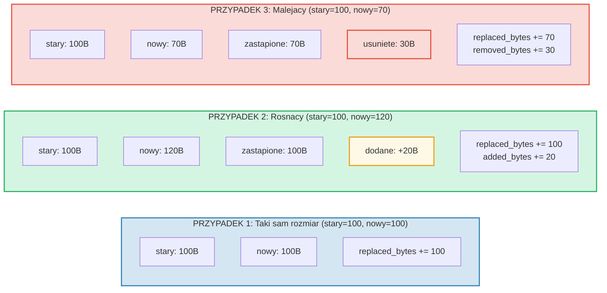

# Sledzenie kosztow

## Struktura OperationCost

Kazda operacja w GroveDB akumuluje koszty, mierzone w zasobach obliczeniowych:

```rust
// costs/src/lib.rs
pub struct OperationCost {
    pub seek_count: u32,              // Liczba szukan w magazynie
    pub storage_cost: StorageCost,    // Bajty dodane/zastapione/usuniete
    pub storage_loaded_bytes: u64,    // Bajty odczytane z dysku
    pub hash_node_calls: u32,         // Liczba operacji haszowania Blake3
    pub sinsemilla_hash_calls: u32,   // Liczba operacji haszowania Sinsemilla (operacje na krzywej eliptycznej)
}
```

> **Wywolania haszy Sinsemilla** sledza operacje haszowania na krzywej eliptycznej
> dla zakotwiczen CommitmentTree. Sa one znacznie drozsze niz hasze wezlow Blake3.

Koszty magazynowania rozkladaja sie dalej:

```rust
// costs/src/storage_cost/mod.rs
pub struct StorageCost {
    pub added_bytes: u32,                   // Nowe dane zapisane
    pub replaced_bytes: u32,                // Istniejace dane nadpisane
    pub removed_bytes: StorageRemovedBytes, // Zwolnione dane
}
```

## Wzorzec CostContext

Wszystkie operacje zwracaja swoj wynik opakowany w `CostContext`:

```rust
pub struct CostContext<T> {
    pub value: T,               // Wynik operacji
    pub cost: OperationCost,    // Zuzycie zasobow
}

pub type CostResult<T, E> = CostContext<Result<T, E>>;
```

Tworzy to **monadyczny** wzorzec sledzenia kosztow -- koszty plyna przez lancuchy
operacji automatycznie:

```rust
// Rozpakuj wynik, dodajac jego koszt do akumulatora
let result = expensive_operation().unwrap_add_cost(&mut total_cost);

// Lancuch operacji, akumulujac koszty
let final_result = op1()
    .flat_map(|x| op2(x))      // Koszty z op1 + op2
    .flat_map(|y| op3(y));      // + koszty z op3
```

## Makro cost_return_on_error!

Najczesciej spotykany wzorzec w kodzie GroveDB to makro `cost_return_on_error!`,
ktore dziala jak `?`, ale zachowuje koszty przy wczesnym powrocie:

```rust
macro_rules! cost_return_on_error {
    ( &mut $cost:ident, $($body:tt)+ ) => {
        {
            let result_with_cost = { $($body)+ };
            let result = result_with_cost.unwrap_add_cost(&mut $cost);
            match result {
                Ok(x) => x,
                Err(e) => return Err(e).wrap_with_cost($cost),
            }
        }
    };
}
```

W praktyce:

```rust
fn insert_element(&self, path: &[&[u8]], key: &[u8], element: Element) -> CostResult<(), Error> {
    let mut cost = OperationCost::default();

    // Kazde wywolanie makra dodaje koszt operacji do `cost`
    // i zwraca wartosc Ok (lub zwraca wczesnie z zakumulowanym kosztem przy Err)
    let merk = cost_return_on_error!(&mut cost, self.open_merk(path));
    cost_return_on_error!(&mut cost, merk.insert(key, element));
    cost_return_on_error!(&mut cost, self.propagate_changes(path));

    Ok(()).wrap_with_cost(cost)
    // `cost` teraz zawiera sume kosztow wszystkich trzech operacji
}
```

## Rozklad kosztow magazynowania

Gdy wartosc jest aktualizowana, koszt zalezy od tego, czy nowa wartosc jest wieksza,
mniejsza, czy taka sama jak stara:



## Koszty operacji haszowania

Koszty haszowania sa mierzone w "wywolaniach haszowania wezla" -- liczbie kompresji
blokow Blake3:

| Operacja | Rozmiar wejscia | Wywolania haszy |
|-----------|-----------|------------|
| `value_hash(maly)` | < 64 bajty | 1 |
| `value_hash(sredni)` | 64-127 bajtow | 2 |
| `kv_hash` | klucz + value_hash | rozne |
| `node_hash` | 96 bajtow (3 * 32) | 2 (zawsze) |
| `combine_hash` | 64 bajty (2 * 32) | 1 (zawsze) |
| `node_hash_with_count` | 104 bajty (3 * 32 + 8) | 2 (zawsze) |
| Sinsemilla (CommitmentTree) | Operacja EC na krzywej Pallas | sledzone osobno przez `sinsemilla_hash_calls` |

Ogolny wzor dla Blake3:

```text
wywolania_haszy = 1 + (bajty_wejscia - 1) / 64
```

## Szacowanie najgorszego i sredniego przypadku

GroveDB udostepnia funkcje do **szacowania** kosztow operacji przed ich wykonaniem.
Jest to kluczowe dla obliczania oplat w blockchainie -- musisz znac koszt, zanim
zobowiazesz sie za niego zaplacic.

```rust
// Koszt najgorszego przypadku odczytu wezla
pub fn add_worst_case_get_merk_node(
    cost: &mut OperationCost,
    not_prefixed_key_len: u32,
    max_element_size: u32,
    node_type: NodeType,
) {
    cost.seek_count += 1;  // Jedno szukanie na dysku
    cost.storage_loaded_bytes +=
        TreeNode::worst_case_encoded_tree_size(
            not_prefixed_key_len, max_element_size, node_type
        ) as u64;
}

// Koszt najgorszego przypadku propagacji
pub fn add_worst_case_merk_propagate(
    cost: &mut OperationCost,
    input: &WorstCaseLayerInformation,
) {
    let levels = match input {
        MaxElementsNumber(n) => ((*n + 1) as f32).log2().ceil() as u32,
        NumberOfLevels(n) => *n,
    };
    let mut nodes_updated = levels;

    // Rotacje AVL moga aktualizowac dodatkowe wezly
    if levels > 2 {
        nodes_updated += 2;  // Co najwyzej 2 dodatkowe wezly dla rotacji
    }

    cost.storage_cost.replaced_bytes += nodes_updated * MERK_BIGGEST_VALUE_SIZE;
    cost.storage_loaded_bytes +=
        nodes_updated as u64 * (MERK_BIGGEST_VALUE_SIZE + MERK_BIGGEST_KEY_SIZE) as u64;
    cost.seek_count += nodes_updated;
    cost.hash_node_calls += nodes_updated * 2;
}
```

Uzywane stale:

```rust
pub const MERK_BIGGEST_VALUE_SIZE: u32 = u16::MAX as u32;  // 65535
pub const MERK_BIGGEST_KEY_SIZE: u32 = 256;
```

---
