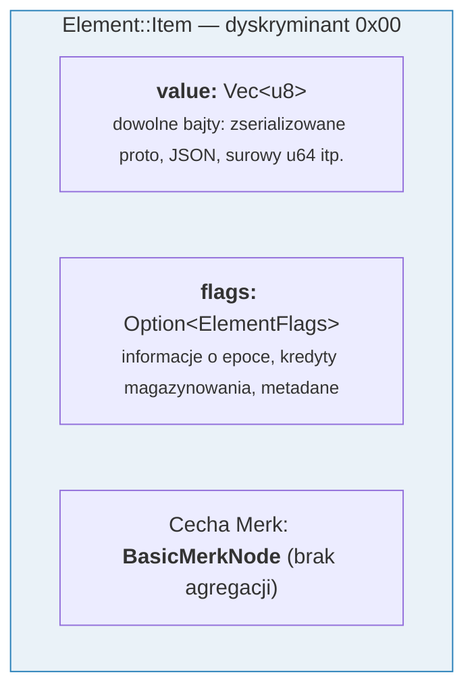
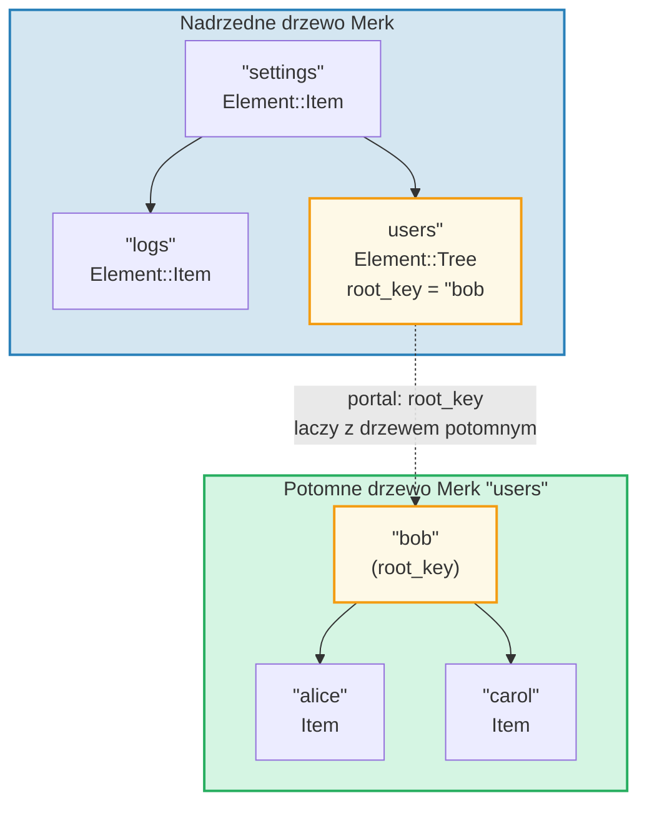
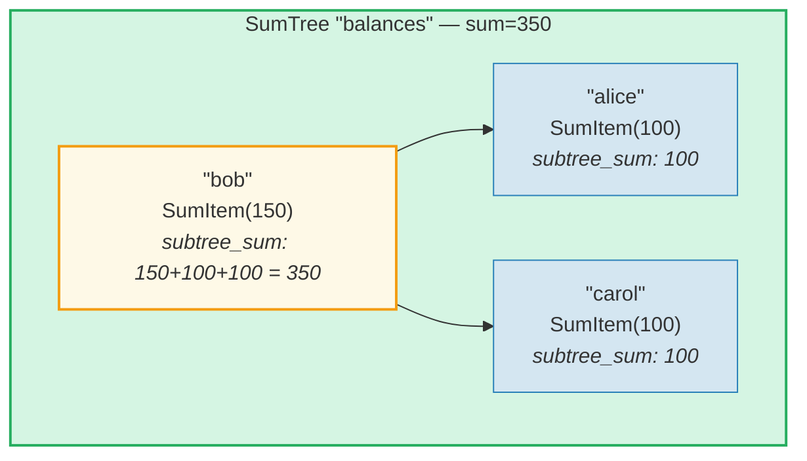
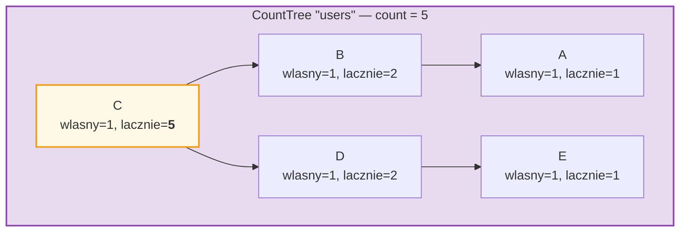
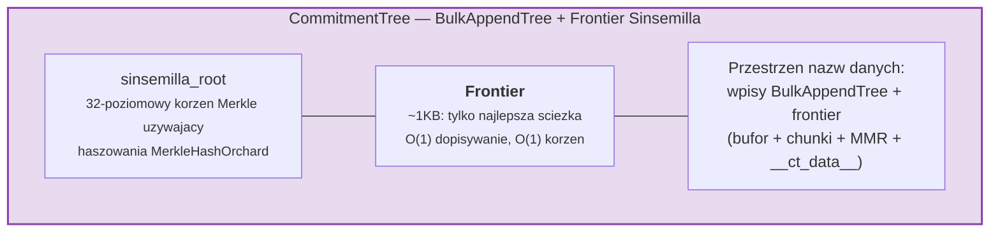

# System elementow

Podczas gdy Merk operuje na surowych parach klucz-wartosc, GroveDB dziala na wyzszym
poziomie, uzywajac **elementow** -- typowanych wartosci, ktore niosa semantyczne
znaczenie. Kazda wartosc przechowywana w GroveDB jest elementem.

## Enumeracja Element

```rust
// grovedb-element/src/element/mod.rs
pub enum Element {
    Item(Vec<u8>, Option<ElementFlags>),                                    // [0]
    Reference(ReferencePathType, MaxReferenceHop, Option<ElementFlags>),    // [1]
    Tree(Option<Vec<u8>>, Option<ElementFlags>),                           // [2]
    SumItem(SumValue, Option<ElementFlags>),                               // [3]
    SumTree(Option<Vec<u8>>, SumValue, Option<ElementFlags>),              // [4]
    BigSumTree(Option<Vec<u8>>, BigSumValue, Option<ElementFlags>),        // [5]
    CountTree(Option<Vec<u8>>, CountValue, Option<ElementFlags>),          // [6]
    CountSumTree(Option<Vec<u8>>, CountValue, SumValue, Option<ElementFlags>), // [7]
    ProvableCountTree(Option<Vec<u8>>, CountValue, Option<ElementFlags>),  // [8]
    ItemWithSumItem(Vec<u8>, SumValue, Option<ElementFlags>),              // [9]
    ProvableCountSumTree(Option<Vec<u8>>, CountValue, SumValue,
                         Option<ElementFlags>),                            // [10]
    CommitmentTree(u64, u8, Option<ElementFlags>),                         // [11]
    MmrTree(u64, Option<ElementFlags>),                                    // [12]
    BulkAppendTree(u64, u8, Option<ElementFlags>),                         // [13]
    DenseAppendOnlyFixedSizeTree(u16, u8, Option<ElementFlags>),           // [14]
}
```

Numery dyskryminantow (pokazane w nawiasach) sa uzywane podczas serializacji.

Aliasy typow uzywane w calym kodzie:

```rust
pub type ElementFlags = Vec<u8>;        // Dowolne metadane na element
pub type MaxReferenceHop = Option<u8>;  // Opcjonalny limit skokow (hop) dla referencji
pub type SumValue = i64;                // 64-bitowa suma ze znakiem
pub type BigSumValue = i128;            // 128-bitowa suma ze znakiem
pub type CountValue = u64;              // 64-bitowy licznik bez znaku
```

## Item -- Podstawowe przechowywanie klucz-wartosc

Najprostszy element. Przechowuje dowolne bajty:

```rust
Element::Item(value: Vec<u8>, flags: Option<ElementFlags>)
```



Konstruktory:

```rust
Element::new_item(b"hello world".to_vec())
Element::new_item_with_flags(b"data".to_vec(), Some(vec![0x01, 0x02]))
```

Elementy Item uczestnicza w agregacji sum: wewnatrz SumTree, Item wnosi domyslna
sume 0. SumItem wnosi swoja jawna wartosc.

## Tree -- Kontenery dla poddrzew

Element Tree to **portal** do innego drzewa Merk. Przechowuje klucz korzenia
(root key) drzewa potomnego (jezeli istnieje):

```rust
Element::Tree(root_key: Option<Vec<u8>>, flags: Option<ElementFlags>)
```



> Element Tree w nadrzednym drzewie Merk przechowuje `root_key` potomnego drzewa Merk. Tworzy to **portal** -- lacze z jednego drzewa Merk do drugiego.

Gdy drzewo jest puste, `root_key` wynosi `None`. Konstruktor `Element::empty_tree()`
tworzy `Element::Tree(None, None)`.

## SumItem / SumTree -- Agregowane sumy

**SumTree** automatycznie utrzymuje sume wkladow sumowych wszystkich swoich
bezposrednich potomkow:

```rust
Element::SumTree(root_key: Option<Vec<u8>>, sum: SumValue, flags: Option<ElementFlags>)
Element::SumItem(value: SumValue, flags: Option<ElementFlags>)
```



> **Wzor agregacji:** `suma_wezla = wlasna_wartosc + suma_lewego_potomka + suma_prawego_potomka`
> Bob: 150 + 100 (alice) + 100 (carol) = **350**. Suma korzenia (350) jest przechowywana w elemencie SumTree rodzica.

Suma jest utrzymywana na poziomie Merk przez typ cechy `TreeFeatureType::SummedMerkNode(i64)`.
Podczas propagacji drzewa, dane agregacyjne kazdego wezla sa przeliczane:

```text
suma_zagregowana = wlasna_suma + suma_lewego_potomka + suma_prawego_potomka
```

## CountTree, CountSumTree, BigSumTree

Dodatkowe typy drzew agregacyjnych:

| Typ elementu | Typ cechy Merk | Agreguje |
|---|---|---|
| `CountTree` | `CountedMerkNode(u64)` | Liczbe elementow |
| `CountSumTree` | `CountedSummedMerkNode(u64, i64)` | Zarowno licznik, jak i sume |
| `BigSumTree` | `BigSummedMerkNode(i128)` | 128-bitowa suma dla duzych wartosci |
| `ProvableCountTree` | `ProvableCountedMerkNode(u64)` | Licznik wbudowany w hasz |
| `ProvableCountSumTree` | `ProvableCountedSummedMerkNode(u64, i64)` | Licznik w haszu + suma |

**ProvableCountTree** jest specjalne: jego licznik jest zawarty w obliczeniu `node_hash`
(przez `node_hash_with_count`), wiec dowod moze zweryfikowac licznik bez ujawniania
jakichkolwiek wartosci.

## Serializacja elementow

Elementy sa serializowane za pomoca **bincode** z porzadkiem bajtow big-endian:

```rust
pub fn serialize(&self, grove_version: &GroveVersion) -> Result<Vec<u8>, ElementError> {
    let config = config::standard().with_big_endian().with_no_limit();
    bincode::encode_to_vec(self, config)
}
```

Pierwszy bajt to **dyskryminant**, umozliwiajacy detekcje typu w O(1):

```rust
pub fn from_serialized_value(value: &[u8]) -> Option<ElementType> {
    match value.first()? {
        0 => Some(ElementType::Item),
        1 => Some(ElementType::Reference),
        2 => Some(ElementType::Tree),
        3 => Some(ElementType::SumItem),
        // ... itd.
    }
}
```

## TreeFeatureType i przeplyw danych agregacyjnych

Enumeracja `TreeFeatureType` stanowi pomost miedzy elementami GroveDB a wezlami Merk:

```rust
pub enum TreeFeatureType {
    BasicMerkNode,                              // Bez agregacji
    SummedMerkNode(i64),                       // Agregacja sum
    BigSummedMerkNode(i128),                   // Duza suma
    CountedMerkNode(u64),                      // Licznik
    CountedSummedMerkNode(u64, i64),           // Licznik + suma
    ProvableCountedMerkNode(u64),              // Licznik w haszu
    ProvableCountedSummedMerkNode(u64, i64),   // Licznik w haszu + suma
}
```

Dane agregacyjne plyna **w gore** przez drzewo:



> **Tabela agregacji:** Agregat kazdego wezla = wlasny(1) + lewy_agregat + prawy_agregat
>
> | Wezel | wlasny | lewy_agg | prawy_agg | lacznie |
> |------|-----|----------|-----------|-------|
> | A | 1 | 0 | 0 | 1 |
> | B | 1 | 1 (A) | 0 | 2 |
> | E | 1 | 0 | 0 | 1 |
> | D | 1 | 0 | 1 (E) | 2 |
> | C | 1 | 2 (B) | 2 (D) | **5** (korzen) |

Licznik przechowywany w kazdym wezle reprezentuje calkowity licznik w poddrzewie
z korzeniem w tym wezle, wlaczajac sam wezel. Licznik wezla korzeniowego to suma
dla calego drzewa.

Enumeracja `AggregateData` przenosi te dane przez system linkow:

```rust
pub enum AggregateData {
    NoAggregateData,
    Sum(i64),
    BigSum(i128),
    Count(u64),
    CountAndSum(u64, i64),
    ProvableCount(u64),
    ProvableCountAndSum(u64, i64),
}
```

## CommitmentTree -- Drzewo zobowiazan Sinsemilla

**CommitmentTree** udostepnia 32-poziomowe drzewo Merkle Sinsemilla do sledzenia
zakotwiczen zobowiazan (commitment anchors), uzywane w protokole prywatnych
transakcji Orchard z Zcash. Opakowuje
`incrementalmerkletree::Frontier<MerkleHashOrchard, 32>` dla O(1) dopisywania
i obliczania korzenia:

```rust
Element::CommitmentTree(
    total_count: u64,               // Liczba dopisanych zobowiazan
    chunk_power: u8,                // Rozmiar kompakcji BulkAppendTree (chunk_size = 2^chunk_power)
    flags: Option<ElementFlags>,
)                                   // dyskryminant [11]
```

> **Uwaga:** Hasz korzenia frontiera Sinsemilla NIE jest przechowywany w elemencie.
> Jest utrwalany w magazynie danych i plynie przez mechanizm hasza potomnego Merk
> (parametr `subtree_root_hash` w `insert_subtree`). Kazda zmiana w frontierze
> automatycznie propaguje sie w gore przez hierarchie Merk w GroveDB.



**Architektura:**
- *Frontier* (najlepsza sciezka drzewa Merkle, ~1KB stalego rozmiaru) jest
  przechowywany w **przestrzeni nazw danych**, pod kluczem `COMMITMENT_TREE_DATA_KEY`
- Rzeczywiste dane not (`cmx || tekst_zaszyfrowany`) sa przechowywane przez **BulkAppendTree**
  w **przestrzeni nazw danych** -- kompaktowane w chunki, mozliwe do pobrania po pozycji
- Historyczne zakotwiczenia sa sledzone przez Platform w oddzielnym dowodliwym drzewie
- Korzen Sinsemilla NIE jest przechowywany w elemencie -- plynie jako hasz potomny
  Merk przez hierarchie haszow GroveDB

**Operacje:**
- `commitment_tree_insert(path, key, cmx, ciphertext, tx)` -- Typowane dopisywanie
  akceptujace `TransmittedNoteCiphertext<M>`; zwraca `(new_root, position)`
- `commitment_tree_anchor(path, key, tx)` -- Pobierz biezace zakotwiczenie Orchard (Anchor)
- `commitment_tree_get_value(path, key, position, tx)` -- Pobranie wartosci po pozycji
- `commitment_tree_count(path, key, tx)` -- Pobranie calkowitej liczby elementow

**Generyk MemoSize:** `CommitmentTree<S, M: MemoSize = DashMemo>` waliduje, ze
ladunki tekstu zaszyfrowanego odpowiadaja oczekiwanemu rozmiarowi dla `M`. Dla Dash (36-bajtowe notatki):
`epk_bytes (32) + enc_ciphertext (104) + out_ciphertext (80) = 216 bajtow`.

**Sledzenie kosztow:** Operacje haszowania Sinsemilla sa sledzone przez
`cost.sinsemilla_hash_calls`. Obliczanie korzenia zawsze przechodzi 32 poziomy.
Laczenie ommerow kaskaduje przez `trailing_ones()` poprzedniej pozycji.
Operacje BulkAppendTree dodaja koszty haszowania Blake3.

## MmrTree -- Zakres gorski Merkle (Merkle Mountain Range)

**MmrTree** przechowuje dane w strukturze danych Merkle Mountain Range (MMR) typu
append-only (tylko dopisywanie), uzywajac haszowania Blake3. Wezly MMR sa przechowywane
w kolumnie **danych** (tej samej co wezly Merk), nie w potomnym poddrzewie Merk.
Zobacz **[Rozdzial 13](#chapter-13-the-mmr-tree--append-only-authenticated-logs)**,
aby poznac dokladny opis dzialania MMR, sposobu wypelniania, generowania i
weryfikowania dowodow, oraz integracji MmrTree z GroveDB.

```rust
Element::MmrTree(
    mmr_size: u64,                  // Wewnetrzny rozmiar MMR (wezly, nie liscie)
    flags: Option<ElementFlags>,
)                                   // dyskryminant [12]
```

> **Uwaga:** Hasz korzenia MMR NIE jest przechowywany w elemencie. Plynie jako
> hasz potomny Merk przez parametr `subtree_root_hash` w `insert_subtree`.

**Operacje:** `mmr_tree_append`, `mmr_tree_root_hash`, `mmr_tree_get_value`,
`mmr_tree_leaf_count`. **Dowody:** dowody V1 (patrz par. 9.6 i par. 13.9).

## BulkAppendTree -- Dwupoziomowa struktura typu append-only

**BulkAppendTree** laczy bufor drzewa Merkle o gestym ulozenieu z MMR na poziomie
chunkow, zapewniajac wydajne dopisywanie z wysokim przeplywem (high-throughput)
z dowodliwymi zapytaniami zakresowymi. Jest to drzewo nie-Merk -- dane znajduja sie
w przestrzeni nazw **danych**, nie w potomnym poddrzewie Merk.
Zobacz **[Rozdzial 14](#chapter-14-the-bulkappendtree--high-throughput-append-only-storage)**,
aby poznac dokladny opis dwupoziomowej architektury, kompakcji chunkow, generowania
i weryfikowania dowodow, oraz integracji z GroveDB.

```rust
Element::BulkAppendTree(
    total_count: u64,               // Laczna liczba dopisanych wartosci
    chunk_power: u8,                // Wysokosc gestego drzewa (pojemnosc bufora = 2^chunk_power - 1)
    flags: Option<ElementFlags>,
)                                   // dyskryminant [13]
```

> **Uwaga:** Korzen stanu (`blake3("bulk_state" || mmr_root || dense_tree_root)`)
> NIE jest przechowywany w elemencie. Plynie jako hasz potomny Merk przez
> parametr `subtree_root_hash` w `insert_subtree`.

**Operacje:** `bulk_append`, `bulk_get_value`, `bulk_get_chunk`,
`bulk_get_buffer`, `bulk_count`, `bulk_chunk_count`.
**Dowody:** dowody zakresowe V1 (patrz par. 9.6 i par. 14.10).

## DenseAppendOnlyFixedSizeTree -- Gesty magazyn o stalej pojemnosci

**DenseAppendOnlyFixedSizeTree** to pelne drzewo binarne o stalej wysokosci *h*,
w ktorym kazdy wezel (wewnetrzny i lisc) przechowuje wartosc danych. Pozycje sa
wypelniane w porzadku poziomowym (BFS). Hasz korzenia jest przeliczany na biezaco
-- zadne posrednie hasze nie sa utrwalane. Zobacz **[Rozdzial 16](#chapter-16-the-denseappendonlyfixedsizetree--dense-fixed-capacity-merkle-storage)**,
aby poznac pelne szczegoly.

```rust
Element::DenseAppendOnlyFixedSizeTree(
    count: u16,                     // Liczba przechowywanych wartosci (max 65 535)
    height: u8,                     // Wysokosc drzewa (1..=16, niezmienna), pojemnosc = 2^h - 1
    flags: Option<ElementFlags>,
)                                   // dyskryminant [14]
```

> **Uwaga:** Hasz korzenia NIE jest przechowywany w elemencie -- jest przeliczany
> na biezaco i plynie jako hasz potomny Merk. Pole `count` jest typu `u16` (nie u64),
> ograniczajac drzewa do 65 535 pozycji. Wysokosci sa ograniczone do 1..=16.

**Operacje:** `dense_tree_insert`, `dense_tree_get`, `dense_tree_root_hash`,
`dense_tree_count`.
**Dowody:** Tylko na poziomie elementu (brak dowodow podzapytan na razie).

## Drzewa nie-Merk -- Wspolne wzorce

CommitmentTree, MmrTree, BulkAppendTree i DenseAppendOnlyFixedSizeTree dziela wspolny
wzorzec architektoniczny, ktory odroznia je od typow drzew opartych na Merk
(Tree, SumTree, CountTree itd.):

| Wlasciwosc | Drzewa oparte na Merk | Drzewa nie-Merk |
|----------|-----------------|-------------------|
| Potomne poddrzewo Merk | Tak (`root_key = Some(...)`) | Nie (brak pola root_key) |
| Magazyn danych | Pary klucz-wartosc Merk | Bloby kolumny danych (klucze nie-Merk) |
| Wiazanie hasza korzenia | `combine_hash(elem_hash, child_root_hash)` | `combine_hash(elem_hash, type_specific_root)` |
| Korzen specyficzny dla typu | Utrzymywany przez AVL Merk | Plynie jako hasz potomny Merk (NIE w bajtach elementu) |
| Format dowodu | V0 (warstwa po warstwie Merk) | V1 (dowod specyficzny dla typu) |
| TreeFeatureType | BasicMerkNode (brak agregacji) | BasicMerkNode |

> **Uwaga o kolumnie magazynu:** Wszystkie cztery typy drzew nie-Merk (MmrTree,
> CommitmentTree, BulkAppendTree, DenseAppendOnlyFixedSizeTree) przechowuja swoje
> dane w kolumnie **danych** uzywajac kluczy nie-Merk. CommitmentTree przechowuje swoj
> frontier Sinsemilla obok wpisow BulkAppendTree w tej samej kolumnie **danych**
> (klucz `b"__ct_data__"`).

Korzen specyficzny dla typu (korzen Sinsemilla, korzen MMR, korzen stanu lub hasz
korzenia gestego drzewa) NIE jest przechowywany w elemencie. Zamiast tego plynie jako
**hasz potomny** Merk przez parametr `subtree_root_hash` w `insert_subtree`.
combined_value_hash Merk staje sie `combine_hash(value_hash(element_bytes), type_specific_root)`.
Kazda zmiana korzenia specyficznego dla typu zmienia hasz potomny, co zmienia
combined_value_hash, ktory propaguje sie w gore przez hierarchie haszow GroveDB --
utrzymujac integralnosc kryptograficzna.

---
