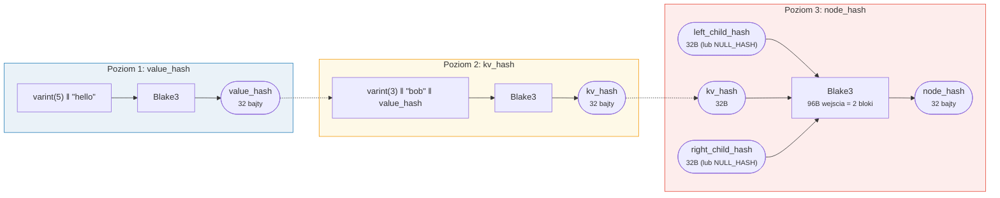
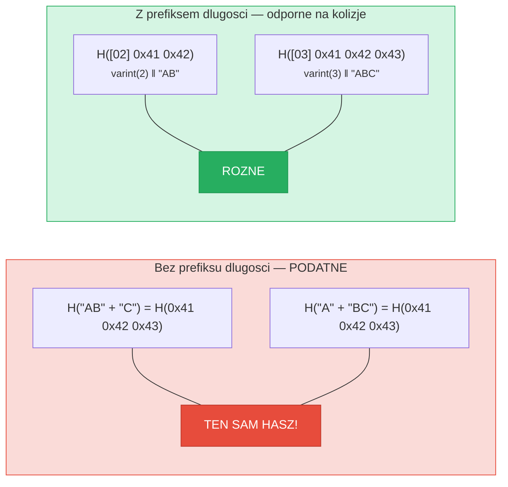
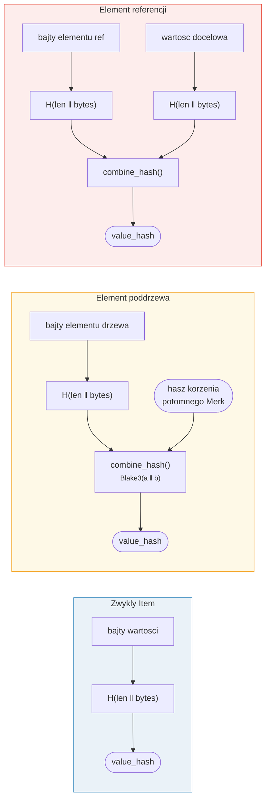

# Haszowanie -- Integralnosc kryptograficzna

Kazdy wezel w drzewie Merk jest haszowany, aby wytworzyc **hasz korzenia** (root hash) --
pojedyncza 32-bajtowa wartosc uwierzytelniajaca calego drzewo. Jakakolwiek zmiana
w dowolnym kluczu, wartosci lub relacji strukturalnej spowoduje inny hasz korzenia.

## Trzystopniowa hierarchia haszy

Merk uzywa trzystopniowego schematu haszowania, od najwewnetrznego do zewnetrznego:

Przyklad: klucz = `"bob"` (3 bajty), wartosc = `"hello"` (5 bajtow):



> KORZEN drzewa = `node_hash` wezla korzeniowego -- uwierzytelnia **kazdy** klucz, wartosc i relacje strukturalna. Brakujace potomki uzywaja `NULL_HASH = [0x00; 32]`.

### Poziom 1: value_hash

```rust
// merk/src/tree/hash.rs
pub fn value_hash(value: &[u8]) -> CostContext<CryptoHash> {
    let mut hasher = blake3::Hasher::new();
    let val_length = value.len().encode_var_vec();  // Kodowanie varint
    hasher.update(val_length.as_slice());
    hasher.update(value);
    // ...
}
```

Dlugosc wartosci jest **kodowana jako varint** i dopisywana na poczatku. Jest to
kluczowe dla odpornosci na kolizje -- bez tego `H("AB" || "C")` byloby rowne
`H("A" || "BC")`.

### Poziom 2: kv_hash

```rust
pub fn kv_hash(key: &[u8], value: &[u8]) -> CostContext<CryptoHash> {
    let mut hasher = blake3::Hasher::new();
    let key_length = key.len().encode_var_vec();
    hasher.update(key_length.as_slice());
    hasher.update(key);
    let vh = value_hash(value);
    hasher.update(vh.as_slice());  // Zagniezdzone haszowanie
    // ...
}
```

To wiaze klucz z wartoscia. Do weryfikacji dowodow istnieje tez wariant, ktory
przyjmuje wstepnie obliczony value_hash:

```rust
pub fn kv_digest_to_kv_hash(key: &[u8], value_hash: &CryptoHash) -> CostContext<CryptoHash>
```

Jest to uzywane, gdy weryfikator juz posiada value_hash (np. dla poddrzew, gdzie
value_hash jest polaczonym haszem).

### Poziom 3: node_hash

```rust
pub fn node_hash(
    kv: &CryptoHash,
    left: &CryptoHash,
    right: &CryptoHash,
) -> CostContext<CryptoHash> {
    let mut hasher = blake3::Hasher::new();
    hasher.update(kv);       // 32 bajty
    hasher.update(left);     // 32 bajty
    hasher.update(right);    // 32 bajty — lacznie 96 bajtow
    // Zawsze dokladnie 2 operacje haszowania (96 bajtow / 64-bajtowy blok = 2)
}
```

Jezeli potomek jest nieobecny, jego hasz to **NULL_HASH** -- 32 bajty zer:

```rust
pub const NULL_HASH: CryptoHash = [0; HASH_LENGTH];  // [0u8; 32]
```

## Blake3 jako funkcja haszujaca

GroveDB uzywa **Blake3** do calego haszowania. Kluczowe wlasciwosci:

- **256-bitowe wyjscie** (32 bajty)
- **Rozmiar bloku**: 64 bajty
- **Szybkosc**: ok. 3 razy szybszy niz SHA-256 na nowoczesnym sprzecie
- **Strumieniowy**: Moze przyrostowo dostarczac dane

Koszt operacji haszowania jest obliczany na podstawie liczby przetworzonych
64-bajtowych blokow:

```rust
let hashes = 1 + (hasher.count() - 1) / 64;  // Liczba operacji haszowania
```

## Kodowanie prefiksu dlugosci dla odpornosci na kolizje

Kazde wejscie o zmiennej dlugosci jest poprzedzone swoim rozmiarem za pomoca **kodowania varint**:



> **Wejscie value_hash**: `[varint(value.len)] [bajty wartosci]`
> **Wejscie kv_hash**: `[varint(key.len)] [bajty klucza] [value_hash: 32 bajty]`

Bez prefiksow dlugosci atakujacy moglby spreparowac rozne pary klucz-wartosc,
ktore haszuja sie do tego samego skrotu. Prefiks dlugosci sprawia, ze jest to
kryptograficznie niewykonalne.

## Haszowanie kombinowane dla elementow specjalnych

Dla **poddrzew** i **referencji**, `value_hash` nie jest po prostu `H(value)`.
Zamiast tego jest to **polaczony hasz** (combined hash), ktory wiaze element
z jego celem:



> **Poddrzewo:** wiaze hasz korzenia potomnego Merk w rodzicu. **Referencja:** wiaze zarowno sciezke referencji, JAK I wartosc docelowa. Zmiana ktoregokolwiek zmienia hasz korzenia.

Funkcja `combine_hash`:

```rust
pub fn combine_hash(hash_one: &CryptoHash, hash_two: &CryptoHash) -> CostContext<CryptoHash> {
    let mut hasher = blake3::Hasher::new();
    hasher.update(hash_one);   // 32 bajty
    hasher.update(hash_two);   // 32 bajty — lacznie 64 bajty, dokladnie 1 operacja haszowania
    // ...
}
```

To wlasnie pozwala GroveDB uwierzytelnic cala hierarchie przez pojedynczy hasz
korzenia -- value_hash kazdego drzewa nadrzednego dla elementu poddrzewa zawiera
hasz korzenia drzewa potomnego.

## Haszowanie agregacyjne dla ProvableCountTree

Wezly `ProvableCountTree` zawieraja zagregowany licznik w haszu wezla:

```rust
pub fn node_hash_with_count(
    kv: &CryptoHash,
    left: &CryptoHash,
    right: &CryptoHash,
    count: u64,
) -> CostContext<CryptoHash> {
    let mut hasher = blake3::Hasher::new();
    hasher.update(kv);                        // 32 bajty
    hasher.update(left);                      // 32 bajty
    hasher.update(right);                     // 32 bajty
    hasher.update(&count.to_be_bytes());      // 8 bajtow — lacznie 104 bajty
    // Nadal dokladnie 2 operacje haszowania (104 < 128 = 2 * 64)
}
```

Oznacza to, ze dowod (proof) licznika nie wymaga ujawniania rzeczywistych danych --
licznik jest wbudowany w kryptograficzne zobowiazanie.

---
