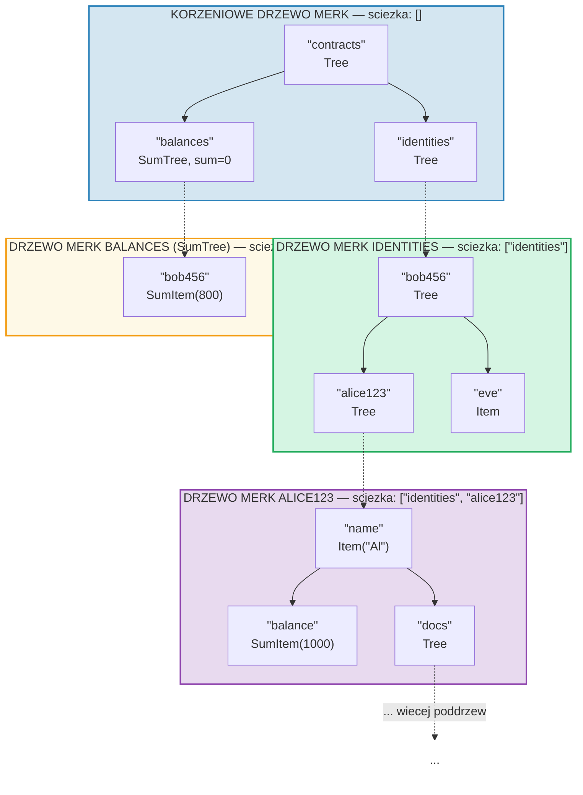
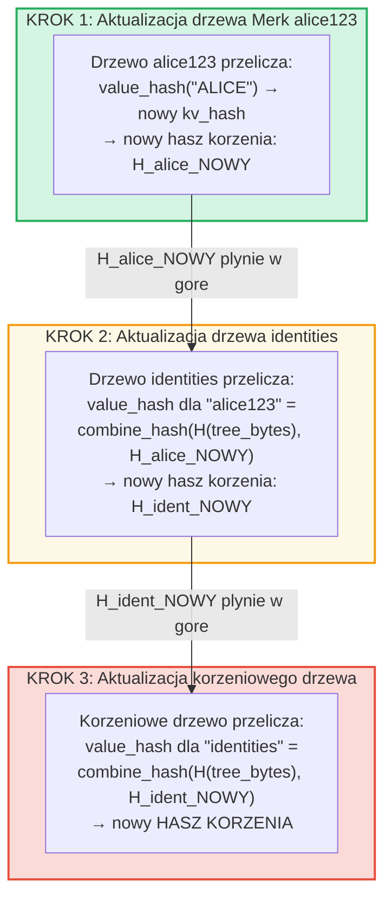
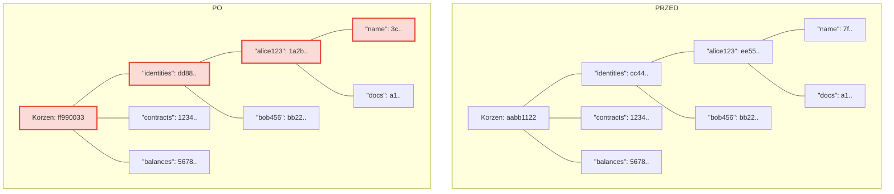
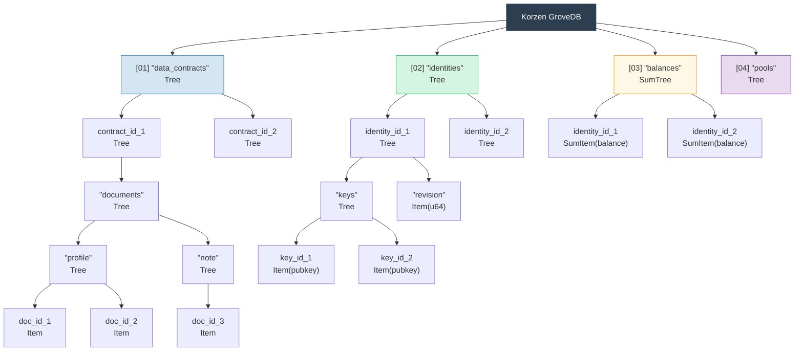

# Hierarchiczny gaj -- Drzewo drzew

## Jak poddrzewa zaglezdzaja sie wewnatrz drzew nadrzednych

Definiujaca cecha GroveDB jest to, ze drzewo Merk moze zawierac elementy, ktore
same sa drzewami Merk. Tworzy to **hierarchiczna przestrzen nazw**:



> Kazde kolorowe pole to oddzielne drzewo Merk. Przerywane strzalki reprezentuja lacza portalowe z elementow Tree do ich potomnych drzew Merk. Sciezka do kazdego drzewa Merk jest pokazana w jego etykiecie.

## System adresowania sciezkowego

Kazdy element w GroveDB jest adresowany przez **sciezke** -- sekwencje ciagow
bajtow nawigujacych od korzenia przez poddrzewa do docelowego klucza:

```text
    Sciezka: ["identities", "alice123", "name"]

    Krok 1: W korzeniowym drzewie, wyszukaj "identities" → element Tree
    Krok 2: Otworz poddrzewo identities, wyszukaj "alice123" → element Tree
    Krok 3: Otworz poddrzewo alice123, wyszukaj "name" → Item("Alice")
```

Sciezki sa reprezentowane jako `Vec<Vec<u8>>` lub przy uzyciu typu `SubtreePath`
dla wydajnej manipulacji bez alokacji:

```rust
// Sciezka do elementu (wszystkie segmenty oprocz ostatniego)
let path: &[&[u8]] = &[b"identities", b"alice123"];
// Klucz w ostatnim poddrzewie
let key: &[u8] = b"name";
```

## Generowanie prefiksow Blake3 dla izolacji magazynu

Kazde poddrzewo w GroveDB otrzymuje swoja wlasna **izolowana przestrzen nazw magazynu**
w RocksDB. Przestrzen nazw jest okreslana przez haszowanie sciezki za pomoca Blake3:

```rust
pub type SubtreePrefix = [u8; 32];

// Prefiks jest obliczany przez haszowanie segmentow sciezki
// storage/src/rocksdb_storage/storage.rs
```

Na przyklad:

```text
    Sciezka: ["identities", "alice123"]
    Prefiks: Blake3(["identities", "alice123"]) = [0xab, 0x3f, ...]  (32 bajty)

    W RocksDB klucze dla tego poddrzewa sa przechowywane jako:
    [prefiks: 32 bajty][oryginalny_klucz]

    Wiec "name" w tym poddrzewie staje sie:
    [0xab, 0x3f, ...][0x6e, 0x61, 0x6d, 0x65]  ("name")
```

To zapewnia:
- Brak kolizji kluczy miedzy poddrzewami (32-bajtowy prefiks = 256-bitowa izolacja)
- Wydajne obliczanie prefiksow (pojedyncze haszowanie Blake3 po bajtach sciezki)
- Dane poddrzewa sa kolokowane w RocksDB dla wydajnosci cache

## Propagacja hasza korzenia w gore hierarchii

Gdy wartosc zmienia sie gleboko w gaju, zmiana musi **propagowac sie w gore**,
aby zaktualizowac hasz korzenia:

```text
    Zmiana: Aktualizacja "name" na "ALICE" w identities/alice123/

    Krok 1: Aktualizacja wartosci w drzewie Merk alice123
            → drzewo alice123 otrzymuje nowy hasz korzenia: H_alice_new

    Krok 2: Aktualizacja elementu "alice123" w drzewie identities
            → value_hash drzewa identities dla "alice123" =
              combine_hash(H(tree_element_bytes), H_alice_new)
            → drzewo identities otrzymuje nowy hasz korzenia: H_ident_new

    Krok 3: Aktualizacja elementu "identities" w korzeniowym drzewie
            → value_hash korzeniowego drzewa dla "identities" =
              combine_hash(H(tree_element_bytes), H_ident_new)
            → HASZ KORZENIA zmienia sie
```



**Przed i po** -- zmienione wezly oznaczone na czerwono:



> Tylko wezly na sciezce od zmienionej wartosci do korzenia sa przeliczane. Rodzenstwo i inne galeze pozostaja bez zmian.

Propagacja jest implementowana przez `propagate_changes_with_transaction`, ktora
przechodzi w gore sciezki od zmodyfikowanego poddrzewa do korzenia, aktualizujac
hasz elementu kazdego rodzica po drodze.

## Przyklad wielopoziomowej struktury gaju

Oto kompletny przyklad pokazujacy, jak Dash Platform strukturyzuje swoj stan:



Kazde pole to oddzielne drzewo Merk, uwierzytelnione az do pojedynczego hasza
korzenia, na ktory zgadzaja sie walidatorzy.

---

