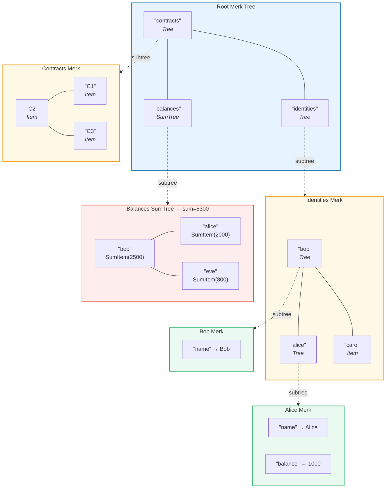
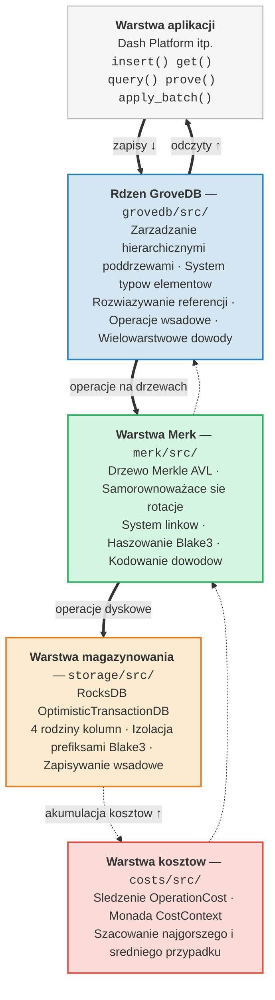

# Wprowadzenie -- Czym jest GroveDB?

## Glowna idea

GroveDB to **hierarchiczna uwierzytelniona struktura danych** -- zasadniczo *gaj*
(drzewo drzew) zbudowany na drzewach Merkle AVL. Kazdy wezel w bazie danych jest
czescia kryptograficznie uwierzytelnionego drzewa, a kazde drzewo moze zawierac
inne drzewa jako potomkow, tworzac gleboka hierarchie weryfikowalnego stanu.

> Kazde kolorowe pole to **oddzielne drzewo Merk**. Przerywane strzalki pokazuja relacje poddrzew -- element Tree w rodzicu zawiera klucz korzenia potomnego drzewa Merk.

W tradycyjnej bazie danych mozna by przechowywac dane w plaskim magazynie klucz-wartosc
z pojedynczym drzewem Merkle na wierzchu do uwierzytelniania. GroveDB przyjmuje inne
podejscie: zagniezdza drzewa Merkle wewnatrz drzew Merkle. Daje to:

1. **Wydajne indeksy wtorne** -- zapytania po dowolnej sciezce, nie tylko po kluczu glownym
2. **Kompaktowe dowody kryptograficzne (proof)** -- dowod istnienia (lub nieobecnosci) dowolnych danych
3. **Agregowane dane** -- drzewa moga automatycznie sumowac, liczyc lub w inny sposob agregowac swoje potomki
4. **Atomowe operacje miedzy drzewami** -- operacje wsadowe (batch) obejmuja wiele poddrzew

## Dlaczego GroveDB istnieje

GroveDB zostal zaprojektowany dla **Dash Platform**, zdecentralizowanej platformy
aplikacyjnej, gdzie kazdy element stanu musi byc:

- **Uwierzytelniony**: Kazdy wezel moze udowodnic dowolny element stanu lekkiemu klientowi
- **Deterministyczny**: Kazdy wezel oblicza dokladnie ten sam korzeń stanu (state root)
- **Wydajny**: Operacje musza zakonczyc sie w ramach ograniczen czasowych bloku
- **Odpytywalny**: Aplikacje potrzebuja bogatych zapytan, nie tylko wyszukiwan po kluczu

Tradycyjne podejscia sa niewystarczajace:

| Podejscie | Problem |
|----------|---------|
| Zwykle drzewo Merkle | Obsluguje tylko wyszukiwania po kluczu, brak zapytan zakresowych |
| Ethereum MPT | Kosztowne rebalansowanie, duze rozmiary dowodow |
| Plaski magazyn klucz-wartosc + pojedyncze drzewo | Brak hierarchicznych zapytan, pojedynczy dowod obejmuje wszystko |
| B-drzewo | Nie jest naturalnie zmerklizowane, zlozony proces uwierzytelniania |

GroveDB rozwiazuje te problemy, laczac **sprawdzone gwarancje rownowazenía drzew AVL**
z **hierarchicznym zaglezdzaniem** i **bogatym systemem typow elementow**.

## Przeglad architektury

GroveDB jest zorganizowany w oddzielne warstwy, z ktorych kazda ma jasno okreslona odpowiedzialnosc:

Dane plyna **w dol** przez te warstwy podczas zapisow i **w gore** podczas odczytow.
Kazda operacja akumuluje koszty przechodzac przez stos, umozliwiajac precyzyjne
rozliczanie zasobow.

---
