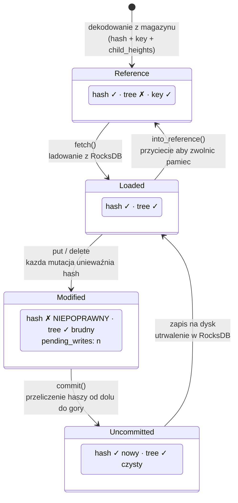
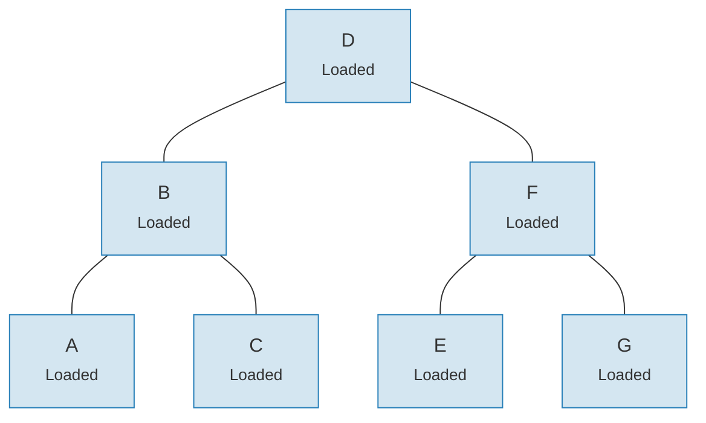
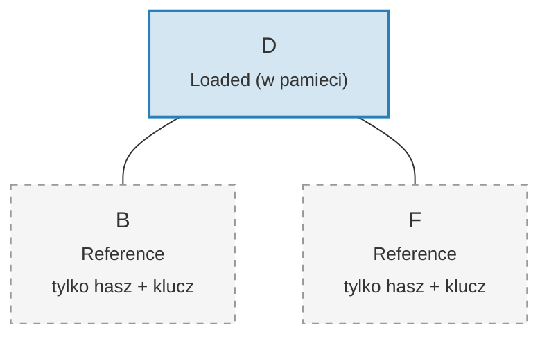

# System linkow -- Architektura leniwego ladowania

Zaladowanie calego drzewa Merk do pamieci byloby zaporowo kosztowne dla duzych
drzew. System linkow rozwiazuje ten problem, reprezentujac polaczenia z potomkami
w czterech mozliwych stanach, umozliwiajac **leniwe ladowanie** (lazy loading) --
potomkowie sa pobierani z magazynu tylko wtedy, gdy sa rzeczywiscie potrzebni.

## Cztery stany linkow

```rust
// merk/src/tree/link.rs
pub enum Link {
    Reference {                    // Przyciete: tylko metadane, brak drzewa w pamieci
        hash: CryptoHash,
        child_heights: (u8, u8),
        key: Vec<u8>,
        aggregate_data: AggregateData,
    },
    Modified {                     // Ostatnio zmienione, hasz jeszcze nie obliczony
        pending_writes: usize,
        child_heights: (u8, u8),
        tree: TreeNode,
    },
    Uncommitted {                  // Hasz obliczony, ale jeszcze nie zapisany do magazynu
        hash: CryptoHash,
        child_heights: (u8, u8),
        tree: TreeNode,
        aggregate_data: AggregateData,
    },
    Loaded {                       // W pelni zaladowane z magazynu
        hash: CryptoHash,
        child_heights: (u8, u8),
        tree: TreeNode,
        aggregate_data: AggregateData,
    },
}
```

## Diagram przejsc stanow



## Co przechowuje kazdy stan

| Stan | Hasz? | Drzewo w pamieci? | Przeznaczenie |
|-------|-------|-----------------|---------|
| **Reference** | Tak | Nie | Kompaktowa reprezentacja na dysku. Przechowuje tylko klucz, hasz, wysokosci potomkow i dane agregacyjne. |
| **Modified** | Nie | Tak | Po kazdej mutacji. Sledzi licznik `pending_writes` do optymalizacji partii. |
| **Uncommitted** | Tak | Tak | Po obliczeniu hasza, ale przed zapisem do magazynu. Stan posredni podczas zatwierdzania. |
| **Loaded** | Tak | Tak | W pelni zmaterializowane. Gotowe do odczytow lub dalszych modyfikacji. |

Pole `pending_writes` w stanie `Modified` jest godne uwagi:

```rust
// Obliczane jako: 1 + lewe_pending_writes + prawe_pending_writes
pending_writes: 1 + tree.child_pending_writes(true)
                  + tree.child_pending_writes(false),
```

Ten licznik pomaga fazie zatwierdzania zdecydowac, jak uszeregowac zapisy dla
optymalnej wydajnosci.

## Wzorzec wywolania zwrotnego Fetch

System linkow uzywa **cechy Fetch** do abstrakcji sposobu ladowania wezlow potomnych:

```rust
pub trait Fetch {
    fn fetch(
        &self,
        link: &Link,
        value_defined_cost_fn: Option<&impl Fn(&[u8], &GroveVersion) -> Option<ValueDefinedCostType>>,
        grove_version: &GroveVersion,
    ) -> CostResult<TreeNode, Error>;
}
```

Rozne implementacje Fetch sluza roznym celom:

- **StorageFetch**: Laduje z RocksDB (normalna sciezka)
- **PanicSource**: Uzywane w testach, gdzie pobieranie nigdy nie powinno nastapic
- **MockSource**: Zwraca kontrolowane dane testowe

Ten wzorzec pozwala operacjom na drzewie byc **niezaleznymi od magazynu** -- ta sama
logika rownowazenia i mutacji dziala niezaleznie od tego, skad pochodza dane.

## Wzorzec Walker

`Walker` opakowuje `TreeNode` ze zrodlem `Fetch`, zapewniajac bezpieczna nawigacje
po drzewie z automatycznym leniwym ladowaniem (`merk/src/tree/walk/mod.rs`):

```rust
pub struct Walker<S: Fetch + Sized + Clone> {
    tree: Owner<TreeNode>,
    source: S,
}
```

Walker zapewnia trzy kluczowe operacje:

**walk()** -- Odlacz potomka, przeksztalc go i ponownie podlacz:

```rust
pub fn walk<F, T>(self, left: bool, f: F, ...) -> CostResult<Self, Error>
where
    F: FnOnce(Option<Self>) -> CostResult<Option<T>, Error>,
    T: Into<TreeNode>,
```

**detach()** -- Usun potomka, ladujac go z magazynu w razie potrzeby:

```rust
pub fn detach(self, left: bool, ...) -> CostResult<(Self, Option<Self>), Error>
```

Jezeli potomek jest `Link::Reference` (przyciety), detach wywola `fetch()`, aby
go zaladowac. Jezeli potomek jest juz w pamieci (`Modified`, `Uncommitted`, `Loaded`),
po prostu przejmuje wlasnosc.

**attach()** -- Polacz potomka z rodzicem:

```rust
pub fn attach(self, left: bool, maybe_child: Option<Self>) -> Self
```

Podlaczanie zawsze tworzy `Link::Modified`, poniewaz relacja rodzic-potomek ulegla zmianie.

## Wydajnosc pamieciowa dzieki przycinaniu

Po zatwierdzeniu zmian, drzewo moze **przyciac** zaladowane poddrzewa z powrotem
do `Link::Reference`, zwalniajac pamiec, jednoczesnie zachowujac hasz potrzebny
do generowania dowodow:

**Przed przycinaniem** -- wszystkie 7 wezlow w pamieci:



**Po przycinaniu** -- tylko korzen w pamieci, potomkowie to `Link::Reference` (tylko hasz + klucz):



> **Link::Loaded** zawiera `hash + child_heights + tree (TreeNode)`. **Link::Reference** zawiera tylko `hash + child_heights + key` -- TreeNode jest zwalniany z pamieci.

Transformacja jest prosta:

```rust
pub fn into_reference(self) -> Link {
    Link::Reference {
        hash: self.hash(),
        child_heights: self.child_heights(),
        key: self.key().to_vec(),
        aggregate_data: self.aggregate_data(),
    }
}
```

Jest to kluczowe dla utrzymania ograniczonego zuzycia pamieci w duzych drzewach --
tylko wezly aktywnie uzywane musza byc w pamieci.

---

