# Drzewo Merk -- Drzewo Merkle AVL

Drzewo Merk to podstawowy element budulcowy GroveDB. Kazde poddrzewo w gaju
jest drzewem Merk -- samorownowazacym sie binarnym drzewem wyszukiwania, w
ktorym kazdy wezel jest kryptograficznie haszowany, tworzac pojedynczy hasz
korzenia (root hash), ktory uwierzytelnia cala zawartosc drzewa.

## Czym jest wezel Merk?

W przeciwienstwie do wielu implementacji drzew Merkle, w ktorych dane znajduja
sie tylko w lisciach, w drzewie Merk **kazdy wezel przechowuje pare klucz-wartosc**.
Oznacza to, ze nie ma "pustych" wezlow wewnetrznych -- drzewo jest jednoczesnie
struktura wyszukiwania i magazynem danych.

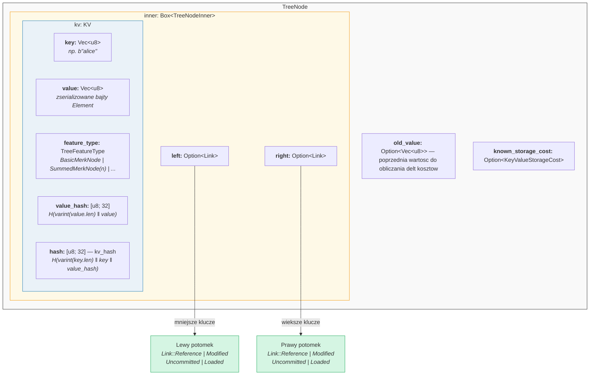

W kodzie (`merk/src/tree/mod.rs`):

```rust
pub struct TreeNode {
    pub(crate) inner: Box<TreeNodeInner>,
    pub(crate) old_value: Option<Vec<u8>>,        // Poprzednia wartosc do sledzenia kosztow
    pub(crate) known_storage_cost: Option<KeyValueStorageCost>,
}

pub struct TreeNodeInner {
    pub(crate) left: Option<Link>,    // Lewy potomek (mniejsze klucze)
    pub(crate) right: Option<Link>,   // Prawy potomek (wieksze klucze)
    pub(crate) kv: KV,               // Ladunek klucz-wartosc
}
```

`Box<TreeNodeInner>` utrzymuje wezel na stercie (heap), co jest istotne, poniewaz
linki do potomkow moga rekurencyjnie zawierac calkowite instancje `TreeNode`.

## Struktura KV

Struktura `KV` przechowuje zarowno surowe dane, jak i ich skroty kryptograficzne
(`merk/src/tree/kv.rs`):

```rust
pub struct KV {
    pub(super) key: Vec<u8>,                        // Klucz wyszukiwania
    pub(super) value: Vec<u8>,                      // Przechowywana wartosc
    pub(super) feature_type: TreeFeatureType,       // Zachowanie agregacyjne
    pub(crate) value_defined_cost: Option<ValueDefinedCostType>,
    pub(super) hash: CryptoHash,                    // kv_hash
    pub(super) value_hash: CryptoHash,              // H(value)
}
```

Dwa wazne punkty:

1. **Klucze nie sa przechowywane na dysku jako czesc zakodowanego wezla.** Sa
   przechowywane jako klucz RocksDB. Gdy wezel jest dekodowany z magazynu, klucz
   jest wstrzykiwany z zewnatrz. Pozwala to uniknac duplikowania bajtow klucza.

2. **Utrzymywane sa dwa pola haszy.** `value_hash` to `H(value)`, a `hash`
   (kv_hash) to `H(key, value_hash)`. Przechowywanie obu pozwala systemowi
   dowodow wybrac, ile informacji ujawnic.

## Pol-zrownowazona natura -- Jak AVL sie "chwieje"

Drzewo Merk to **drzewo AVL** -- klasyczne samorownowazace sie binarne drzewo
wyszukiwania wynalezione przez Adelsona-Velsky'ego i Landisa. Kluczowy niezmiennik to:

> Dla kazdego wezla roznica wysokosci miedzy jego lewym a prawym poddrzewem
> wynosi co najwyzej 1.

Wyrazane jest to jako **wspolczynnik rownowagi** (balance factor):

```text
balance_factor = prawa_wysokosc - lewa_wysokosc
```

Poprawne wartosci: **{-1, 0, 1}**

```rust
// merk/src/tree/mod.rs
pub const fn balance_factor(&self) -> i8 {
    let left_height = self.child_height(true) as i8;
    let right_height = self.child_height(false) as i8;
    right_height - left_height
}
```

Jest tu jednak subtelna kwestia: chociaz kazdy pojedynczy wezel moze przechylac sie
tylko o jeden poziom, te przechylenia moga sie **kumulowac** w calosci drzewa.
Dlatego nazywamy je "pol-zrownowazonym" -- drzewo nie jest idealnie zrownowazone
jak pelne drzewo binarne.

Rozwazmy drzewo o 10 wezlach. Idealnie zrownowazone drzewo mialoby wysokosc 4
(ceil(log2(10+1))). Ale drzewo AVL moze miec wysokosc 5:

**Idealnie zrownowazone (wysokosc 4)** -- kazdy poziom jest calkowicie zapelniony:

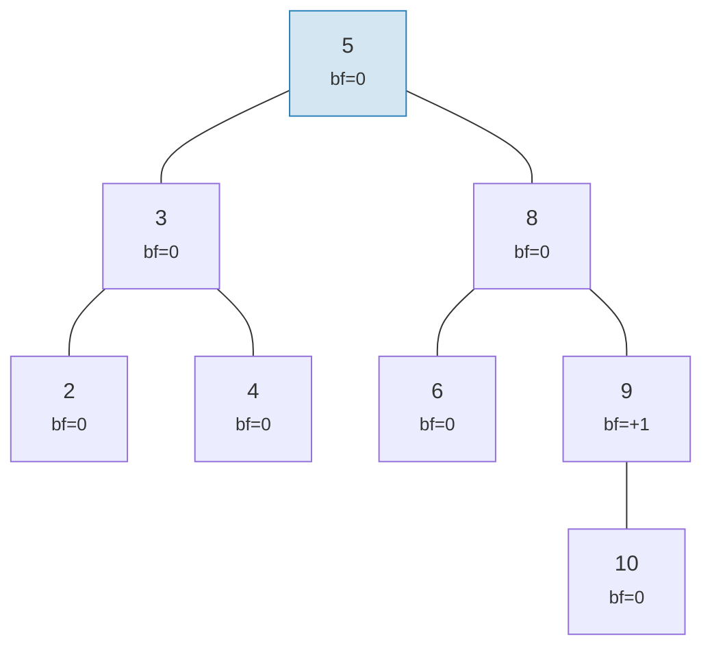

**Poprawne "chwiejne" drzewo AVL (wysokosc 5)** -- kazdy wezel przechyla sie co najwyzej o 1, ale kumuluje sie:

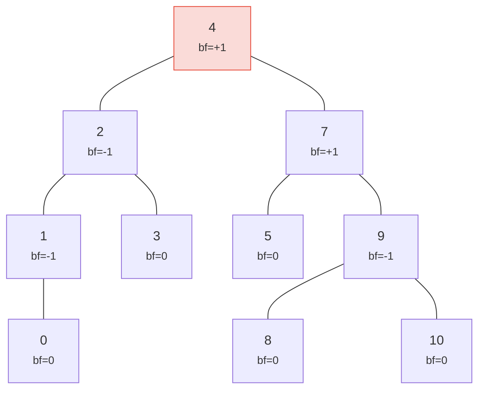

> Wysokosc 5 zamiast idealnej 4 -- to jest wlasnie to "chwiejnosc". Najgorszy przypadek: h <= 1,44 * log2(n+2).

Oba drzewa sa poprawnymi drzewami AVL! Najgorsza mozliwa wysokosc drzewa AVL wynosi:

```text
h <= 1,4404 * log2(n + 2) - 0,3277
```

Wiec dla **n = 1 000 000** wezlow:
- Idealna rownowaga: wysokosc 20
- Najgorszy przypadek AVL: wysokosc ok. 29

Ten ok. 44% narzut to cena prostych regul rotacji AVL. W praktyce losowe
wstawienia daja drzewa znacznie blizsze idealnej rownowadze.

Oto jak wygladaja poprawne i niepoprawne drzewa:

**POPRAWNE** -- wszystkie wspolczynniki rownowagi naleza do {-1, 0, +1}:

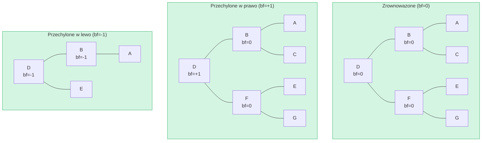

**NIEPOPRAWNE** -- wspolczynnik rownowagi = +2 (potrzebna rotacja!):

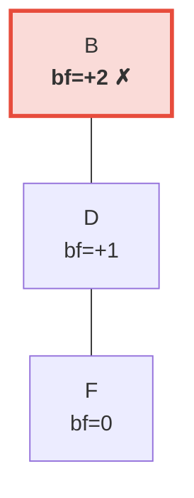

> Prawe poddrzewo jest o 2 poziomy wyzsze niz lewe (ktore jest puste). Wyzwala to **rotacje w lewo** w celu przywrocenia niezmiennika AVL.

## Rotacje -- Przywracanie rownowagi

Gdy wstawianie lub usuwanie powoduje, ze wspolczynnik rownowagi osiaga +/-2,
drzewo musi zostac **obrocene** w celu przywrocenia niezmiennika AVL. Istnieja
cztery przypadki, sprowadzalne do dwoch podstawowych operacji.

### Pojedyncza rotacja w lewo

Uzywana, gdy wezel jest **przechylony w prawo** (bf = +2), a jego prawy potomek
jest **przechylony w prawo lub zrownowazony** (bf >= 0):

**Przed** (bf=+2):

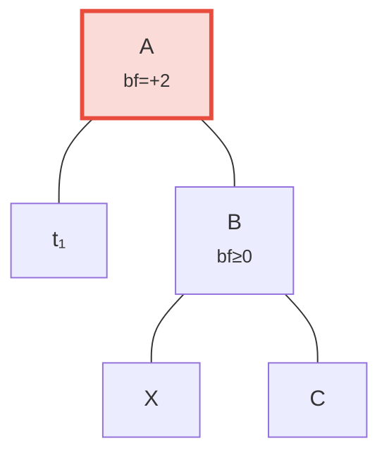

**Po** rotacji w lewo -- B awansuje na korzen:

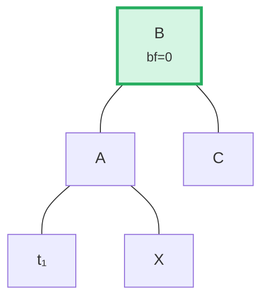

> **Kroki:** (1) Odlacz B od A. (2) Odlacz X (lewy potomek B). (3) Podlacz X jako prawy potomek A. (4) Podlacz A jako lewy potomek B. Poddrzewo z korzeniem w B jest teraz zrownowazone.

W kodzie (`merk/src/tree/ops.rs`):

```rust
fn rotate<V>(self, left: bool, ...) -> CostResult<Self, Error> {
    // Odlacz potomka po ciezszej stronie
    let (tree, child) = self.detach_expect(left, ...);
    // Odlacz wnuka z przeciwnej strony potomka
    let (child, maybe_grandchild) = child.detach(!left, ...);

    // Podlacz wnuka do pierwotnego korzenia
    tree.attach(left, maybe_grandchild)
        .maybe_balance(...)
        .flat_map_ok(|tree| {
            // Podlacz pierwotny korzen jako potomka awansowanego wezla
            child.attach(!left, Some(tree))
                .maybe_balance(...)
        })
}
```

Zwroc uwage, ze `maybe_balance` jest wywolywana rekurencyjnie -- sama rotacja
moze stworzyc nowe nierownowazone sytuacje wymagajace dalszej korekcji.

### Podwojna rotacja (lewo-prawo)

Uzywana, gdy wezel jest **przechylony w lewo** (bf = -2), ale jego lewy potomek
jest **przechylony w prawo** (bf > 0). Pojedyncza rotacja tego nie naprawi:

**Krok 0: Przed** -- C jest przechylony w lewo (bf=-2), ale jego lewy potomek A przechyla sie w prawo (bf=+1). Pojedyncza rotacja tego nie naprawi:

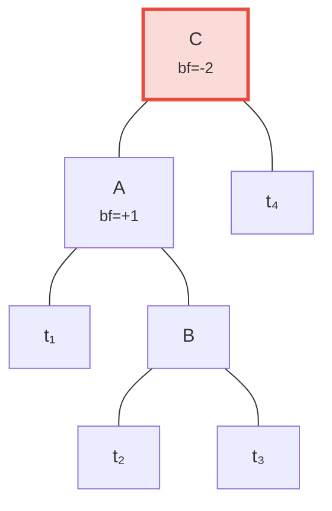

**Krok 1: Rotacja w lewo potomka A** -- teraz zarowno C, jak i B przechylaja sie w lewo, co mozna naprawic pojedyncza rotacja:

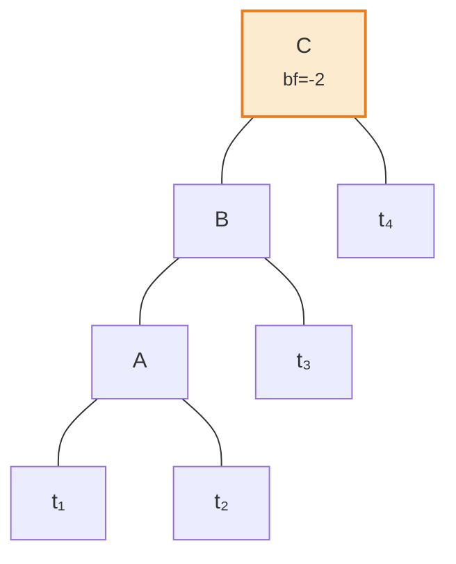

**Krok 2: Rotacja w prawo korzenia C** -- zrownowazone!

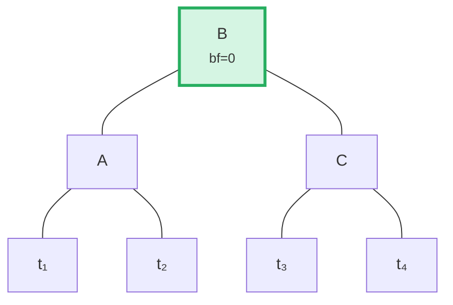

Algorytm wykrywa ten przypadek porownujac kierunek przechylenia rodzica ze
wspolczynnikiem rownowagi potomka:

```rust
fn maybe_balance<V>(self, ...) -> CostResult<Self, Error> {
    let balance_factor = self.balance_factor();
    if balance_factor.abs() <= 1 {
        return Ok(self);  // Juz zrownowazone
    }

    let left = balance_factor < 0;  // true jezeli przechylone w lewo

    // Podwojna rotacja potrzebna, gdy potomek przechyla sie w przeciwna strone niz rodzic
    let tree = if left == (self.tree().link(left).unwrap().balance_factor() > 0) {
        // Pierwsza rotacja: obroc potomka w przeciwnym kierunku
        self.walk_expect(left, |child|
            child.rotate(!left, ...).map_ok(Some), ...
        )
    } else {
        self
    };

    // Druga (lub jedyna) rotacja
    tree.rotate(left, ...)
}
```

## Operacje wsadowe -- Budowanie i stosowanie

Zamiast wstawiac elementy jeden po drugim, Merk obsluguje operacje wsadowe (batch),
ktore stosuja wiele zmian w jednym przebiegu. Jest to kluczowe dla wydajnosci:
partia N operacji na drzewie o M elementach zajmuje **O((M + N) log(M + N))** czasu,
w porownaniu z O(N log M) dla sekwencyjnych wstawien.

### Typ MerkBatch

```rust
type MerkBatch<K> = [(K, Op)];

enum Op {
    Put(Vec<u8>, TreeFeatureType),  // Wstawianie lub aktualizacja z wartoscia i typem cechy
    PutWithSpecializedCost(...),     // Wstawianie z predefiniowanym kosztem
    PutCombinedReference(...),       // Wstawianie referencji z polaczonym haszem
    Replace(Vec<u8>, TreeFeatureType),
    Patch { .. },                    // Czesciowa aktualizacja wartosci
    Delete,                          // Usuwanie klucza
    DeleteLayered,                   // Usuwanie z kosztem warstwowym
    DeleteMaybeSpecialized,          // Usuwanie z opcjonalnym kosztem specjalistycznym
}
```

### Strategia 1: build() -- Budowanie od zera

Gdy drzewo jest puste, `build()` konstruuje zrownowazone drzewo bezposrednio
z posortowanej partii za pomoca algorytmu **podzial po medianie**:

Wsadowe dane wejsciowe (posortowane): `[A, B, C, D, E, F, G]` -- wybierz srodkowy (D) jako korzen, rekurencja na kazdej polowie:

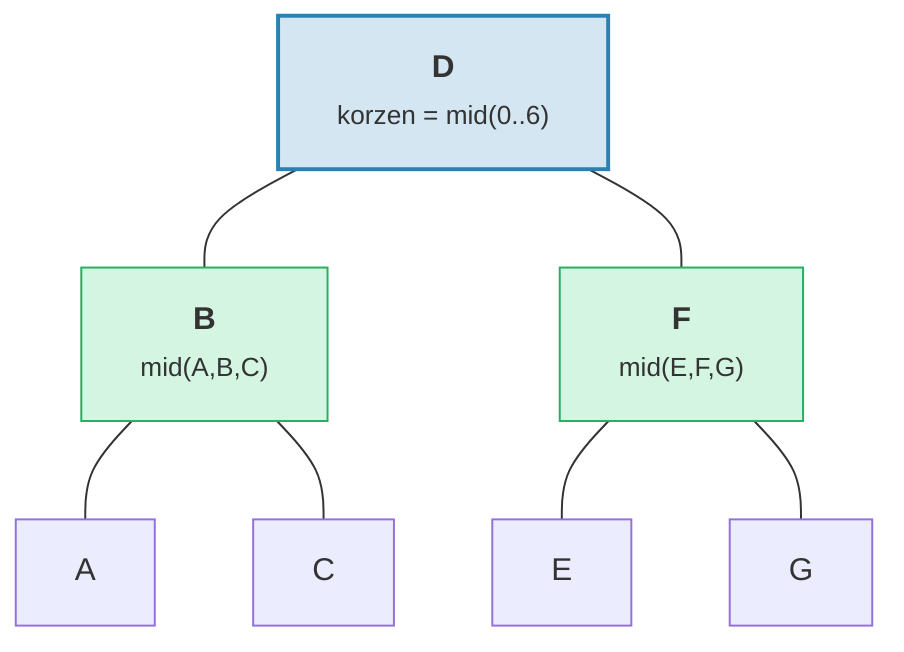

> Wynik: idealnie zrownowazone drzewo o wysokosci = 3 = ceil(log2(7)).

```rust
fn build(batch: &MerkBatch<K>, ...) -> CostResult<Option<TreeNode>, Error> {
    let mid_index = batch.len() / 2;
    let (mid_key, mid_op) = &batch[mid_index];

    // Utworz wezel korzenia ze srodkowego elementu
    let mid_tree = TreeNode::new(mid_key.clone(), value.clone(), None, feature_type)?;

    // Rekurencyjnie buduj lewe i prawe poddrzewa
    let left = Self::build(&batch[..mid_index], ...);
    let right = Self::build(&batch[mid_index + 1..], ...);

    // Podlacz potomkow
    mid_tree.attach(true, left).attach(false, right)
}
```

Produkuje to drzewo o wysokosci ceil(log2(n)) -- idealnie zrownowazone.

### Strategia 2: apply_sorted() -- Scalanie z istniejacym drzewem

Gdy drzewo juz zawiera dane, `apply_sorted()` uzywa **wyszukiwania binarnego**,
aby znalezc, gdzie kazda operacja wsadowa powinna zostac zastosowana, a nastepnie
rekurencyjnie stosuje operacje do lewego i prawego poddrzewa:

Istniejace drzewo z partia `[(B, Put), (F, Delete)]`:

Wyszukiwanie binarne: B < D (idz w lewo), F > D (idz w prawo).

**Przed:**
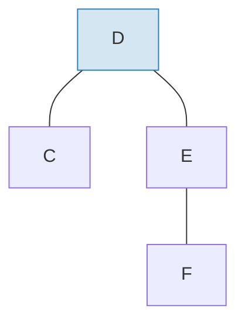

**Po** zastosowaniu partii i rebalansowaniu:
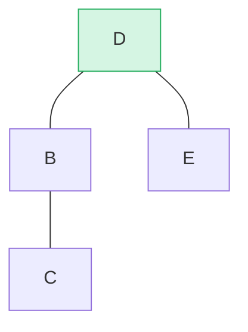

> B wstawione jako lewe poddrzewo, F usuniete z prawego poddrzewa. `maybe_balance()` potwierdza bf(D) = 0.

```rust
fn apply_sorted(self, batch: &MerkBatch<K>, ...) -> CostResult<...> {
    let search = batch.binary_search_by(|(key, _)| key.cmp(self.tree().key()));

    match search {
        Ok(index) => {
            // Klucz pasuje do tego wezla -- zastosuj operacje bezposrednio
            // (Put zastepuje wartosc, Delete usuwa wezel)
        }
        Err(mid) => {
            // Klucz nie znaleziony -- mid jest punktem podzialu
            // Rekurencja na left_batch[..mid] i right_batch[mid..]
        }
    }

    self.recurse(batch, mid, exclusive, ...)
}
```

Metoda `recurse` dzieli partie i przechodzi w lewo i w prawo:

```rust
fn recurse(self, batch: &MerkBatch<K>, mid: usize, ...) {
    let left_batch = &batch[..mid];
    let right_batch = &batch[mid..];  // lub mid+1 jezeli wylaczne

    // Zastosuj lewa partie do lewego poddrzewa
    let tree = self.walk(true, |maybe_left| {
        Self::apply_to(maybe_left, left_batch, ...)
    });

    // Zastosuj prawa partie do prawego poddrzewa
    let tree = tree.walk(false, |maybe_right| {
        Self::apply_to(maybe_right, right_batch, ...)
    });

    // Ponowne zrownowazenie po modyfikacjach
    tree.maybe_balance(...)
}
```

### Usuwanie wezla

Podczas usuwania wezla z dwoma potomkami, Merk awansuje **wezel brzegowy** z
wyzszego poddrzewa. Minimalizuje to ryzyko koniecznosci dodatkowych rotacji:

**Przed** -- usuwanie D (ma dwoje potomkow, wysokosc prawego poddrzewa >= lewego):

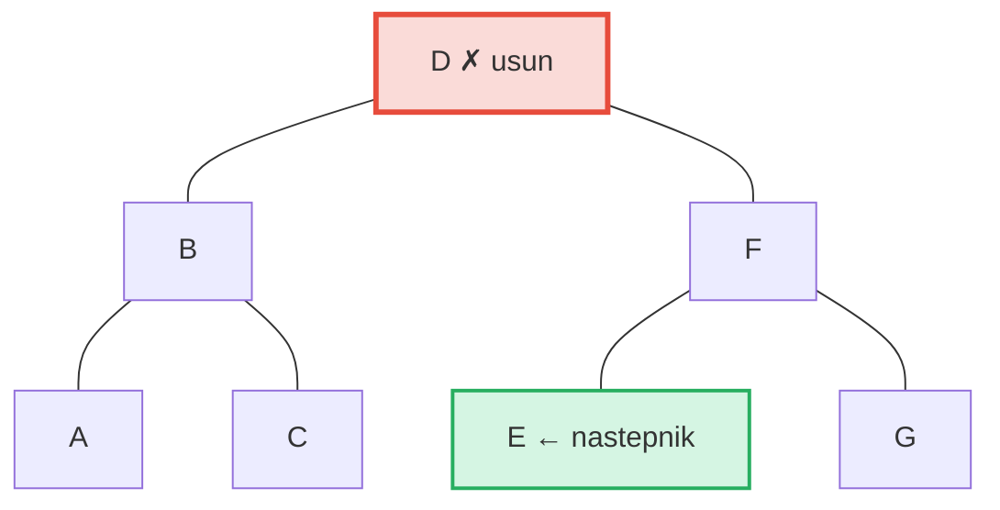

**Po** -- E (najbardziej lewy w prawym poddrzewie = nastepnik w porzadku inorder) awansuje na pozycje D:

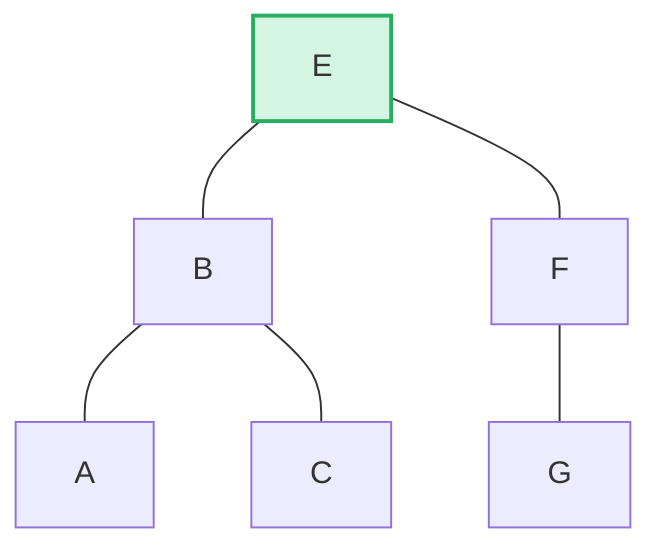

> **Regula:** Jezeli lewa_wysokosc > prawa --> awansuj prawy brzeg lewego poddrzewa. Jezeli prawa_wysokosc >= lewa --> awansuj lewy brzeg prawego poddrzewa. Minimalizuje to rebalansowanie po usunieciu.

```rust
pub fn remove(self, ...) -> CostResult<Option<Self>, Error> {
    let has_left = tree.link(true).is_some();
    let has_right = tree.link(false).is_some();
    let left = tree.child_height(true) > tree.child_height(false);

    if has_left && has_right {
        // Dwoje potomkow: awansuj brzeg wyzszego potomka
        let (tree, tall_child) = self.detach_expect(left, ...);
        let (_, short_child) = tree.detach_expect(!left, ...);
        tall_child.promote_edge(!left, short_child, ...)
    } else if has_left || has_right {
        // Jeden potomek: awansuj go bezposrednio
        self.detach_expect(left, ...).1
    } else {
        // Wezel liscia: po prostu usun
        None
    }
}
```

---
