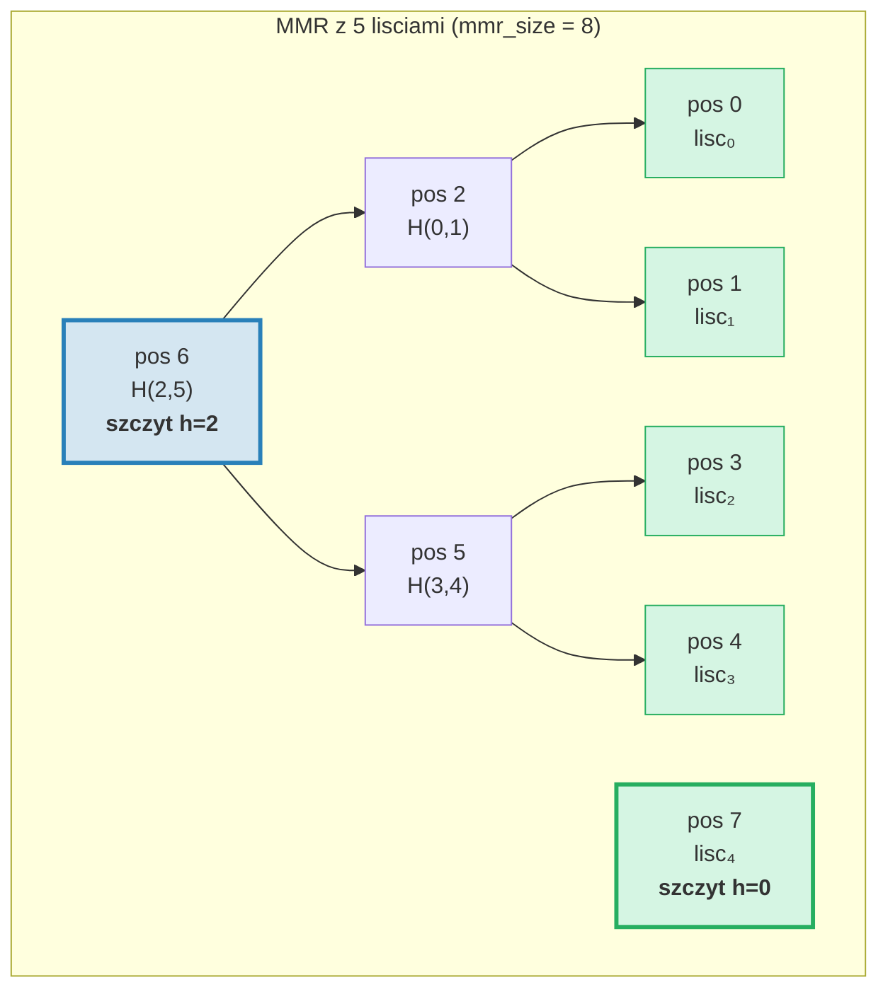
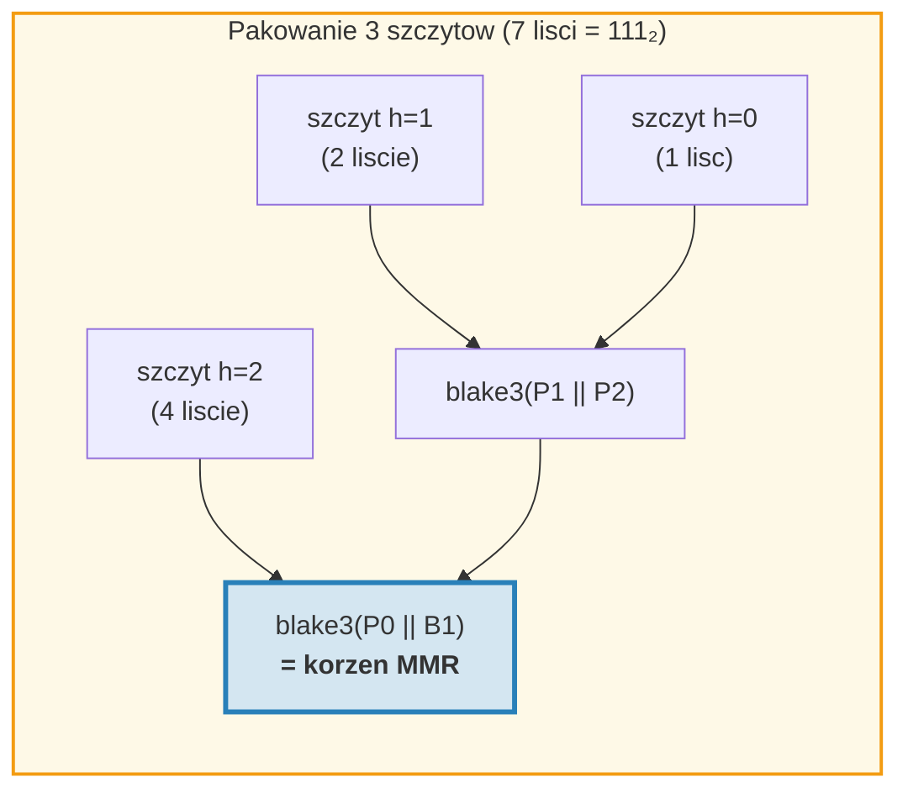
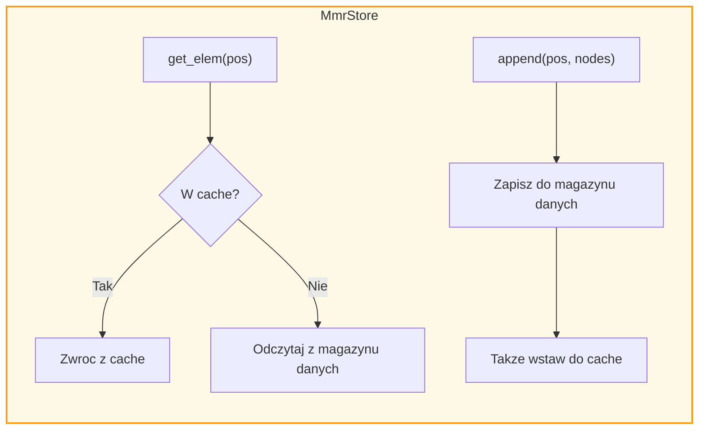
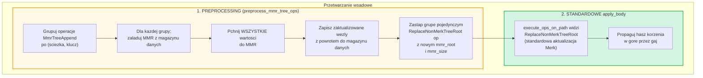
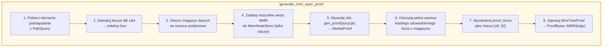
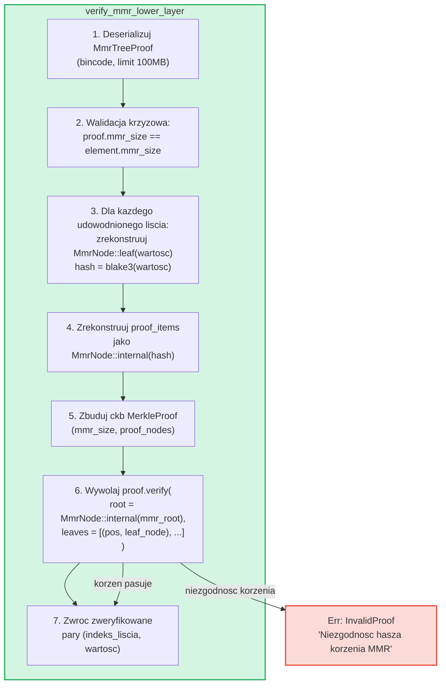

# Drzewo MMR -- Uwierzytelnione logi typu append-only

**MmrTree** to struktura danych GroveDB typu append-only (tylko dopisywanie),
zbudowana na Merkle Mountain Range (MMR) z haszowaniem Blake3. Podczas gdy drzewa
Merk AVL (Rozdzial 2) doskonale radza sobie z losowymi operacjami klucz-wartosc
z aktualizacjami O(log N), MMR sa zaprojektowane specjalnie dla przypadku
append-only: oferuja zero rotacji, zamortyzowany koszt haszowania O(1) na
dopisanie i sekwencyjne wzorce operacji I/O.

Ten rozdzial szczegolowo omawia strukture danych MMR -- jak rosnie, jak wezly sa
przechowywane, jak dopisywania kaskaduja, oraz jak system dowodow pozwala dowolnej
trzeciej stronie zweryfikowac, ze konkretna wartosc zostala dopisana na konkretnej pozycji.

## Dlaczego oddzielny typ drzewa?

Standardowe drzewa Merk GroveDB dobrze radza sobie z uporządkowanymi danymi
klucz-wartosc, ale logi append-only maja inne wymagania:

| Wlasciwosc | Drzewo Merk AVL | MMR |
|----------|--------------|-----|
| Operacje | Wstawianie, aktualizacja, usuwanie | Tylko dopisywanie |
| Rebalansowanie | O(log N) rotacji na zapis | Brak |
| Wzorzec I/O | Losowy (rebalansowanie dotyka wielu wezlow) | Sekwencyjny (nowe wezly zawsze na koncu) |
| Laczne hasze dla N wstawien | O(N log N) | O(N) |
| Struktura | Okreslona kolejnoscia wstawiania | Okreslona tylko liczba lisci |
| Dowody | Sciezka od korzenia do liscia | Hasze rodzenstwa + szczytow |

Dla zastosowań takich jak logi transakcji, strumienie zdarzen lub jakiekolwiek
monotonnicznie rosnace dane, MMR jest scisle lepszy: prostszy, szybszy
i bardziej przewidywalny.

## Struktura danych MMR

MMR to **las doskonalych drzew binarnych** (zwanych "szczytami"), ktory rosnie
od lewej do prawej. Kazdy szczyt jest pelnym drzewem binarnym o pewnej
wysokosci *h*, zawierajacym dokladnie 2^h lisci.

Kluczowa obserwacja: **reprezentacja binarna liczby lisci określa strukture
szczytow**. Kazdy bit 1 w formie binarnej odpowiada jednemu szczytowi:

```text
Liczba lisci  Binarnie  Szczyty
─────────     ──────    ─────
1             1         jeden szczyt h=0
2             10        jeden szczyt h=1
3             11        szczyty h=1, h=0
4             100       jeden szczyt h=2
5             101       szczyty h=2, h=0
6             110       szczyty h=2, h=1
7             111       szczyty h=2, h=1, h=0
8             1000      jeden szczyt h=3
```

Oznacza to, ze struktura MMR jest w pelni okreslona przez pojedyncza liczbe --
liczbe lisci. Dwa MMR z ta sama liczba lisci zawsze maja ten sam ksztalt,
niezaleznie od dopisanych wartosci.

## Jak MMR sie wypelnia

Kazdy wezel w MMR ma **pozycje** (indeksowana od 0). Liscie i wezly wewnetrzne
sa przeplecione w specyficznym wzorcu. Oto wzrost krok po kroku:

**Po 1 lisciu (mmr_size = 1):**
```text
pos:  0
      lisc₀        ← jeden szczyt na wysokosci 0
```

**Po 2 lisciach (mmr_size = 3):**
```text
pos:     2          ← wewnetrzny: blake3(lisc₀.hash || lisc₁.hash)
        / \
       0   1        ← liscie

Jeden szczyt na wysokosci 1. Pozycje 0 i 1 to liscie, pozycja 2 jest wewnetrzna.
```
Gdy lisc₁ zostal dopisany, utworzyl szczyt na wysokosci 0. Ale juz istnial
szczyt na wysokosci 0 (lisc₀), wiec **polaczyli sie** w szczyt na wysokosci 1.

**Po 3 lisciach (mmr_size = 4):**
```text
pos:     2     3    ← szczyt h=1, szczyt h=0
        / \
       0   1

Dwa szczyty. Brak laczenia — wysokosci 1 i 0 sa rozne.
(Binarnie: 3 = 11₂ → jeden szczyt na kazdy bit 1)
```

**Po 4 lisciach (mmr_size = 7):**
```text
pos:         6              ← wewnetrzny: laczenie wezlow 2 i 5
           /   \
         2       5          ← wezly wewnetrzne
        / \     / \
       0   1   3   4        ← liscie

Jeden szczyt na wysokosci 2.
```
Tu robi sie interesujaco. Dopisanie liscia₃ (pozycja 4) tworzy wezel₅
(laczenie pozycji 3 i 4). Ale teraz wezel₅ (wysokosc 1) i wezel₂ (wysokosc 1)
sa szczytami o rownej wysokosci sasiednich, wiec lacza sie w wezel₆. **Kaskada
dwoch laczen z jednego dopisania.**

**Po 5 lisciach (mmr_size = 8):**
```text
pos:         6         7    ← szczyt h=2, szczyt h=0
           /   \
         2       5
        / \     / \
       0   1   3   4

Dwa szczyty. (Binarnie: 5 = 101₂)
```

**Po 7 lisciach (mmr_size = 11):**
```text
pos:         6         10    ← szczyt h=2, szczyt h=1, szczyt h=0
           /   \      / \
         2       5   8   9    7
        / \     / \
       0   1   3   4

Trzy szczyty. (Binarnie: 7 = 111₂)
```

**Po 8 lisciach (mmr_size = 15):**
```text
pos:              14                     ← pojedynczy szczyt h=3
               /      \
            6            13
          /   \        /    \
        2       5    9       12
       / \     / \  / \     / \
      0   1   3  4 7   8  10  11

Jeden szczyt na wysokosci 3. Trzy kaskadowe laczenia z dopisania liscia₇.
```



> **Niebieski** = szczyty (korzenie doskonalych poddrzew binarnych). **Zielony** = wezly lisci.

## Kaskada laczen

Gdy nowy lisc jest dopisywany, moze wywolac lancuch laczen. Liczba laczen
jest rowna liczbie **koncowych bitow 1** w binarnej reprezentacji biezacej
liczby lisci:

| Liczba lisci (przed push) | Binarnie | koncowe 1 | Laczenia | Lacznie haszy |
|--------------------------|--------|-------------|--------|--------------|
| 0 | `0` | 0 | 0 | 1 (tylko lisc) |
| 1 | `1` | 1 | 1 | 2 |
| 2 | `10` | 0 | 0 | 1 |
| 3 | `11` | 2 | 2 | 3 |
| 4 | `100` | 0 | 0 | 1 |
| 5 | `101` | 1 | 1 | 2 |
| 6 | `110` | 0 | 0 | 1 |
| 7 | `111` | 3 | 3 | 4 |

**Lacznie haszy na push** = `1 + trailing_ones(liczba_lisci)`:
- 1 hasz dla samego liscia: `blake3(wartosc)`
- N haszy dla kaskady laczen: `blake3(lewy.hash || prawy.hash)` dla kazdego
  laczenia

Tak GroveDB sledzi koszty haszowania dla kazdego dopisania. Implementacja:
```rust
pub fn hash_count_for_push(leaf_count: u64) -> u32 {
    1 + leaf_count.trailing_ones()
}
```

## Rozmiar MMR vs liczba lisci

MMR przechowuje zarowno liscie, jak i wezly wewnetrzne w plaskiej przestrzeni
pozycji, wiec `mmr_size` jest zawsze wiekszy niz liczba lisci. Dokladna relacja to:

```text
mmr_size = 2 * liczba_lisci - popcount(liczba_lisci)
```

gdzie `popcount` to liczba bitow 1 (tj. liczba szczytow). Kazdy wezel
wewnetrzny laczy dwa poddrzewa, zmniejszajac liczbe wezlow o jeden na laczenie.

Obliczenie odwrotne -- liczba lisci z mmr_size -- uzywa pozycji szczytow:

```rust
fn mmr_size_to_leaf_count(mmr_size: u64) -> u64 {
    // Kazdy szczyt na wysokosci h zawiera 2^h lisci
    get_peaks(mmr_size).iter()
        .map(|&peak_pos| 1u64 << pos_height_in_tree(peak_pos))
        .sum()
}
```

| mmr_size | liczba_lisci | szczyty |
|----------|-----------|-------|
| 0 | 0 | (puste) |
| 1 | 1 | h=0 |
| 3 | 2 | h=1 |
| 4 | 3 | h=1, h=0 |
| 7 | 4 | h=2 |
| 8 | 5 | h=2, h=0 |
| 10 | 6 | h=2, h=1 |
| 11 | 7 | h=2, h=1, h=0 |
| 15 | 8 | h=3 |

GroveDB przechowuje `mmr_size` w elemencie (nie liczbe lisci), poniewaz
biblioteka ckb MMR uzywa pozycji wewnetrznie. Operacja `mmr_tree_leaf_count`
oblicza liczbe lisci na biezaco.

## Hasz korzenia MMR -- Pakowanie szczytow

MMR ma wiele szczytow (jeden na kazdy bit 1 w liczbie lisci). Aby wytworzyc
pojedynczy 32-bajtowy hasz korzenia, szczyty sa **"pakowane"** od prawej
do lewej:

```text
root = bag_rhs_peaks(szczyty):
    zacznij od najbardziej prawego szczytu
    zloz w lewo: blake3(lewy_szczyt || zakumulowany_prawy)
```

Przy 1 szczycie korzen to po prostu hasz tego szczytu. Przy 3 szczytach:



> Hasz korzenia zmienia sie z **kazdym** dopisaniem, nawet gdy nie wystepuja
> laczenia, poniewaz najbardziej prawy szczyt sie zmienia i pakowanie musi
> byc przeliczone.

## Struktura wezlow i serializacja

Kazdy wezel MMR to `MmrNode`:

```rust
struct MmrNode {
    hash: [u8; 32],           // Hasz Blake3
    value: Option<Vec<u8>>,   // Some dla lisci, None dla wezlow wewnetrznych
}
```

**Wezel liscia:** `hash = blake3(bajty_wartosci)`, `value = Some(bajty_wartosci)`
**Wezel wewnetrzny:** `hash = blake3(lewy.hash || prawy.hash)`, `value = None`

Funkcja laczenia jest prosta -- konkatenuj dwa 32-bajtowe hasze i oblicz
Blake3 wyniku:

```rust
fn blake3_merge(left: &[u8; 32], right: &[u8; 32]) -> [u8; 32] {
    let mut input = [0u8; 64];
    input[..32].copy_from_slice(left);
    input[32..].copy_from_slice(right);
    *blake3::hash(&input).as_bytes()
}
```

> **Uwaga o PartialEq:** `MmrNode` implementuje `PartialEq` porownujac **tylko
> pole hash**, nie wartosc. Jest to kluczowe dla weryfikacji dowodow: weryfikator
> ckb porownuje zrekonstruowany korzen (value = None) z oczekiwanym korzeniem.
> Gdyby PartialEq porownywalo pole value, dowody MMR z jednym lisciem zawsze
> by sie nie powiodly, poniewaz lisc ma `value: Some(...)`, ale rekonstrukcja
> korzenia produkuje `value: None`.

**Format serializacji:**
```text
Wewnetrzny: [0x00] [hash: 32 bajty]                                = 33 bajty
Lisc:       [0x01] [hash: 32 bajty] [dlugosc_wartosci: 4 BE] [wartosc...]   = 37 + dlugosc bajtow
```

Bajt flagi odroznia wezly wewnetrzne od lisci. Deserializacja waliduje dokladna
dlugosc -- nie sa dozwolone dodatkowe bajty koncowe.

## Architektura magazynowania

MmrTree przechowuje swoje wezly w kolumnie **danych** (tej samej rodzinie kolumn,
ktorej uzywaja wezly Merk), nie w potomnym poddrzewie Merk. Element nie ma pola
`root_key` -- hasz korzenia MMR plynie jako **hasz potomny** Merk przez
`insert_subtree(subtree_root_hash)`, uwierzytelniajac stan MMR.

**Klucze magazynowania** sa oparte na pozycji:
```text
klucz = 'm' || pozycja_jako_be_u64    (9 bajtow: prefiks + u64 BE)
```

Wiec pozycja 42 jest przechowywana pod kluczem `[0x6D, 0x00, 0x00, 0x00, 0x00, 0x00, 0x00,
0x00, 0x2A]`.

Wyszukiwanie liscia *i* wymaga najpierw obliczenia pozycji MMR:
`pos = leaf_index_to_pos(i)`, a nastepnie odczytu klucza danych `m{pos}`.

**Cache z natychmiastowym zapisem:** Podczas dopisywania nowo zapisane wezly musza
byc natychmiast odczytywalne dla nastepnych laczen w tym samym pushu. Poniewaz
magazyn transakcyjny GroveDB odraca zapisy do partii (nie sa widoczne dla
odczytow do zatwierdzenia), adapter `MmrStore` opakowuje kontekst magazynowania
pamieciowym cache `HashMap`:



To zapewnia, ze gdy dopisanie liscia₃ wyzwala kaskade laczen (tworzac wezly
wewnetrzne na pozycjach 5 i 6), wezel₅ jest natychmiast dostepny przy
obliczaniu wezla₆, mimo ze wezel₅ nie zostal jeszcze zatwierdzony do RocksDB.

**Propagacja hasza korzenia do korzenia stanu GroveDB:**

```text
combined_value_hash = blake3(
    blake3(varint(len) || element_bytes),   ← value_hash z zserializowanego elementu
    mmr_root_hash                           ← child_hash = korzen specyficzny dla typu
)
```

Hasz korzenia MMR plynie jako hasz potomny Merk przez `insert_subtree`. Kazda zmiana
stanu MMR produkuje inny `combined_value_hash`, ktory propaguje sie w gore przez
nadrzedna hierarchie Merk az do korzenia stanu GroveDB.

## Operacje GroveDB

MmrTree udostepnia cztery operacje:

```rust
// Dopisz wartosc — zwraca (nowy_korzen_mmr, indeks_liscia)
db.mmr_tree_append(path, key, value, tx, version)

// Odczytaj biezacy hasz korzenia (z elementu, bez dostepu do magazynu)
db.mmr_tree_root_hash(path, key, tx, version)

// Pobierz wartosc liscia po indeksie 0-bazowym
db.mmr_tree_get_value(path, key, leaf_index, tx, version)

// Pobierz liczbe dopisanych lisci
db.mmr_tree_leaf_count(path, key, tx, version)
```

### Przeplyw dopisywania

Operacja dopisywania jest najbardziej zlozona, wykonujac 8 krokow:

```mermaid
graph TD
    subgraph append["mmr_tree_append(path, key, value, tx)"]
        A1["1. Odczytaj element na path/key<br/>→ pobierz mmr_size, flags"]
        A2["2. Otworz magazyn danych na<br/>sciezce path/key poddrzewo"]
        A3["3. Utworz MmrNode::leaf(value)<br/>hash = blake3(value)"]
        A4["4. Pchnij lisc do ckb MMR<br/>→ kaskadowe laczenia zapisuja<br/>nowe wezly wewnetrzne"]
        A5["5. Zatwierdz → zrzuc nowe<br/>wezly do magazynu"]
        A6["6. Spakuj szczyty → nowy mmr_root"]
        A7["7. Zaktualizuj element z<br/>nowym mmr_root i mmr_size"]
        A8["8. Propaguj zmiany w gore<br/>przez hierarchie Merk<br/>GroveDB + zatwierdz tx"]

        A1 --> A2 --> A3 --> A4 --> A5 --> A6 --> A7 --> A8
    end

    style append fill:#d5f5e3,stroke:#27ae60,stroke-width:2px
    style A6 fill:#d4e6f1,stroke:#2980b9,stroke-width:2px
```



Krok 4 moze zapisac 1 wezel (tylko lisc) lub 1 + N wezlow (lisc + N wezlow
wewnetrznych laczen). Krok 5 wywoluje `mmr.commit()`, ktory zrzuca ckb MemStore
do MmrStore. Krok 7 wywoluje `insert_subtree` z nowym korzeniem MMR jako haszem
potomnym (przez `subtree_root_hash`), poniewaz MmrTree nie ma potomnego Merk.

### Operacje odczytu

`mmr_tree_root_hash` oblicza korzen z danych MMR w magazynie.
`mmr_tree_leaf_count` wyprowadza liczbe lisci z `mmr_size` w elemencie.
Nie potrzeba dostepu do magazynu danych.

`mmr_tree_get_value` oblicza `pos = leaf_index_to_pos(leaf_index)`, odczytuje
pojedynczy wpis magazynu danych na `m{pos}`, deserializuje `MmrNode` i zwraca
`node.value`.

## Operacje wsadowe

Wiele dopisywan MMR moze byc wsadowanych za pomoca `GroveOp::MmrTreeAppend { value }`.
Poniewaz standardowa funkcja wsadowa `execute_ops_on_path` ma dostep tylko do
Merk (nie do kontekstu magazynu MMR), dopisywania MMR uzywaja **fazy preprocessingu**:



Przyklad: wsad z 3 dopisaniami do tego samego MMR:
```rust
vec![
    QualifiedGroveDbOp { path: p, key: k, op: MmrTreeAppend { value: v1 } },
    QualifiedGroveDbOp { path: p, key: k, op: MmrTreeAppend { value: v2 } },
    QualifiedGroveDbOp { path: p, key: k, op: MmrTreeAppend { value: v3 } },
]
```

Preprocessing laduje MMR raz, pushuje v1, v2, v3 (tworzac wszystkie posrednie
wezly), zapisuje wszystko do magazynu danych, a nastepnie emituje pojedynczy
`ReplaceNonMerkTreeRoot` z finalnym `mmr_root` i `mmr_size`. Standardowa
maszyneria wsadowa obsluguje reszte.

## Generowanie dowodow

Dowody MMR to **dowody V1** -- uzywaja wariantu `ProofBytes::MMR` w warstwowej
strukturze dowodow (patrz par. 9.6). Dowod demonstruje, ze konkretne wartosci
lisci istnieja na konkretnych pozycjach w MMR i ze ich hasze sa zgodne
z `mmr_root` przechowywanym w nadrzednym elemencie.

### Kodowanie zapytan

Klucze zapytan koduja pozycje jako **bajty u64 big-endian**. Zachowuje to
leksykograficzny porzadek sortowania (poniewaz kodowanie BE jest monotoniczne),
umozliwiajac dzialanie wszystkich standardowych wariantow `QueryItem`:

```text
QueryItem::Key([0,0,0,0,0,0,0,5])            → indeks liscia 5
QueryItem::RangeInclusive([..2]..=[..7])      → indeksy lisci [2, 3, 4, 5, 6, 7]
QueryItem::RangeFrom([..10]..)                → indeksy lisci [10, 11, ..., N-1]
QueryItem::RangeFull                          → wszystkie liscie [0..leaf_count)
```

Ograniczenie bezpieczenstwa **10 000 000 indeksow** zapobiega wyczerpaniu pamieci
z nieograniczonych zapytan zakresowych. Pusty MMR (zero lisci) zwraca pusty dowod.

### Struktura MmrTreeProof

```rust
struct MmrTreeProof {
    mmr_size: u64,                 // Rozmiar MMR w momencie dowodu
    leaves: Vec<(u64, Vec<u8>)>,   // (indeks_liscia, wartosc) dla kazdego udowodnionego liscia
    proof_items: Vec<[u8; 32]>,    // Hasze rodzenstwa/szczytow do weryfikacji
}
```

`proof_items` zawieraja minimalny zestaw haszy potrzebnych do rekonstrukcji
sciezek od udowodnionych lisci do korzenia MMR. Sa to wezly rodzenstwa na
kazdym poziomie i hasze niezaangazowanych szczytow.

### Przeplyw generowania



Krok 4 uzywa `MemNodeStore` -- BTreeMap tylko do odczytu, ktora wstepnie laduje
wszystkie wezly MMR z magazynu danych. Generator dowodow ckb potrzebuje losowego
dostepu, wiec wszystkie wezly musza byc w pamieci.

Krok 5 to miejsce, gdzie biblioteka ckb wykonuje ciezka prace: znajac rozmiar
MMR i pozycje do udowodnienia, okresla, ktore hasze rodzenstwa i szczytow sa
potrzebne.

### Opracowany przyklad

**Dowodzenie liscia 2 w 5-lisciowym MMR (mmr_size = 8):**

```text
Struktura MMR:
pos:         6         7
           /   \
         2       5
        / \     / \
       0   1   3   4

Indeks liscia 2 → pozycja MMR 3

Aby zweryfikowac lisc na pozycji 3:
  1. Haszuj podana wartosc: leaf_hash = blake3(wartosc)
  2. Rodzenstwo na pozycji 4:  wezel₅ = blake3(leaf_hash || proof[pos 4])
  3. Rodzenstwo na pozycji 2:  wezel₆ = blake3(proof[pos 2] || wezel₅)
  4. Szczyt na pozycji 7:      korzen = bag(wezel₆, proof[pos 7])
  5. Porownaj: korzen == oczekiwany mmr_root ✓

proof_items = [hash(pos 4), hash(pos 2), hash(pos 7)]
leaves = [(2, oryginalne_bajty_wartosci)]
```

Rozmiar dowodu dla tego przykladu to: 3 hasze (96 bajtow) + 1 wartosc liscia +
metadane. Ogolnie, udowodnienie K lisci z N-lisciowego MMR wymaga
O(K * log N) haszy rodzenstwa.

## Weryfikacja dowodow

Weryfikacja jest **czysta** -- nie wymaga dostepu do bazy danych. Weryfikator
potrzebuje tylko bajtow dowodu i oczekiwanego hasza korzenia MMR (ktory
wyodrebnia z nadrzednego elementu udowodnionego w warstwie Merk powyzej).

### Kroki weryfikacji



Funkcja `MerkleProof::verify` ckb rekonstruuje korzen z lisci i elementow dowodu,
a nastepnie porownuje go (uzywajac `PartialEq`, ktory sprawdza tylko hasz)
z oczekiwanym korzeniem.

### Lancuch zaufania

Pelny lancuch od korzenia stanu GroveDB do zweryfikowanej wartosci liscia:

```text
Korzen stanu GroveDB (znany/zaufany)
│
├─ Dowod V0 Merk warstwa 0: dowodzi, ze poddrzewo istnieje w korzeniu
│   └─ root_hash odpowiada state_root ✓
│
├─ Dowod V0 Merk warstwa 1: dowodzi elementu MmrTree na sciezce/kluczu
│   └─ Wezel KVValueHash: element_bytes zawieraja mmr_root
│   └─ combined_hash = combine_hash(H(element_bytes), mmr_root)
│   └─ root_hash odpowiada warstwie nadrzednej ✓
│
└─ Dowod V1 MMR: dowodzi, ze wartosci lisci sa w MMR
    └─ Zrekonstruuj sciezki od lisci przez rodzenstwo do szczytow
    └─ Spakuj szczyty → zrekonstruowany korzen
    └─ zrekonstruowany korzen == mmr_root z element_bytes ✓
    └─ Wynik: lisc₂ = [zweryfikowane bajty wartosci]
```

### Wlasciwosci bezpieczenstwa

- **Walidacja krzyzowa mmr_size:** `mmr_size` dowodu musi odpowiadac `mmr_size`
  elementu. Niezgodnosc wskazuje, ze dowod zostal wygenerowany wobec innego
  stanu i jest odrzucany.
- **Limit rozmiaru bincode:** Deserializacja uzywa limitu 100MB, aby zapobiec
  spreparowanym naglowkom dlugosci powodujacym ogromne alokacje.
- **Rozliczanie limitow:** Kazdy udowodniony lisc zmniejsza ogolny limit
  zapytania o 1, uzywajac `saturating_sub` aby zapobiec niedomiaru.
- **Zwrot hasza potomnego:** Weryfikator zwraca obliczony korzen MMR jako hasz
  potomny do obliczenia combine_hash w warstwie nadrzednej.
- **Odrzucenie V0:** Proba podzapytania do MmrTree z dowodami V0 zwraca
  `Error::NotSupported`. Tylko dowody V1 moga schodzic do drzew nie-Merk.

## Sledzenie kosztow

Operacje MMR sledza koszty z precyzja:

| Operacja | Wywolania haszy | Operacje magazynowania |
|-----------|-----------|-------------------|
| Dopisanie 1 liscia | `1 + trailing_ones(liczba_lisci)` | 1 zapis liscia + N zapisow wewnetrznych |
| Hasz korzenia | 0 (cache w elemencie) | 1 odczyt elementu |
| Pobranie wartosci | 0 | 1 odczyt elementu + 1 odczyt danych |
| Liczba lisci | 0 | 1 odczyt elementu |

Wzor liczby haszy `1 + trailing_ones(N)` daje dokladna liczbe wywolan Blake3:
1 dla hasza liscia, plus jedno haszowanie laczenia na poziom kaskady.

**Analiza zamortyzowana:** Po N dopisaniach calkowita liczba haszy wynosi:

```text
Σ (1 + trailing_ones(i)) dla i = 0..N-1
= N + Σ trailing_ones(i) dla i = 0..N-1
= N + (N - popcount(N))
≈ 2N
```

Wiec zamortyzowany koszt na dopisanie wynosi okolo **2 wywolan haszy Blake3** --
staly i niezalezny od rozmiaru drzewa. Porownaj to z drzewami Merk AVL, gdzie
kazde wstawienie wymaga O(log N) haszy dla sciezki plus potencjalne hasze rotacji.

**Koszt magazynowania:** Kazde dopisanie zapisuje 1 wezel liscia (37 + dlugosc_wartosci bajtow)
plus 0 do log₂(N) wezlow wewnetrznych (33 bajty kazdy). Zamortyzowany zapis
magazynowania na dopisanie wynosi okolo 33 + 37 + dlugosc_wartosci bajtow ≈ 70 + dlugosc_wartosci bajtow.

## Pliki implementacji

| Plik | Przeznaczenie |
|------|---------|
| `grovedb-mmr/src/node.rs` | Struktura `MmrNode`, laczenie Blake3, serializacja |
| `grovedb-mmr/src/grove_mmr.rs` | Wrapper `GroveMmr` wokol ckb MMR |
| `grovedb-mmr/src/util.rs` | `mmr_node_key`, `hash_count_for_push`, `mmr_size_to_leaf_count` |
| `grovedb-mmr/src/proof.rs` | Generowanie i weryfikacja `MmrTreeProof` |
| `grovedb-mmr/src/dense_merkle.rs` | Geste korzenie drzew Merkle (uzywane przez BulkAppendTree) |
| `grovedb/src/operations/mmr_tree.rs` | Operacje GroveDB + adapter `MmrStore` + preprocessing wsadowy |
| `grovedb/src/operations/proof/generate.rs` | Generowanie dowodow V1: `generate_mmr_layer_proof`, `query_items_to_leaf_indices` |
| `grovedb/src/operations/proof/verify.rs` | Weryfikacja dowodow V1: `verify_mmr_lower_layer` |
| `grovedb/src/tests/mmr_tree_tests.rs` | 28 testow integracyjnych |

## Porownanie z innymi uwierzytelnionymi strukturami

| | MMR (MmrTree) | Merk AVL (Tree) | Sinsemilla (CommitmentTree) |
|---|---|---|---|
| **Zastosowanie** | Logi append-only | Magazyn klucz-wartosc | Zobowiazania ZK-kompatybilne |
| **Funkcja haszujaca** | Blake3 | Blake3 | Sinsemilla (krzywa Pallas) |
| **Operacje** | Dopisywanie, odczyt po indeksie | Wstawianie, aktualizacja, usuwanie, zapytanie | Dopisywanie, swiadek |
| **Zamortyzowany hasz/zapis** | ~2 | O(log N) | ~33 (32 poziomy + ommery) |
| **Typ dowodu** | V1 (hasze rodzenstwa MMR) | V0 (dowod sciezki Merk) | Swiadek (sciezka auth Merkle) |
| **ZK-kompatybilny** | Nie | Nie | Tak (obwody Halo 2) |
| **Rebalansowanie** | Brak | Rotacje AVL | Brak |
| **Obsluga usuwania** | Nie | Tak | Nie |

---
