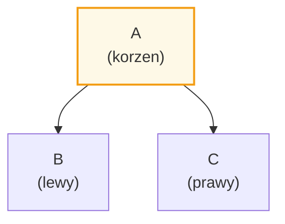
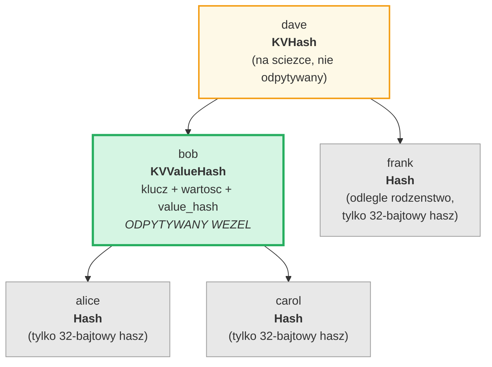
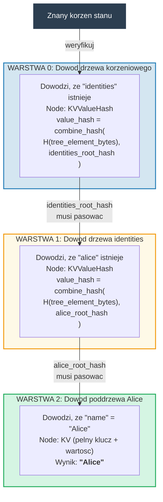
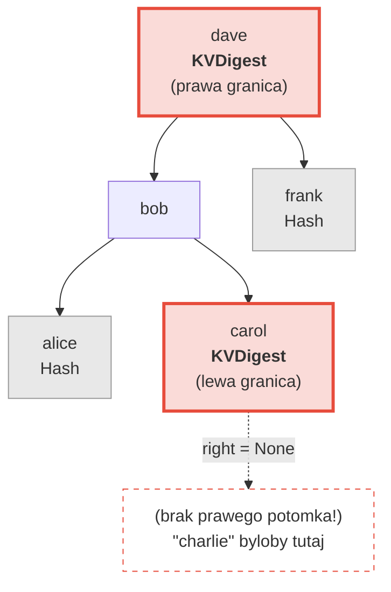
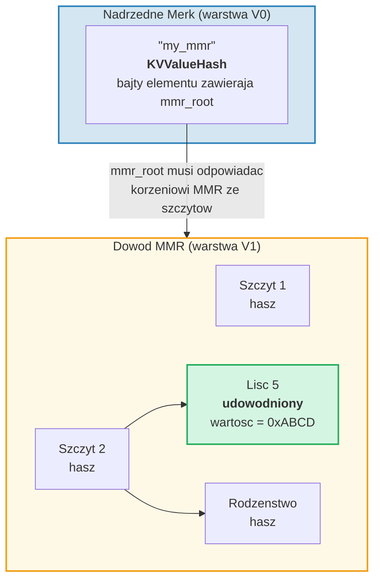
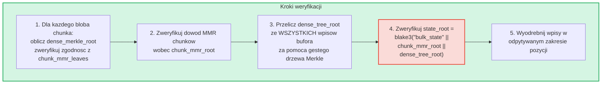
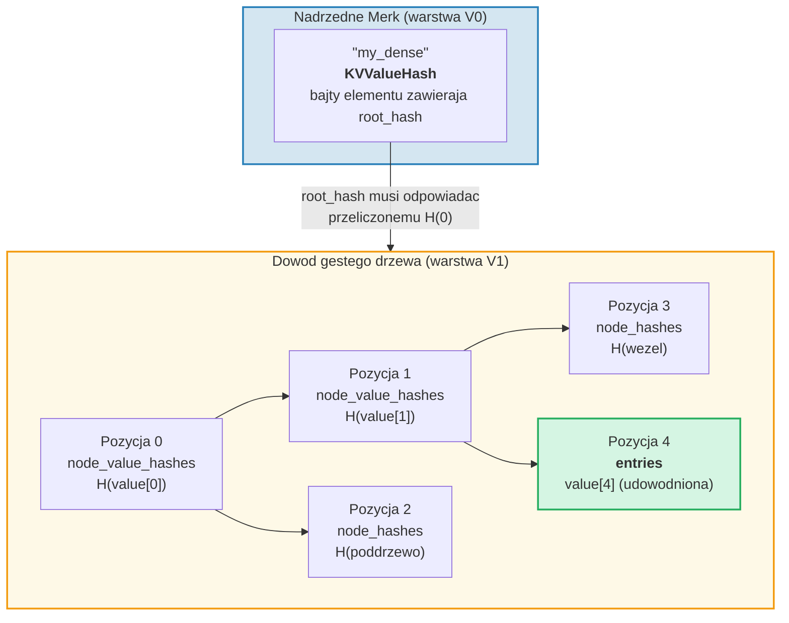

# System dowodow (proof)

System dowodow GroveDB pozwala dowolnej stronie zweryfikowac poprawnosc wynikow
zapytania bez posiadania pelnej bazy danych. Dowod (proof) jest kompaktowa
reprezentacja odpowiedniej struktury drzewa, ktora pozwala odtworzyc hasz korzenia.

## Operacje dowodow oparte na stosie

Dowody sa kodowane jako sekwencja **operacji**, ktore rekonstruuja czesciowe drzewo
za pomoca maszyny stosowej:

```rust
// merk/src/proofs/mod.rs
pub enum Op {
    Push(Node),        // Poloz wezel na stos (rosnacy porzadek kluczy)
    PushInverted(Node),// Poloz wezel (malejacy porzadek kluczy)
    Parent,            // Zdejmij rodzica, zdejmij potomka → podlacz potomka jako LEWY rodzica
    Child,             // Zdejmij potomka, zdejmij rodzica → podlacz potomka jako PRAWY rodzica
    ParentInverted,    // Zdejmij rodzica, zdejmij potomka → podlacz potomka jako PRAWY rodzica
    ChildInverted,     // Zdejmij potomka, zdejmij rodzica → podlacz potomka jako LEWY rodzica
}
```

Wykonanie uzywa stosu:

Operacje dowodu: `Push(B), Push(A), Parent, Push(C), Child`

| Krok | Operacja | Stos (gora→prawo) | Akcja |
|------|-----------|-------------------|--------|
| 1 | Push(B) | [ B ] | Poloz B na stos |
| 2 | Push(A) | [ B , A ] | Poloz A na stos |
| 3 | Parent | [ A{left:B} ] | Zdejmij A (rodzic), zdejmij B (potomek), B → LEWY A |
| 4 | Push(C) | [ A{left:B} , C ] | Poloz C na stos |
| 5 | Child | [ A{left:B, right:C} ] | Zdejmij C (potomek), zdejmij A (rodzic), C → PRAWY A |

Wynik koncowy -- jedno drzewo na stosie:



> Weryfikator oblicza `node_hash(A) = Blake3(kv_hash_A || node_hash_B || node_hash_C)` i sprawdza, czy odpowiada oczekiwanemu haszowi korzenia.

Oto funkcja `execute` (`merk/src/proofs/tree.rs`):

```rust
pub fn execute<I, F>(ops: I, collapse: bool, mut visit_node: F) -> CostResult<Tree, Error>
where
    I: IntoIterator<Item = Result<Op, Error>>,
    F: FnMut(&Node) -> Result<(), Error>,
{
    let mut stack: Vec<Tree> = Vec::with_capacity(32);

    for op in ops {
        match op? {
            Op::Parent => {
                let (mut parent, child) = (try_pop(&mut stack), try_pop(&mut stack));
                parent.left = Some(Child { tree: Box::new(child), hash: child.hash() });
                stack.push(parent);
            }
            Op::Child => {
                let (child, mut parent) = (try_pop(&mut stack), try_pop(&mut stack));
                parent.right = Some(Child { tree: Box::new(child), hash: child.hash() });
                stack.push(parent);
            }
            Op::Push(node) => {
                visit_node(&node)?;
                stack.push(Tree::from(node));
            }
            // ... Warianty Inverted zamieniaja lewy/prawy
        }
    }
    // Ostatni element na stosie to korzen
}
```

## Typy wezlow w dowodach

Kazdy `Push` przenosi `Node` zawierajacy tyle informacji, ile wystarczy do
weryfikacji:

```rust
pub enum Node {
    // Minimum informacji — tylko hasz. Uzywane dla odleglego rodzenstwa.
    Hash(CryptoHash),

    // Hasz KV dla wezlow na sciezce, ale nie odpytywanych.
    KVHash(CryptoHash),

    // Pelny klucz-wartosc dla odpytywanych elementow.
    KV(Vec<u8>, Vec<u8>),

    // Klucz, wartosc i wstepnie obliczony value_hash.
    // Uzywane dla poddrzew, gdzie value_hash = combine_hash(...)
    KVValueHash(Vec<u8>, Vec<u8>, CryptoHash),

    // KV z typem cechy — dla ProvableCountTree lub przywracania chunkow.
    KVValueHashFeatureType(Vec<u8>, Vec<u8>, CryptoHash, TreeFeatureType),

    // Referencja: klucz, zdereferencjonowana wartosc, hasz elementu referencji.
    KVRefValueHash(Vec<u8>, Vec<u8>, CryptoHash),

    // Dla elementow w ProvableCountTree.
    KVCount(Vec<u8>, Vec<u8>, u64),

    // Hasz KV + licznik dla nie-odpytywanych wezlow ProvableCountTree.
    KVHashCount(CryptoHash, u64),

    // Referencja w ProvableCountTree.
    KVRefValueHashCount(Vec<u8>, Vec<u8>, CryptoHash, u64),

    // Dla dowodow granic/nieobecnosci w ProvableCountTree.
    KVDigestCount(Vec<u8>, CryptoHash, u64),

    // Klucz + value_hash dla dowodow nieobecnosci (zwykle drzewa).
    KVDigest(Vec<u8>, CryptoHash),
}
```

Wybor typu Node determinuje, jakie informacje potrzebuje weryfikator:

**Zapytanie: "Pobierz wartosc dla klucza 'bob'"**



> Zielony = odpytywany wezel (pelne dane ujawnione). Zolty = na sciezce (tylko kv_hash). Szary = rodzenstwo (tylko 32-bajtowe hasze wezlow).

Zakodowane jako operacje dowodu:

| # | Op | Efekt |
|---|----|----|
| 1 | Push(Hash(alice_node_hash)) | Poloz hasz alice |
| 2 | Push(KVValueHash("bob", value, value_hash)) | Poloz bob z pelnymi danymi |
| 3 | Parent | alice staje sie lewym potomkiem bob |
| 4 | Push(Hash(carol_node_hash)) | Poloz hasz carol |
| 5 | Child | carol staje sie prawym potomkiem bob |
| 6 | Push(KVHash(dave_kv_hash)) | Poloz kv_hash dave |
| 7 | Parent | poddrzewo bob staje sie lewym dave |
| 8 | Push(Hash(frank_node_hash)) | Poloz hasz frank |
| 9 | Child | frank staje sie prawym potomkiem dave |

## Generowanie dowodow wielowarstwowych

Poniewaz GroveDB jest drzewem drzew, dowody obejmuja wiele warstw. Kazda warstwa
dowodzi odpowiednia czesc jednego drzewa Merk, a warstwy sa polaczone mechanizmem
combined value_hash:

**Zapytanie:** `Pobierz ["identities", "alice", "name"]`



> **Lancuch zaufania:** `znany_korzen_stanu → weryfikuj Warstwe 0 → weryfikuj Warstwe 1 → weryfikuj Warstwe 2 → "Alice"`. Odtworzony hasz korzenia kazdej warstwy musi odpowiadac value_hash z warstwy powyzej.

Weryfikator sprawdza kazda warstwe, potwierdzajac, ze:
1. Dowod warstwy rekonstruuje sie do oczekiwanego hasza korzenia
2. Hasz korzenia odpowiada value_hash z warstwy nadrzednej
3. Hasz korzenia najwyzszego poziomu odpowiada znanemu korzeniowi stanu

## Weryfikacja dowodow

Weryfikacja podaza za warstwami dowodu od dolu do gory lub od gory do dolu,
uzywajac funkcji `execute` do rekonstrukcji drzewa kazdej warstwy. Metoda
`Tree::hash()` w drzewie dowodowym oblicza hasz na podstawie typu wezla:

```rust
impl Tree {
    pub fn hash(&self) -> CostContext<CryptoHash> {
        match &self.node {
            Node::Hash(hash) => *hash,  // Juz hasz, zwroc bezposrednio

            Node::KVHash(kv_hash) =>
                node_hash(kv_hash, &self.child_hash(true), &self.child_hash(false)),

            Node::KV(key, value) =>
                kv_hash(key, value)
                    .flat_map(|kv_hash| node_hash(&kv_hash, &left, &right)),

            Node::KVValueHash(key, _, value_hash) =>
                kv_digest_to_kv_hash(key, value_hash)
                    .flat_map(|kv_hash| node_hash(&kv_hash, &left, &right)),

            Node::KVValueHashFeatureType(key, _, value_hash, feature_type) => {
                let kv = kv_digest_to_kv_hash(key, value_hash);
                match feature_type {
                    ProvableCountedMerkNode(count) =>
                        node_hash_with_count(&kv, &left, &right, *count),
                    _ => node_hash(&kv, &left, &right),
                }
            }

            Node::KVRefValueHash(key, referenced_value, ref_element_hash) => {
                let ref_value_hash = value_hash(referenced_value);
                let combined = combine_hash(ref_element_hash, &ref_value_hash);
                let kv = kv_digest_to_kv_hash(key, &combined);
                node_hash(&kv, &left, &right)
            }
            // ... inne warianty
        }
    }
}
```

## Dowody nieobecnosci

GroveDB moze udowodnic, ze klucz **nie istnieje**. Uzywa do tego wezlow granicznych --
wezlow, ktore bylyby sasiadami brakujacego klucza, gdyby istnial:

**Udowodnij:** "charlie" NIE istnieje



> **Wyszukiwanie binarne:** alice < bob < carol < **"charlie"** < dave < frank. "charlie" znajdowalby sie miedzy carol a dave. Prawy potomek carol to `None`, co dowodzi, ze nic nie istnieje miedzy carol a dave. Zatem "charlie" nie moze istniec w tym drzewie.

Dla zapytan zakresowych dowody nieobecnosci pokazuja, ze nie ma kluczy w
odpytywanym zakresie, ktore nie zostaly uwzglednione w zbiorze wynikow.

## Dowody V1 -- Drzewa nie-Merk

System dowodow V0 dziala wylacznie z poddrzewami Merk, schodzac warstwa po
warstwie przez hierarchie gaju. Jednak elementy **CommitmentTree**, **MmrTree**,
**BulkAppendTree** i **DenseAppendOnlyFixedSizeTree** przechowuja swoje dane
poza potomnym drzewem Merk. Nie maja potomnego Merk, do ktorego mozna by
zejsc -- ich specyficzny dla typu hasz korzenia plynie jako hasz potomny Merk.

**Format dowodow V1** rozszerza V0, aby obslugiwac te drzewa nie-Merk za pomoca
struktur dowodowych specyficznych dla typu:

```rust
/// Ktory format dowodu uzywa warstwa.
pub enum ProofBytes {
    Merk(Vec<u8>),            // Standardowe operacje dowodu Merk
    MMR(Vec<u8>),             // Dowod czlonkostwa MMR
    BulkAppendTree(Vec<u8>),  // Dowod zakresowy BulkAppendTree
    DenseTree(Vec<u8>),       // Dowod wlaczenia gestego drzewa
    CommitmentTree(Vec<u8>),  // Korzen Sinsemilla (32 bajty) + bajty dowodu BulkAppendTree
}

/// Jedna warstwa dowodu V1.
pub struct LayerProof {
    pub merk_proof: ProofBytes,
    pub lower_layers: BTreeMap<Vec<u8>, LayerProof>,
}
```

**Regula wyboru V0/V1:** Jezeli kazda warstwa w dowodzie jest standardowym drzewem
Merk, `prove_query` produkuje `GroveDBProof::V0` (wstecznie kompatybilny). Jezeli
dowolna warstwa obejmuje MmrTree, BulkAppendTree lub DenseAppendOnlyFixedSizeTree,
produkuje `GroveDBProof::V1`.

### Jak dowody drzew nie-Merk wiaza sie z haszem korzenia

Nadrzedne drzewo Merk dowodzi zserializowanych bajtow elementu przez standardowy
wezel dowodu Merk (`KVValueHash`). Korzen specyficzny dla typu (np. `mmr_root` lub
`state_root`) plynie jako **hasz potomny** Merk -- NIE jest osadzony w bajtach
elementu:

```text
combined_value_hash = combine_hash(
    Blake3(varint(len) || element_bytes),   ← zawiera count, height itp.
    type_specific_root                      ← mmr_root / state_root / dense_root
)
```

Dowod specyficzny dla typu nastepnie dowodzi, ze odpytywane dane sa zgodne
z korzeniem specyficznym dla typu, ktory byl uzywany jako hasz potomny.

### Dowody MMR Tree

Dowod MMR demonstruje, ze konkretne liscie istnieja na znanych pozycjach w MMR
i ze hasz korzenia MMR odpowiada haszowi potomnemu przechowywanego w
nadrzednym wezle Merk:

```rust
pub struct MmrProof {
    pub mmr_size: u64,
    pub proof: MerkleProof,  // ckb_merkle_mountain_range::MerkleProof
    pub leaves: Vec<MmrProofLeaf>,
}

pub struct MmrProofLeaf {
    pub position: u64,       // Pozycja MMR
    pub leaf_index: u64,     // Logiczny indeks liscia
    pub hash: [u8; 32],      // Hasz liscia
    pub value: Vec<u8>,      // Bajty wartosci liscia
}
```



**Klucze zapytania to pozycje:** Elementy zapytan koduja pozycje jako bajty u64
big-endian (co zachowuje porzadek sortowania). `QueryItem::RangeInclusive` z
pozycjami start/end kodowanymi w BE wybiera ciagly zakres lisci MMR.

**Weryfikacja:**
1. Zrekonstruuj liscie `MmrNode` z dowodu
2. Zweryfikuj `MerkleProof` ckb wobec oczekiwanego korzenia MMR z hasza potomnego nadrzednego Merk
3. Waliduj skrzyzowanie, ze `proof.mmr_size` odpowiada rozmiarowi przechowywanego w elemencie
4. Zwroc udowodnione wartosci lisci

### Dowody BulkAppendTree

Dowody BulkAppendTree sa bardziej zlozone, poniewaz dane znajduja sie w dwoch
miejscach: zapieczętowanych blobach chunkow i w aktywnym buforze. Dowod
zakresowy musi zwrocic:

- **Pelne bloby chunkow** dla kazdego ukonczonego chunka nakladajacego sie z zapytanym zakresem
- **Poszczegolne wpisy bufora** dla pozycji nadal w buforze

```rust
pub struct BulkAppendTreeProof {
    pub chunk_power: u8,
    pub total_count: u64,
    pub chunk_blobs: Vec<(u64, Vec<u8>)>,       // (chunk_index, blob_bytes)
    pub chunk_mmr_size: u64,
    pub chunk_mmr_proof_items: Vec<[u8; 32]>,    // Hasze rodzenstwa MMR
    pub chunk_mmr_leaves: Vec<(u64, [u8; 32])>,  // (mmr_pos, dense_merkle_root)
    pub buffer_entries: Vec<Vec<u8>>,             // WSZYSTKIE biezace wpisy bufora (gestego drzewa)
    pub chunk_mmr_root: [u8; 32],
}
```



> **Dlaczego uwzgledniamy WSZYSTKIE wpisy bufora?** Bufor to geste drzewo Merkle,
> ktorego hasz korzenia zobowiazuje do kazdego wpisu. Aby zweryfikowac `dense_tree_root`,
> weryfikator musi odbudowac drzewo ze wszystkich wpisow. Poniewaz bufor jest ograniczony
> przez `capacity` wpisow (co najwyzej 65 535), jest to akceptowalne.

**Rozliczanie limitow:** Kazda pojedyncza wartosc (wewnatrz chunka lub bufora)
liczy sie do limitu zapytania, nie kazdy blob chunka jako calosc. Jezeli zapytanie
ma `limit: 100`, a chunk zawiera 1024 wpisow z 500 nakladajacymi sie z zakresem,
wszystkie 500 wpisow liczy sie do limitu.

### Dowody DenseAppendOnlyFixedSizeTree

Dowod gestego drzewa demonstruje, ze konkretne pozycje zawieraja konkretne
wartosci, uwierzytelnione wobec hasza korzenia drzewa (ktory plynie jako hasz
potomny Merk). Wszystkie wezly uzywaja `blake3(H(value) || H(left) || H(right))`,
wiec wezly przodkow na sciezce uwierzytelniania potrzebuja tylko swoich
32-bajtowych **haszy wartosci** -- nie pelnych wartosci.

```rust
pub struct DenseTreeProof {
    pub entries: Vec<(u16, Vec<u8>)>,            // udowodnione (pozycja, wartosc)
    pub node_value_hashes: Vec<(u16, [u8; 32])>, // hasze wartosci przodkow na sciezce uwierzytelniania
    pub node_hashes: Vec<(u16, [u8; 32])>,       // wstepnie obliczone hasze poddrzew rodzenstwa
}
```

> `height` i `count` pochodza z nadrzednego elementu (uwierzytelnionego przez hierarchie Merk), nie z dowodu.



**Weryfikacja** jest czysta funkcja nie wymagajaca magazynu:
1. Zbuduj mapy wyszukiwania z `entries`, `node_value_hashes` i `node_hashes`
2. Rekurencyjnie przelicz hasz korzenia od pozycji 0:
   - Pozycja ma wstepnie obliczony hasz w `node_hashes` → uzyj go bezposrednio
   - Pozycja z wartoscia w `entries` → `blake3(blake3(value) || H(left) || H(right))`
   - Pozycja z haszem w `node_value_hashes` → `blake3(hash || H(left) || H(right))`
   - Pozycja `>= count` lub `>= capacity` → `[0u8; 32]`
3. Porownaj obliczony korzen z oczekiwanym haszem korzenia z nadrzednego elementu
4. Zwroc udowodnione wpisy w przypadku sukcesu

**Dowody wielopozycyjne** scalaja nakladajace sie sciezki uwierzytelniania:
wspolni przodkowie i ich wartosci pojawiaja sie tylko raz, co sprawia, ze sa
bardziej kompaktowe niz niezalezne dowody.

---
