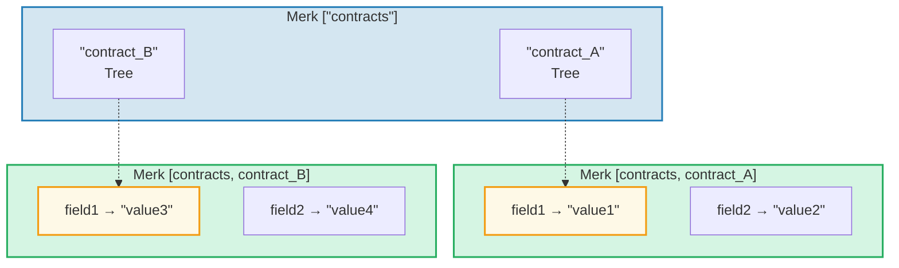
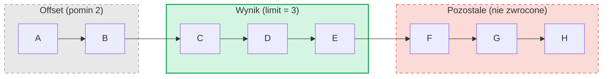

# System zapytan

## Struktura PathQuery

Zapytania GroveDB uzywaja typu `PathQuery`, ktory laczy sciezke (gdzie szukac)
z zapytaniem (co wybrac):

```rust
pub struct PathQuery {
    pub path: Vec<Vec<u8>>,         // Sciezka startowa w gaju
    pub query: SizedQuery,          // Co wybrac
}

pub struct SizedQuery {
    pub query: Query,               // Kryteria selekcji
    pub limit: Option<u16>,         // Maksymalna liczba wynikow
    pub offset: Option<u16>,        // Pomin pierwszych N wynikow
}
```

## Typ Query

```rust
pub struct Query {
    pub items: Vec<QueryItem>,              // Co dopasowac
    pub default_subquery_branch: SubqueryBranch,
    pub conditional_subquery_branches: Option<IndexMap<QueryItem, SubqueryBranch>>,
    pub left_to_right: bool,                // Kierunek iteracji
    pub add_parent_tree_on_subquery: bool,  // Dolacz element drzewa nadrzednego do wynikow (v2)
}
```

> **`add_parent_tree_on_subquery`** (v2): Gdy ustawione na `true`, element drzewa
> nadrzednego (np. CountTree lub SumTree) jest dolaczany do wynikow zapytania obok
> wartosci jego potomkow. Pozwala to pobrac zarowno wartosci zagregowane, jak i
> poszczegolne elementy w jednym zapytaniu.

## QueryItems -- Co wybrac

Kazdy `QueryItem` okresla klucz lub zakres do dopasowania:

```rust
pub enum QueryItem {
    Key(Vec<u8>),                           // Dokladne dopasowanie klucza
    Range(Range<Vec<u8>>),                  // Zakres wylaczny [start..end)
    RangeInclusive(RangeInclusive<Vec<u8>>),// Zakres wlaczny [start..=end]
    RangeFull(RangeFull),                   // Wszystkie klucze
    RangeFrom(RangeFrom<Vec<u8>>),          // [start..)
    RangeTo(RangeTo<Vec<u8>>),              // [..end)
    RangeToInclusive(RangeToInclusive<Vec<u8>>), // [..=end]
    RangeAfter(RangeFrom<Vec<u8>>),         // (start..) wylaczny poczatek
    RangeAfterTo(Range<Vec<u8>>),           // (start..end) oba wylaczne
    RangeAfterToInclusive(RangeInclusive<Vec<u8>>), // (start..=end]
}
```

Przyklady zapytan:

Drzewo Merk (posortowane): `alice  bob  carol  dave  eve  frank`

| Zapytanie | Selekcja | Wynik |
|-------|-----------|--------|
| `Key("bob")` | alice **[bob]** carol dave eve frank | bob |
| `RangeInclusive("bob"..="dave")` | alice **[bob carol dave]** eve frank | bob, carol, dave |
| `RangeAfter("carol"..)` | alice bob carol **[dave eve frank]** | dave, eve, frank |
| `RangeFull`, limit=2 | **[alice bob]** carol dave eve frank *(zatrzymane limitem)* | alice, bob |
| `RangeFull`, limit=2, od-prawej-do-lewej | alice bob carol dave **[eve frank]** *(zatrzymane limitem)* | frank, eve |

## Podzapytania i galęzie warunkowe

Prawdziwa sila zapytan GroveDB to **podzapytania** -- gdy zapytanie dopasowuje
element Tree, zapytanie moze automatycznie zejsc do tego poddrzewa:



> **PathQuery:** `path: ["contracts"], query: RangeFull` z `default_subquery: Key("field1")`
>
> **Wykonanie:**
> 1. `RangeFull` na ["contracts"] → dopasowuje contract_A, contract_B
> 2. Oba sa elementami Tree → zejdz z podzapytaniem `Key("field1")`
> 3. contract_A → "value1", contract_B → "value3"
>
> **Wynik:** `["value1", "value3"]`

**Warunkowe podzapytania** pozwalaja stosowac rozne podzapytania w zaleznosci
od dopasowanego klucza:

```rust
conditional_subquery_branches: Some(indexmap! {
    QueryItem::Key(b"contract_A".to_vec()) => SubqueryBranch {
        subquery: Some(Query { items: vec![Key(b"field1".to_vec())] }),
        ..
    },
    QueryItem::Key(b"contract_B".to_vec()) => SubqueryBranch {
        subquery: Some(Query { items: vec![Key(b"field2".to_vec())] }),
        ..
    },
})
```

To pobierze `field1` z `contract_A`, ale `field2` z `contract_B`.

## Zapytania z rozmiarem -- Limit i offset

Wrapper `SizedQuery` dodaje paginacje:



> `SizedQuery { query: RangeFull, limit: Some(3), offset: Some(2) }` → Wynik: **[C, D, E]**

W polaczeniu z `left_to_right: false`, iteracja jest odwrocona:

```text
    SizedQuery {
        query: Query { items: [RangeFull], left_to_right: false, .. },
        limit: Some(3),
        offset: None
    }

    Wynik: [H, G, F]
```

## Scalanie zapytan

Wiele PathQuery moze byc scalonych w jedno zapytanie dla wydajnosci. Algorytm
scalania znajduje wspolne prefiksy sciezek i laczy elementy zapytan:

```text
    Zapytanie A: path=["users"], query=Key("alice")
    Zapytanie B: path=["users"], query=Key("bob")

    Scalone:  path=["users"], query=items=[Key("alice"), Key("bob")]
```

---

