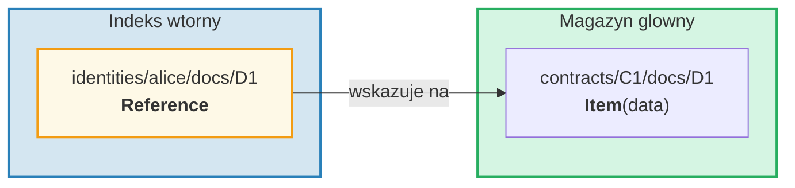
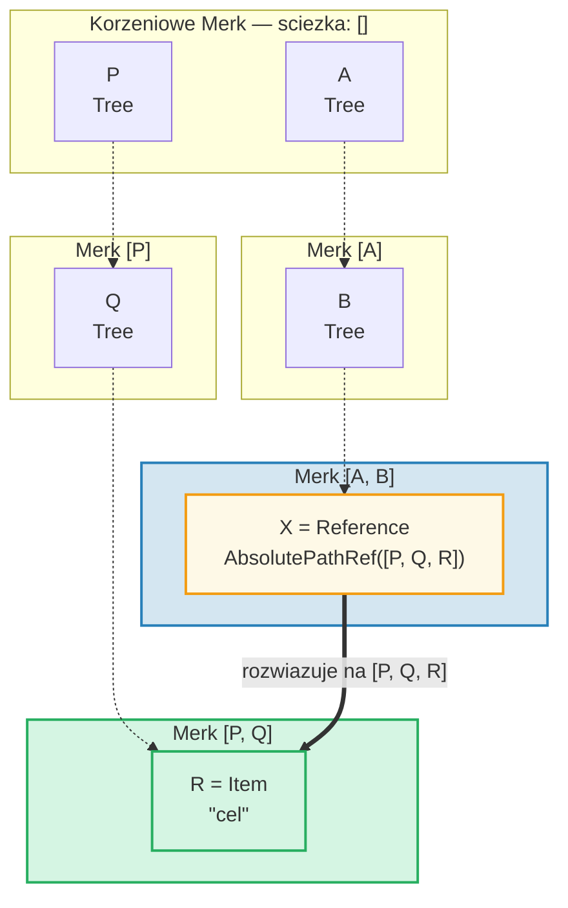
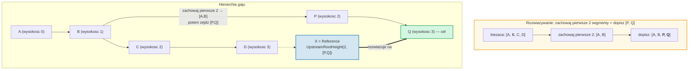
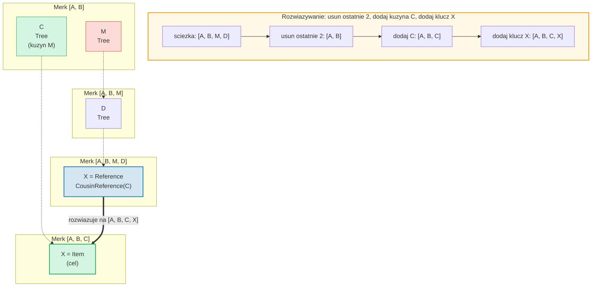
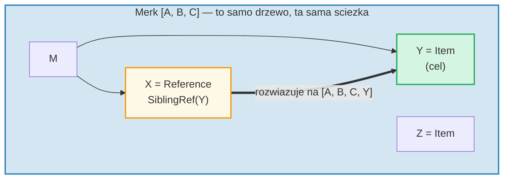
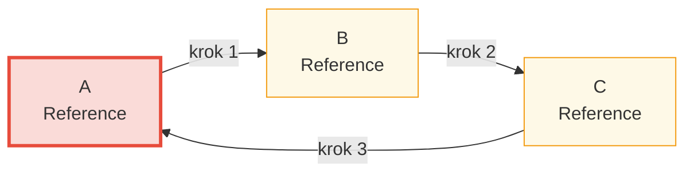

# System referencji

## Dlaczego referencje istnieja

W hierarchicznej bazie danych czesto potrzebny jest dostep do tych samych danych
z wielu sciezek. Na przyklad dokumenty moga byc przechowywane pod ich kontraktem,
ale rowniez odpytywalne po tozsamosci wlasciciela. **Referencje** to odpowiedz
GroveDB -- sa wskaznikami z jednej lokalizacji do drugiej, podobnymi do dowiazan
symbolicznych (symbolic links) w systemie plikow.



Kluczowe wlasciwosci:
- Referencje sa **uwierzytelniane** -- value_hash referencji zawiera zarowno sama
  referencje, jak i element referencyjny
- Referencje moga byc **lancuchowe** -- referencja moze wskazywac na inna referencje
- Wykrywanie cykli zapobiega nieskonczonym petlom
- Konfigurowalny limit skokow (hop limit) zapobiega wyczerpaniu zasobow

## Siedem typow referencji

```rust
// grovedb-element/src/reference_path/mod.rs
pub enum ReferencePathType {
    AbsolutePathReference(Vec<Vec<u8>>),
    UpstreamRootHeightReference(u8, Vec<Vec<u8>>),
    UpstreamRootHeightWithParentPathAdditionReference(u8, Vec<Vec<u8>>),
    UpstreamFromElementHeightReference(u8, Vec<Vec<u8>>),
    CousinReference(Vec<u8>),
    RemovedCousinReference(Vec<Vec<u8>>),
    SiblingReference(Vec<u8>),
}
```

Przyjrzyjmy sie kazdemu z diagramami.

### AbsolutePathReference

Najprostszy typ. Przechowuje pelna sciezke do celu:



> X przechowuje pelna bezwzgledna sciezke `[P, Q, R]`. Niezaleznie od lokalizacji X, zawsze rozwiazuje sie na ten sam cel.

### UpstreamRootHeightReference

Zachowuje pierwsze N segmentow biezacej sciezki, a nastepnie dopisuje nowa sciezke:



### UpstreamRootHeightWithParentPathAdditionReference

Jak UpstreamRootHeight, ale ponownie dopisuje ostatni segment biezacej sciezki:

```text
    Referencja na sciezce [A, B, C, D, E] klucz=X
    UpstreamRootHeightWithParentPathAdditionReference(2, [P, Q])

    Biezaca sciezka:    [A, B, C, D, E]
    Zachowaj pierwsze 2: [A, B]
    Dopisz [P, Q]:       [A, B, P, Q]
    Dopisz ostatni:      [A, B, P, Q, E]   ← "E" z oryginalnej sciezki dodane z powrotem

    Przydatne dla: indeksow, gdzie klucz nadrzedny powinien byc zachowany
```

### UpstreamFromElementHeightReference

Odrzuca ostatnie N segmentow, a nastepnie dopisuje:

```text
    Referencja na sciezce [A, B, C, D] klucz=X
    UpstreamFromElementHeightReference(1, [P, Q])

    Biezaca sciezka:     [A, B, C, D]
    Odrzuc ostatni 1:    [A, B, C]
    Dopisz [P, Q]:       [A, B, C, P, Q]
```

### CousinReference

Zastepuje tylko bezposredniego rodzica nowym kluczem:



> "Kuzyn" to poddrzewo bedace rodzenistwem dziadka referencji. Referencja nawiguje dwa poziomy w gore, a nastepnie schodzi do poddrzewa kuzyna.

### RemovedCousinReference

Jak CousinReference, ale zastepuje rodzica wielosegmentowa sciezka:

```text
    Referencja na sciezce [A, B, C, D] klucz=X
    RemovedCousinReference([M, N])

    Biezaca sciezka:  [A, B, C, D]
    Usun rodzica C:   [A, B]
    Dopisz [M, N]:    [A, B, M, N]
    Dodaj klucz X:    [A, B, M, N, X]
```

### SiblingReference

Najprostsza referencja wzgledna -- po prostu zmienia klucz w ramach tego samego rodzica:



> Najprostszy typ referencji. X i Y sa rodzenstwem w tym samym drzewie Merk -- rozwiazywanie po prostu zmienia klucz, zachowujac ta sama sciezke.

## Podazanie za referencjami i limit skokow

Gdy GroveDB napotyka element Reference, musi **podazyc** za nim, aby znalezc
rzeczywista wartosc. Poniewaz referencje moga wskazywac na inne referencje,
obejmuje to petle:

```rust
// grovedb/src/reference_path.rs
pub const MAX_REFERENCE_HOPS: usize = 10;

pub fn follow_reference(...) -> CostResult<ResolvedReference, Error> {
    let mut hops_left = MAX_REFERENCE_HOPS;
    let mut visited = HashSet::new();

    while hops_left > 0 {
        // Rozwiaz sciezke referencji na sciezke bezwzgledna
        let target_path = current_ref.absolute_qualified_path(...);

        // Sprawdz cykle
        if !visited.insert(target_path.clone()) {
            return Err(Error::CyclicReference);
        }

        // Pobierz element w celu
        let element = Element::get(target_path);

        match element {
            Element::Reference(next_ref, ..) => {
                // Nadal referencja -- kontynuuj podazanie
                current_ref = next_ref;
                hops_left -= 1;
            }
            other => {
                // Znaleziono rzeczywisty element!
                return Ok(ResolvedReference { element: other, ... });
            }
        }
    }

    Err(Error::ReferenceLimit)  // Przekroczono 10 skokow
}
```

## Wykrywanie cykli

`HashSet` `visited` sledzi wszystkie sciezki, ktore juz widzielismy. Jezeli
napotykamy sciezke, ktora juz odwiedzilismy, mamy cykl:



> **Slad wykrywania cykli:**
>
> | Krok | Podazaj | Zbior visited | Wynik |
> |------|--------|-------------|--------|
> | 1 | Zacznij od A | { A } | A jest Ref → podazaj |
> | 2 | A → B | { A, B } | B jest Ref → podazaj |
> | 3 | B → C | { A, B, C } | C jest Ref → podazaj |
> | 4 | C → A | A juz w visited! | **Error::CyclicRef** |
>
> Bez wykrywania cykli, to petliloby sie w nieskonczonosc. `MAX_REFERENCE_HOPS = 10` rowniez ogranicza glebokosc przechodzenia dla dlugich lancuchow.

## Referencje w Merk -- Polaczone hasze wartosci

Gdy referencja jest przechowywana w drzewie Merk, jej `value_hash` musi
uwierzytelnic zarowno strukture referencji, jak i dane referencyjne:

```rust
// merk/src/tree/kv.rs
pub fn update_hashes_using_reference_value_hash(
    mut self,
    reference_value_hash: CryptoHash,
) -> CostContext<Self> {
    // Haszuj wlasne bajty elementu referencji
    let actual_value_hash = value_hash(self.value_as_slice());

    // Polacz: H(bajty_referencji) + H(dane_referencyjne)
    let combined = combine_hash(&actual_value_hash, &reference_value_hash);

    self.value_hash = combined;
    self.hash = kv_digest_to_kv_hash(self.key(), self.value_hash());
    // ...
}
```

Oznacza to, ze zmiana zarowno samej referencji, JAK I danych, na ktore wskazuje,
zmieni hasz korzenia -- oba sa kryptograficznie powiazane.

---

