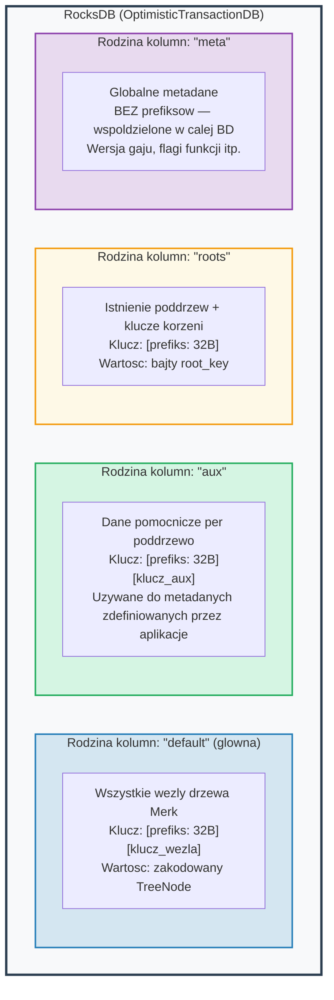
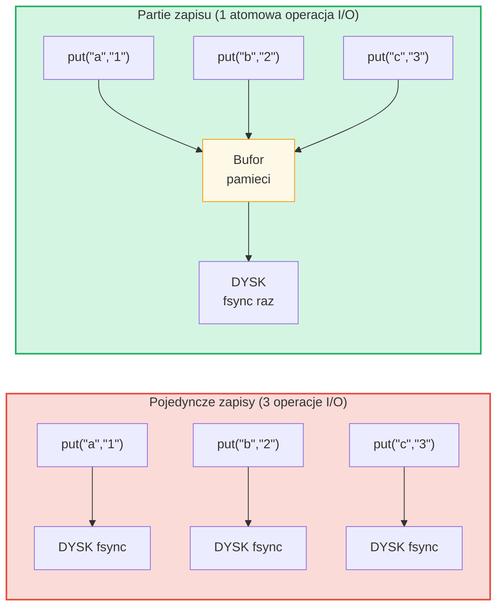

# Warstwa magazynowania

## RocksDB z OptimisticTransactionDB

GroveDB uzywa **RocksDB** jako zaplecza magazynowania, konkretnie wariantu
`OptimisticTransactionDB` obslugujacego transakcje:

```rust
// storage/src/rocksdb_storage/storage.rs
pub(crate) type Db = OptimisticTransactionDB;
pub(crate) type Tx<'db> = Transaction<'db, Db>;

pub struct RocksDbStorage {
    db: OptimisticTransactionDB,
}
```

**Transakcje optymistyczne** dzialaja zakladajac, ze nie bedzie konfliktow. Jezeli
dwie transakcje modyfikuja te same dane, druga z nich, ktora probuje zatwierdzic,
zakonczy sie niepowodzeniem i moze byc ponowiona. Jest to bardziej wydajne niz
pesymistyczne blokowanie dla obciazen, gdzie konflikty sa rzadkie.

Opcje RocksDB sa dostrojone do obciazenia GroveDB:

```rust
lazy_static! {
    static ref DEFAULT_OPTS: rocksdb::Options = {
        let mut opts = rocksdb::Options::default();
        opts.create_if_missing(true);
        opts.increase_parallelism(num_cpus::get() as i32);
        opts.set_allow_mmap_writes(true);
        opts.set_allow_mmap_reads(true);
        opts.create_missing_column_families(true);
        opts.set_atomic_flush(true);
        opts
    };
}
```

## Cztery rodziny kolumn

Rodziny kolumn (column families) RocksDB dzialaja jak oddzielne przestrzenie
nazw klucz-wartosc w ramach jednej bazy danych. GroveDB uzywa czterech:



> **Przyklad:** Klucz `[ab3fc2...][6e616d65]` w RK "default" mapuje na `TreeNode{key:"name", val:"Al"}`, gdzie `ab3fc2...` to `Blake3(sciezka)`, a `6e616d65` to "name" w bajtach.

```rust
pub(crate) const AUX_CF_NAME: &str = "aux";
pub(crate) const ROOTS_CF_NAME: &str = "roots";
pub(crate) const META_CF_NAME: &str = "meta";
// Glowne dane uzywaja domyslnej rodziny kolumn
```

## Konteksty magazynowania z prefiksem

Kazde poddrzewo otrzymuje swoj wlasny **kontekst magazynowania z prefiksem** --
wrapper, ktory automatycznie dopisuje 32-bajtowy prefiks Blake3 do wszystkich kluczy:

```text
    Sciezka poddrzewa: ["identities", "alice"]
    Prefiks: Blake3(sciezka) = [0xab, 0x3f, 0xc2, ...]  (32 bajty)

    Gdy poddrzewo przechowuje klucz "name" z wartoscia "Alice":

    Klucz RocksDB:   [0xab 0x3f 0xc2 ... (32 bajty) | 0x6e 0x61 0x6d 0x65]
                      \_________prefiks________/       \_____"name"_____/

    Wartosc RocksDB: [zakodowany TreeNode z wartoscia "Alice"]
```

Typy kontekstow:

```text
    Bez transakcji:
    PrefixedRocksDbImmediateStorageContext
    └── Odczyty/zapisy bezposrednio do BD z prefiksem

    Z transakcja:
    PrefixedRocksDbTransactionContext
    └── Odczyty/zapisy przez transakcje z prefiksem
```

Oba implementuja ceche `StorageContext`:

```rust
pub trait StorageContext<'db> {
    fn get(&self, key: &[u8]) -> CostResult<Option<Vec<u8>>, Error>;
    fn get_aux(&self, key: &[u8]) -> CostResult<Option<Vec<u8>>, Error>;
    fn get_root(&self, key: &[u8]) -> CostResult<Option<Vec<u8>>, Error>;
    fn get_meta(&self, key: &[u8]) -> CostResult<Option<Vec<u8>>, Error>;
    fn put(&self, key: &[u8], value: &[u8], ...) -> CostResult<(), Error>;
    fn put_aux(&self, key: &[u8], value: &[u8], ...) -> CostResult<(), Error>;
    fn put_root(&self, key: &[u8], value: &[u8], ...) -> CostResult<(), Error>;
    fn put_meta(&self, key: &[u8], value: &[u8], ...) -> CostResult<(), Error>;
    fn delete(&self, key: &[u8], ...) -> CostResult<(), Error>;
    // ...
}
```

## Partie zapisu i model transakcyjny

Dla wydajnosci GroveDB akumuluje zapisy w partiach:



> 3 synchronizacje dysku vs 1 synchronizacja dysku = ok. 3x szybciej. Partie zapisu sa rowniez **atomowe** (wszystko albo nic).

`StorageBatch` akumuluje operacje, ktore sa zrzucane razem:

```rust
pub struct StorageBatch {
    operations: RefCell<Vec<AbstractBatchOperation>>,
}
```

## Kluczowy wzorzec commit_local()

Podczas uzywania transakcji istnieje krytyczny wzorzec, ktory musi byc
przestrzegany. Zapisy w ramach transakcji sa buforowane -- nie sa widoczne
do momentu zatwierdzenia:

```rust
// POPRAWNY wzorzec:
{
    let tx = db.start_transaction();
    let storage_ctx = db.get_transactional_storage_context(path, &tx);

    storage_ctx.put(key, value);  // Zapisuje do bufora transakcji

    drop(storage_ctx);            // Zwolnij pozyczenie na tx
    tx.commit_local();            // Zrzuc transakcje do BD
}

// NIEPOPRAWNY — dane zostana utracone:
{
    let tx = db.start_transaction();
    let storage_ctx = db.get_transactional_storage_context(path, &tx);

    storage_ctx.put(key, value);  // Zapisuje do bufora transakcji

    // tx jest niszczony tutaj bez commit_local()!
    // Wszystkie zapisy sa WYCOFYWANE!
}
```

Jest to szczegolnie wazne, poniewaz `storage_ctx` pozycza transakcje.
Musisz wykonac `drop(storage_ctx)` zanim bedziesz mogl wywolac `tx.commit_local()`.

---
