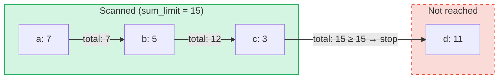

# Consultas de Soma Agregada

## Visão Geral

As Consultas de Soma Agregada são um tipo de consulta especializado projetado para **SumTrees** no GroveDB.
Enquanto consultas regulares recuperam elementos por chave ou intervalo, as consultas de soma agregada
iteram pelos elementos e acumulam seus valores de soma até que um **limite de soma** seja atingido.

Isso é útil para perguntas como:
- "Me dê as transações até que o total acumulado ultrapasse 1000"
- "Quais itens contribuem para as primeiras 500 unidades de valor nesta árvore?"
- "Colete itens de soma até um orçamento de N"

## Conceitos Fundamentais

### Como Difere das Consultas Regulares

| Característica | PathQuery | AggregateSumPathQuery |
|---------|-----------|----------------------|
| **Alvo** | Qualquer tipo de elemento | Elementos SumItem / ItemWithSumItem |
| **Condição de parada** | Limite (contagem) ou fim do intervalo | Limite de soma (total acumulado) **e/ou** limite de itens |
| **Retorna** | Elementos ou chaves | Pares chave-valor de soma |
| **Subconsultas** | Sim (desce em subárvores) | Não (nível único da árvore) |
| **Referências** | Resolvidas pela camada GroveDB | Opcionalmente seguidas ou ignoradas |

### A Estrutura AggregateSumQuery

```rust
pub struct AggregateSumQuery {
    pub items: Vec<QueryItem>,              // Keys or ranges to scan
    pub left_to_right: bool,                // Iteration direction
    pub sum_limit: u64,                     // Stop when running total reaches this
    pub limit_of_items_to_check: Option<u16>, // Max number of matching items to return
}
```

A consulta é envolvida em um `AggregateSumPathQuery` para especificar onde no grove procurar:

```rust
pub struct AggregateSumPathQuery {
    pub path: Vec<Vec<u8>>,                 // Path to the SumTree
    pub aggregate_sum_query: AggregateSumQuery,
}
```

### Limite de Soma — O Total Acumulado

O `sum_limit` é o conceito central. Conforme os elementos são escaneados, seus valores de soma são
acumulados. Quando o total acumulado atinge ou excede o limite de soma, a iteração para:



> **Resultado:** `[(a, 7), (b, 5), (c, 3)]` — a iteração para porque 7 + 5 + 3 = 15 >= sum_limit

Valores de soma negativos são suportados. Um valor negativo aumenta o orçamento restante:

```text
sum_limit = 12, elements: a(10), b(-3), c(5)

a: total = 10, remaining = 2
b: total =  7, remaining = 5  ← negative value gave us more room
c: total = 12, remaining = 0  ← stop

Result: [(a, 10), (b, -3), (c, 5)]
```

## Opções de Consulta

A struct `AggregateSumQueryOptions` controla o comportamento da consulta:

```rust
pub struct AggregateSumQueryOptions {
    pub allow_cache: bool,                              // Use cached reads (default: true)
    pub error_if_intermediate_path_tree_not_present: bool, // Error on missing path (default: true)
    pub error_if_non_sum_item_found: bool,              // Error on non-sum elements (default: true)
    pub ignore_references: bool,                        // Skip references (default: false)
}
```

### Tratamento de Elementos Não-Soma

SumTrees podem conter uma mistura de tipos de elementos: `SumItem`, `Item`, `Reference`, `ItemWithSumItem`,
e outros. Por padrão, encontrar um elemento que não seja de soma nem referência produz um erro.

Quando `error_if_non_sum_item_found` é definido como `false`, elementos não-soma são **silenciosamente ignorados**
sem consumir um slot do limite do usuário:

```text
Tree contents: a(SumItem=7), b(Item), c(SumItem=3)
Query: sum_limit=100, limit_of_items_to_check=2, error_if_non_sum_item_found=false

Scan: a(7) → returned, limit=1
      b(Item) → skipped, limit still 1
      c(3) → returned, limit=0 → stop

Result: [(a, 7), (c, 3)]
```

Nota: Elementos `ItemWithSumItem` são **sempre** processados (nunca ignorados), pois carregam
um valor de soma.

### Tratamento de Referências

Por padrão, elementos `Reference` são **seguidos** — a consulta resolve a cadeia de referências
(até 3 saltos intermediários) para encontrar o valor de soma do elemento alvo:

```text
Tree contents: a(SumItem=7), ref_b(Reference → a)
Query: sum_limit=100

ref_b is followed → resolves to a(SumItem=7)

Result: [(a, 7), (ref_b, 7)]
```

Quando `ignore_references` é `true`, referências são silenciosamente ignoradas sem consumir um slot
de limite, similar a como elementos não-soma são ignorados.

Cadeias de referências com mais de 3 saltos intermediários produzem um erro `ReferenceLimit`.

## O Tipo de Resultado

Consultas retornam um `AggregateSumQueryResult`:

```rust
pub struct AggregateSumQueryResult {
    pub results: Vec<(Vec<u8>, i64)>,       // Key-sum value pairs
    pub hard_limit_reached: bool,           // True if system limit truncated results
}
```

O flag `hard_limit_reached` indica se o limite rígido de escaneamento do sistema (padrão: 1024
elementos) foi atingido antes da consulta terminar naturalmente. Quando `true`, mais resultados podem
existir além do que foi retornado.

## Dois Sistemas de Limite

Consultas de soma agregada possuem **três** condições de parada:

| Limite | Origem | O que conta | Efeito quando atingido |
|-------|--------|---------------|-------------------|
| **sum_limit** | Usuário (consulta) | Total acumulado dos valores de soma | Para a iteração |
| **limit_of_items_to_check** | Usuário (consulta) | Itens correspondentes retornados | Para a iteração |
| **Limite rígido de escaneamento** | Sistema (GroveVersion, padrão 1024) | Todos os elementos escaneados (incluindo ignorados) | Para a iteração, define `hard_limit_reached` |

O limite rígido de escaneamento previne iteração ilimitada quando nenhum limite de usuário é definido.
Elementos ignorados (itens não-soma com `error_if_non_sum_item_found=false`, ou referências com
`ignore_references=true`) contam contra o limite rígido de escaneamento, mas **não** contra o
`limit_of_items_to_check` do usuário.

## Uso da API

### Consulta Simples

```rust
use grovedb::AggregateSumPathQuery;
use grovedb_merk::proofs::query::AggregateSumQuery;

// "Give me items from this SumTree until the total reaches 1000"
let query = AggregateSumQuery::new(1000, None);
let path_query = AggregateSumPathQuery {
    path: vec![b"my_tree".to_vec()],
    aggregate_sum_query: query,
};

let result = db.query_aggregate_sums(
    &path_query,
    true,   // allow_cache
    true,   // error_if_intermediate_path_tree_not_present
    None,   // transaction
    grove_version,
).unwrap().expect("query failed");

for (key, sum_value) in &result.results {
    println!("{}: {}", String::from_utf8_lossy(key), sum_value);
}
```

### Consulta com Opções

```rust
use grovedb::{AggregateSumPathQuery, AggregateSumQueryOptions};
use grovedb_merk::proofs::query::AggregateSumQuery;

// Skip non-sum items and ignore references
let query = AggregateSumQuery::new(1000, Some(50));
let path_query = AggregateSumPathQuery {
    path: vec![b"mixed_tree".to_vec()],
    aggregate_sum_query: query,
};

let result = db.query_aggregate_sums_with_options(
    &path_query,
    AggregateSumQueryOptions {
        error_if_non_sum_item_found: false,  // skip Items, Trees, etc.
        ignore_references: true,              // skip References
        ..AggregateSumQueryOptions::default()
    },
    None,
    grove_version,
).unwrap().expect("query failed");

if result.hard_limit_reached {
    println!("Warning: results may be incomplete (hard limit reached)");
}
```

### Consultas Baseadas em Chave

Em vez de escanear um intervalo, você pode consultar chaves específicas:

```rust
// Check the sum value of specific keys
let query = AggregateSumQuery::new_with_keys(
    vec![b"alice".to_vec(), b"bob".to_vec(), b"carol".to_vec()],
    u64::MAX,  // no sum limit
    None,      // no item limit
);
```

### Consultas Descendentes

Itere da chave mais alta para a mais baixa:

```rust
let query = AggregateSumQuery::new_descending(500, Some(10));
// Or: query.left_to_right = false;
```

## Referência de Construtores

| Construtor | Descrição |
|-------------|-------------|
| `new(sum_limit, limit)` | Intervalo completo, ascendente |
| `new_descending(sum_limit, limit)` | Intervalo completo, descendente |
| `new_single_key(key, sum_limit)` | Busca por chave única |
| `new_with_keys(keys, sum_limit, limit)` | Múltiplas chaves específicas |
| `new_with_keys_reversed(keys, sum_limit, limit)` | Múltiplas chaves, descendente |
| `new_single_query_item(item, sum_limit, limit)` | Um único QueryItem (chave ou intervalo) |
| `new_with_query_items(items, sum_limit, limit)` | Múltiplos QueryItems |

---
