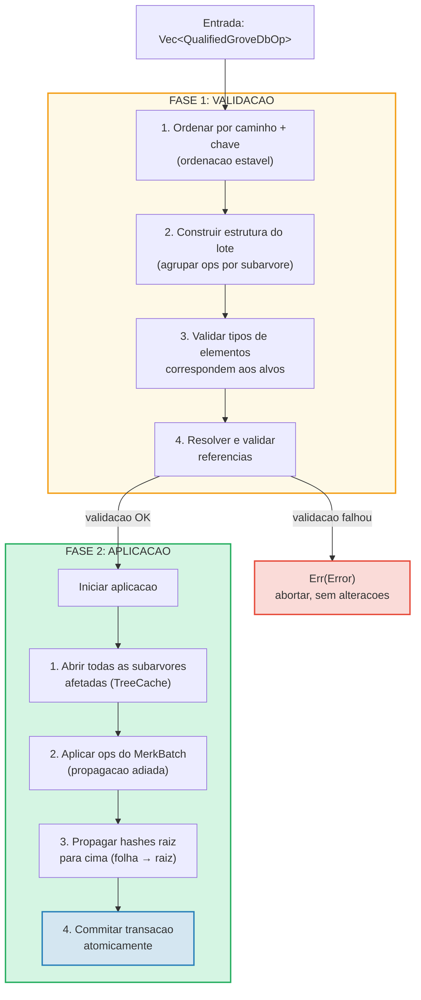
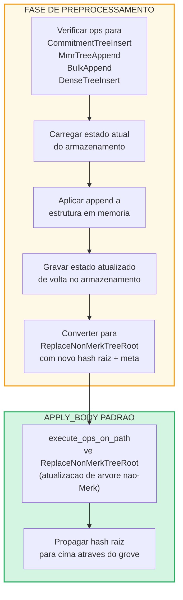

# Operacoes em Lote no Nivel do Grove

## Variantes de GroveOp

No nivel do GroveDB, as operacoes sao representadas como `GroveOp`:

```rust
pub enum GroveOp {
    // Operacoes voltadas ao usuario:
    InsertOnly { element: Element },
    InsertOrReplace { element: Element },
    Replace { element: Element },
    Patch { element: Element, change_in_bytes: i32 },
    RefreshReference { reference_path_type, max_reference_hop, flags, trust_refresh_reference },
    Delete,
    DeleteTree(TreeType),                          // Parametrizado pelo tipo de arvore

    // Operacoes de append para arvores nao-Merk (voltadas ao usuario):
    CommitmentTreeInsert { cmx: [u8; 32], payload: Vec<u8> },
    MmrTreeAppend { value: Vec<u8> },
    BulkAppend { value: Vec<u8> },
    DenseTreeInsert { value: Vec<u8> },

    // Operacoes internas (criadas por preprocessamento/propagacao, rejeitadas por from_ops):
    ReplaceTreeRootKey { hash, root_key, aggregate_data },
    InsertTreeWithRootHash { hash, root_key, flags, aggregate_data },
    ReplaceNonMerkTreeRoot { hash: [u8; 32], meta: NonMerkTreeMeta },
    InsertNonMerkTree { hash, root_key, flags, aggregate_data, meta: NonMerkTreeMeta },
}
```

**NonMerkTreeMeta** transporta o estado especifico do tipo de arvore atraves do processamento em lote:

```rust
pub enum NonMerkTreeMeta {
    CommitmentTree { total_count: u64, chunk_power: u8 },
    MmrTree { mmr_size: u64 },
    BulkAppendTree { total_count: u64, chunk_power: u8 },
    DenseTree { count: u16, height: u8 },
}
```

Cada operacao e envolvida em um `QualifiedGroveDbOp` que inclui o caminho:

```rust
pub struct QualifiedGroveDbOp {
    pub path: KeyInfoPath,           // Onde no grove
    pub key: Option<KeyInfo>,        // Qual chave (None para ops de arvore append-only)
    pub op: GroveOp,                 // O que fazer
}
```

> **Nota:** O campo `key` e `Option<KeyInfo>` — e `None` para operacoes de arvores
> append-only (`CommitmentTreeInsert`, `MmrTreeAppend`, `BulkAppend`, `DenseTreeInsert`)
> onde a chave da arvore e o ultimo segmento do `path`.

## Processamento em Duas Fases

As operacoes em lote sao processadas em duas fases:



## TreeCache e Propagacao Adiada

Durante a aplicacao do lote, o GroveDB usa um **TreeCache** para adiar a propagacao
do hash raiz ate que todas as operacoes em uma subarvore estejam completas:

```mermaid
graph TD
    subgraph without["SEM TreeCache (ingênuo)"]
        w1["Op 1: Inserir A em X"]
        w1p["Propagar X → pai → raiz"]
        w2["Op 2: Inserir B em X"]
        w2p["Propagar X → pai → raiz"]
        w3["Op 3: Inserir C em X"]
        w3p["Propagar X → pai → raiz"]
        w1 --> w1p --> w2 --> w2p --> w3 --> w3p
    end

    subgraph with_tc["COM TreeCache (adiado)"]
        t1["Op 1: Inserir A em X<br/>→ armazenado em buffer"]
        t2["Op 2: Inserir B em X<br/>→ armazenado em buffer"]
        t3["Op 3: Inserir C em X<br/>→ armazenado em buffer"]
        tp["Propagar X → pai → raiz<br/>(subir UMA vez)"]
        t1 --> t2 --> t3 --> tp
    end

    style without fill:#fadbd8,stroke:#e74c3c,stroke-width:2px
    style with_tc fill:#d5f5e3,stroke:#27ae60,stroke-width:2px
    style w1p fill:#fadbd8,stroke:#e74c3c
    style w2p fill:#fadbd8,stroke:#e74c3c
    style w3p fill:#fadbd8,stroke:#e74c3c
    style tp fill:#d5f5e3,stroke:#27ae60,stroke-width:2px
```



> **3 propagacoes x O(profundidade)** vs **1 propagacao x O(profundidade)** = 3x mais rapido para esta subarvore.

Essa e uma otimizacao significativa quando muitas operacoes visam a mesma subarvore.

## Operacoes Atomicas Entre Subarvores

Uma propriedade-chave dos lotes do GroveDB e a **atomicidade entre subarvores**. Um unico
lote pode modificar elementos em multiplas subarvores, e ou todas as alteracoes sao
commitadas ou nenhuma:

```text
    Lote:
    1. Deletar ["balances", "alice"]       (remover saldo)
    2. Inserir ["balances", "bob"] = 100   (adicionar saldo)
    3. Atualizar ["identities", "bob", "rev"] = 2  (atualizar revisao)

    Tres subarvores afetadas: balances, identities, identities/bob

    Se QUALQUER operacao falhar → TODAS as operacoes sao revertidas
    Se TODAS tiverem sucesso → TODAS sao commitadas atomicamente
```

O processador de lotes lida com isso:
1. Coletando todos os caminhos afetados
2. Abrindo todas as subarvores necessarias
3. Aplicando todas as operacoes
4. Propagando todos os hashes raiz na ordem de dependencia
5. Commitando a transacao inteira

## Preprocessamento de Lote para Arvores Nao-Merk

Operacoes de CommitmentTree, MmrTree, BulkAppendTree e DenseAppendOnlyFixedSizeTree
requerem acesso a contextos de armazenamento fora da Merk, o que nao esta disponivel
dentro do metodo padrao `execute_ops_on_path` (ele so tem acesso a Merk). Essas
operacoes usam um **padrao de preprocessamento**: antes da fase principal `apply_body`,
os pontos de entrada verificam ops de arvores nao-Merk e as convertem em ops internas
padrao.

```rust
pub enum GroveOp {
    // ... ops padrao ...

    // Operacoes de arvores nao-Merk (voltadas ao usuario):
    CommitmentTreeInsert { cmx: [u8; 32], payload: Vec<u8> },
    MmrTreeAppend { value: Vec<u8> },
    BulkAppend { value: Vec<u8> },
    DenseTreeInsert { value: Vec<u8> },

    // Ops internas (produzidas pelo preprocessamento):
    ReplaceNonMerkTreeRoot { hash: [u8; 32], meta: NonMerkTreeMeta },
}
```



**Por que preprocessamento?** A funcao `execute_ops_on_path` opera em uma unica
subarvore Merk e nao tem acesso a `self.db` ou contextos de armazenamento mais amplos.
O preprocessamento nos pontos de entrada (`apply_batch_with_element_flags_update`,
`apply_partial_batch_with_element_flags_update`) tem acesso completo ao banco de dados,
entao pode carregar/salvar dados e entao passar um simples `ReplaceNonMerkTreeRoot`
para a maquinaria padrao de lote.

Cada metodo de preprocessamento segue o mesmo padrao:
1. **`preprocess_commitment_tree_ops`** — Carrega fronteira e BulkAppendTree do
   armazenamento de dados, adiciona em ambos, salva de volta, converte para `ReplaceNonMerkTreeRoot`
   com raiz combinada atualizada e meta `CommitmentTree { total_count, chunk_power }`
2. **`preprocess_mmr_tree_ops`** — Carrega MMR do armazenamento de dados, adiciona valores,
   salva de volta, converte para `ReplaceNonMerkTreeRoot` com raiz MMR atualizada
   e meta `MmrTree { mmr_size }`
3. **`preprocess_bulk_append_ops`** — Carrega BulkAppendTree do armazenamento de dados,
   adiciona valores (pode acionar compactacao de chunk), salva de volta, converte para
   `ReplaceNonMerkTreeRoot` com raiz de estado atualizada e meta `BulkAppendTree { total_count, chunk_power }`
4. **`preprocess_dense_tree_ops`** — Carrega DenseFixedSizedMerkleTree do armazenamento
   de dados, insere valores sequencialmente, recalcula hash raiz, salva de volta,
   converte para `ReplaceNonMerkTreeRoot` com hash raiz atualizado e meta `DenseTree { count, height }`

A op `ReplaceNonMerkTreeRoot` carrega o novo hash raiz e um enum `NonMerkTreeMeta`
para que o elemento possa ser totalmente reconstruido apos o processamento.

---
