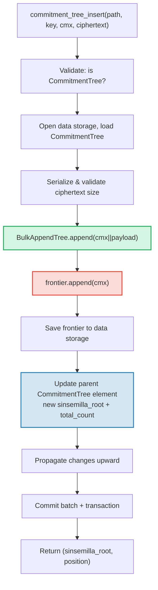

# A CommitmentTree — Ancoras de Compromisso Sinsemilla

A **CommitmentTree** e a ponte do GroveDB entre armazenamento autenticado e sistemas de
prova de conhecimento zero (zero-knowledge). Ela combina uma **BulkAppendTree** (Capitulo 14)
para armazenamento eficiente de dados compactados em chunks com uma **fronteira Sinsemilla**
no namespace de dados para ancoras compativeis com ZK. Assim como MmrTree e BulkAppendTree,
ela **nao tem Merk filha** — o hash raiz combinado flui como o hash filho da Merk. Tanto
as entradas da BulkAppendTree quanto a fronteira Sinsemilla residem no **namespace de dados**.

Este capitulo cobre a funcao de hash Sinsemilla e por que ela importa para circuitos de
conhecimento zero, a estrutura de dados da fronteira e sua serializacao compacta, a
arquitetura de armazenamento de namespace duplo, as operacoes do GroveDB, preprocessamento
em lote, geracao de testemunhos do lado do cliente e como as provas funcionam.

## Por que uma Arvore Amigavel a ZK?

As arvores padrao do GroveDB usam hashing Blake3. Blake3 e rapido em software, mas
**caro dentro de circuitos de conhecimento zero**. Quando um gastador precisa provar
"eu conheco uma nota na posicao P na arvore de compromissos" sem revelar P, ele deve
avaliar a funcao de hash de Merkle 32 vezes (uma por nivel da arvore) dentro de um
circuito ZK.

Sinsemilla (especificado no ZIP-244 para o protocolo Zcash Orchard) e projetado
exatamente para este caso de uso — ele fornece **hashing eficiente dentro do circuito**
sobre a curva eliptica Pallas, uma metade do ciclo de curvas Pasta usado pelo sistema
de prova Halo 2.

| Propriedade | Blake3 | Sinsemilla |
|----------|--------|------------|
| **Custo no circuito** | ~25.000 restricoes por hash | ~800 restricoes por hash |
| **Velocidade em software** | Muito rapido (~2 GB/s) | Lento (~10.000 hashes/s) |
| **Estrutura algebrica** | Nenhuma (bitwise) | Operacoes de ponto na curva Pallas |
| **Proposito primario** | Hashing geral, arvores de Merkle | Provas de Merkle dentro do circuito |
| **Usado por** | Arvores Merk do GroveDB, MMR, Bulk | Protocolo blindado Orchard |
| **Tamanho da saida** | 32 bytes | 32 bytes (elemento de campo Pallas) |

A CommitmentTree usa Sinsemilla para a arvore de Merkle sobre a qual os circuitos ZK
raciocinam, enquanto ainda usa Blake3 para a hierarquia Merk do GroveDB acima dela.
Itens inseridos na arvore sao armazenados via BulkAppendTree no namespace de dados
(compactados em chunks, recuperaveis por posicao) e simultaneamente adicionados a
fronteira Sinsemilla (produzindo uma ancora provavel por ZK).

## A Arquitetura de Namespace de Dados

A CommitmentTree armazena **todos os dados no namespace de dados** no mesmo caminho de
subarvore. Assim como MmrTree e BulkAppendTree, ela **nao tem Merk filha** (sem campo
`root_key` — a raiz especifica do tipo flui como o hash filho da Merk). As entradas da
BulkAppendTree e a fronteira Sinsemilla coexistem no namespace de dados usando prefixos
de chave distintos:

```text
┌──────────────────────────────────────────────────────────────┐
│                       CommitmentTree                          │
│                                                               │
│  ┌─────────────────────────────────────────────────────────┐  │
│  │  Data Namespace                                         │  │
│  │                                                         │  │
│  │  BulkAppendTree storage (Chapter 14):                   │  │
│  │    Buffer entries → chunk blobs → chunk MMR             │  │
│  │    value = cmx (32 bytes) || ciphertext (216 bytes)     │  │
│  │                                                         │  │
│  │  Sinsemilla Frontier (~1KB):                            │  │
│  │    key: b"__ct_data__" (COMMITMENT_TREE_DATA_KEY)       │  │
│  │    Depth-32 incremental Merkle tree                     │  │
│  │    Stores only the rightmost path (leaf + ommers)       │  │
│  │    O(1) append, O(1) root computation                   │  │
│  │    Produces Orchard-compatible Anchor for ZK proofs     │  │
│  └─────────────────────────────────────────────────────────┘  │
│                                                               │
│  sinsemilla_root embedded in Element bytes                    │
│    → flows through Merk value_hash → GroveDB state root      │
└──────────────────────────────────────────────────────────────┘
```

**Por que duas estruturas?** A BulkAppendTree fornece armazenamento e recuperacao
eficientes, compactados em chunks, para potencialmente milhoes de notas encriptadas. A
fronteira Sinsemilla fornece ancoras compativeis com ZK que podem ser provadas dentro de
um circuito Halo 2. Ambas sao atualizadas em sincronia a cada append.

Compare com os outros tipos de arvore nao padrao:

| | CommitmentTree | MmrTree | BulkAppendTree |
|---|---|---|---|
| **Merk filha** | Nao | Nao | Nao |
| **Namespace de dados** | Entradas BulkAppendTree + fronteira | Nos MMR | Buffer + chunks + MMR |
| **Namespace aux** | — | — | — |
| **Itens consultaveis** | Via provas V1 | Via provas V1 | Via provas V1 |
| **Funcao de hash** | Sinsemilla + Blake3 | Blake3 | Blake3 |

## A Fronteira Sinsemilla

A fronteira e uma arvore de Merkle incremental de profundidade 32 implementada pelo tipo
`Frontier<MerkleHashOrchard, 32>` do crate `incrementalmerkletree`. Em vez de armazenar
todas as 2^32 folhas possiveis, ela armazena apenas a informacao necessaria para
**adicionar a proxima folha e computar a raiz atual**: a folha mais a direita e seus
ommers (hashes irmaos necessarios para o calculo da raiz).

```text
                         root (level 32)
                        /               \
                      ...               ...
                     /                     \
                  (level 2)             (level 2)
                  /     \               /     \
              (level 1) (level 1)   (level 1)  ?
              /    \    /    \      /    \
             L0    L1  L2    L3   L4    ?     ← frontier stores L4
                                              + ommers at levels
                                              where left sibling exists
```

A fronteira armazena:
- **leaf** (folha): o valor mais recentemente adicionado (um elemento de campo Pallas)
- **ommers**: os hashes dos irmaos esquerdos em cada nivel onde o caminho da fronteira
  vai para a direita (no maximo 32 ommers para uma arvore de profundidade 32)
- **position** (posicao): a posicao indexada em 0 da folha

Propriedades-chave:
- **O(1) append**: insere uma nova folha, atualiza ommers, recomputa a raiz
- **O(1) root**: percorre os ommers armazenados da folha ate a raiz
- **~1KB de tamanho constante**: independente de quantas folhas foram adicionadas
- **Deterministico**: duas fronteiras com a mesma sequencia de appends produzem a mesma raiz

A constante `EMPTY_SINSEMILLA_ROOT` e a raiz de uma arvore vazia de profundidade 32,
pre-computada como `MerkleHashOrchard::empty_root(Level::from(32)).to_bytes()`:

```text
0xae2935f1dfd8a24aed7c70df7de3a668eb7a49b1319880dde2bbd9031ae5d82f
```

## Como o Append Funciona — A Cascata de Ommers

Quando um novo compromisso e adicionado na posicao N, o numero de ommers que devem ser
atualizados e igual a `trailing_ones(N)` — o numero de bits 1 finais na representacao
binaria de N. Este e o mesmo padrao da cascata de merge do MMR (secao 13.4), mas
operando sobre ommers em vez de picos.

**Exemplo detalhado — adicionando 4 folhas:**

```text
Position 0 (binary: 0, trailing_ones: 0):
  frontier = { leaf: L0, ommers: [], position: 0 }
  Sinsemilla hashes: 32 (root computation) + 0 (no ommer merges) = 32

Position 1 (binary: 1, trailing_ones: 0 of PREVIOUS position 0):
  Before: position 0 has trailing_ones = 0
  frontier = { leaf: L1, ommers: [H(L0,L1) at level 1], position: 1 }
  Sinsemilla hashes: 32 + 0 = 32

Position 2 (binary: 10, trailing_ones: 0 of PREVIOUS position 1):
  Before: position 1 has trailing_ones = 1
  frontier = { leaf: L2, ommers: [level1_hash], position: 2 }
  Sinsemilla hashes: 32 + 1 = 33

Position 3 (binary: 11, trailing_ones: 0 of PREVIOUS position 2):
  Before: position 2 has trailing_ones = 0
  frontier = { leaf: L3, ommers: [level1_hash, level2_hash], position: 3 }
  Sinsemilla hashes: 32 + 0 = 32
```

O **total de hashes Sinsemilla** por append e:

```text
32 (root computation always traverses all 32 levels)
+ trailing_ones(current_position)  (ommer cascade)
```

Em media, `trailing_ones` e ~1 (distribuicao geometrica), entao o custo medio e de
**~33 hashes Sinsemilla por append**. O pior caso (na posicao 2^32 - 1, onde todos os
bits sao 1) e de **64 hashes**.

## O Formato de Serializacao da Fronteira

A fronteira e armazenada no armazenamento de dados na chave `b"__ct_data__"`. O formato
de transmissao e:

```text
┌──────────────────────────────────────────────────────────────────┐
│ has_frontier: u8                                                  │
│   0x00 → empty tree (no more fields)                             │
│   0x01 → non-empty (fields follow)                               │
├──────────────────────────────────────────────────────────────────┤
│ position: u64 BE (8 bytes)      — 0-indexed leaf position        │
├──────────────────────────────────────────────────────────────────┤
│ leaf: [u8; 32]                  — Pallas field element bytes     │
├──────────────────────────────────────────────────────────────────┤
│ ommer_count: u8                 — number of ommers (0..=32)      │
├──────────────────────────────────────────────────────────────────┤
│ ommers: [ommer_count × 32 bytes] — Pallas field elements        │
└──────────────────────────────────────────────────────────────────┘
```

**Analise de tamanho:**

| Estado | Tamanho | Detalhamento |
|-------|------|-----------|
| Vazio | 1 byte | Apenas flag `0x00` |
| 1 folha, 0 ommers | 42 bytes | 1 + 8 + 32 + 1 |
| ~16 ommers (media) | 554 bytes | 1 + 8 + 32 + 1 + 16x32 |
| 32 ommers (maximo) | 1.066 bytes | 1 + 8 + 32 + 1 + 32x32 |

O tamanho da fronteira e limitado a ~1,1KB independente de quantos milhoes de
compromissos foram adicionados. Isso torna o ciclo carregar-modificar-salvar muito
barato (1 busca para ler, 1 busca para escrever).

## Representacao do Elemento

```rust
CommitmentTree(
    u64,                  // total_count: number of appended items
    u8,                   // chunk_power: dense tree height for BulkAppendTree buffer
    Option<ElementFlags>, // flags: optional metadata
)
```

O parametro `chunk_power` controla a altura da arvore densa do buffer da BulkAppendTree;
`chunk_power` deve estar no intervalo 1..=16 (veja secoes 14.1 e 16).

**Identificadores de tipo:**

| Identificador | Valor |
|---|---|
| Discriminante do elemento | 11 |
| `TreeType` | `CommitmentTree = 7` |
| `ElementType` | 11 |
| `COMMITMENT_TREE_COST_SIZE` | 12 bytes (8 total_count + 1 chunk_power + 1 discriminante + 2 overhead) |

A raiz Sinsemilla NAO e armazenada no Element. Ela flui como o hash filho da Merk
atraves do mecanismo `insert_subtree`. Quando a Merk pai computa seu
`combined_value_hash`, a raiz derivada de Sinsemilla e incluida como o hash filho:

```text
combined_value_hash = blake3(value_hash || child_hash)
                                           ↑ sinsemilla/BulkAppendTree combined root
```

Isso significa que qualquer alteracao na fronteira Sinsemilla se propaga automaticamente
atraves da hierarquia Merk do GroveDB ate a raiz de estado.

**Metodos construtores:**

| Metodo | Cria |
|---|---|
| `Element::empty_commitment_tree(chunk_power)` | Arvore vazia, count=0, sem flags |
| `Element::empty_commitment_tree_with_flags(chunk_power, flags)` | Arvore vazia com flags |
| `Element::new_commitment_tree(total_count, chunk_power, flags)` | Todos os campos explicitos |

## Arquitetura de Armazenamento

A CommitmentTree armazena todos os seus dados em um unico **namespace de dados** no
caminho da subarvore. Entradas da BulkAppendTree e a fronteira Sinsemilla coexistem na
mesma coluna usando prefixos de chave distintos. Nenhum namespace aux e usado.

```text
┌──────────────────────────────────────────────────────────────────┐
│  Data Namespace (all CommitmentTree storage)                      │
│                                                                   │
│  BulkAppendTree storage keys (see §14.7):                         │
│    b"m" || pos (u64 BE)  → MMR node blobs                        │
│    b"b" || index (u64 BE)→ buffer entries (cmx || ciphertext)     │
│    b"e" || chunk (u64 BE)→ chunk blobs (compacted buffer)         │
│    b"M"                  → BulkAppendTree metadata                │
│                                                                   │
│  Sinsemilla frontier:                                             │
│    b"__ct_data__"        → serialized CommitmentFrontier (~1KB)   │
│                                                                   │
│  No Merk nodes — this is a non-Merk tree.                         │
│  Data authenticated via BulkAppendTree state_root (Blake3).       │
│  Sinsemilla root authenticates all cmx values via Pallas curve.   │
└──────────────────────────────────────────────────────────────────┘
```

**O padrao carregar-modificar-salvar**: Toda operacao mutavel carrega a fronteira do
armazenamento de dados, modifica-a na memoria e a escreve de volta. Como a fronteira
tem no maximo ~1KB, este e um par barato de operacoes de E/S (1 busca para ler,
1 busca para escrever). Simultaneamente, a BulkAppendTree e carregada, recebe o append
e e salva.

**Propagacao do hash raiz**: Quando um item e inserido, duas coisas mudam:
1. O estado da BulkAppendTree muda (nova entrada no buffer ou compactacao de chunk)
2. A raiz Sinsemilla muda (novo compromisso na fronteira)

Ambos sao capturados no elemento `CommitmentTree` atualizado. O hash do no Merk pai
se torna:

```text
combined_hash = combine_hash(
    value_hash(element_bytes),    ← includes total_count + chunk_power
    child_hash(combined_root)     ← sinsemilla/BulkAppendTree combined root
)
```

Assim como MmrTree e BulkAppendTree, a raiz especifica do tipo flui como o hash filho
da Merk. Toda autenticacao de dados flui atraves dessa vinculacao de hash filho.

**Implicacoes do armazenamento de dados nao-Merk**: Como o namespace de dados contem
chaves da BulkAppendTree (nao nos Merk), operacoes que iteram o armazenamento como
elementos Merk — como `find_subtrees`, `is_empty_tree` e `verify_merk_and_submerks` —
devem tratar CommitmentTree (e outros tipos de arvore nao-Merk) como caso especial.
O auxiliar `uses_non_merk_data_storage()` em `Element` e `TreeType` identifica esses
tipos de arvore. Operacoes de exclusao limpam o namespace de dados diretamente em vez
de itera-lo, e verify_grovedb pula a recursao de sub-merk para esses tipos.

## Operacoes do GroveDB

CommitmentTree fornece quatro operacoes. A operacao de insercao e generica sobre
`M: MemoSize` (do crate `orchard`), que controla a validacao do tamanho do payload
do texto cifrado. O padrao `M = DashMemo` fornece um payload de 216 bytes
(32 epk + 104 enc + 80 out).

```rust
// Insert a commitment (typed) — returns (sinsemilla_root, position)
// M controls ciphertext size validation
db.commitment_tree_insert::<_, _, M>(path, key, cmx, ciphertext, tx, version)

// Insert a commitment (raw bytes) — validates payload.len() == ciphertext_payload_size::<DashMemo>()
db.commitment_tree_insert_raw(path, key, cmx, payload_vec, tx, version)

// Get the current Orchard Anchor
db.commitment_tree_anchor(path, key, tx, version)

// Retrieve a value by global position
db.commitment_tree_get_value(path, key, position, tx, version)

// Get the current item count
db.commitment_tree_count(path, key, tx, version)
```

O `commitment_tree_insert` tipado aceita um `TransmittedNoteCiphertext<M>` e o serializa
internamente. O `commitment_tree_insert_raw` (pub(crate)) aceita `Vec<u8>` e e usado
pelo preprocessamento em lote onde os payloads ja estao serializados.

### commitment_tree_insert

A operacao de insercao atualiza tanto a BulkAppendTree quanto a fronteira Sinsemilla
em uma unica operacao atomica:

```text
Step 1: Validate element at path/key is a CommitmentTree
        → extract total_count, chunk_power, flags

Step 2: Build ct_path = path ++ [key]

Step 3: Open data storage context at ct_path
        Load CommitmentTree (frontier + BulkAppendTree)
        Serialize ciphertext → validate payload size matches M
        Append cmx||ciphertext to BulkAppendTree
        Append cmx to Sinsemilla frontier → get new sinsemilla_root
        Track Blake3 + Sinsemilla hash costs

Step 4: Save updated frontier to data storage

Step 5: Open parent Merk at path
        Write updated CommitmentTree element:
          new total_count, same chunk_power, same flags
        Child hash = combined_root (sinsemilla + bulk state)

Step 6: Propagate changes from parent upward through Merk hierarchy

Step 7: Commit storage batch and local transaction
        Return (sinsemilla_root, position)
```



> **Vermelho** = operacoes Sinsemilla. **Verde** = operacoes BulkAppendTree.
> **Azul** = atualizacao do elemento que conecta ambos.

### commitment_tree_anchor

A operacao de ancora e uma consulta somente-leitura:

```text
Step 1: Validate element at path/key is a CommitmentTree
Step 2: Build ct_path = path ++ [key]
Step 3: Load frontier from data storage
Step 4: Return frontier.anchor() as orchard::tree::Anchor
```

O tipo `Anchor` e a representacao nativa do Orchard da raiz Sinsemilla, adequado para
passar diretamente ao `orchard::builder::Builder` ao construir provas de autorizacao
de gasto.

### commitment_tree_get_value

Recupera um valor armazenado (cmx || payload) pela sua posicao global:

```text
Step 1: Validate element at path/key is a CommitmentTree
        → extract total_count, chunk_power
Step 2: Build ct_path = path ++ [key]
Step 3: Open data storage context, wrap in CachedBulkStore
Step 4: Load BulkAppendTree, call get_value(position)
Step 5: Return Option<Vec<u8>>
```

Isso segue o mesmo padrao de `bulk_get_value` (secao 14.9) — a BulkAppendTree
recupera transparentemente do buffer ou de um blob de chunk compactado dependendo
de onde a posicao se encontra.

### commitment_tree_count

Retorna o numero total de itens adicionados a arvore:

```text
Step 1: Read element at path/key
Step 2: Verify it is a CommitmentTree
Step 3: Return total_count from element fields
```

Esta e uma simples leitura de campo do elemento — sem acesso ao armazenamento alem da
Merk pai.

## Operacoes em Lote

CommitmentTree suporta insercoes em lote atraves da variante `GroveOp::CommitmentTreeInsert`:

```rust
GroveOp::CommitmentTreeInsert {
    cmx: [u8; 32],      // extracted note commitment
    payload: Vec<u8>,    // serialized ciphertext (216 bytes for DashMemo)
}
```

Dois construtores criam esta op:

```rust
// Raw constructor — caller serializes payload manually
QualifiedGroveDbOp::commitment_tree_insert_op(path, cmx, payload_vec)

// Typed constructor — serializes TransmittedNoteCiphertext<M> internally
QualifiedGroveDbOp::commitment_tree_insert_op_typed::<M>(path, cmx, &ciphertext)
```

Multiplas insercoes direcionadas a mesma arvore sao permitidas em um unico lote. Como
`execute_ops_on_path` nao tem acesso ao armazenamento de dados, todas as ops de
CommitmentTree devem ser preprocessadas antes de `apply_body`.

**O pipeline de preprocessamento** (`preprocess_commitment_tree_ops`):

```text
Input: [CTInsert{cmx1}, Insert{...}, CTInsert{cmx2}, CTInsert{cmx3}]
                                       ↑ same (path,key) as cmx1

Step 1: Group CommitmentTreeInsert ops by (path, key)
        group_1: [cmx1, cmx2, cmx3]

Step 2: For each group:
        a. Read existing element → verify CommitmentTree, extract chunk_power
        b. Open transactional storage context at ct_path
        c. Load CommitmentTree from data storage (frontier + BulkAppendTree)
        d. For each (cmx, payload):
           - ct.append_raw(cmx, payload) — validates size, appends to both
        e. Save updated frontier to data storage

Step 3: Replace all CTInsert ops with one ReplaceNonMerkTreeRoot per group
        carrying: hash=bulk_state_root (combined root),
                  meta=NonMerkTreeMeta::CommitmentTree {
                      total_count: new_count,
                      chunk_power,
                  }

Output: [ReplaceNonMerkTreeRoot{...}, Insert{...}]
```

A primeira op CommitmentTreeInsert em cada grupo e substituida pelo
`ReplaceNonMerkTreeRoot`; ops subsequentes para o mesmo (path, key) sao descartadas.
A maquinaria padrao de lote entao lida com a atualizacao do elemento e propagacao do
hash raiz.

## O Generico MemoSize e Tratamento de Texto Cifrado

A struct `CommitmentTree<S, M>` e generica sobre `M: MemoSize` (do crate `orchard`).
Isso controla o tamanho dos textos cifrados de notas encriptadas armazenados junto com
cada compromisso.

```rust
pub struct CommitmentTree<S, M: MemoSize = DashMemo> {
    frontier: CommitmentFrontier,
    pub bulk_tree: BulkAppendTree<S>,
    _memo: PhantomData<M>,
}
```

O padrao `M = DashMemo` significa que codigo existente que nao se preocupa com o tamanho
do memo (como `verify_grovedb`, `commitment_tree_anchor`, `commitment_tree_count`)
funciona sem especificar `M`.

**Formato da entrada armazenada**: Cada entrada na BulkAppendTree e
`cmx (32 bytes) || ciphertext_payload`, onde o layout do payload e:

```text
epk_bytes (32) || enc_ciphertext (variable by M) || out_ciphertext (80)
```

Para `DashMemo`: `32 + 104 + 80 = 216 bytes` de payload, entao cada entrada tem
`32 + 216 = 248 bytes` no total.

**Auxiliares de serializacao** (funcoes livres publicas):

| Funcao | Descricao |
|----------|-------------|
| `ciphertext_payload_size::<M>()` | Tamanho esperado do payload para um dado `MemoSize` |
| `serialize_ciphertext::<M>(ct)` | Serializa `TransmittedNoteCiphertext<M>` para bytes |
| `deserialize_ciphertext::<M>(data)` | Desserializa bytes de volta para `TransmittedNoteCiphertext<M>` |

**Validacao de payload**: O metodo `append_raw()` valida que
`payload.len() == ciphertext_payload_size::<M>()` e retorna
`CommitmentTreeError::InvalidPayloadSize` em caso de incompatibilidade. O metodo tipado
`append()` serializa internamente, entao o tamanho esta sempre correto por construcao.

## Geracao de Testemunho do Lado do Cliente

O crate `grovedb-commitment-tree` fornece uma arvore do **lado do cliente** para carteiras
e ambientes de teste que precisam gerar caminhos de testemunho de Merkle para gastar notas.
Habilite a feature `client` para usa-la:

```toml
grovedb-commitment-tree = { version = "4", features = ["client"] }
```

```rust
pub struct ClientMemoryCommitmentTree {
    inner: ShardTree<MemoryShardStore<MerkleHashOrchard, u32>, 32, 4>,
}
```

A `ClientMemoryCommitmentTree` envolve `ShardTree` — uma arvore de compromissos completa
(nao apenas uma fronteira) que mantem o historico completo na memoria. Isso permite gerar
caminhos de autenticacao para qualquer folha marcada, o que a fronteira sozinha nao
consegue fazer.

**API:**

| Metodo | Descricao |
|---|---|
| `new(max_checkpoints)` | Cria arvore vazia com limite de retencao de checkpoints |
| `append(cmx, retention)` | Adiciona um compromisso com politica de retencao |
| `checkpoint(id)` | Cria um checkpoint no estado atual |
| `max_leaf_position()` | Posicao da folha mais recentemente adicionada |
| `witness(position, depth)` | Gera `MerklePath` para gastar uma nota |
| `anchor()` | Raiz atual como `orchard::tree::Anchor` |

**Politicas de retencao** controlam quais folhas podem ser testemunhadas depois:

| Retencao | Significado |
|---|---|
| `Retention::Ephemeral` | Folha nao pode ser testemunhada (notas de outras pessoas) |
| `Retention::Marked` | Folha pode ser testemunhada (suas proprias notas) |
| `Retention::Checkpoint { id, marking }` | Cria um checkpoint, opcionalmente marca |

**Comparacao servidor vs cliente:**

| | `CommitmentFrontier` (servidor) | `ClientMemoryCommitmentTree` (cliente) | `ClientPersistentCommitmentTree` (sqlite) |
|---|---|---|---|
| **Armazenamento** | ~1KB fronteira no armazenamento de dados | Arvore completa na memoria | Arvore completa no SQLite |
| **Pode testemunhar** | Nao | Sim (apenas folhas marcadas) | Sim (apenas folhas marcadas) |
| **Pode computar ancora** | Sim | Sim | Sim |
| **Ancora corresponde** | Mesma sequencia → mesma ancora | Mesma sequencia → mesma ancora | Mesma sequencia → mesma ancora |
| **Persiste entre reinicializacoes** | Sim (armazenamento de dados GroveDB) | Nao (perdido ao descartar) | Sim (banco de dados SQLite) |
| **Caso de uso** | Rastreamento de ancora do lado do servidor GroveDB | Testes, carteiras efemeras | Carteiras de producao |
| **Feature flag** | `server` | `client` | `sqlite` |

Todos os tres produzem **ancoras identicas** para a mesma sequencia de appends. Isso e
verificado pelo teste `test_frontier_and_client_same_root`.

### Cliente Persistente — Geracao de Testemunho com SQLite

A `ClientMemoryCommitmentTree` em memoria perde todo o estado ao ser descartada. Para
carteiras de producao que devem sobreviver a reinicializacoes sem re-escanear toda a
blockchain, o crate fornece `ClientPersistentCommitmentTree` com suporte a SQLite.
Habilite a feature `sqlite`:

```toml
grovedb-commitment-tree = { version = "4", features = ["sqlite"] }
```

```rust
pub struct ClientPersistentCommitmentTree {
    inner: ShardTree<SqliteShardStore, 32, 4>,
}
```

**Tres modos de construtor:**

| Construtor | Descricao |
|---|---|
| `open(conn, max_checkpoints)` | Assume propriedade de uma `rusqlite::Connection` existente |
| `open_on_shared_connection(arc, max_checkpoints)` | Compartilha um `Arc<Mutex<Connection>>` com outros componentes |
| `open_path(path, max_checkpoints)` | Conveniencia — abre/cria um banco SQLite no caminho fornecido |

Os construtores traga-sua-propria-conexao (`open`, `open_on_shared_connection`) permitem
que a carteira use seu **banco de dados existente** para armazenamento da arvore de
compromissos. O `SqliteShardStore` cria suas tabelas com o prefixo `commitment_tree_`,
entao coexiste seguramente ao lado de outras tabelas da aplicacao.

**API** e identica a `ClientMemoryCommitmentTree`:

| Metodo | Descricao |
|---|---|
| `append(cmx, retention)` | Adiciona um compromisso com politica de retencao |
| `checkpoint(id)` | Cria um checkpoint no estado atual |
| `max_leaf_position()` | Posicao da folha mais recentemente adicionada |
| `witness(position, depth)` | Gera `MerklePath` para gastar uma nota |
| `anchor()` | Raiz atual como `orchard::tree::Anchor` |

**Esquema SQLite** (4 tabelas, criadas automaticamente):

```sql
commitment_tree_shards                -- Shard data (serialized prunable trees)
commitment_tree_cap                   -- Tree cap (single-row, top of shard tree)
commitment_tree_checkpoints           -- Checkpoint metadata (position or empty)
commitment_tree_checkpoint_marks_removed  -- Marks removed per checkpoint
```

**Exemplo de persistencia:**

```rust
use grovedb_commitment_tree::{ClientPersistentCommitmentTree, Retention, Position};

// First session: append notes and close
let mut tree = ClientPersistentCommitmentTree::open_path("wallet.db", 100)?;
tree.append(cmx_0, Retention::Marked)?;
tree.append(cmx_1, Retention::Ephemeral)?;
let anchor_before = tree.anchor()?;
drop(tree);

// Second session: reopen, state is preserved
let tree = ClientPersistentCommitmentTree::open_path("wallet.db", 100)?;
let anchor_after = tree.anchor()?;
assert_eq!(anchor_before, anchor_after);  // same anchor, no re-scan needed
```

**Exemplo de conexao compartilhada** (para carteiras com um banco de dados SQLite existente):

```rust
use std::sync::{Arc, Mutex};
use grovedb_commitment_tree::rusqlite::Connection;

let conn = Arc::new(Mutex::new(Connection::open("wallet.db")?));
// conn is also used by other wallet components...
let mut tree = ClientPersistentCommitmentTree::open_on_shared_connection(
    conn.clone(), 100
)?;
```

O crate `grovedb-commitment-tree` re-exporta `rusqlite` sob a feature flag `sqlite`,
para que consumidores downstream nao precisem adicionar `rusqlite` como dependencia
separada.

**Internos do SqliteShardStore:**

O `SqliteShardStore` implementa todos os 18 metodos da trait `ShardStore`.
Shard trees sao serializadas usando um formato binario compacto:

```text
Nil:    [0x00]                                     — 1 byte
Leaf:   [0x01][hash: 32][flags: 1]                 — 34 bytes
Parent: [0x02][has_ann: 1][ann?: 32][left][right]  — recursive
```

`LocatedPrunableTree` adiciona um prefixo de endereco: `[level: 1][index: 8][tree_bytes]`.

O enum `ConnectionHolder` abstrai sobre conexoes proprias vs compartilhadas:

```rust
enum ConnectionHolder {
    Owned(Connection),                    // exclusive access
    Shared(Arc<Mutex<Connection>>),       // shared with other components
}
```

Todas as operacoes de banco de dados adquirem a conexao atraves de um auxiliar `with_conn`
que trata transparentemente ambos os modos, bloqueando o mutex apenas quando compartilhado.

## Integracao de Provas

CommitmentTree suporta dois caminhos de prova:

**1. Prova de ancora Sinsemilla (caminho ZK):**

```text
GroveDB root hash
  ↓ Merk proof (V0, standard)
Parent Merk node
  ↓ value_hash includes CommitmentTree element bytes
CommitmentTree element bytes
  ↓ contains sinsemilla_root field
Sinsemilla root (Orchard Anchor)
  ↓ ZK proof (Halo 2 circuit, off-chain)
Note commitment at position P
```

1. A prova da Merk pai demonstra que o elemento `CommitmentTree` existe no caminho/chave
   alegado, com bytes especificos.
2. Esses bytes incluem o campo `sinsemilla_root`.
3. O cliente (carteira) constroi independentemente um testemunho de Merkle na arvore
   Sinsemilla usando `ClientMemoryCommitmentTree::witness()` (testes) ou
   `ClientPersistentCommitmentTree::witness()` (producao, com suporte SQLite).
4. O circuito ZK verifica o testemunho contra a ancora (sinsemilla_root).

**2. Prova de recuperacao de item (caminho V1):**

Itens individuais (cmx || payload) podem ser consultados por posicao e provados usando
provas V1 (secao 9.6), o mesmo mecanismo usado pela BulkAppendTree independente. A prova
V1 inclui o caminho de autenticacao da BulkAppendTree para a posicao solicitada,
encadeado a prova da Merk pai para o elemento CommitmentTree.

## Rastreamento de Custos

CommitmentTree introduz um campo de custo dedicado para operacoes Sinsemilla:

```rust
pub struct OperationCost {
    pub seek_count: u32,
    pub storage_cost: StorageCost,
    pub storage_loaded_bytes: u64,
    pub hash_node_calls: u32,
    pub sinsemilla_hash_calls: u32,   // ← new field for CommitmentTree
}
```

O campo `sinsemilla_hash_calls` e separado de `hash_node_calls` porque hashes Sinsemilla
sao dramaticamente mais caros que Blake3 tanto em tempo de CPU quanto em custo de
circuito ZK.

**Detalhamento de custo por append:**

| Componente | Caso medio | Pior caso |
|---|---|---|
| Hashes Sinsemilla | 33 (32 raiz + 1 ommer medio) | 64 (32 raiz + 32 ommers) |
| Buscas de E/S da fronteira | 2 (get + put) | 2 |
| Bytes carregados da fronteira | 554 (~16 ommers) | 1.066 (32 ommers) |
| Bytes escritos da fronteira | 554 | 1.066 |
| Hashes BulkAppendTree | ~5 Blake3 (amortizado, veja secao 14.15) | O(chunk_size) na compactacao |
| E/S BulkAppendTree | 2-3 buscas (metadados + buffer) | +2 na compactacao de chunk |

**Constantes de estimativa de custo** (de `average_case_costs.rs` e
`worst_case_costs.rs`):

```rust
// Average case
const AVG_FRONTIER_SIZE: u32 = 554;    // ~16 ommers
const AVG_SINSEMILLA_HASHES: u32 = 33; // 32 root levels + 1 avg ommer

// Worst case
const MAX_FRONTIER_SIZE: u32 = 1066;   // 32 ommers (max depth)
const MAX_SINSEMILLA_HASHES: u32 = 64; // 32 root levels + 32 ommers
```

O componente de custo da BulkAppendTree e rastreado junto com o custo Sinsemilla,
combinando tanto hashes Blake3 (das operacoes de buffer/chunk da BulkAppendTree) quanto
hashes Sinsemilla (do append da fronteira) em um unico `OperationCost`.

## A Hierarquia de Chaves Orchard e Re-exportacoes

O crate `grovedb-commitment-tree` re-exporta a API completa do Orchard necessaria para
construir e verificar transacoes blindadas. Isso permite que o codigo da Platform importe
tudo de um unico crate.

**Tipos de gerenciamento de chaves:**

```text
SpendingKey
  ├── SpendAuthorizingKey → SpendValidatingKey
  └── FullViewingKey
        ├── IncomingViewingKey (decrypt received notes)
        ├── OutgoingViewingKey (decrypt sent notes)
        └── Address (= PaymentAddress, derive recipient addresses)
```

**Tipos de nota:**

| Tipo | Proposito |
|---|---|
| `Note` | Nota completa com valor, destinatario, aleatoriedade |
| `ExtractedNoteCommitment` | O `cmx` extraido de uma nota (32 bytes) |
| `Nullifier` | Tag unica que marca uma nota como gasta |
| `Rho` | Entrada de derivacao do nullifier (vincula gasto a nota anterior) |
| `NoteValue` | Valor de nota de 64 bits |
| `ValueCommitment` | Compromisso Pedersen com um valor de nota |

**Tipos de prova e bundle:**

| Tipo | Proposito |
|---|---|
| `ProvingKey` | Chave de prova Halo 2 para circuitos Orchard |
| `VerifyingKey` | Chave de verificacao Halo 2 para circuitos Orchard |
| `BatchValidator` | Verificacao em lote de multiplos bundles Orchard |
| `Bundle<T, V>` | Colecao de Actions formando uma transferencia blindada |
| `Action` | Par unico de gasto/saida dentro de um bundle |
| `Authorized` | Estado de autorizacao do bundle (assinaturas + prova ZK) |
| `Flags` | Flags do bundle (gastos habilitados, saidas habilitadas) |
| `Proof` | A prova Halo 2 dentro de um bundle autorizado |

**Tipos de construtor:**

| Tipo | Proposito |
|---|---|
| `Builder` | Constroi um bundle Orchard a partir de gastos e saidas |
| `BundleType` | Configura estrategia de preenchimento para o bundle |

**Tipos de arvore:**

| Tipo | Proposito |
|---|---|
| `Anchor` | Raiz Sinsemilla como tipo nativo do Orchard |
| `MerkleHashOrchard` | No de hash Sinsemilla na arvore de compromissos |
| `MerklePath` | Caminho de autenticacao de 32 niveis para geracao de testemunho |

## Arquivos de Implementacao

| Arquivo | Proposito |
|------|---------|
| `grovedb-commitment-tree/src/lib.rs` | Struct `CommitmentFrontier`, serializacao, `EMPTY_SINSEMILLA_ROOT`, re-exportacoes |
| `grovedb-commitment-tree/src/commitment_tree/mod.rs` | Struct `CommitmentTree<S, M>`, append tipado/bruto, auxiliares de serializacao de texto cifrado |
| `grovedb-commitment-tree/src/commitment_frontier/mod.rs` | `CommitmentFrontier` (fronteira Sinsemilla envolvendo `Frontier`) |
| `grovedb-commitment-tree/src/error.rs` | `CommitmentTreeError` (incluindo `InvalidPayloadSize`) |
| `grovedb-commitment-tree/src/client/mod.rs` | `ClientMemoryCommitmentTree`, geracao de testemunho em memoria |
| `grovedb-commitment-tree/src/client/sqlite_store.rs` | `SqliteShardStore`, impl `ShardStore` sobre SQLite, serializacao de arvore |
| `grovedb-commitment-tree/src/client/client_persistent_commitment_tree.rs` | `ClientPersistentCommitmentTree`, geracao de testemunho com SQLite |
| `grovedb-commitment-tree/Cargo.toml` | Feature flags: `server`, `client`, `sqlite` |
| `grovedb-element/src/element/mod.rs` | Variante `Element::CommitmentTree` (3 campos: `u64, u8, Option<ElementFlags>`) |
| `grovedb-element/src/element/constructor.rs` | `empty_commitment_tree(chunk_power)`, `new_commitment_tree_with_all()` |
| `grovedb-element/src/element/helpers.rs` | Auxiliar `uses_non_merk_data_storage()` |
| `merk/src/tree_type/costs.rs` | `COMMITMENT_TREE_COST_SIZE = 12` |
| `merk/src/tree_type/mod.rs` | `TreeType::CommitmentTree = 7`, `uses_non_merk_data_storage()` |
| `grovedb/src/operations/commitment_tree.rs` | Operacoes do GroveDB: insercao tipada, insercao bruta, ancora, get_value, count, preprocessamento em lote |
| `grovedb/src/operations/delete/mod.rs` | Tratamento de exclusao de tipos de arvore nao-Merk |
| `grovedb/src/batch/mod.rs` | `GroveOp::CommitmentTreeInsert`, construtor `commitment_tree_insert_op_typed` |
| `grovedb/src/batch/estimated_costs/average_case_costs.rs` | Modelo de custo de caso medio |
| `grovedb/src/batch/estimated_costs/worst_case_costs.rs` | Modelo de custo de pior caso |
| `grovedb/src/tests/commitment_tree_tests.rs` | 32 testes de integracao |

## Comparacao com Outros Tipos de Arvore

| | CommitmentTree | MmrTree | BulkAppendTree | DenseTree |
|---|---|---|---|---|
| **Discriminante do elemento** | 11 | 12 | 13 | 14 |
| **TreeType** | 7 | 8 | 9 | 10 |
| **Tem Merk filha** | Nao | Nao | Nao | Nao |
| **Namespace de dados** | Entradas BulkAppendTree + fronteira Sinsemilla | Nos MMR | Buffer + chunks + MMR | Valores por posicao |
| **Funcao de hash** | Sinsemilla + Blake3 | Blake3 | Blake3 | Blake3 |
| **Tipo de prova** | V1 (Bulk) + ZK (Sinsemilla) | V1 (prova MMR) | V1 (prova Bulk) | V1 (prova DenseTree) |
| **Hashes por append** | ~33 Sinsemilla + ~5 Blake3 | ~2 Blake3 | ~5 Blake3 (amortizado) | O(n) Blake3 |
| **Tamanho do custo** | 12 bytes | 11 bytes | 12 bytes | 6 bytes |
| **Capacidade** | Ilimitada | Ilimitada | Ilimitada | Fixa (2^h - 1) |
| **Amigavel a ZK** | Sim (Halo 2) | Nao | Nao | Nao |
| **Compactacao de chunks** | Sim (chunk_power configuravel) | Nao | Sim | Nao |
| **Caso de uso** | Compromissos de notas blindadas | Logs de eventos/transacoes | Logs bulk de alto desempenho | Estruturas pequenas limitadas |

Escolha CommitmentTree quando precisar de ancoras provaveis por ZK para protocolos
blindados com armazenamento compactado em chunks eficiente. Escolha MmrTree quando
precisar de um log append-only simples com provas de folha individual. Escolha
BulkAppendTree quando precisar de consultas de faixa de alto desempenho com snapshots
baseados em chunks. Escolha DenseAppendOnlyFixedSizeTree quando precisar de uma estrutura
compacta de capacidade fixa onde cada posicao armazena um valor e o hash raiz e sempre
recomputado em tempo real.

---
