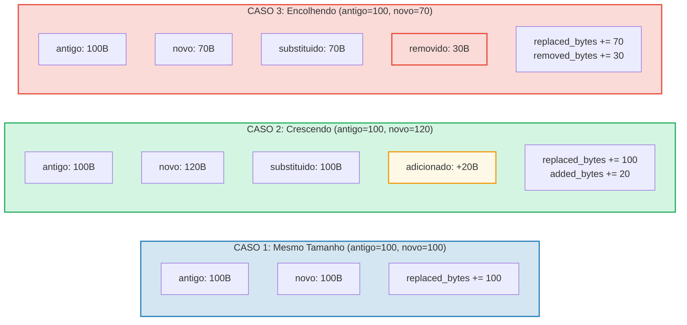

# Rastreamento de Custos

## A Estrutura OperationCost

Cada operacao no GroveDB acumula custos, medidos em recursos computacionais:

```rust
// costs/src/lib.rs
pub struct OperationCost {
    pub seek_count: u32,              // Numero de buscas no armazenamento
    pub storage_cost: StorageCost,    // Bytes adicionados/substituidos/removidos
    pub storage_loaded_bytes: u64,    // Bytes lidos do disco
    pub hash_node_calls: u32,         // Numero de operacoes de hash Blake3
    pub sinsemilla_hash_calls: u32,   // Numero de operacoes de hash Sinsemilla (ops EC)
}
```

> **Chamadas de hash Sinsemilla** rastreiam operacoes de hash de curva eliptica para
> ancoras de CommitmentTree. Estas sao significativamente mais caras que hashes de no Blake3.

Os custos de armazenamento se detalham ainda mais:

```rust
// costs/src/storage_cost/mod.rs
pub struct StorageCost {
    pub added_bytes: u32,                   // Novos dados escritos
    pub replaced_bytes: u32,                // Dados existentes sobrescritos
    pub removed_bytes: StorageRemovedBytes, // Dados liberados
}
```

## O Padrao CostContext

Todas as operacoes retornam seu resultado envolvido em um `CostContext`:

```rust
pub struct CostContext<T> {
    pub value: T,               // O resultado da operacao
    pub cost: OperationCost,    // Recursos consumidos
}

pub type CostResult<T, E> = CostContext<Result<T, E>>;
```

Isso cria um padrao **monadico** de rastreamento de custos — os custos fluem atraves de
cadeias de operacoes automaticamente:

```rust
// Desempacotar um resultado, adicionando seu custo a um acumulador
let result = expensive_operation().unwrap_add_cost(&mut total_cost);

// Encadear operacoes, acumulando custos
let final_result = op1()
    .flat_map(|x| op2(x))      // Custos de op1 + op2
    .flat_map(|y| op3(y));      // + custos de op3
```

## A Macro cost_return_on_error!

O padrao mais comum no codigo do GroveDB e a macro `cost_return_on_error!`,
que atua como `?` mas preserva custos no retorno antecipado:

```rust
macro_rules! cost_return_on_error {
    ( &mut $cost:ident, $($body:tt)+ ) => {
        {
            let result_with_cost = { $($body)+ };
            let result = result_with_cost.unwrap_add_cost(&mut $cost);
            match result {
                Ok(x) => x,
                Err(e) => return Err(e).wrap_with_cost($cost),
            }
        }
    };
}
```

Na pratica:

```rust
fn insert_element(&self, path: &[&[u8]], key: &[u8], element: Element) -> CostResult<(), Error> {
    let mut cost = OperationCost::default();

    // Cada chamada da macro adiciona o custo da operacao a `cost`
    // e retorna o valor Ok (ou retorna antecipadamente com custo acumulado em caso de Err)
    let merk = cost_return_on_error!(&mut cost, self.open_merk(path));
    cost_return_on_error!(&mut cost, merk.insert(key, element));
    cost_return_on_error!(&mut cost, self.propagate_changes(path));

    Ok(()).wrap_with_cost(cost)
    // `cost` agora contem a soma dos custos de todas as tres operacoes
}
```

## Detalhamento de Custos de Armazenamento

Quando um valor e atualizado, o custo depende de se o novo valor e maior, menor ou do
mesmo tamanho:



## Custos de Operacoes de Hash

Os custos de hash sao medidos em "chamadas de hash de no" — o numero de compressoes de
bloco Blake3:

| Operacao | Tamanho da Entrada | Chamadas de Hash |
|----------|-------------------|------------------|
| `value_hash(pequeno)` | < 64 bytes | 1 |
| `value_hash(medio)` | 64-127 bytes | 2 |
| `kv_hash` | chave + value_hash | varia |
| `node_hash` | 96 bytes (3 x 32) | 2 (sempre) |
| `combine_hash` | 64 bytes (2 x 32) | 1 (sempre) |
| `node_hash_with_count` | 104 bytes (3 x 32 + 8) | 2 (sempre) |
| Sinsemilla (CommitmentTree) | Op EC de curva Pallas | rastreado separadamente via `sinsemilla_hash_calls` |

A formula geral para Blake3:

```text
hash_calls = 1 + (input_bytes - 1) / 64
```

## Estimativa de Pior Caso e Caso Medio

O GroveDB fornece funcoes para **estimar** os custos de operacao antes de executa-las.
Isso e crucial para calculo de taxas em blockchain — voce precisa saber o custo antes
de se comprometer a pagar por ele.

```rust
// Custo de pior caso para ler um no
pub fn add_worst_case_get_merk_node(
    cost: &mut OperationCost,
    not_prefixed_key_len: u32,
    max_element_size: u32,
    node_type: NodeType,
) {
    cost.seek_count += 1;  // Uma busca em disco
    cost.storage_loaded_bytes +=
        TreeNode::worst_case_encoded_tree_size(
            not_prefixed_key_len, max_element_size, node_type
        ) as u64;
}

// Custo de pior caso de propagacao
pub fn add_worst_case_merk_propagate(
    cost: &mut OperationCost,
    input: &WorstCaseLayerInformation,
) {
    let levels = match input {
        MaxElementsNumber(n) => ((*n + 1) as f32).log2().ceil() as u32,
        NumberOfLevels(n) => *n,
    };
    let mut nodes_updated = levels;

    // Rotacoes AVL podem atualizar nos adicionais
    if levels > 2 {
        nodes_updated += 2;  // No maximo 2 nos extras para rotacoes
    }

    cost.storage_cost.replaced_bytes += nodes_updated * MERK_BIGGEST_VALUE_SIZE;
    cost.storage_loaded_bytes +=
        nodes_updated as u64 * (MERK_BIGGEST_VALUE_SIZE + MERK_BIGGEST_KEY_SIZE) as u64;
    cost.seek_count += nodes_updated;
    cost.hash_node_calls += nodes_updated * 2;
}
```

Constantes usadas:

```rust
pub const MERK_BIGGEST_VALUE_SIZE: u32 = u16::MAX as u32;  // 65535
pub const MERK_BIGGEST_KEY_SIZE: u32 = 256;
```

---
