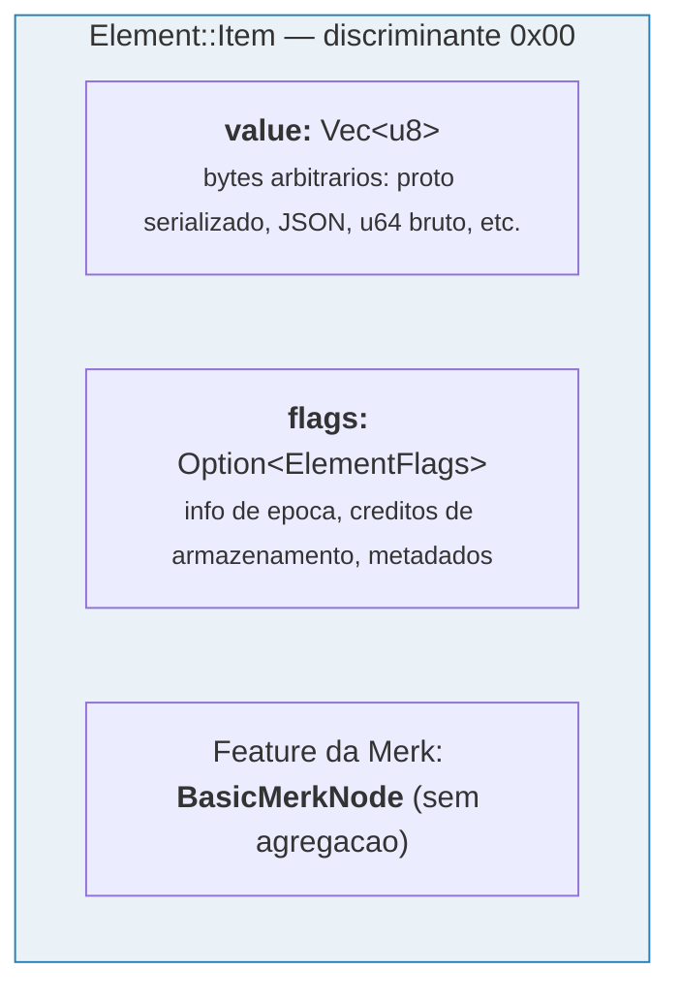
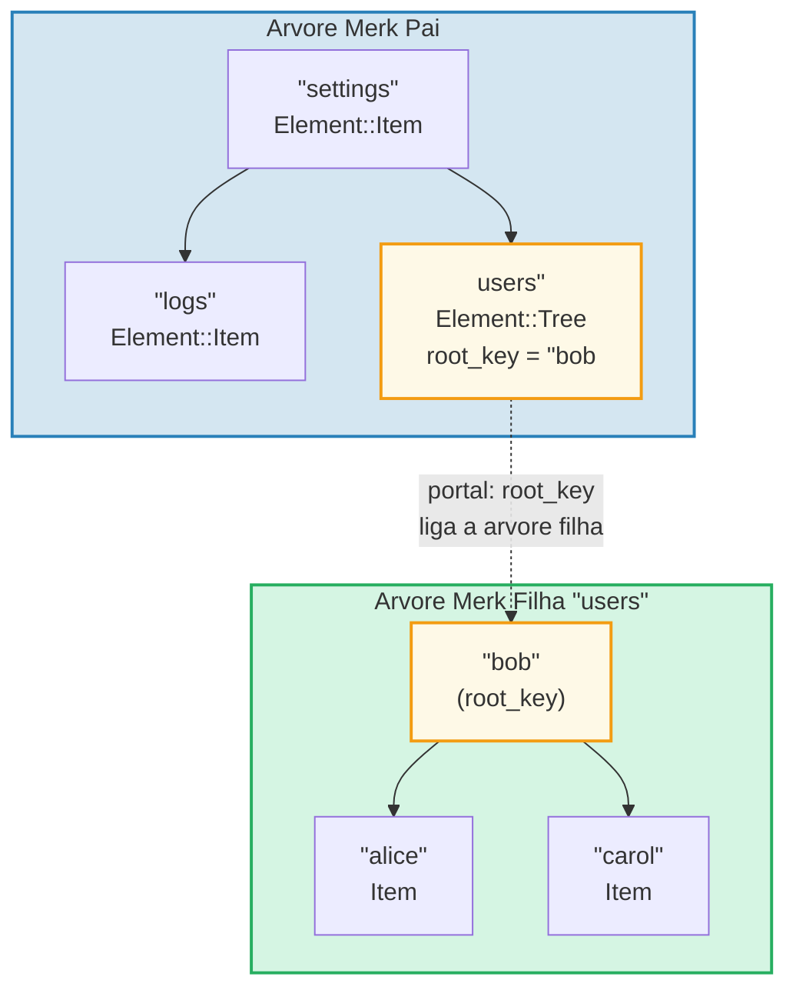
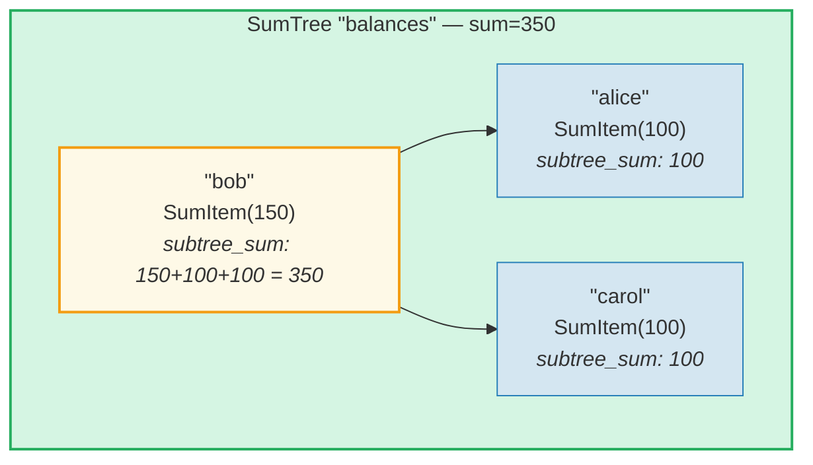
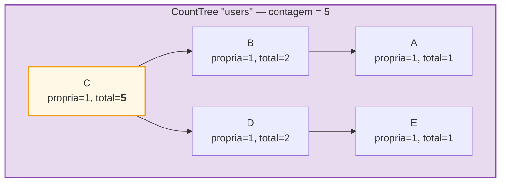
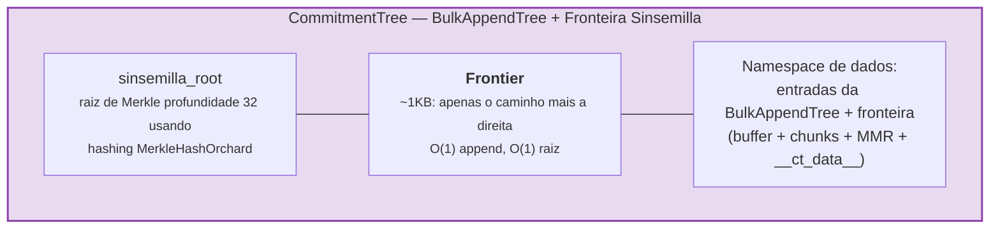

# O Sistema de Elementos

Enquanto a Merk lida com pares chave-valor brutos, o GroveDB opera em um nivel mais alto
usando **elementos** (Elements) — valores tipados que carregam significado semantico. Todo
valor armazenado no GroveDB e um Element.

## O Enum Element

```rust
// grovedb-element/src/element/mod.rs
pub enum Element {
    Item(Vec<u8>, Option<ElementFlags>),                                    // [0]
    Reference(ReferencePathType, MaxReferenceHop, Option<ElementFlags>),    // [1]
    Tree(Option<Vec<u8>>, Option<ElementFlags>),                           // [2]
    SumItem(SumValue, Option<ElementFlags>),                               // [3]
    SumTree(Option<Vec<u8>>, SumValue, Option<ElementFlags>),              // [4]
    BigSumTree(Option<Vec<u8>>, BigSumValue, Option<ElementFlags>),        // [5]
    CountTree(Option<Vec<u8>>, CountValue, Option<ElementFlags>),          // [6]
    CountSumTree(Option<Vec<u8>>, CountValue, SumValue, Option<ElementFlags>), // [7]
    ProvableCountTree(Option<Vec<u8>>, CountValue, Option<ElementFlags>),  // [8]
    ItemWithSumItem(Vec<u8>, SumValue, Option<ElementFlags>),              // [9]
    ProvableCountSumTree(Option<Vec<u8>>, CountValue, SumValue,
                         Option<ElementFlags>),                            // [10]
    CommitmentTree(u64, u8, Option<ElementFlags>),                         // [11]
    MmrTree(u64, Option<ElementFlags>),                                    // [12]
    BulkAppendTree(u64, u8, Option<ElementFlags>),                         // [13]
    DenseAppendOnlyFixedSizeTree(u16, u8, Option<ElementFlags>),           // [14]
}
```

Os numeros de discriminante (mostrados entre colchetes) sao usados durante a serializacao.

Apelidos de tipo (type aliases) usados em todo o codigo:

```rust
pub type ElementFlags = Vec<u8>;        // Metadados arbitrarios por elemento
pub type MaxReferenceHop = Option<u8>;  // Limite opcional de saltos para referencias
pub type SumValue = i64;                // Soma com sinal de 64 bits
pub type BigSumValue = i128;            // Soma com sinal de 128 bits
pub type CountValue = u64;              // Contagem sem sinal de 64 bits
```

## Item — Armazenamento Basico Chave-Valor

O elemento mais simples. Armazena bytes arbitrarios:

```rust
Element::Item(value: Vec<u8>, flags: Option<ElementFlags>)
```



Construtores:

```rust
Element::new_item(b"hello world".to_vec())
Element::new_item_with_flags(b"data".to_vec(), Some(vec![0x01, 0x02]))
```

Items participam da agregacao de soma: dentro de uma SumTree, um Item contribui com
uma soma padrao de 0. Um SumItem contribui com seu valor explicito.

## Tree — Conteineres para Subarvores

Um elemento Tree e um **portal** para outra arvore Merk. Ele armazena a chave raiz da
arvore filha (se houver):

```rust
Element::Tree(root_key: Option<Vec<u8>>, flags: Option<ElementFlags>)
```



> O elemento Tree na Merk pai armazena a `root_key` da arvore Merk filha. Isso cria um **portal** — um link de uma arvore Merk para outra.

Quando uma arvore esta vazia, `root_key` e `None`. O construtor `Element::empty_tree()`
cria `Element::Tree(None, None)`.

## SumItem / SumTree — Somas Agregadas

Uma **SumTree** (arvore de soma) mantem automaticamente a soma de todas as contribuicoes
de soma dos seus filhos diretos:

```rust
Element::SumTree(root_key: Option<Vec<u8>>, sum: SumValue, flags: Option<ElementFlags>)
Element::SumItem(value: SumValue, flags: Option<ElementFlags>)
```



> **Formula de agregacao:** `soma_no = valor_proprio + soma_filho_esquerdo + soma_filho_direito`
> Bob: 150 + 100 (alice) + 100 (carol) = **350**. A soma raiz (350) e armazenada no elemento SumTree do pai.

A soma e mantida no nivel da Merk atraves do tipo de feature `TreeFeatureType::SummedMerkNode(i64)`. Durante a propagacao da arvore, os dados agregados de cada no sao recalculados:

```text
aggregate_sum = soma_propria + soma_filho_esquerdo + soma_filho_direito
```

## CountTree, CountSumTree, BigSumTree

Tipos adicionais de arvores agregadas:

| Tipo de Elemento | Tipo de Feature Merk | O que Agrega |
|---|---|---|
| `CountTree` | `CountedMerkNode(u64)` | Numero de elementos |
| `CountSumTree` | `CountedSummedMerkNode(u64, i64)` | Contagem e soma |
| `BigSumTree` | `BigSummedMerkNode(i128)` | Soma de 128 bits para valores grandes |
| `ProvableCountTree` | `ProvableCountedMerkNode(u64)` | Contagem incorporada no hash |
| `ProvableCountSumTree` | `ProvableCountedSummedMerkNode(u64, i64)` | Contagem no hash + soma |

**ProvableCountTree** e especial: sua contagem e incluida na computacao do `node_hash`
(via `node_hash_with_count`), entao uma prova pode verificar a contagem sem
revelar quaisquer valores.

## Serializacao de Elementos

Os elementos sao serializados usando **bincode** com ordem de bytes big-endian:

```rust
pub fn serialize(&self, grove_version: &GroveVersion) -> Result<Vec<u8>, ElementError> {
    let config = config::standard().with_big_endian().with_no_limit();
    bincode::encode_to_vec(self, config)
}
```

O primeiro byte e o **discriminante**, permitindo deteccao de tipo em O(1):

```rust
pub fn from_serialized_value(value: &[u8]) -> Option<ElementType> {
    match value.first()? {
        0 => Some(ElementType::Item),
        1 => Some(ElementType::Reference),
        2 => Some(ElementType::Tree),
        3 => Some(ElementType::SumItem),
        // ... etc
    }
}
```

## TreeFeatureType e Fluxo de Dados Agregados

O enum `TreeFeatureType` faz a ponte entre os Elements do GroveDB e os nos da Merk:

```rust
pub enum TreeFeatureType {
    BasicMerkNode,                              // Sem agregacao
    SummedMerkNode(i64),                       // Agregacao de soma
    BigSummedMerkNode(i128),                   // Soma grande
    CountedMerkNode(u64),                      // Contagem
    CountedSummedMerkNode(u64, i64),           // Contagem + soma
    ProvableCountedMerkNode(u64),              // Contagem no hash
    ProvableCountedSummedMerkNode(u64, i64),   // Contagem no hash + soma
}
```

Os dados agregados fluem **para cima** atraves da arvore:



> **Tabela de agregacao:** O agregado de cada no = propria(1) + agregado_esquerdo + agregado_direito
>
> | No | propria | agg_esq | agg_dir | total |
> |------|-----|----------|-----------|-------|
> | A | 1 | 0 | 0 | 1 |
> | B | 1 | 1 (A) | 0 | 2 |
> | E | 1 | 0 | 0 | 1 |
> | D | 1 | 0 | 1 (E) | 2 |
> | C | 1 | 2 (B) | 2 (D) | **5** (raiz) |

A contagem armazenada em cada no representa a contagem total na subarvore com raiz
naquele no, incluindo ele mesmo. A contagem do no raiz e o total de toda a arvore.

O enum `AggregateData` transporta isso atraves do sistema de links:

```rust
pub enum AggregateData {
    NoAggregateData,
    Sum(i64),
    BigSum(i128),
    Count(u64),
    CountAndSum(u64, i64),
    ProvableCount(u64),
    ProvableCountAndSum(u64, i64),
}
```

## CommitmentTree — Arvore de Compromisso Sinsemilla

Uma **CommitmentTree** (arvore de compromisso) fornece uma arvore de Merkle Sinsemilla
de profundidade 32 para rastrear ancoras de compromisso de notas, como usado no
protocolo blindado Orchard do Zcash. Ela envolve
`incrementalmerkletree::Frontier<MerkleHashOrchard, 32>` para append O(1) e
computacao de raiz:

```rust
Element::CommitmentTree(
    total_count: u64,               // Numero de compromissos adicionados
    chunk_power: u8,                // Tamanho de compactacao da BulkAppendTree (chunk_size = 2^chunk_power)
    flags: Option<ElementFlags>,
)                                   // discriminante [11]
```

> **Nota:** O hash raiz da fronteira Sinsemilla NAO e armazenado no Element.
> Ele e persistido no armazenamento de dados e flui atraves do mecanismo de hash
> filho da Merk (parametro `subtree_root_hash` de `insert_subtree`). Qualquer
> alteracao na fronteira propaga automaticamente para cima atraves da hierarquia
> Merk do GroveDB.



**Arquitetura:**
- A *fronteira* (frontier) (caminho mais a direita da arvore de Merkle, ~1KB de tamanho constante) e
  armazenada no **namespace de dados**, com chave `COMMITMENT_TREE_DATA_KEY`
- Os dados reais das notas (`cmx || ciphertext`) sao armazenados via uma **BulkAppendTree**
  no **namespace de dados** — compactados em chunks, recuperaveis por posicao
- Ancoras historicas sao rastreadas pela Platform em uma arvore provavel separada
- A raiz Sinsemilla NAO e armazenada no Element — flui como o hash filho da Merk
  atraves da hierarquia de hash do GroveDB

**Operacoes:**
- `commitment_tree_insert(path, key, cmx, ciphertext, tx)` — Append tipado
  aceitando `TransmittedNoteCiphertext<M>`; retorna `(new_root, position)`
- `commitment_tree_anchor(path, key, tx)` — Obter a Anchor Orchard atual
- `commitment_tree_get_value(path, key, position, tx)` — Recuperar valor por posicao
- `commitment_tree_count(path, key, tx)` — Obter contagem total de itens

**Generico MemoSize:** `CommitmentTree<S, M: MemoSize = DashMemo>` valida que
os payloads de ciphertext correspondem ao tamanho esperado para `M`. Para o Dash (memos de 36 bytes):
`epk_bytes (32) + enc_ciphertext (104) + out_ciphertext (80) = 216 bytes`.

**Rastreamento de custos:** Operacoes de hash Sinsemilla sao rastreadas via
`cost.sinsemilla_hash_calls`. A computacao da raiz sempre percorre 32 niveis.
As mesclagens de ommers cascateiam atraves de `trailing_ones()` da posicao anterior.
Operacoes da BulkAppendTree adicionam custos de hash Blake3.

## MmrTree — Merkle Mountain Range

Uma **MmrTree** armazena dados em um Merkle Mountain Range (MMR) apenas para append
usando hashing Blake3. Os nos do MMR sao armazenados na coluna de **dados** (a mesma
dos nos Merk), nao em uma subarvore Merk filha. Veja o **[Capitulo 13](#chapter-13-the-mmr-tree--append-only-authenticated-logs)**
para um mergulho profundo abrangente sobre como os MMRs funcionam, como se preenchem,
como as provas sao geradas e verificadas, e como a MmrTree se integra ao GroveDB.

```rust
Element::MmrTree(
    mmr_size: u64,                  // Tamanho interno do MMR (nos, nao folhas)
    flags: Option<ElementFlags>,
)                                   // discriminante [12]
```

> **Nota:** O hash raiz do MMR NAO e armazenado no Element. Ele flui como o hash
> filho da Merk via parametro `subtree_root_hash` de `insert_subtree`.

**Operacoes:** `mmr_tree_append`, `mmr_tree_root_hash`, `mmr_tree_get_value`,
`mmr_tree_leaf_count`. **Provas:** provas V1 (veja secoes 9.6 e 13.9).

## BulkAppendTree — Estrutura de Append de Dois Niveis

Uma **BulkAppendTree** combina um buffer de arvore de Merkle densa com um MMR ao nivel
de chunk para appends eficientes de alta vazao com consultas de faixa provaveis. E uma
arvore nao-Merk — os dados vivem no namespace de **dados**, nao em uma subarvore Merk filha.
Veja o **[Capitulo 14](#chapter-14-the-bulkappendtree--high-throughput-append-only-storage)**
para um mergulho profundo abrangente sobre a arquitetura de dois niveis, compactacao
de chunks, geracao de provas, verificacao e integracao com o GroveDB.

```rust
Element::BulkAppendTree(
    total_count: u64,               // Total de valores adicionados
    chunk_power: u8,                // Altura da arvore densa (capacidade do buffer = 2^chunk_power - 1)
    flags: Option<ElementFlags>,
)                                   // discriminante [13]
```

> **Nota:** A raiz de estado (`blake3("bulk_state" || mmr_root || dense_tree_root)`)
> NAO e armazenada no Element. Ela flui como o hash filho da Merk via
> parametro `subtree_root_hash` de `insert_subtree`.

**Operacoes:** `bulk_append`, `bulk_get_value`, `bulk_get_chunk`,
`bulk_get_buffer`, `bulk_count`, `bulk_chunk_count`.
**Provas:** provas de faixa V1 (veja secoes 9.6 e 14.10).

## DenseAppendOnlyFixedSizeTree — Armazenamento Denso de Capacidade Fixa

Uma **DenseAppendOnlyFixedSizeTree** (arvore densa de append com tamanho fixo) e uma
arvore binaria completa de altura fixa *h* onde cada no (interno e folha) armazena um
valor de dados. As posicoes sao preenchidas em ordem de nivel (BFS). O hash raiz e
recalculado em tempo real — nenhum hash intermediario e persistido. Veja o
**[Capitulo 16](#chapter-16-the-denseappendonlyfixedsizetree--dense-fixed-capacity-merkle-storage)**
para o mergulho profundo completo.

```rust
Element::DenseAppendOnlyFixedSizeTree(
    count: u16,                     // Numero de valores armazenados (max 65.535)
    height: u8,                     // Altura da arvore (1..=16, imutavel), capacidade = 2^h - 1
    flags: Option<ElementFlags>,
)                                   // discriminante [14]
```

> **Nota:** O hash raiz NAO e armazenado no Element — ele e recalculado em
> tempo real e flui como o hash filho da Merk. O campo `count` e `u16` (nao u64),
> limitando arvores a 65.535 posicoes. Alturas sao restritas a 1..=16.

**Operacoes:** `dense_tree_insert`, `dense_tree_get`, `dense_tree_root_hash`,
`dense_tree_count`.
**Provas:** Apenas ao nivel de elemento (sem provas de subconsulta ainda).

## Arvores Nao-Merk — Padroes Comuns

CommitmentTree, MmrTree, BulkAppendTree e DenseAppendOnlyFixedSizeTree compartilham um
padrao arquitetural comum que os distingue dos tipos de arvore baseados em Merk
(Tree, SumTree, CountTree, etc.):

| Propriedade | Arvores baseadas em Merk | Arvores nao-Merk |
|-------------|--------------------------|-------------------|
| Subarvore Merk filha | Sim (`root_key = Some(...)`) | Nao (sem campo root_key) |
| Armazenamento de dados | Pares chave-valor Merk | Blobs na coluna de dados (chaves nao-Merk) |
| Vinculacao do hash raiz | `combine_hash(elem_hash, child_root_hash)` | `combine_hash(elem_hash, raiz_especifica_do_tipo)` |
| Raiz especifica do tipo | Mantida pela AVL Merk | Flui como hash filho da Merk (NAO nos bytes do elemento) |
| Formato de prova | V0 (camada a camada Merk) | V1 (prova especifica do tipo) |
| TreeFeatureType | BasicMerkNode (sem agregacao) | BasicMerkNode |

> **Nota sobre coluna de armazenamento:** Todos os quatro tipos de arvores nao-Merk
> (MmrTree, CommitmentTree, BulkAppendTree, DenseAppendOnlyFixedSizeTree)
> armazenam seus dados na coluna de **dados** usando chaves nao-Merk. A CommitmentTree
> armazena sua fronteira Sinsemilla junto com as entradas da BulkAppendTree na
> mesma coluna de **dados** (chave `b"__ct_data__"`).

A raiz especifica do tipo (raiz sinsemilla, raiz MMR, raiz de estado ou hash raiz
da arvore densa) NAO e armazenada no Element. Em vez disso, ela flui como o **hash
filho** da Merk via parametro `subtree_root_hash` de `insert_subtree`. O
combined_value_hash da Merk se torna
`combine_hash(value_hash(element_bytes), raiz_especifica_do_tipo)`.
Qualquer alteracao na raiz especifica do tipo muda o hash filho, que muda o
combined_value_hash, que propaga para cima atraves da hierarquia de hash do
GroveDB — mantendo a integridade criptografica.

---
