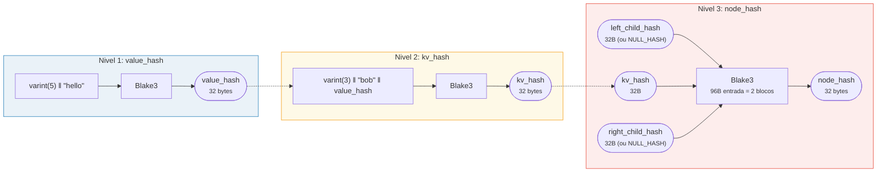
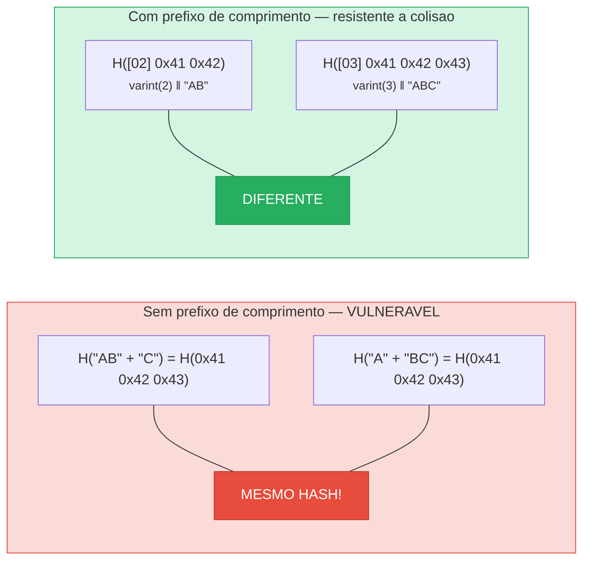
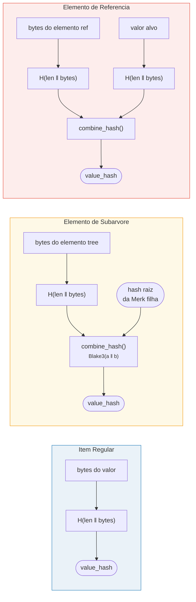

# Hashing — Integridade Criptografica

Cada no em uma arvore Merk e hasheado para produzir um **hash raiz** — um unico valor
de 32 bytes que autentica a arvore inteira. Qualquer alteracao em qualquer chave, valor
ou relacao estrutural produzira um hash raiz diferente.

## Hierarquia de Hash em Tres Niveis

A Merk usa um esquema de hashing em tres niveis, do mais interno ao mais externo:

Exemplo: chave = `"bob"` (3 bytes), valor = `"hello"` (5 bytes):



> A RAIZ da arvore = `node_hash` do no raiz — autentica **cada** chave, valor e relacao estrutural. Filhos ausentes usam `NULL_HASH = [0x00; 32]`.

### Nivel 1: value_hash

```rust
// merk/src/tree/hash.rs
pub fn value_hash(value: &[u8]) -> CostContext<CryptoHash> {
    let mut hasher = blake3::Hasher::new();
    let val_length = value.len().encode_var_vec();  // Codificacao varint
    hasher.update(val_length.as_slice());
    hasher.update(value);
    // ...
}
```

O comprimento do valor e **codificado em varint** e prefixado. Isso e critico para
resistencia a colisao — sem isso, `H("AB" || "C")` seria igual a `H("A" || "BC")`.

### Nivel 2: kv_hash

```rust
pub fn kv_hash(key: &[u8], value: &[u8]) -> CostContext<CryptoHash> {
    let mut hasher = blake3::Hasher::new();
    let key_length = key.len().encode_var_vec();
    hasher.update(key_length.as_slice());
    hasher.update(key);
    let vh = value_hash(value);
    hasher.update(vh.as_slice());  // Hash aninhado
    // ...
}
```

Isso vincula a chave ao valor. Para verificacao de provas, existe tambem uma variante
que recebe um value_hash pre-calculado:

```rust
pub fn kv_digest_to_kv_hash(key: &[u8], value_hash: &CryptoHash) -> CostContext<CryptoHash>
```

Isso e usado quando o verificador ja possui o value_hash (por exemplo, para subarvores
onde o value_hash e um hash combinado).

### Nivel 3: node_hash

```rust
pub fn node_hash(
    kv: &CryptoHash,
    left: &CryptoHash,
    right: &CryptoHash,
) -> CostContext<CryptoHash> {
    let mut hasher = blake3::Hasher::new();
    hasher.update(kv);       // 32 bytes
    hasher.update(left);     // 32 bytes
    hasher.update(right);    // 32 bytes — total 96 bytes
    // Sempre exatamente 2 operacoes de hash (96 bytes / bloco de 64 bytes = 2)
}
```

Se um filho estiver ausente, seu hash e o **NULL_HASH** — 32 bytes zero:

```rust
pub const NULL_HASH: CryptoHash = [0; HASH_LENGTH];  // [0u8; 32]
```

## Blake3 como Funcao de Hash

O GroveDB usa **Blake3** para todo o hashing. Propriedades-chave:

- **Saida de 256 bits** (32 bytes)
- **Tamanho do bloco**: 64 bytes
- **Velocidade**: ~3x mais rapido que SHA-256 em hardware moderno
- **Streaming**: Pode alimentar dados incrementalmente

O custo da operacao de hash e calculado com base em quantos blocos de 64 bytes sao
processados:

```rust
let hashes = 1 + (hasher.count() - 1) / 64;  // Numero de operacoes de hash
```

## Codificacao de Prefixo de Comprimento para Resistencia a Colisao

Toda entrada de comprimento variavel e prefixada com seu comprimento usando **codificacao varint**:



> **Entrada do value_hash**: `[varint(value.len)] [bytes do valor]`
> **Entrada do kv_hash**: `[varint(key.len)] [bytes da chave] [value_hash: 32 bytes]`

Sem prefixos de comprimento, um atacante poderia criar diferentes pares chave-valor que
produzem o mesmo digest. O prefixo de comprimento torna isso criptograficamente
inviavel.

## Hashing Combinado para Elementos Especiais

Para **subarvores** e **referencias**, o `value_hash` nao e simplesmente `H(value)`.
Em vez disso, e um **hash combinado** que vincula o elemento ao seu alvo:



> **Subarvore:** vincula o hash raiz da Merk filha ao pai. **Referencia:** vincula tanto o caminho da referencia QUANTO o valor alvo. Alterar qualquer um muda o hash raiz.

A funcao `combine_hash`:

```rust
pub fn combine_hash(hash_one: &CryptoHash, hash_two: &CryptoHash) -> CostContext<CryptoHash> {
    let mut hasher = blake3::Hasher::new();
    hasher.update(hash_one);   // 32 bytes
    hasher.update(hash_two);   // 32 bytes — total 64 bytes, exatamente 1 op de hash
    // ...
}
```

Isso e o que permite ao GroveDB autenticar toda a hierarquia atraves de um unico
hash raiz — o value_hash de cada arvore pai para um elemento de subarvore inclui o
hash raiz da arvore filha.

## Hashing Agregado para ProvableCountTree

Nos de `ProvableCountTree` incluem a contagem agregada no hash do no:

```rust
pub fn node_hash_with_count(
    kv: &CryptoHash,
    left: &CryptoHash,
    right: &CryptoHash,
    count: u64,
) -> CostContext<CryptoHash> {
    let mut hasher = blake3::Hasher::new();
    hasher.update(kv);                        // 32 bytes
    hasher.update(left);                      // 32 bytes
    hasher.update(right);                     // 32 bytes
    hasher.update(&count.to_be_bytes());      // 8 bytes — total 104 bytes
    // Ainda exatamente 2 ops de hash (104 < 128 = 2 x 64)
}
```

Isso significa que uma prova de contagem nao requer revelar os dados reais — a contagem
e incorporada no compromisso criptografico.

---
