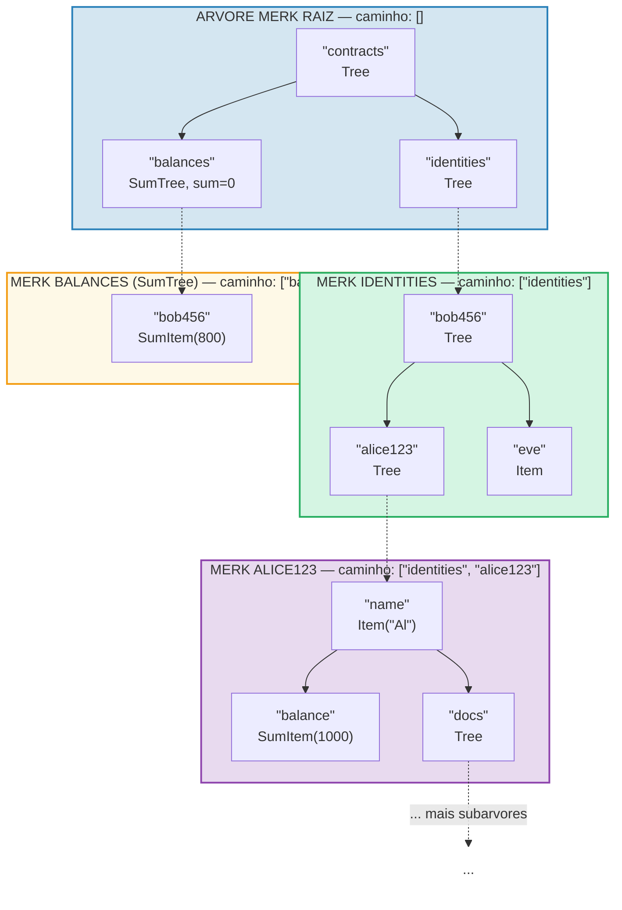
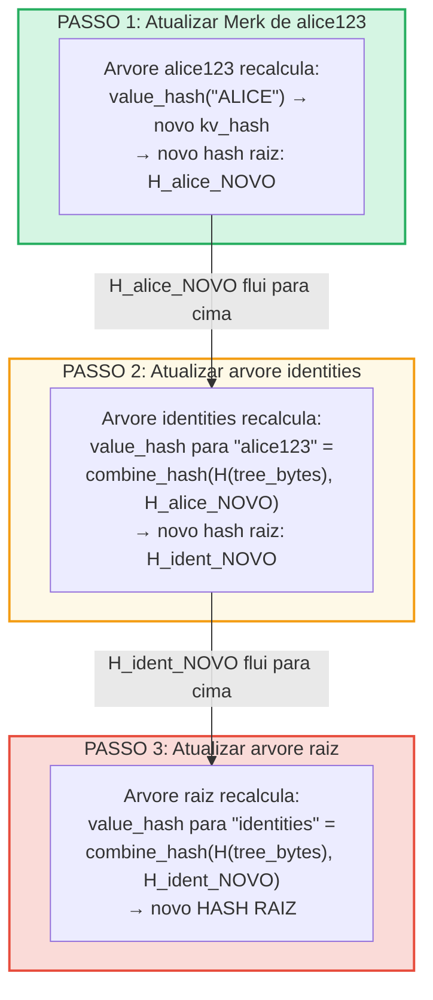
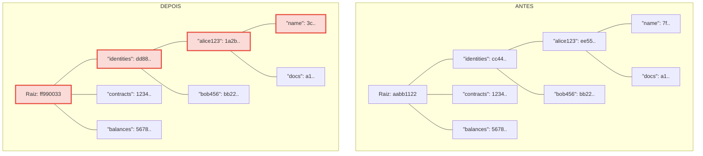
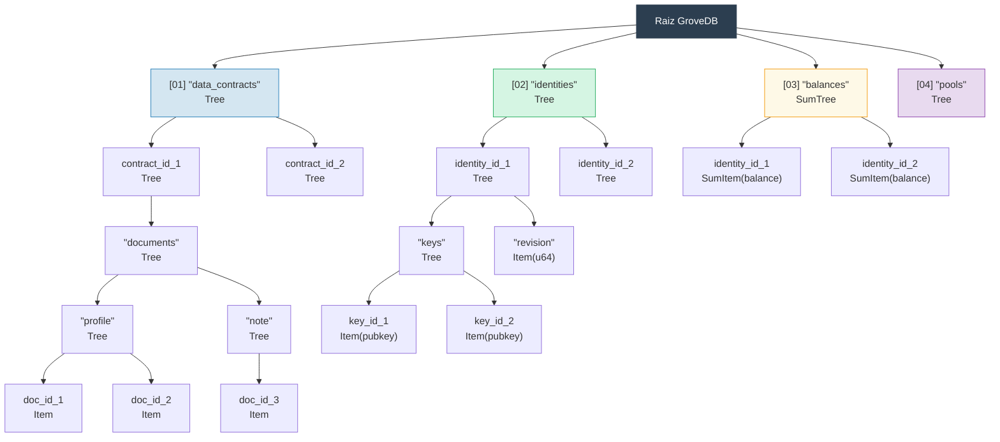

# O Grove Hierarquico — Arvore de Arvores

## Como Subarvores se Aninham Dentro de Arvores Pai

A caracteristica definidora do GroveDB e que uma arvore Merk pode conter elementos que
sao eles mesmos arvores Merk. Isso cria um **namespace hierarquico**:



> Cada caixa colorida e uma arvore Merk separada. As setas tracejadas representam os links de portal dos elementos Tree para suas arvores Merk filhas. O caminho para cada Merk e mostrado no seu rotulo.

## Sistema de Enderecamento por Caminho

Cada elemento no GroveDB e enderecado por um **caminho** (path) — uma sequencia de
strings de bytes que navegam da raiz atraves de subarvores ate a chave alvo:

```text
    Caminho: ["identities", "alice123", "name"]

    Passo 1: Na arvore raiz, buscar "identities" → elemento Tree
    Passo 2: Abrir subarvore identities, buscar "alice123" → elemento Tree
    Passo 3: Abrir subarvore alice123, buscar "name" → Item("Alice")
```

Os caminhos sao representados como `Vec<Vec<u8>>` ou usando o tipo `SubtreePath` para
manipulacao eficiente sem alocacao:

```rust
// O caminho para o elemento (todos os segmentos exceto o ultimo)
let path: &[&[u8]] = &[b"identities", b"alice123"];
// A chave dentro da subarvore final
let key: &[u8] = b"name";
```

## Geracao de Prefixo Blake3 para Isolamento de Armazenamento

Cada subarvore no GroveDB recebe seu proprio **namespace de armazenamento isolado** no
RocksDB. O namespace e determinado pelo hashing do caminho com Blake3:

```rust
pub type SubtreePrefix = [u8; 32];

// O prefixo e computado pelo hashing dos segmentos do caminho
// storage/src/rocksdb_storage/storage.rs
```

Por exemplo:

```text
    Caminho: ["identities", "alice123"]
    Prefixo: Blake3(["identities", "alice123"]) = [0xab, 0x3f, ...]  (32 bytes)

    No RocksDB, as chaves para esta subarvore sao armazenadas como:
    [prefixo: 32 bytes][chave_original]

    Entao "name" nesta subarvore se torna:
    [0xab, 0x3f, ...][0x6e, 0x61, 0x6d, 0x65]  ("name")
```

Isso garante:
- Sem colisoes de chave entre subarvores (prefixo de 32 bytes = isolamento de 256 bits)
- Computacao eficiente do prefixo (um unico hash Blake3 sobre os bytes do caminho)
- Dados da subarvore sao colocalizados no RocksDB para eficiencia de cache

## Propagacao do Hash Raiz Atraves da Hierarquia

Quando um valor muda no fundo do grove, a mudanca deve **propagar para cima** para
atualizar o hash raiz:

```text
    Alteracao: Atualizar "name" para "ALICE" em identities/alice123/

    Passo 1: Atualizar valor na arvore Merk de alice123
            → arvore alice123 recebe novo hash raiz: H_alice_new

    Passo 2: Atualizar elemento "alice123" na arvore identities
            → value_hash da arvore identities para "alice123" =
              combine_hash(H(tree_element_bytes), H_alice_new)
            → arvore identities recebe novo hash raiz: H_ident_new

    Passo 3: Atualizar elemento "identities" na arvore raiz
            → value_hash da arvore raiz para "identities" =
              combine_hash(H(tree_element_bytes), H_ident_new)
            → HASH RAIZ muda
```



**Antes vs Depois** — nos alterados marcados em vermelho:



> Apenas os nos no caminho do valor alterado ate a raiz sao recalculados. Irmaos e outras ramificacoes permanecem inalterados.

A propagacao e implementada por `propagate_changes_with_transaction`, que percorre
o caminho da subarvore modificada ate a raiz, atualizando o hash do elemento de cada pai
ao longo do caminho.

## Exemplo de Estrutura de Grove Multinivel

Aqui esta um exemplo completo mostrando como o Dash Platform estrutura seu estado:



Cada caixa e uma arvore Merk separada, autenticada ate um unico hash raiz com o qual
os validadores concordam.

---
