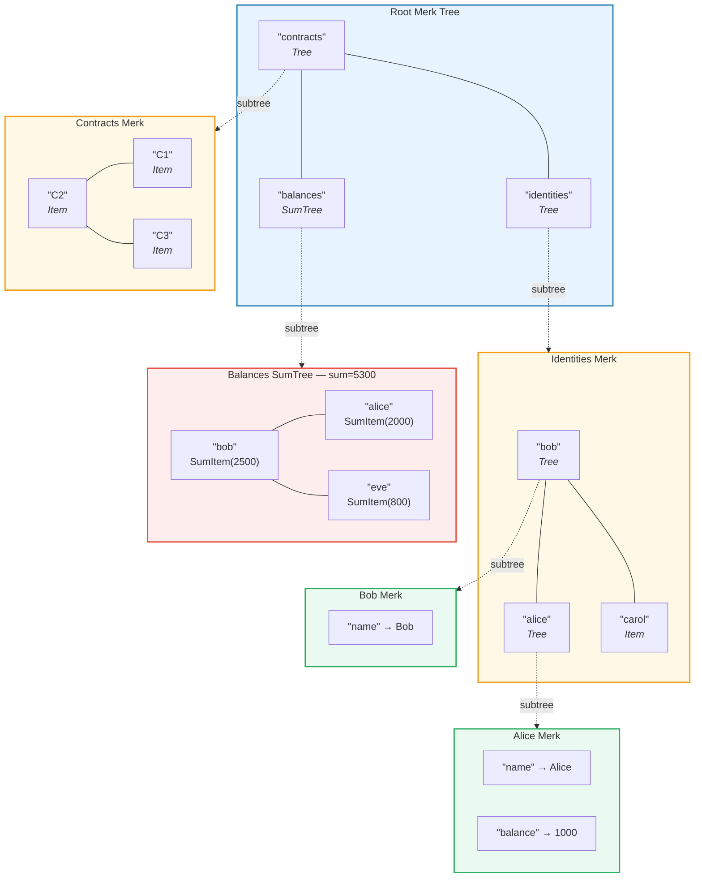
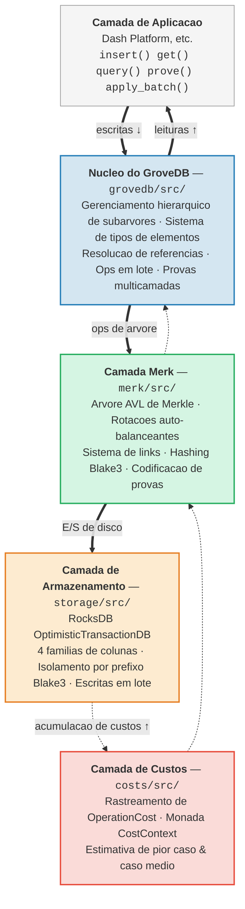

# Introducao — O que e o GroveDB?

## A Ideia Central

GroveDB e uma **estrutura de dados autenticada hierarquica** — essencialmente um *grove*
(bosque, ou arvore de arvores) construido sobre arvores AVL de Merkle. Cada no no banco
de dados faz parte de uma arvore criptograficamente autenticada, e cada arvore pode
conter outras arvores como filhas, formando uma hierarquia profunda de estado verificavel.

> Cada caixa colorida e uma **arvore Merk separada**. As setas tracejadas mostram o relacionamento de subarvore — um elemento Tree no pai contem a chave raiz da Merk filha.

Em um banco de dados tradicional, voce poderia armazenar dados em um armazem chave-valor
plano com uma unica arvore de Merkle no topo para autenticacao. O GroveDB adota uma
abordagem diferente: ele aninha arvores de Merkle dentro de arvores de Merkle. Isso
proporciona:

1. **Indices secundarios eficientes** — consulta por qualquer caminho, nao apenas por chave primaria
2. **Provas criptograficas compactas** — prova a existencia (ou ausencia) de qualquer dado
3. **Dados agregados** — arvores podem automaticamente somar, contar ou agregar de outras formas seus filhos
4. **Operacoes atomicas entre arvores** — operacoes em lote abrangem multiplas subarvores

## Por que o GroveDB Existe

O GroveDB foi projetado para o **Dash Platform**, uma plataforma de aplicacoes
descentralizada onde cada pedaco de estado deve ser:

- **Autenticado**: Qualquer no pode provar qualquer pedaco de estado para um cliente leve
- **Deterministico**: Todo no computa exatamente o mesmo hash raiz de estado
- **Eficiente**: As operacoes devem ser concluidas dentro das restricoes de tempo do bloco
- **Consultavel**: Aplicacoes precisam de consultas ricas, nao apenas buscas por chave

Abordagens tradicionais ficam aquem:

| Abordagem | Problema |
|-----------|----------|
| Arvore de Merkle simples | Suporta apenas buscas por chave, sem consultas por faixa |
| MPT do Ethereum | Rebalanceamento caro, provas grandes |
| Chave-valor plano + arvore unica | Sem consultas hierarquicas, uma unica prova cobre tudo |
| B-tree | Nao e naturalmente Merklizada, autenticacao complexa |

O GroveDB resolve isso combinando as **garantias comprovadas de balanceamento das arvores AVL**
com **aninhamento hierarquico** e um **sistema rico de tipos de elementos**.

## Visao Geral da Arquitetura

O GroveDB e organizado em camadas distintas, cada uma com uma responsabilidade clara:

Os dados fluem **para baixo** atraves dessas camadas durante as escritas e **para cima**
durante as leituras. Cada operacao acumula custos conforme percorre a pilha, permitindo
uma contabilizacao precisa de recursos.

---
