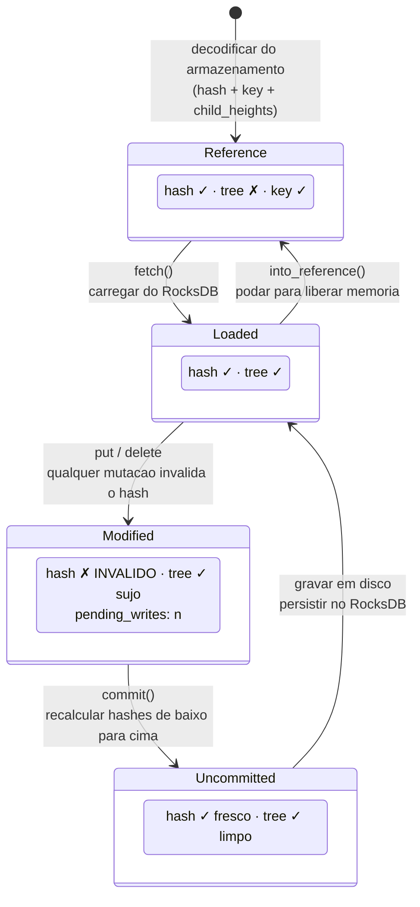
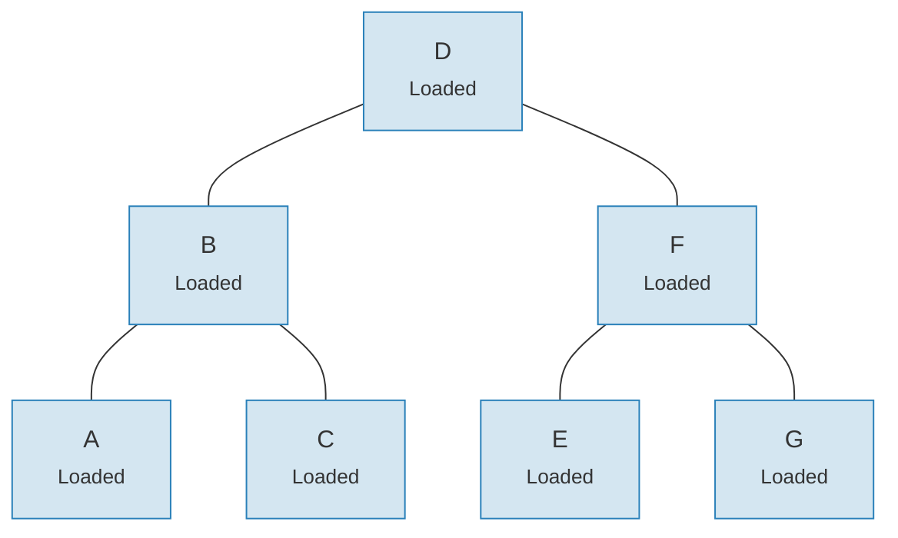
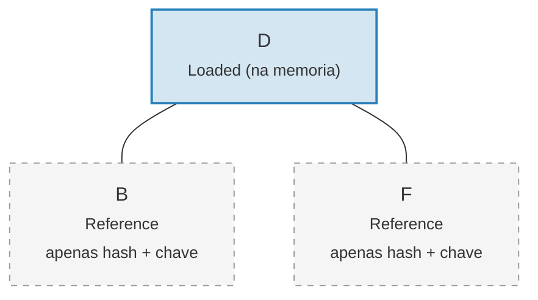

# O Sistema de Links — Arquitetura de Carregamento Preguicoso

Carregar uma arvore Merk inteira na memoria seria proibitivamente caro para arvores
grandes. O sistema de links resolve isso representando as conexoes com filhos em quatro
estados possiveis, permitindo o **carregamento preguicoso** (lazy loading) — os filhos sao
buscados do armazenamento somente quando realmente necessarios.

## Quatro Estados de Link

```rust
// merk/src/tree/link.rs
pub enum Link {
    Reference {                    // Podado: apenas metadados, sem arvore na memoria
        hash: CryptoHash,
        child_heights: (u8, u8),
        key: Vec<u8>,
        aggregate_data: AggregateData,
    },
    Modified {                     // Recentemente alterado, hash ainda nao calculado
        pending_writes: usize,
        child_heights: (u8, u8),
        tree: TreeNode,
    },
    Uncommitted {                  // Hash calculado mas ainda nao persistido no armazenamento
        hash: CryptoHash,
        child_heights: (u8, u8),
        tree: TreeNode,
        aggregate_data: AggregateData,
    },
    Loaded {                       // Totalmente carregado do armazenamento
        hash: CryptoHash,
        child_heights: (u8, u8),
        tree: TreeNode,
        aggregate_data: AggregateData,
    },
}
```

## Diagrama de Transicao de Estados



## O que Cada Estado Armazena

| Estado | Hash? | Arvore na Memoria? | Proposito |
|--------|-------|---------------------|-----------|
| **Reference** | Sim | Nao | Representacao compacta em disco. Armazena apenas chave, hash, alturas dos filhos e dados agregados. |
| **Modified** | Nao | Sim | Apos qualquer mutacao. Rastreia a contagem de `pending_writes` para otimizacao de lote. |
| **Uncommitted** | Sim | Sim | Apos o calculo do hash mas antes da escrita no armazenamento. Estado intermediario durante o commit. |
| **Loaded** | Sim | Sim | Totalmente materializado. Pronto para leituras ou modificacoes adicionais. |

O campo `pending_writes` em `Modified` e digno de nota:

```rust
// Calculado como: 1 + left_pending_writes + right_pending_writes
pending_writes: 1 + tree.child_pending_writes(true)
                  + tree.child_pending_writes(false),
```

Essa contagem ajuda a fase de commit a decidir como ordenar as escritas para desempenho
otimo.

## O Padrao de Callback Fetch

O sistema de links usa uma **trait Fetch** para abstrair como os nos filhos sao carregados:

```rust
pub trait Fetch {
    fn fetch(
        &self,
        link: &Link,
        value_defined_cost_fn: Option<&impl Fn(&[u8], &GroveVersion) -> Option<ValueDefinedCostType>>,
        grove_version: &GroveVersion,
    ) -> CostResult<TreeNode, Error>;
}
```

Diferentes implementacoes de fetch servem a diferentes propositos:

- **StorageFetch**: Carrega do RocksDB (o caminho normal)
- **PanicSource**: Usado em testes onde a busca nunca deveria acontecer
- **MockSource**: Retorna dados de teste controlados

Esse padrao permite que as operacoes da arvore sejam **agnoscticas ao armazenamento** — a
mesma logica de balanceamento e mutacao funciona independentemente de onde os dados vem.

## O Padrao Walker

O `Walker` envolve um `TreeNode` com uma fonte `Fetch`, fornecendo travessia segura
da arvore com carregamento preguicoso automatico (`merk/src/tree/walk/mod.rs`):

```rust
pub struct Walker<S: Fetch + Sized + Clone> {
    tree: Owner<TreeNode>,
    source: S,
}
```

O Walker fornece tres operacoes-chave:

**walk()** — Desconectar um filho, transforma-lo e reconecta-lo:

```rust
pub fn walk<F, T>(self, left: bool, f: F, ...) -> CostResult<Self, Error>
where
    F: FnOnce(Option<Self>) -> CostResult<Option<T>, Error>,
    T: Into<TreeNode>,
```

**detach()** — Remover um filho, carregando-o do armazenamento se necessario:

```rust
pub fn detach(self, left: bool, ...) -> CostResult<(Self, Option<Self>), Error>
```

Se o filho for um `Link::Reference` (podado), detach chamara `fetch()` para carrega-lo
primeiro. Se o filho ja estiver na memoria (`Modified`, `Uncommitted`, `Loaded`),
simplesmente toma a propriedade.

**attach()** — Conectar um filho a um pai:

```rust
pub fn attach(self, left: bool, maybe_child: Option<Self>) -> Self
```

Conectar sempre cria um `Link::Modified` ja que o relacionamento pai-filho
mudou.

## Eficiencia de Memoria Atraves da Poda

Apos realizar o commit das mudancas, a arvore pode **podar** subarvores carregadas de volta
para `Link::Reference`, liberando memoria enquanto retem o hash necessario para
geracao de provas:

**Antes da poda** — todos os 7 nos na memoria:



**Apos a poda** — apenas a raiz na memoria, filhos sao `Link::Reference` (apenas hash + chave):



> **Link::Loaded** contem `hash + child_heights + tree (TreeNode)`. **Link::Reference** contem apenas `hash + child_heights + key` — o TreeNode e liberado da memoria.

A transformacao e simples:

```rust
pub fn into_reference(self) -> Link {
    Link::Reference {
        hash: self.hash(),
        child_heights: self.child_heights(),
        key: self.key().to_vec(),
        aggregate_data: self.aggregate_data(),
    }
}
```

Isso e crucial para manter o uso de memoria limitado em arvores grandes — apenas os nos
que estao sendo ativamente acessados precisam estar na memoria.

---
