# A Arvore Merk — Uma Arvore AVL de Merkle

A arvore Merk e o bloco de construcao fundamental do GroveDB. Cada subarvore no
grove e uma arvore Merk — uma arvore de busca binaria auto-balanceante onde cada no e
criptograficamente hasheado, produzindo um unico hash raiz que autentica todo o conteudo
da arvore.

## O que e um No Merk?

Diferente de muitas implementacoes de arvores de Merkle onde os dados vivem apenas nas
folhas, em uma arvore Merk **cada no armazena um par chave-valor**. Isso significa que nao
existem nos internos "vazios" — a arvore e simultaneamente uma estrutura de busca e um
armazem de dados.

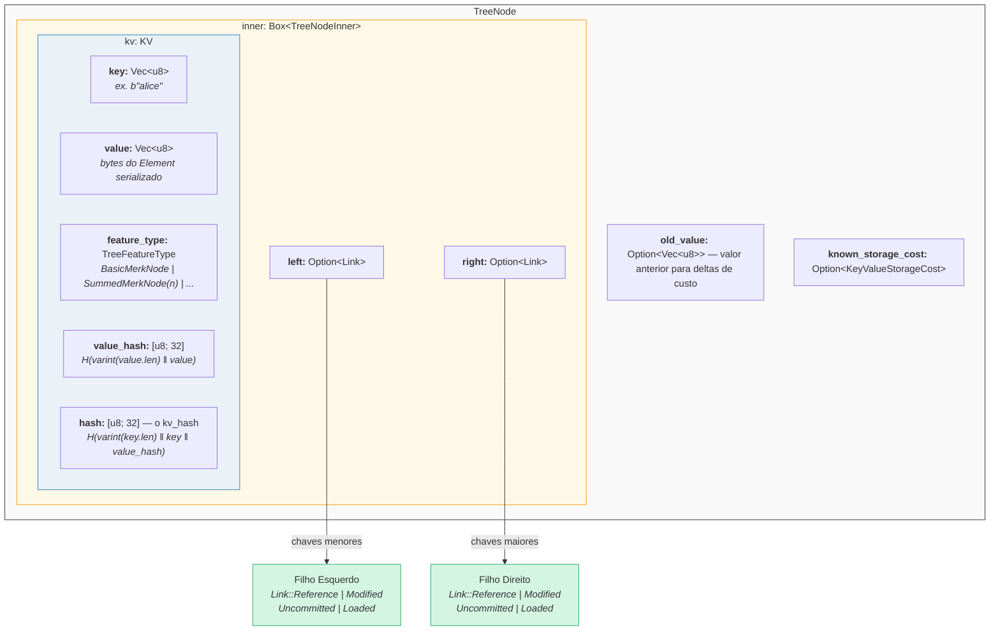

No codigo (`merk/src/tree/mod.rs`):

```rust
pub struct TreeNode {
    pub(crate) inner: Box<TreeNodeInner>,
    pub(crate) old_value: Option<Vec<u8>>,        // Valor anterior para rastreamento de custos
    pub(crate) known_storage_cost: Option<KeyValueStorageCost>,
}

pub struct TreeNodeInner {
    pub(crate) left: Option<Link>,    // Filho esquerdo (chaves menores)
    pub(crate) right: Option<Link>,   // Filho direito (chaves maiores)
    pub(crate) kv: KV,               // O payload chave-valor
}
```

O `Box<TreeNodeInner>` mantem o no no heap, o que e essencial ja que os links filhos
podem conter recursivamente instancias inteiras de `TreeNode`.

## A Estrutura KV

A struct `KV` armazena tanto os dados brutos quanto seus resumos criptograficos
(`merk/src/tree/kv.rs`):

```rust
pub struct KV {
    pub(super) key: Vec<u8>,                        // A chave de busca
    pub(super) value: Vec<u8>,                      // O valor armazenado
    pub(super) feature_type: TreeFeatureType,       // Comportamento de agregacao
    pub(crate) value_defined_cost: Option<ValueDefinedCostType>,
    pub(super) hash: CryptoHash,                    // kv_hash
    pub(super) value_hash: CryptoHash,              // H(value)
}
```

Dois pontos importantes:

1. **As chaves nao sao armazenadas em disco como parte do no codificado.** Elas sao
   armazenadas como a chave do RocksDB. Quando um no e decodificado do armazenamento,
   a chave e injetada externamente. Isso evita duplicar os bytes da chave.

2. **Dois campos de hash sao mantidos.** O `value_hash` e `H(value)` e o
   `hash` (kv_hash) e `H(key, value_hash)`. Manter ambos permite ao sistema de provas
   escolher quanta informacao revelar.

## A Natureza Semi-Balanceada — Como a AVL "Oscila"

Uma arvore Merk e uma **arvore AVL** — a classica arvore de busca binaria auto-balanceante
inventada por Adelson-Velsky e Landis. O invariante chave e:

> Para cada no, a diferenca de altura entre suas subarvores esquerda e direita e
> no maximo 1.

Isso e expresso como o **fator de balanceamento** (balance factor):

```text
balance_factor = right_height - left_height
```

Valores validos: **{-1, 0, 1}**

```rust
// merk/src/tree/mod.rs
pub const fn balance_factor(&self) -> i8 {
    let left_height = self.child_height(true) as i8;
    let right_height = self.child_height(false) as i8;
    right_height - left_height
}
```

Mas aqui esta o ponto sutil: embora cada no individual possa pender apenas um nivel,
essas inclinacoes podem se **acumular** ao longo da arvore. Por isso chamamos de
"semi-balanceada" — a arvore nao e perfeitamente balanceada como uma arvore binaria
completa.

Considere uma arvore de 10 nos. Uma arvore perfeitamente balanceada teria altura 4
(teto(log2(10+1))). Mas uma arvore AVL pode ter altura 5:

**Perfeitamente balanceada (altura 4)** — cada nivel completamente preenchido:

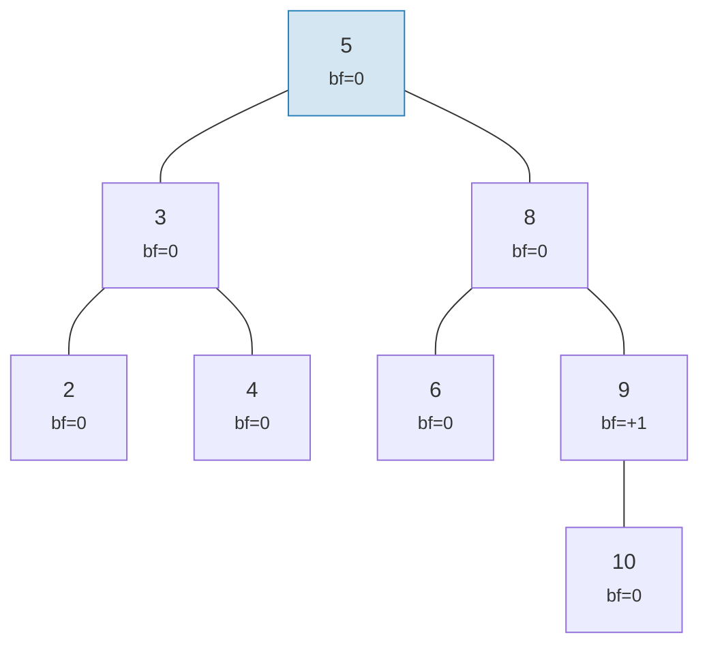

**"Oscilacao" valida na AVL (altura 5)** — cada no pende no maximo 1, mas se acumula:

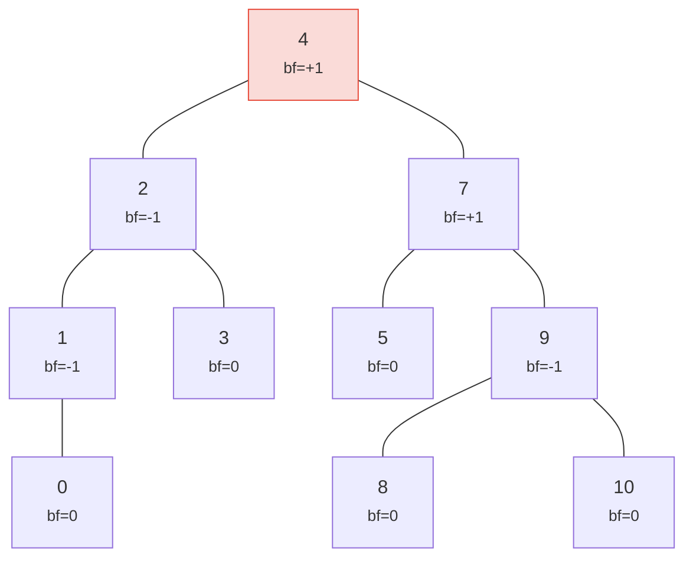

> Altura 5 vs a perfeita 4 — essa e a "oscilacao". Pior caso: h <= 1,44 x log2(n+2).

Ambas as arvores sao arvores AVL validas! A altura de pior caso de uma arvore AVL e:

```text
h <= 1,4404 x log2(n + 2) - 0,3277
```

Entao para **n = 1.000.000** nos:
- Balanceamento perfeito: altura 20
- Pior caso AVL: altura aproximadamente 29

Essa sobrecarga de ~44% e o preco das regras simples de rotacao da AVL. Na pratica,
insercoes aleatorias produzem arvores muito mais proximas do perfeitamente balanceado.

Aqui esta como arvores validas e invalidas se parecem:

**VALIDA** — todos os fatores de balanceamento em {-1, 0, +1}:

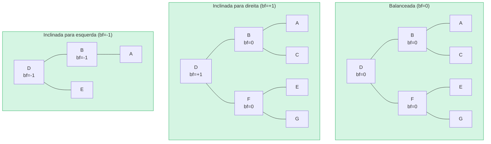

**INVALIDA** — fator de balanceamento = +2 (precisa de rotacao!):

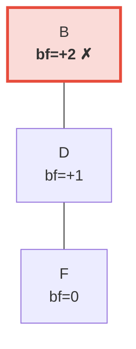

> A subarvore direita e 2 niveis mais alta que a esquerda (que esta vazia). Isso aciona uma **rotacao a esquerda** para restaurar o invariante AVL.

## Rotacoes — Restaurando o Balanceamento

Quando uma insercao ou remocao faz o fator de balanceamento atingir +/-2, a arvore deve
ser **rotacionada** para restaurar o invariante AVL. Existem quatro casos, reduziveis
a duas operacoes fundamentais.

### Rotacao Simples a Esquerda

Usada quando um no esta **pesado a direita** (bf = +2) e seu filho direito esta
**pesado a direita ou balanceado** (bf >= 0):

**Antes** (bf=+2):

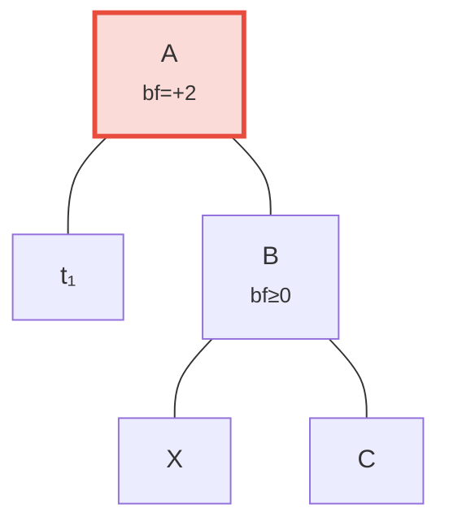

**Depois** da rotacao a esquerda — B promovido a raiz:

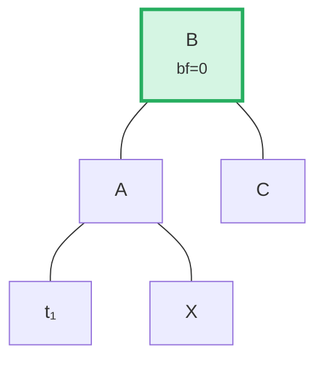

> **Passos:** (1) Desconectar B de A. (2) Desconectar X (filho esquerdo de B). (3) Conectar X como filho direito de A. (4) Conectar A como filho esquerdo de B. A subarvore com raiz em B agora esta balanceada.

No codigo (`merk/src/tree/ops.rs`):

```rust
fn rotate<V>(self, left: bool, ...) -> CostResult<Self, Error> {
    // Desconectar filho do lado pesado
    let (tree, child) = self.detach_expect(left, ...);
    // Desconectar neto do lado oposto do filho
    let (child, maybe_grandchild) = child.detach(!left, ...);

    // Conectar neto a raiz original
    tree.attach(left, maybe_grandchild)
        .maybe_balance(...)
        .flat_map_ok(|tree| {
            // Conectar raiz original como filho do no promovido
            child.attach(!left, Some(tree))
                .maybe_balance(...)
        })
}
```

Note como `maybe_balance` e chamado recursivamente — a propria rotacao pode criar
novos desbalanceamentos que precisam de correcao adicional.

### Rotacao Dupla (Esquerda-Direita)

Usada quando um no esta **pesado a esquerda** (bf = -2) mas seu filho esquerdo esta
**pesado a direita** (bf > 0). Uma rotacao simples nao resolveria:

**Passo 0: Antes** — C esta pesado a esquerda (bf=-2) mas seu filho esquerdo A pende para a direita (bf=+1). Uma rotacao simples nao resolve:

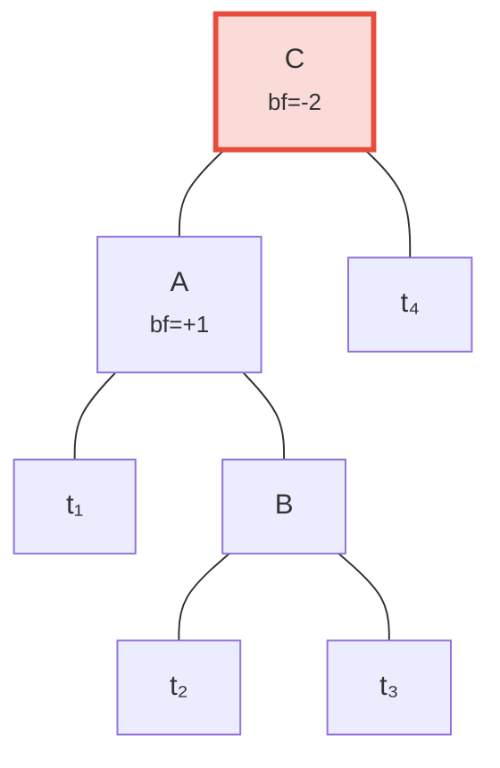

**Passo 1: Rotacionar filho A a esquerda** — agora tanto C quanto B pendem para a esquerda, corrigivel por uma rotacao simples:

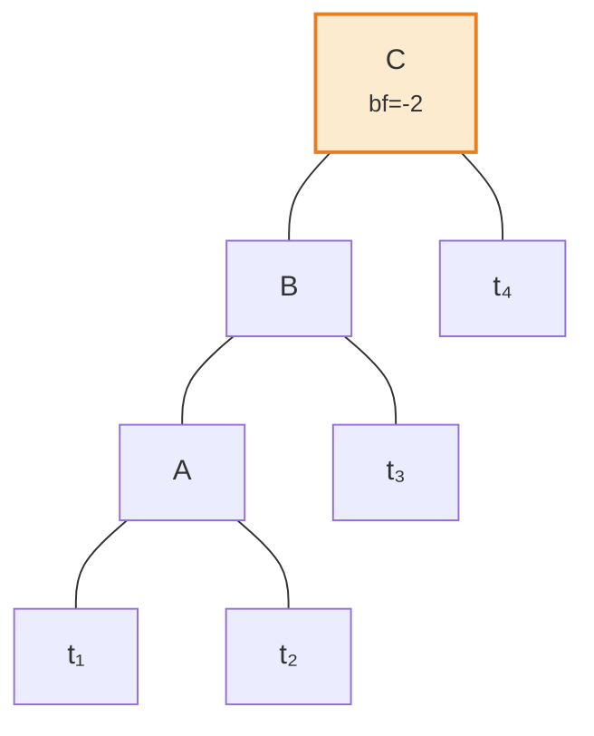

**Passo 2: Rotacionar raiz C a direita** — balanceada!

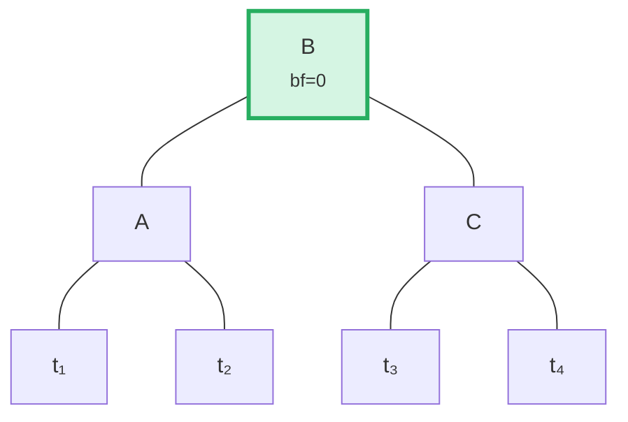

O algoritmo detecta esse caso comparando a direcao de inclinacao do pai com o fator de
balanceamento do filho:

```rust
fn maybe_balance<V>(self, ...) -> CostResult<Self, Error> {
    let balance_factor = self.balance_factor();
    if balance_factor.abs() <= 1 {
        return Ok(self);  // Ja balanceada
    }

    let left = balance_factor < 0;  // true se pesada a esquerda

    // Rotacao dupla necessaria quando o filho pende no sentido oposto ao pai
    let tree = if left == (self.tree().link(left).unwrap().balance_factor() > 0) {
        // Primeira rotacao: rotacionar filho na direcao oposta
        self.walk_expect(left, |child|
            child.rotate(!left, ...).map_ok(Some), ...
        )
    } else {
        self
    };

    // Segunda (ou unica) rotacao
    tree.rotate(left, ...)
}
```

## Operacoes em Lote — Construindo e Aplicando

Ao inves de inserir elementos um por vez, a Merk suporta operacoes em lote que
aplicam multiplas mudancas em uma unica passada. Isso e critico para eficiencia: um
lote de N operacoes em uma arvore de M elementos leva **O((M + N) log(M + N))** tempo,
versus O(N log M) para insercoes sequenciais.

### O Tipo MerkBatch

```rust
type MerkBatch<K> = [(K, Op)];

enum Op {
    Put(Vec<u8>, TreeFeatureType),  // Inserir ou atualizar com valor e tipo de feature
    PutWithSpecializedCost(...),     // Inserir com custo predefinido
    PutCombinedReference(...),       // Inserir referencia com hash combinado
    Replace(Vec<u8>, TreeFeatureType),
    Patch { .. },                    // Atualizacao parcial de valor
    Delete,                          // Remover chave
    DeleteLayered,                   // Remover com custo em camadas
    DeleteMaybeSpecialized,          // Remover com custo especializado opcional
}
```

### Estrategia 1: build() — Construindo do Zero

Quando a arvore esta vazia, `build()` constroi uma arvore balanceada diretamente a partir
do lote ordenado usando um algoritmo de **divisao pela mediana**:

Lote de entrada (ordenado): `[A, B, C, D, E, F, G]` — escolher o meio (D) como raiz, recursao em cada metade:

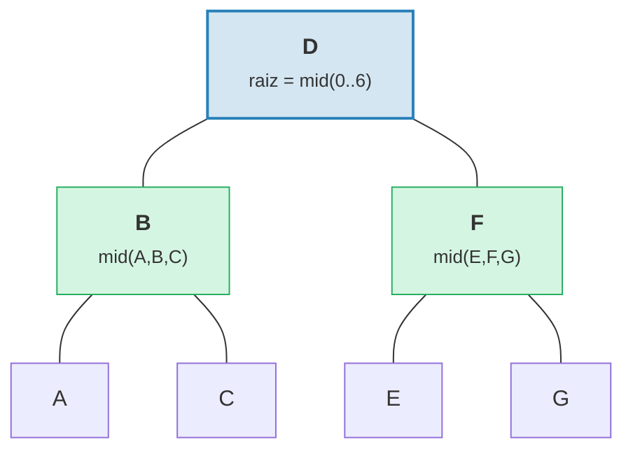

> Resultado: arvore perfeitamente balanceada com altura = 3 = teto(log2(7)).

```rust
fn build(batch: &MerkBatch<K>, ...) -> CostResult<Option<TreeNode>, Error> {
    let mid_index = batch.len() / 2;
    let (mid_key, mid_op) = &batch[mid_index];

    // Criar no raiz a partir do elemento central
    let mid_tree = TreeNode::new(mid_key.clone(), value.clone(), None, feature_type)?;

    // Recursivamente construir subarvores esquerda e direita
    let left = Self::build(&batch[..mid_index], ...);
    let right = Self::build(&batch[mid_index + 1..], ...);

    // Conectar filhos
    mid_tree.attach(true, left).attach(false, right)
}
```

Isso produz uma arvore com altura teto(log2(n)) — perfeitamente balanceada.

### Estrategia 2: apply_sorted() — Mesclando em Arvore Existente

Quando a arvore ja possui dados, `apply_sorted()` usa **busca binaria** para encontrar
onde cada operacao do lote pertence, e entao aplica recursivamente as operacoes nas
subarvores esquerda e direita:

Arvore existente com lote `[(B, Put), (F, Delete)]`:

Busca binaria: B < D (ir para esquerda), F > D (ir para direita).

**Antes:**
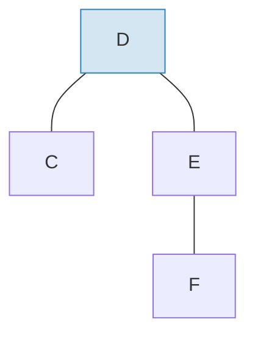

**Depois** de aplicar o lote e rebalancear:
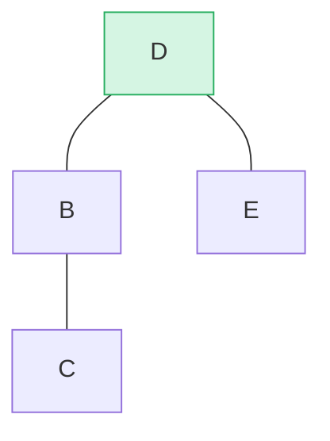

> B inserido como subarvore esquerda, F removido da subarvore direita. `maybe_balance()` confirma bf(D) = 0.

```rust
fn apply_sorted(self, batch: &MerkBatch<K>, ...) -> CostResult<...> {
    let search = batch.binary_search_by(|(key, _)| key.cmp(self.tree().key()));

    match search {
        Ok(index) => {
            // Chave corresponde a este no — aplicar operacao diretamente
            // (Put substitui valor, Delete remove no)
        }
        Err(mid) => {
            // Chave nao encontrada — mid e o ponto de divisao
            // Recursao em left_batch[..mid] e right_batch[mid..]
        }
    }

    self.recurse(batch, mid, exclusive, ...)
}
```

O metodo `recurse` divide o lote e percorre esquerda e direita:

```rust
fn recurse(self, batch: &MerkBatch<K>, mid: usize, ...) {
    let left_batch = &batch[..mid];
    let right_batch = &batch[mid..];  // ou mid+1 se exclusivo

    // Aplicar lote esquerdo na subarvore esquerda
    let tree = self.walk(true, |maybe_left| {
        Self::apply_to(maybe_left, left_batch, ...)
    });

    // Aplicar lote direito na subarvore direita
    let tree = tree.walk(false, |maybe_right| {
        Self::apply_to(maybe_right, right_batch, ...)
    });

    // Rebalancear apos modificacoes
    tree.maybe_balance(...)
}
```

### Remocao de No

Ao deletar um no com dois filhos, a Merk promove o **no de borda** da
subarvore mais alta. Isso minimiza a chance de precisar de rotacoes adicionais:

**Antes** — deletando D (tem dois filhos, altura da subarvore direita >= esquerda):

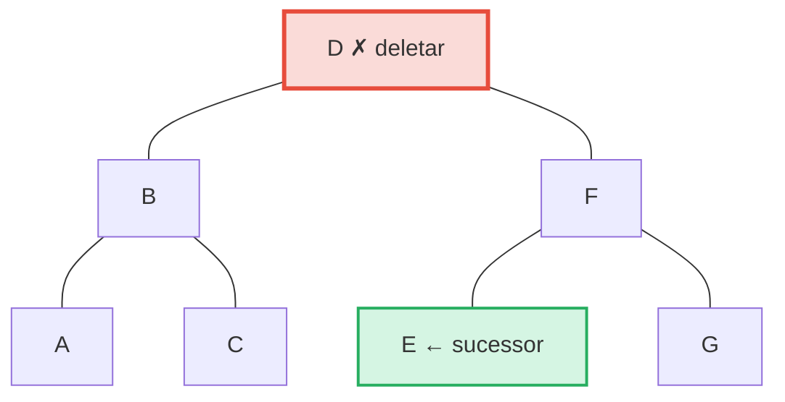

**Depois** — E (mais a esquerda na subarvore direita = sucessor em ordem) promovido a posicao de D:

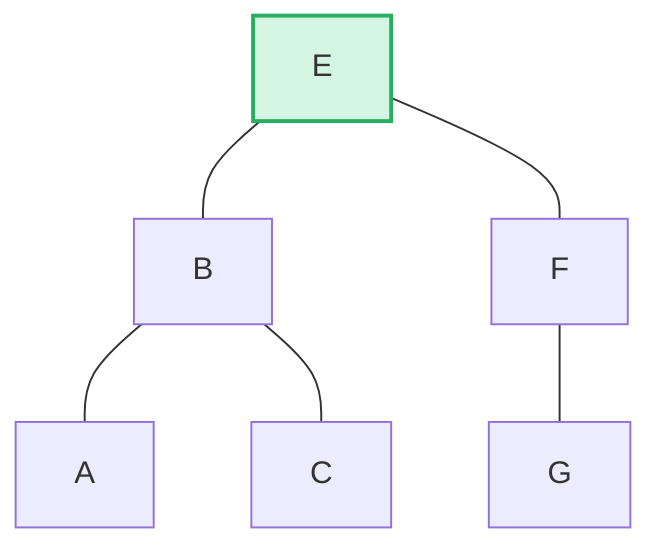

> **Regra:** Se altura esquerda > direita -> promover borda direita da subarvore esquerda. Se altura direita >= esquerda -> promover borda esquerda da subarvore direita. Isso minimiza o rebalanceamento apos a remocao.

```rust
pub fn remove(self, ...) -> CostResult<Option<Self>, Error> {
    let has_left = tree.link(true).is_some();
    let has_right = tree.link(false).is_some();
    let left = tree.child_height(true) > tree.child_height(false);

    if has_left && has_right {
        // Dois filhos: promover borda do filho mais alto
        let (tree, tall_child) = self.detach_expect(left, ...);
        let (_, short_child) = tree.detach_expect(!left, ...);
        tall_child.promote_edge(!left, short_child, ...)
    } else if has_left || has_right {
        // Um filho: promove-lo diretamente
        self.detach_expect(left, ...).1
    } else {
        // No folha: simplesmente remover
        None
    }
}
```

---
