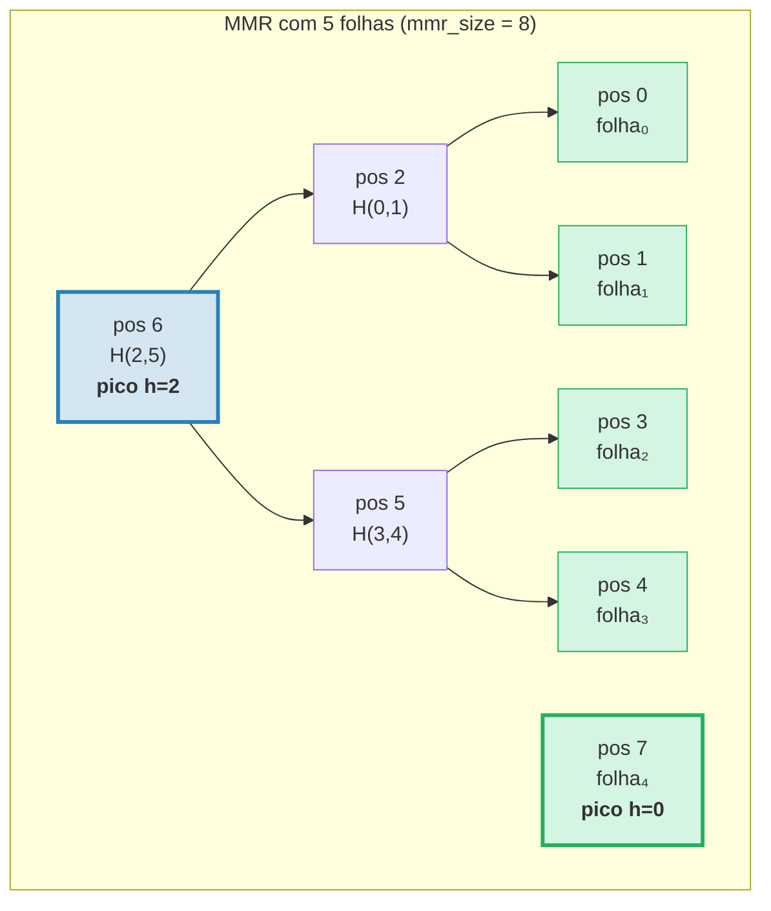
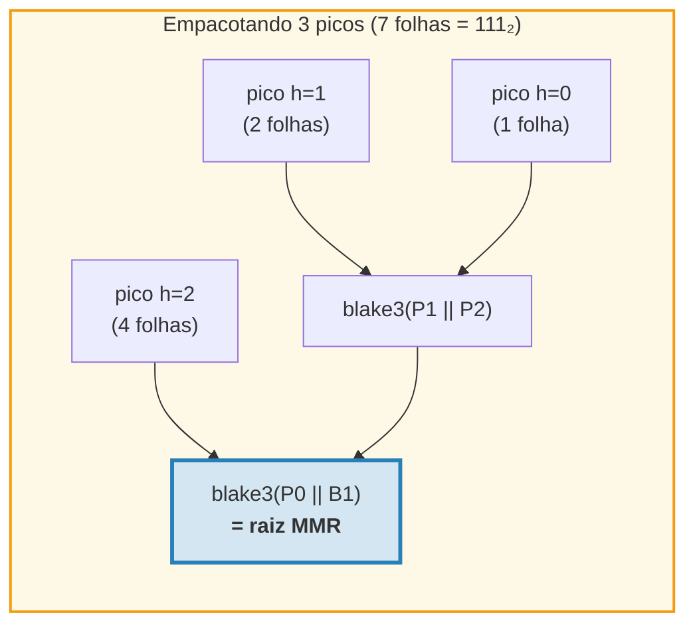
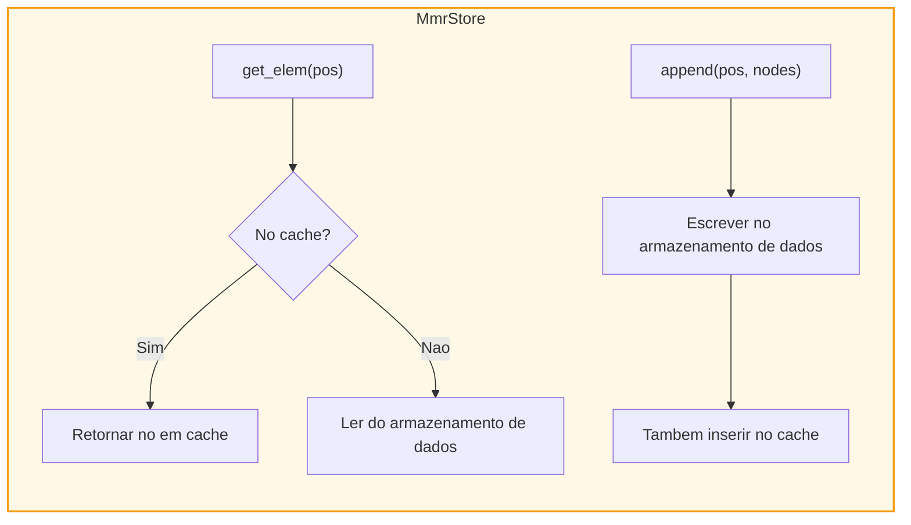
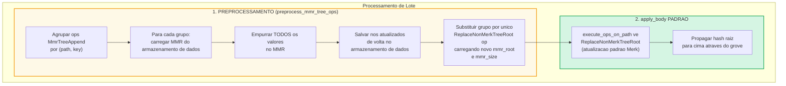
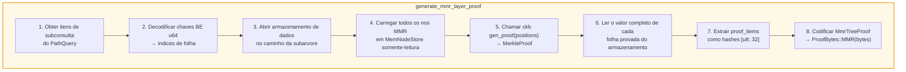
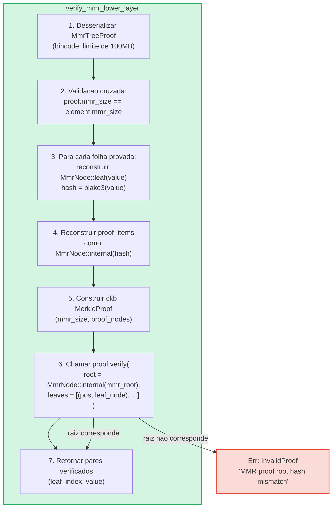

# A Arvore MMR — Logs Autenticados Apenas para Append

A **MmrTree** e a estrutura de dados autenticada apenas para append do GroveDB, construida
sobre um Merkle Mountain Range (MMR) com hashing Blake3. Enquanto as arvores AVL Merk
(Capitulo 2) se destacam em operacoes aleatorias de chave-valor com atualizacoes O(log N),
os MMRs sao construidos especificamente para o caso de apenas append: oferecem zero
rotacoes, custo de hash O(1) amortizado por append, e padroes de E/S sequenciais.

Este capitulo cobre a estrutura de dados MMR em profundidade — como ela cresce, como os
nos sao armazenados, como os appends cascateiam, e como o sistema de provas permite que
qualquer terceiro verifique que um valor especifico foi adicionado em uma posicao
especifica.

## Por que um Tipo de Arvore Separado?

As arvores Merk padrao do GroveDB lidam bem com dados chave-valor ordenados, mas
logs apenas para append tem requisitos diferentes:

| Propriedade | Arvore AVL Merk | MMR |
|-------------|----------------|-----|
| Operacoes | Inserir, atualizar, deletar | Apenas append |
| Rebalanceamento | O(log N) rotacoes por escrita | Nenhum |
| Padrao de E/S | Aleatorio (rebalanceamento toca muitos nos) | Sequencial (novos nos sempre no final) |
| Total de hashes para N insercoes | O(N log N) | O(N) |
| Estrutura | Determinada pela ordem de insercao | Determinada apenas pela contagem de folhas |
| Provas | Caminho da raiz a folha | Hashes de irmaos + picos |

Para casos de uso como logs de transacao, fluxos de eventos, ou qualquer dado que cresce
monotonicamente, o MMR e estritamente melhor: mais simples, mais rapido e mais previsivel.

## A Estrutura de Dados MMR

Um MMR e uma **floresta de arvores binarias perfeitas** (chamadas "picos") que cresce da
esquerda para a direita. Cada pico e uma arvore binaria completa de alguma altura *h*,
contendo exatamente 2^h folhas.

O insight chave: **a representacao binaria da contagem de folhas determina a estrutura
de picos**. Cada bit 1 na forma binaria corresponde a um pico:

```text
Contagem de folhas   Binario   Picos
─────────────────    ──────    ─────
1                    1         um pico h=0
2                    10        um pico h=1
3                    11        picos h=1, h=0
4                    100       um pico h=2
5                    101       picos h=2, h=0
6                    110       picos h=2, h=1
7                    111       picos h=2, h=1, h=0
8                    1000      um pico h=3
```

Isso significa que a estrutura do MMR e totalmente determinada por um unico numero — a
contagem de folhas. Dois MMRs com o mesmo numero de folhas sempre tem a mesma forma,
independentemente dos valores que foram adicionados.

## Como o MMR se Preenche

Cada no no MMR tem uma **posicao** (indexada a partir de 0). Folhas e nos internos sao
intercalados em um padrao especifico. Aqui esta o crescimento passo a passo:

**Apos 1 folha (mmr_size = 1):**
```text
pos:  0
      folha₀        ← um pico na altura 0
```

**Apos 2 folhas (mmr_size = 3):**
```text
pos:     2          ← interno: blake3(folha₀.hash || folha₁.hash)
        / \
       0   1        ← folhas

Um pico na altura 1. Posicoes 0 e 1 sao folhas, posicao 2 e interna.
```
Quando a folha₁ foi adicionada, criou um pico de altura 0. Mas ja havia um pico de
altura 0 (folha₀), entao eles **mesclaram** em um pico de altura 1.

**Apos 3 folhas (mmr_size = 4):**
```text
pos:     2     3    ← pico h=1, pico h=0
        / \
       0   1

Dois picos. Sem mesclagem — alturas 1 e 0 sao diferentes.
(Binario: 3 = 11₂ → um pico por bit 1)
```

**Apos 4 folhas (mmr_size = 7):**
```text
pos:         6              ← interno: mesclagem dos nos 2 e 5
           /   \
         2       5          ← nos internos
        / \     / \
       0   1   3   4        ← folhas

Um pico na altura 2.
```
Aqui fica interessante. Adicionar a folha₃ (posicao 4) cria o no₅ (mesclando as
posicoes 3 e 4). Mas agora o no₅ (altura 1) e o no₂ (altura 1) sao picos adjacentes de
mesma altura, entao mesclam no no₆. **Uma cascata de duas mesclagens a partir de um
unico append.**

**Apos 5 folhas (mmr_size = 8):**
```text
pos:         6         7    ← pico h=2, pico h=0
           /   \
         2       5
        / \     / \
       0   1   3   4

Dois picos. (Binario: 5 = 101₂)
```

**Apos 7 folhas (mmr_size = 11):**
```text
pos:         6         10    ← pico h=2, pico h=1, pico h=0
           /   \      / \
         2       5   8   9    7
        / \     / \
       0   1   3   4

Tres picos. (Binario: 7 = 111₂)
```

**Apos 8 folhas (mmr_size = 15):**
```text
pos:              14                     ← pico unico h=3
               /      \
            6            13
          /   \        /    \
        2       5    9       12
       / \     / \  / \     / \
      0   1   3  4 7   8  10  11

Um pico na altura 3. Tres mesclagens em cascata ao adicionar a folha₇.
```



> **Azul** = picos (raizes de subarvores binarias perfeitas). **Verde** = nos folha.

## A Cascata de Mesclagem

Quando uma nova folha e adicionada, pode acionar uma cadeia de mesclagens. O numero de
mesclagens e igual ao numero de **bits 1 finais** na representacao binaria da contagem
atual de folhas:

| Contagem de folhas (antes do push) | Binario | 1s finais | Mesclagens | Total de hashes |
|-------------------------------------|---------|-----------|------------|-----------------|
| 0 | `0` | 0 | 0 | 1 (apenas folha) |
| 1 | `1` | 1 | 1 | 2 |
| 2 | `10` | 0 | 0 | 1 |
| 3 | `11` | 2 | 2 | 3 |
| 4 | `100` | 0 | 0 | 1 |
| 5 | `101` | 1 | 1 | 2 |
| 6 | `110` | 0 | 0 | 1 |
| 7 | `111` | 3 | 3 | 4 |

**Total de hashes por push** = `1 + trailing_ones(leaf_count)`:
- 1 hash para a propria folha: `blake3(value)`
- N hashes para a cascata de mesclagem: `blake3(left.hash || right.hash)` para cada
  mesclagem

E assim que o GroveDB rastreia os custos de hash para cada append. A implementacao:
```rust
pub fn hash_count_for_push(leaf_count: u64) -> u32 {
    1 + leaf_count.trailing_ones()
}
```

## Tamanho do MMR vs Contagem de Folhas

O MMR armazena tanto folhas quanto nos internos em um espaco de posicoes plano, entao
`mmr_size` e sempre maior que a contagem de folhas. A relacao exata e:

```text
mmr_size = 2 * leaf_count - popcount(leaf_count)
```

onde `popcount` e o numero de bits 1 (ou seja, o numero de picos). Cada no interno
mescla duas subarvores, reduzindo a contagem de nos em uma por mesclagem.

A computacao reversa — contagem de folhas a partir do mmr_size — usa as posicoes dos picos:

```rust
fn mmr_size_to_leaf_count(mmr_size: u64) -> u64 {
    // Cada pico na altura h contem 2^h folhas
    get_peaks(mmr_size).iter()
        .map(|&peak_pos| 1u64 << pos_height_in_tree(peak_pos))
        .sum()
}
```

| mmr_size | leaf_count | picos |
|----------|-----------|-------|
| 0 | 0 | (vazio) |
| 1 | 1 | h=0 |
| 3 | 2 | h=1 |
| 4 | 3 | h=1, h=0 |
| 7 | 4 | h=2 |
| 8 | 5 | h=2, h=0 |
| 10 | 6 | h=2, h=1 |
| 11 | 7 | h=2, h=1, h=0 |
| 15 | 8 | h=3 |

O GroveDB armazena `mmr_size` no Element (nao a contagem de folhas) porque a biblioteca
ckb MMR usa posicoes internamente. A operacao `mmr_tree_leaf_count` deriva a contagem de
folhas em tempo real.

## Hash Raiz do MMR — Empacotando os Picos

Um MMR tem multiplos picos (um por bit 1 na contagem de folhas). Para produzir um unico
hash raiz de 32 bytes, os picos sao **"empacotados"** (bagged) da direita para a esquerda:

```text
root = bag_rhs_peaks(peaks):
    comecar com o pico mais a direita
    dobrar para a esquerda: blake3(pico_esquerdo || acumulado_direito)
```

Com 1 pico, a raiz e apenas o hash desse pico. Com 3 picos:



> O hash raiz muda a **cada** append, mesmo quando nenhuma mesclagem ocorre, porque o
> pico mais a direita muda e o empacotamento deve ser recalculado.

## Estrutura do No e Serializacao

Cada no do MMR e um `MmrNode`:

```rust
struct MmrNode {
    hash: [u8; 32],           // Hash Blake3
    value: Option<Vec<u8>>,   // Some para folhas, None para nos internos
}
```

**No folha:** `hash = blake3(value_bytes)`, `value = Some(value_bytes)`
**No interno:** `hash = blake3(left.hash || right.hash)`, `value = None`

A funcao de mesclagem e direta — concatenar dois hashes de 32 bytes e aplicar Blake3
no resultado:

```rust
fn blake3_merge(left: &[u8; 32], right: &[u8; 32]) -> [u8; 32] {
    let mut input = [0u8; 64];
    input[..32].copy_from_slice(left);
    input[32..].copy_from_slice(right);
    *blake3::hash(&input).as_bytes()
}
```

> **Nota sobre PartialEq:** `MmrNode` implementa `PartialEq` comparando **apenas
> o campo hash**, nao o valor. Isso e critico para verificacao de provas: o verificador
> do ckb compara uma raiz reconstruida (value = None) contra a raiz esperada. Se
> PartialEq comparasse o campo value, provas de MMR com uma unica folha sempre
> falhariam porque a folha tem `value: Some(...)` mas a reconstrucao da raiz
> produz `value: None`.

**Formato de serializacao:**
```text
Interno: [0x00] [hash: 32 bytes]                                = 33 bytes
Folha:   [0x01] [hash: 32 bytes] [value_len: 4 BE] [value...]   = 37 + len bytes
```

O byte de flag distingue nos internos de folhas. A desserializacao valida o
comprimento exato — nenhum byte final e permitido.

## Arquitetura de Armazenamento

A MmrTree armazena seus nos na coluna de **dados** (a mesma familia de colunas usada
pelos nos Merk), nao em uma subarvore Merk filha. O Element nao tem campo `root_key`
— o hash raiz do MMR flui como o **hash filho** da Merk via
`insert_subtree(subtree_root_hash)`, autenticando o estado do MMR.

**Chaves de armazenamento** sao baseadas em posicao:
```text
key = 'm' || position_as_be_u64    (9 bytes: prefixo + u64 BE)
```

Entao a posicao 42 e armazenada na chave `[0x6D, 0x00, 0x00, 0x00, 0x00, 0x00, 0x00,
0x00, 0x2A]`.

Buscar a folha *i* requer computar a posicao no MMR primeiro:
`pos = leaf_index_to_pos(i)`, e entao ler a chave de dados `m{pos}`.

**Cache de escrita direta:** Durante os appends, nos recem-escritos devem ser
imediatamente legiveis para mesclagens subsequentes no mesmo push. Como o
armazenamento transacional do GroveDB adia escritas para um lote (nao sao visiveis
para leituras ate o commit), um adaptador `MmrStore` envolve o contexto de
armazenamento com um cache `HashMap` em memoria:



Isso garante que quando a adicao da folha₃ aciona uma cascata de mesclagem (criando
nos internos nas posicoes 5 e 6), o no₅ esta imediatamente disponivel ao computar
o no₆, mesmo que o no₅ nao tenha sido commitado no RocksDB ainda.

**Propagacao do hash raiz para o hash raiz de estado do GroveDB:**

```text
combined_value_hash = blake3(
    blake3(varint(len) || element_bytes),   ← value_hash do Element serializado
    mmr_root_hash                           ← child_hash = raiz especifica do tipo
)
```

O hash raiz do MMR flui como o hash filho da Merk via `insert_subtree`. Qualquer
alteracao no estado do MMR produz um `combined_value_hash` diferente, que propaga para
cima atraves da hierarquia Merk pai ate o hash raiz de estado do GroveDB.

## Operacoes do GroveDB

A MmrTree fornece quatro operacoes:

```rust
// Adicionar um valor — retorna (new_mmr_root, leaf_index)
db.mmr_tree_append(path, key, value, tx, version)

// Ler o hash raiz atual (do Element, sem acesso ao armazenamento)
db.mmr_tree_root_hash(path, key, tx, version)

// Obter um valor de folha pelo indice baseado em 0
db.mmr_tree_get_value(path, key, leaf_index, tx, version)

// Obter o numero de folhas adicionadas
db.mmr_tree_leaf_count(path, key, tx, version)
```

### Fluxo de Append

A operacao de append e a mais complexa, executando 8 passos:

```mermaid
graph TD
    subgraph append["mmr_tree_append(path, key, value, tx)"]
        A1["1. Ler Element em path/key<br/>→ obter mmr_size, flags"]
        A2["2. Abrir armazenamento de dados<br/>na subarvore path/key"]
        A3["3. Criar MmrNode::leaf(value)<br/>hash = blake3(value)"]
        A4["4. Empurrar folha no ckb MMR<br/>→ mesclagens em cascata escrevem<br/>novos nos internos"]
        A5["5. Commit → descarregar novos<br/>nos no armazenamento"]
        A6["6. Empacotar picos → novo mmr_root"]
        A7["7. Atualizar Element com<br/>novo mmr_root e mmr_size"]
        A8["8. Propagar alteracoes para cima<br/>atraves da hierarquia Merk<br/>do GroveDB + commitar tx"]

        A1 --> A2 --> A3 --> A4 --> A5 --> A6 --> A7 --> A8
    end

    style append fill:#d5f5e3,stroke:#27ae60,stroke-width:2px
    style A6 fill:#d4e6f1,stroke:#2980b9,stroke-width:2px
```



O passo 4 pode escrever 1 no (apenas folha) ou 1 + N nos (folha + N nos internos de
mesclagem). O passo 5 chama `mmr.commit()` que descarrega o MemStore do ckb para o
MmrStore. O passo 7 chama `insert_subtree` com a nova raiz MMR como o hash filho
(via `subtree_root_hash`), ja que a MmrTree nao tem Merk filha.

### Operacoes de Leitura

`mmr_tree_root_hash` computa a raiz dos dados MMR no armazenamento.
`mmr_tree_leaf_count` deriva a contagem de folhas do `mmr_size` no Element.
Nenhum acesso ao armazenamento de dados e necessario.

`mmr_tree_get_value` computa `pos = leaf_index_to_pos(leaf_index)`, le a entrada
unica de armazenamento de dados em `m{pos}`, desserializa o `MmrNode`, e retorna
`node.value`.

## Operacoes em Lote

Multiplos appends de MMR podem ser agrupados usando `GroveOp::MmrTreeAppend { value }`.
Como a funcao padrao de lote `execute_ops_on_path` so tem acesso a Merk (nao ao contexto
de armazenamento do MMR), os appends de MMR usam uma **fase de preprocessamento**:



Exemplo: Um lote com 3 appends para o mesmo MMR:
```rust
vec![
    QualifiedGroveDbOp { path: p, key: k, op: MmrTreeAppend { value: v1 } },
    QualifiedGroveDbOp { path: p, key: k, op: MmrTreeAppend { value: v2 } },
    QualifiedGroveDbOp { path: p, key: k, op: MmrTreeAppend { value: v3 } },
]
```

O preprocessamento carrega o MMR uma vez, empurra v1, v2, v3 (criando todos os nos
intermediarios), salva tudo no armazenamento de dados, e entao emite um unico
`ReplaceNonMerkTreeRoot` com o `mmr_root` e `mmr_size` finais. A maquinaria padrao
de lote cuida do resto.

## Geracao de Provas

As provas MMR sao **provas V1** — usam a variante `ProofBytes::MMR` na estrutura de
prova em camadas (veja secao 9.6). A prova demonstra que valores de folha especificos
existem em posicoes especificas dentro do MMR, e que seus hashes sao consistentes com
o `mmr_root` armazenado no elemento pai.

### Codificacao de Consulta

As chaves de consulta codificam posicoes como **bytes u64 big-endian**. Isso preserva
a ordem de classificacao lexicografica (ja que a codificacao BE e monotonica), permitindo
que todas as variantes padrao de `QueryItem` funcionem:

```text
QueryItem::Key([0,0,0,0,0,0,0,5])            → indice de folha 5
QueryItem::RangeInclusive([..2]..=[..7])      → indices de folha [2, 3, 4, 5, 6, 7]
QueryItem::RangeFrom([..10]..)                → indices de folha [10, 11, ..., N-1]
QueryItem::RangeFull                          → todas as folhas [0..leaf_count)
```

Um limite de seguranca de **10.000.000 indices** previne esgotamento de memoria de
consultas de faixa ilimitadas. Um MMR vazio (zero folhas) retorna uma prova vazia.

### A Estrutura MmrTreeProof

```rust
struct MmrTreeProof {
    mmr_size: u64,                 // Tamanho do MMR no momento da prova
    leaves: Vec<(u64, Vec<u8>)>,   // (leaf_index, value) para cada folha provada
    proof_items: Vec<[u8; 32]>,    // Hashes de irmaos/picos para verificacao
}
```

Os `proof_items` contem o conjunto minimo de hashes necessarios para reconstruir
os caminhos das folhas provadas ate a raiz do MMR. Estes sao os nos irmaos em cada
nivel e os hashes de pico nao envolvidos.

### Fluxo de Geracao



O passo 4 usa um `MemNodeStore` — um BTreeMap somente-leitura que pre-carrega todos os
nos MMR do armazenamento de dados. O gerador de provas ckb precisa de acesso aleatorio,
entao todos os nos devem estar na memoria.

O passo 5 e onde a biblioteca ckb faz o trabalho pesado: dados o tamanho do MMR e as
posicoes a provar, ela determina quais hashes de irmaos e picos sao necessarios.

### Exemplo Detalhado

**Provando a folha 2 em um MMR de 5 folhas (mmr_size = 8):**

```text
Estrutura do MMR:
pos:         6         7
           /   \
         2       5
        / \     / \
       0   1   3   4

Indice de folha 2 → posicao MMR 3

Para verificar a folha na posicao 3:
  1. Hash do valor alegado: leaf_hash = blake3(value)
  2. Irmao na posicao 4:  no₅ = blake3(leaf_hash || proof[pos 4])
  3. Irmao na posicao 2:  no₆ = blake3(proof[pos 2] || no₅)
  4. Pico na posicao 7:   raiz = bag(no₆, proof[pos 7])
  5. Comparar: raiz == mmr_root esperado ✓

proof_items = [hash(pos 4), hash(pos 2), hash(pos 7)]
leaves = [(2, original_value_bytes)]
```

O tamanho da prova para este exemplo e: 3 hashes (96 bytes) + 1 valor de folha +
metadados. Em geral, provar K folhas de um MMR de N folhas requer
O(K * log N) hashes de irmaos.

## Verificacao de Provas

A verificacao e **pura** — nao requer acesso ao banco de dados. O verificador precisa
apenas dos bytes da prova e do hash raiz esperado do MMR (que ele extrai do elemento
pai provado na camada Merk acima).

### Passos de Verificacao



A funcao `MerkleProof::verify` do ckb reconstroi a raiz a partir das folhas e dos itens
de prova, e entao compara (usando `PartialEq`, que verifica apenas o hash) contra a
raiz esperada.

### Cadeia de Confianca

A cadeia completa do hash raiz de estado do GroveDB ate um valor de folha verificado:

```text
state_root do GroveDB (conhecido/confiavel)
│
├─ Camada de prova V0 Merk 0: prova que a subarvore existe na raiz
│   └─ root_hash corresponde ao state_root ✓
│
├─ Camada de prova V0 Merk 1: prova o elemento MmrTree em path/key
│   └─ No KVValueHash: element_bytes contem mmr_root
│   └─ combined_hash = combine_hash(H(element_bytes), mmr_root)
│   └─ root_hash corresponde a camada pai ✓
│
└─ Prova V1 MMR: prova que valores de folha estao no MMR
    └─ Reconstruir caminhos das folhas atraves dos irmaos ate os picos
    └─ Empacotar picos → raiz reconstruida
    └─ raiz reconstruida == mmr_root dos element_bytes ✓
    └─ Resultado: folha₂ = [bytes do valor verificado]
```

### Propriedades de Seguranca

- **Validacao cruzada do mmr_size:** O `mmr_size` da prova deve corresponder ao
  `mmr_size` do elemento. Uma divergencia indica que a prova foi gerada contra um
  estado diferente e e rejeitada.
- **Limite de tamanho bincode:** A desserializacao usa um limite de 100MB para evitar
  que cabecalhos de comprimento forjados causem alocacoes enormes.
- **Contabilizacao de limite:** Cada folha provada decrementa o limite geral da consulta
  em 1 usando `saturating_sub` para evitar underflow.
- **Retorno do hash filho:** O verificador retorna a raiz MMR computada como o hash
  filho para a computacao combine_hash na camada pai.
- **Rejeicao V0:** Tentar uma subconsulta em uma MmrTree com provas V0 retorna
  `Error::NotSupported`. Apenas provas V1 podem descer em arvores nao-Merk.

## Rastreamento de Custos

As operacoes MMR rastreiam custos com precisao:

| Operacao | Chamadas de hash | Operacoes de armazenamento |
|----------|-----------------|---------------------------|
| Append 1 folha | `1 + trailing_ones(leaf_count)` | 1 escrita de folha + N escritas internas |
| Hash raiz | 0 (em cache no Element) | 1 leitura de Element |
| Obter valor | 0 | 1 leitura de Element + 1 leitura de dados |
| Contagem de folhas | 0 | 1 leitura de Element |

A formula de contagem de hash `1 + trailing_ones(N)` da o numero exato de chamadas
Blake3: 1 para o hash da folha, mais um hash de mesclagem por nivel de cascata.

**Analise amortizada:** Em N appends, a contagem total de hash e:

```text
Soma (1 + trailing_ones(i)) para i = 0..N-1
= N + Soma trailing_ones(i) para i = 0..N-1
= N + (N - popcount(N))
≈ 2N
```

Entao o custo amortizado por append e aproximadamente **2 chamadas de hash Blake3** —
constante e independente do tamanho da arvore. Compare com as arvores AVL Merk onde
cada insercao requer O(log N) hashes para o caminho mais potenciais hashes de rotacao.

**Custo de armazenamento:** Cada append escreve 1 no folha (37 + value_len bytes) mais
0 a log₂(N) nos internos (33 bytes cada). A escrita de armazenamento amortizada por
append e aproximadamente 33 + 37 + value_len bytes ≈ 70 + value_len bytes.

## Arquivos de Implementacao

| Arquivo | Proposito |
|---------|-----------|
| `grovedb-mmr/src/node.rs` | Struct `MmrNode`, mesclagem Blake3, serializacao |
| `grovedb-mmr/src/grove_mmr.rs` | Wrapper `GroveMmr` em torno do ckb MMR |
| `grovedb-mmr/src/util.rs` | `mmr_node_key`, `hash_count_for_push`, `mmr_size_to_leaf_count` |
| `grovedb-mmr/src/proof.rs` | Geracao e verificacao de `MmrTreeProof` |
| `grovedb-mmr/src/dense_merkle.rs` | Raizes de arvore de Merkle densa (usadas pela BulkAppendTree) |
| `grovedb/src/operations/mmr_tree.rs` | Operacoes GroveDB + adaptador `MmrStore` + preprocessamento de lote |
| `grovedb/src/operations/proof/generate.rs` | Geracao de prova V1: `generate_mmr_layer_proof`, `query_items_to_leaf_indices` |
| `grovedb/src/operations/proof/verify.rs` | Verificacao de prova V1: `verify_mmr_lower_layer` |
| `grovedb/src/tests/mmr_tree_tests.rs` | 28 testes de integracao |

## Comparacao com Outras Estruturas Autenticadas

| | MMR (MmrTree) | AVL Merk (Tree) | Sinsemilla (CommitmentTree) |
|---|---|---|---|
| **Caso de uso** | Logs apenas append | Armazem chave-valor | Compromissos amigaveis a ZK |
| **Funcao de hash** | Blake3 | Blake3 | Sinsemilla (curva Pallas) |
| **Operacoes** | Append, ler por indice | Inserir, atualizar, deletar, consultar | Append, witness |
| **Hash amortizado/escrita** | ~2 | O(log N) | ~33 (32 niveis + ommers) |
| **Tipo de prova** | V1 (hashes de irmaos MMR) | V0 (prova de caminho Merk) | Witness (caminho de auth Merkle) |
| **Amigavel a ZK** | Nao | Nao | Sim (circuitos Halo 2) |
| **Rebalanceamento** | Nenhum | Rotacoes AVL | Nenhum |
| **Suporte a delete** | Nao | Sim | Nao |

---
