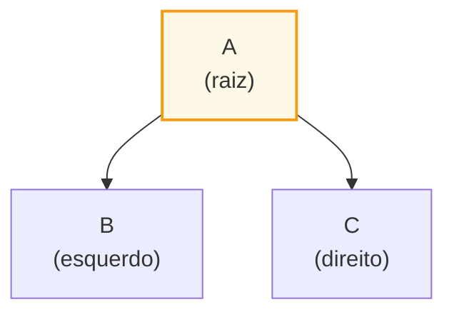
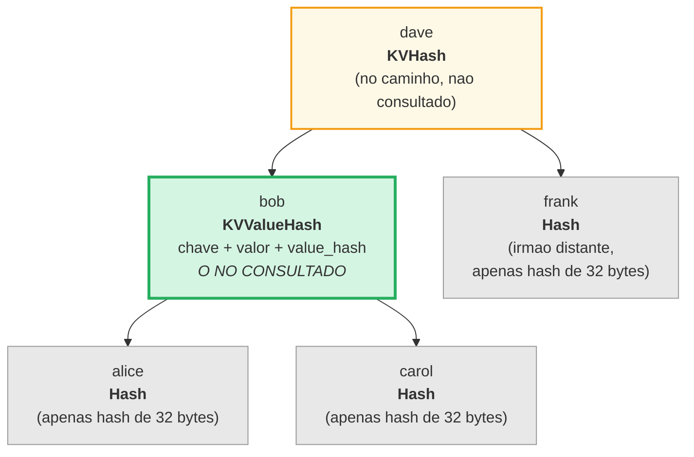
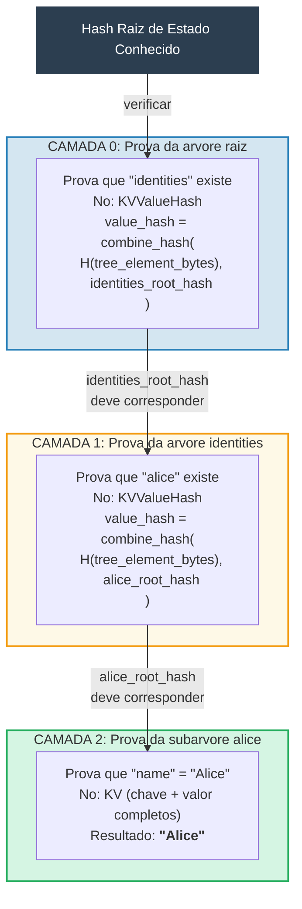
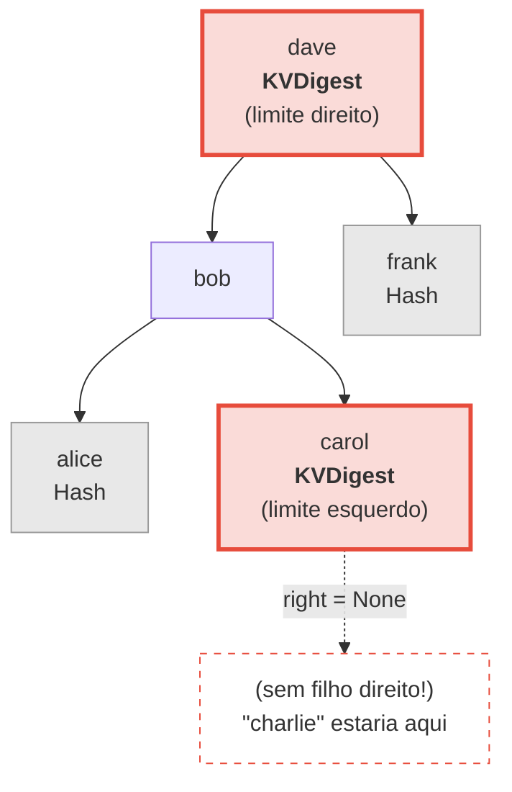
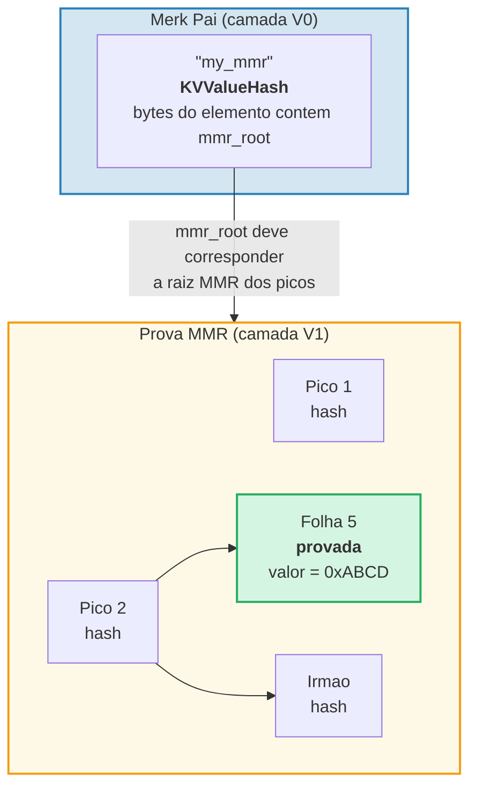
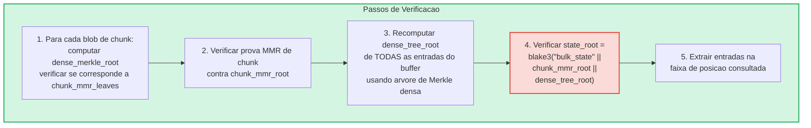
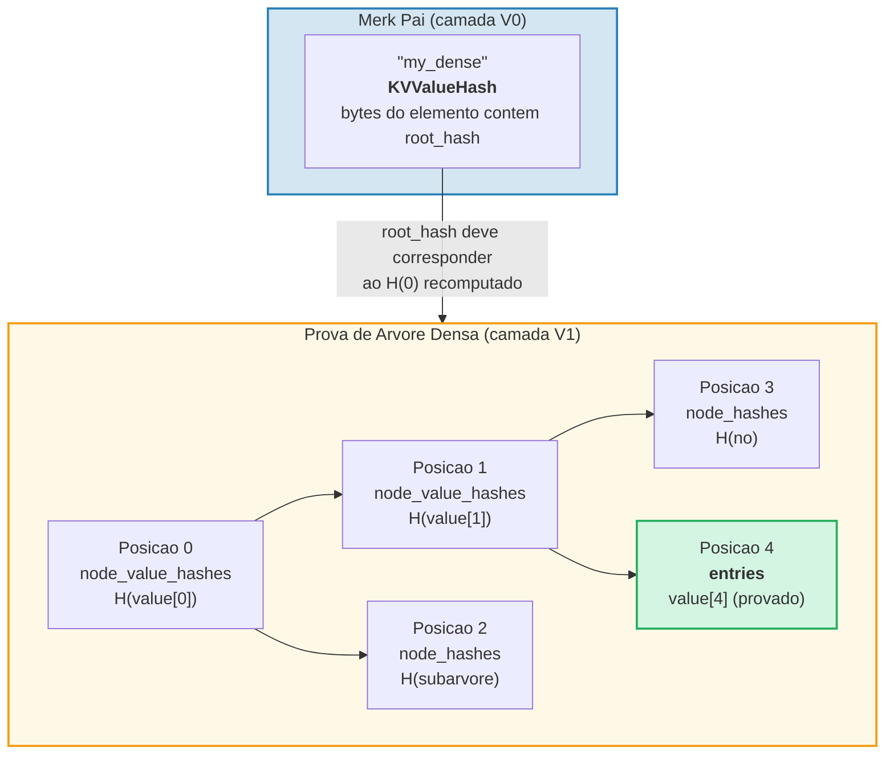

# O Sistema de Provas

O sistema de provas do GroveDB permite que qualquer parte verifique a correcao dos
resultados de consultas sem ter o banco de dados completo. Uma prova e uma representacao
compacta da estrutura de arvore relevante que permite a reconstrucao do hash raiz.

## Operacoes de Prova Baseadas em Pilha

As provas sao codificadas como uma sequencia de **operacoes** que reconstroem uma arvore
parcial usando uma maquina de pilha (stack machine):

```rust
// merk/src/proofs/mod.rs
pub enum Op {
    Push(Node),        // Empurrar um no na pilha (ordem crescente de chave)
    PushInverted(Node),// Empurrar um no (ordem decrescente de chave)
    Parent,            // Desempilhar pai, desempilhar filho → conectar filho como ESQUERDO do pai
    Child,             // Desempilhar filho, desempilhar pai → conectar filho como DIREITO do pai
    ParentInverted,    // Desempilhar pai, desempilhar filho → conectar filho como DIREITO do pai
    ChildInverted,     // Desempilhar filho, desempilhar pai → conectar filho como ESQUERDO do pai
}
```

A execucao usa uma pilha:

Ops da prova: `Push(B), Push(A), Parent, Push(C), Child`

| Passo | Operacao | Pilha (topo→direita) | Acao |
|-------|----------|----------------------|------|
| 1 | Push(B) | [ B ] | Empurrar B na pilha |
| 2 | Push(A) | [ B , A ] | Empurrar A na pilha |
| 3 | Parent | [ A{left:B} ] | Desempilhar A (pai), desempilhar B (filho), B → ESQUERDO de A |
| 4 | Push(C) | [ A{left:B} , C ] | Empurrar C na pilha |
| 5 | Child | [ A{left:B, right:C} ] | Desempilhar C (filho), desempilhar A (pai), C → DIREITO de A |

Resultado final — uma arvore na pilha:



> O verificador computa `node_hash(A) = Blake3(kv_hash_A || node_hash_B || node_hash_C)` e verifica se corresponde ao hash raiz esperado.

Esta e a funcao `execute` (`merk/src/proofs/tree.rs`):

```rust
pub fn execute<I, F>(ops: I, collapse: bool, mut visit_node: F) -> CostResult<Tree, Error>
where
    I: IntoIterator<Item = Result<Op, Error>>,
    F: FnMut(&Node) -> Result<(), Error>,
{
    let mut stack: Vec<Tree> = Vec::with_capacity(32);

    for op in ops {
        match op? {
            Op::Parent => {
                let (mut parent, child) = (try_pop(&mut stack), try_pop(&mut stack));
                parent.left = Some(Child { tree: Box::new(child), hash: child.hash() });
                stack.push(parent);
            }
            Op::Child => {
                let (child, mut parent) = (try_pop(&mut stack), try_pop(&mut stack));
                parent.right = Some(Child { tree: Box::new(child), hash: child.hash() });
                stack.push(parent);
            }
            Op::Push(node) => {
                visit_node(&node)?;
                stack.push(Tree::from(node));
            }
            // ... Variantes Inverted trocam esquerda/direita
        }
    }
    // Item final na pilha e a raiz
}
```

## Tipos de No em Provas

Cada `Push` carrega um `Node` que contem informacao suficiente para
verificacao:

```rust
pub enum Node {
    // Informacao minima — apenas o hash. Usado para irmaos distantes.
    Hash(CryptoHash),

    // Hash KV para nos no caminho mas nao consultados.
    KVHash(CryptoHash),

    // Chave-valor completo para itens consultados.
    KV(Vec<u8>, Vec<u8>),

    // Chave, valor e value_hash pre-computado.
    // Usado para subarvores onde value_hash = combine_hash(...)
    KVValueHash(Vec<u8>, Vec<u8>, CryptoHash),

    // KV com tipo de feature — para ProvableCountTree ou restauracao de chunks.
    KVValueHashFeatureType(Vec<u8>, Vec<u8>, CryptoHash, TreeFeatureType),

    // Referencia: chave, valor desreferenciado, hash do elemento de referencia.
    KVRefValueHash(Vec<u8>, Vec<u8>, CryptoHash),

    // Para itens em ProvableCountTree.
    KVCount(Vec<u8>, Vec<u8>, u64),

    // Hash KV + contagem para nos nao consultados de ProvableCountTree.
    KVHashCount(CryptoHash, u64),

    // Referencia em ProvableCountTree.
    KVRefValueHashCount(Vec<u8>, Vec<u8>, CryptoHash, u64),

    // Para provas de limite/ausencia em ProvableCountTree.
    KVDigestCount(Vec<u8>, CryptoHash, u64),

    // Chave + value_hash para provas de ausencia (arvores regulares).
    KVDigest(Vec<u8>, CryptoHash),
}
```

A escolha do tipo de Node determina que informacao o verificador precisa:

**Consulta: "Obter valor para chave 'bob'"**



> Verde = no consultado (dados completos revelados). Amarelo = no caminho (apenas kv_hash). Cinza = irmaos (apenas hashes de 32 bytes).

Codificado como ops de prova:

| # | Op | Efeito |
|---|----|----|
| 1 | Push(Hash(alice_node_hash)) | Empurrar hash de alice |
| 2 | Push(KVValueHash("bob", value, value_hash)) | Empurrar bob com dados completos |
| 3 | Parent | alice se torna filho esquerdo de bob |
| 4 | Push(Hash(carol_node_hash)) | Empurrar hash de carol |
| 5 | Child | carol se torna filho direito de bob |
| 6 | Push(KVHash(dave_kv_hash)) | Empurrar kv_hash de dave |
| 7 | Parent | subarvore de bob se torna esquerda de dave |
| 8 | Push(Hash(frank_node_hash)) | Empurrar hash de frank |
| 9 | Child | frank se torna filho direito de dave |

## Geracao de Provas Multicamada

Como o GroveDB e uma arvore de arvores, as provas abrangem multiplas camadas. Cada camada
prova a porcao relevante de uma arvore Merk, e as camadas sao conectadas pelo mecanismo
de combined value_hash:

**Consulta:** `Get ["identities", "alice", "name"]`



> **Cadeia de confianca:** `hash_raiz_estado_conhecido → verificar Camada 0 → verificar Camada 1 → verificar Camada 2 → "Alice"`. O hash raiz reconstruido de cada camada deve corresponder ao value_hash da camada acima.

O verificador verifica cada camada, confirmando que:
1. A prova da camada reconstroi para o hash raiz esperado
2. O hash raiz corresponde ao value_hash da camada pai
3. O hash raiz do nivel superior corresponde ao hash raiz de estado conhecido

## Verificacao de Provas

A verificacao segue as camadas da prova de baixo para cima ou de cima para baixo, usando
a funcao `execute` para reconstruir a arvore de cada camada. O metodo `Tree::hash()` na
arvore da prova computa o hash com base no tipo de no:

```rust
impl Tree {
    pub fn hash(&self) -> CostContext<CryptoHash> {
        match &self.node {
            Node::Hash(hash) => *hash,  // Ja e um hash, retornar diretamente

            Node::KVHash(kv_hash) =>
                node_hash(kv_hash, &self.child_hash(true), &self.child_hash(false)),

            Node::KV(key, value) =>
                kv_hash(key, value)
                    .flat_map(|kv_hash| node_hash(&kv_hash, &left, &right)),

            Node::KVValueHash(key, _, value_hash) =>
                kv_digest_to_kv_hash(key, value_hash)
                    .flat_map(|kv_hash| node_hash(&kv_hash, &left, &right)),

            Node::KVValueHashFeatureType(key, _, value_hash, feature_type) => {
                let kv = kv_digest_to_kv_hash(key, value_hash);
                match feature_type {
                    ProvableCountedMerkNode(count) =>
                        node_hash_with_count(&kv, &left, &right, *count),
                    _ => node_hash(&kv, &left, &right),
                }
            }

            Node::KVRefValueHash(key, referenced_value, ref_element_hash) => {
                let ref_value_hash = value_hash(referenced_value);
                let combined = combine_hash(ref_element_hash, &ref_value_hash);
                let kv = kv_digest_to_kv_hash(key, &combined);
                node_hash(&kv, &left, &right)
            }
            // ... outras variantes
        }
    }
}
```

## Provas de Ausencia

O GroveDB pode provar que uma chave **nao** existe. Isso usa nos de limite —
os nos que seriam adjacentes a chave ausente se ela existisse:

**Provar:** "charlie" NAO existe



> **Busca binaria:** alice < bob < carol < **"charlie"** < dave < frank. "charlie" estaria entre carol e dave. O filho direito de carol e `None`, provando que nada existe entre carol e dave. Portanto "charlie" nao pode existir nesta arvore.

Para consultas de faixa, provas de ausencia mostram que nao existem chaves dentro da
faixa consultada que nao foram incluidas no conjunto de resultados.

## Provas V1 — Arvores Nao-Merk

O sistema de provas V0 funciona exclusivamente com subarvores Merk, descendo camada por
camada atraves da hierarquia do grove. No entanto, elementos **CommitmentTree**, **MmrTree**,
**BulkAppendTree** e **DenseAppendOnlyFixedSizeTree** armazenam seus dados fora de uma
subarvore Merk filha. Eles nao tem uma Merk filha para descer — o hash raiz especifico
do tipo flui como o hash filho da Merk em vez disso.

O **formato de prova V1** estende o V0 para lidar com essas arvores nao-Merk com
estruturas de prova especificas por tipo:

```rust
/// Qual formato de prova uma camada usa.
pub enum ProofBytes {
    Merk(Vec<u8>),            // Ops de prova Merk padrao
    MMR(Vec<u8>),             // Prova de pertinencia MMR
    BulkAppendTree(Vec<u8>),  // Prova de faixa BulkAppendTree
    DenseTree(Vec<u8>),       // Prova de inclusao de arvore densa
    CommitmentTree(Vec<u8>),  // Raiz sinsemilla (32 bytes) + prova BulkAppendTree
}

/// Uma camada de uma prova V1.
pub struct LayerProof {
    pub merk_proof: ProofBytes,
    pub lower_layers: BTreeMap<Vec<u8>, LayerProof>,
}
```

**Regra de selecao V0/V1:** Se toda camada na prova e uma arvore Merk padrao,
`prove_query` produz um `GroveDBProof::V0` (retrocompativel). Se qualquer camada
envolve uma MmrTree, BulkAppendTree ou DenseAppendOnlyFixedSizeTree, produz
`GroveDBProof::V1`.

### Como Provas de Arvores Nao-Merk se Vinculam ao Hash Raiz

A arvore Merk pai prova os bytes serializados do elemento via um no de prova Merk
padrao (`KVValueHash`). A raiz especifica do tipo (por exemplo, `mmr_root` ou
`state_root`) flui como o **hash filho** da Merk — NAO e incorporada nos
bytes do elemento:

```text
combined_value_hash = combine_hash(
    Blake3(varint(len) || element_bytes),   ← contem contagem, altura, etc.
    type_specific_root                      ← mmr_root / state_root / dense_root
)
```

A prova especifica do tipo entao prova que os dados consultados sao consistentes com
a raiz especifica do tipo que foi usada como o hash filho.

### Provas de Arvore MMR

Uma prova MMR demonstra que folhas especificas existem em posicoes conhecidas dentro
do MMR, e que o hash raiz do MMR corresponde ao hash filho armazenado no no Merk pai:

```rust
pub struct MmrProof {
    pub mmr_size: u64,
    pub proof: MerkleProof,  // ckb_merkle_mountain_range::MerkleProof
    pub leaves: Vec<MmrProofLeaf>,
}

pub struct MmrProofLeaf {
    pub position: u64,       // Posicao no MMR
    pub leaf_index: u64,     // Indice logico da folha
    pub hash: [u8; 32],      // Hash da folha
    pub value: Vec<u8>,      // Bytes do valor da folha
}
```



**Chaves de consulta sao posicoes:** Os itens de consulta codificam posicoes como bytes
u64 big-endian (o que preserva a ordem de classificacao). `QueryItem::RangeInclusive` com
posicoes inicio/fim codificadas em BE seleciona uma faixa contigua de folhas MMR.

**Verificacao:**
1. Reconstruir folhas `MmrNode` a partir da prova
2. Verificar a `MerkleProof` do ckb contra a raiz MMR esperada do hash filho da Merk pai
3. Validacao cruzada de que `proof.mmr_size` corresponde ao tamanho armazenado no elemento
4. Retornar os valores de folha provados

### Provas BulkAppendTree

As provas de BulkAppendTree sao mais complexas porque os dados vivem em dois locais:
blobs de chunk selados e o buffer em progresso. Uma prova de faixa deve retornar:

- **Blobs de chunk completos** para qualquer chunk completo que se sobreponha a faixa da consulta
- **Entradas individuais do buffer** para posicoes ainda no buffer

```rust
pub struct BulkAppendTreeProof {
    pub chunk_power: u8,
    pub total_count: u64,
    pub chunk_blobs: Vec<(u64, Vec<u8>)>,       // (chunk_index, blob_bytes)
    pub chunk_mmr_size: u64,
    pub chunk_mmr_proof_items: Vec<[u8; 32]>,    // Hashes de irmaos MMR
    pub chunk_mmr_leaves: Vec<(u64, [u8; 32])>,  // (mmr_pos, dense_merkle_root)
    pub buffer_entries: Vec<Vec<u8>>,             // TODAS as entradas atuais do buffer (arvore densa)
    pub chunk_mmr_root: [u8; 32],
}
```



> **Por que incluir TODAS as entradas do buffer?** O buffer e uma arvore de Merkle densa cujo hash raiz compromete cada entrada. Para verificar o `dense_tree_root`, o verificador deve reconstruir a arvore de todas as entradas. Como o buffer e limitado a `capacity` entradas (no maximo 65.535), isso e aceitavel.

**Contabilizacao de limite:** Cada valor individual (dentro de um chunk ou do buffer) conta
para o limite da consulta, nao cada blob de chunk como um todo. Se uma consulta tem
`limit: 100` e um chunk contem 1024 entradas com 500 se sobrepondo a faixa,
todas as 500 entradas contam para o limite.

### Provas DenseAppendOnlyFixedSizeTree

Uma prova de arvore densa demonstra que posicoes especificas contem valores especificos,
autenticadas contra o hash raiz da arvore (que flui como o hash filho da Merk).
Todos os nos usam `blake3(H(value) || H(left) || H(right))`, entao os nos ancestrais no
caminho de autenticacao precisam apenas do seu **hash de valor** de 32 bytes — nao do valor completo.

```rust
pub struct DenseTreeProof {
    pub entries: Vec<(u16, Vec<u8>)>,            // (posicao, valor) provados
    pub node_value_hashes: Vec<(u16, [u8; 32])>, // hashes de valor de ancestrais no caminho de auth
    pub node_hashes: Vec<(u16, [u8; 32])>,       // hashes de subarvore irma pre-computados
}
```

> `height` e `count` vem do Element pai (autenticado pela hierarquia Merk), nao da prova.



**Verificacao** e uma funcao pura que nao requer armazenamento:
1. Construir mapas de busca a partir de `entries`, `node_value_hashes` e `node_hashes`
2. Recomputar recursivamente o hash raiz a partir da posicao 0:
   - Posicao tem hash pre-computado em `node_hashes` → usa-lo diretamente
   - Posicao com valor em `entries` → `blake3(blake3(value) || H(left) || H(right))`
   - Posicao com hash em `node_value_hashes` → `blake3(hash || H(left) || H(right))`
   - Posicao `>= count` ou `>= capacity` → `[0u8; 32]`
3. Comparar a raiz computada com o hash raiz esperado do elemento pai
4. Retornar entradas provadas em caso de sucesso

**Provas de multiplas posicoes** mesclam caminhos de autenticacao sobrepostos: ancestrais
compartilhados e seus valores aparecem apenas uma vez, tornando-as mais compactas que
provas independentes.

---
