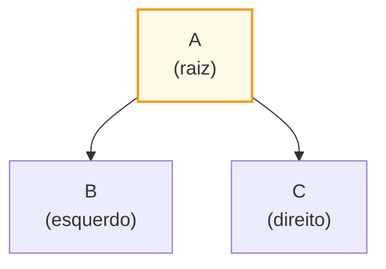
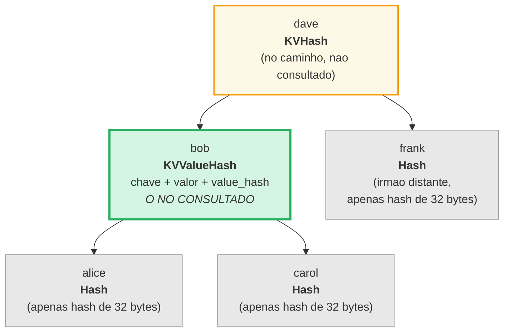
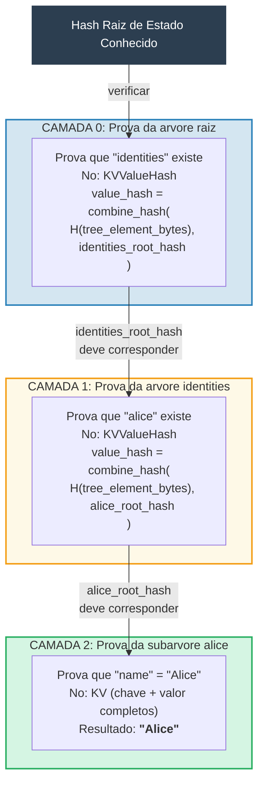
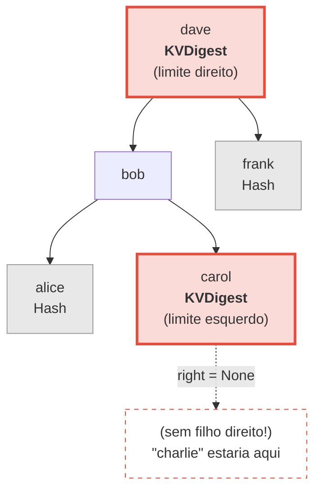
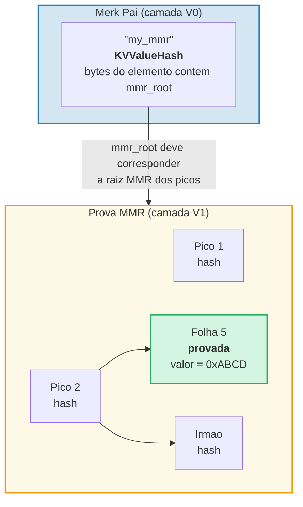
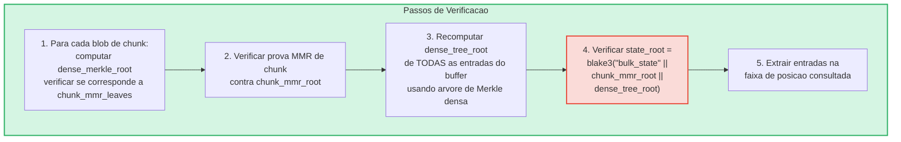
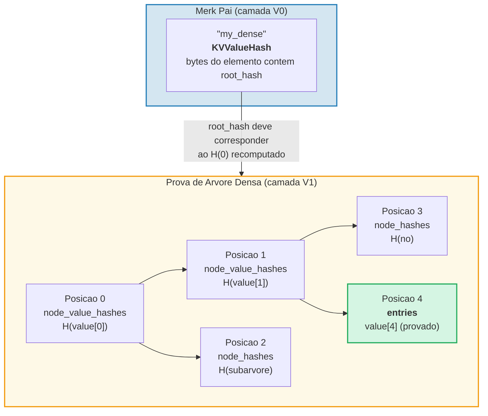

# O Sistema de Provas

O sistema de provas do GroveDB permite que qualquer parte verifique a correcao dos
resultados de consultas sem ter o banco de dados completo. Uma prova e uma representacao
compacta da estrutura de arvore relevante que permite a reconstrucao do hash raiz.

## Operacoes de Prova Baseadas em Pilha

As provas sao codificadas como uma sequencia de **operacoes** que reconstroem uma arvore
parcial usando uma maquina de pilha (stack machine):

```rust
// merk/src/proofs/mod.rs
pub enum Op {
    Push(Node),        // Empurrar um no na pilha (ordem crescente de chave)
    PushInverted(Node),// Empurrar um no (ordem decrescente de chave)
    Parent,            // Desempilhar pai, desempilhar filho → conectar filho como ESQUERDO do pai
    Child,             // Desempilhar filho, desempilhar pai → conectar filho como DIREITO do pai
    ParentInverted,    // Desempilhar pai, desempilhar filho → conectar filho como DIREITO do pai
    ChildInverted,     // Desempilhar filho, desempilhar pai → conectar filho como ESQUERDO do pai
}
```

A execucao usa uma pilha:

Ops da prova: `Push(B), Push(A), Parent, Push(C), Child`

| Passo | Operacao | Pilha (topo→direita) | Acao |
|-------|----------|----------------------|------|
| 1 | Push(B) | [ B ] | Empurrar B na pilha |
| 2 | Push(A) | [ B , A ] | Empurrar A na pilha |
| 3 | Parent | [ A{left:B} ] | Desempilhar A (pai), desempilhar B (filho), B → ESQUERDO de A |
| 4 | Push(C) | [ A{left:B} , C ] | Empurrar C na pilha |
| 5 | Child | [ A{left:B, right:C} ] | Desempilhar C (filho), desempilhar A (pai), C → DIREITO de A |

Resultado final — uma arvore na pilha:


```mermaid
graph TD
    A_proof["A<br/>(raiz)"]
    B_proof["B<br/>(esquerdo)"]
    C_proof["C<br/>(direito)"]
    A_proof --> B_proof
    A_proof --> C_proof

    style A_proof fill:#fef9e7,stroke:#f39c12,stroke-width:2px
```

> O verificador computa `node_hash(A) = Blake3(kv_hash_A || node_hash_B || node_hash_C)` e verifica se corresponde ao hash raiz esperado.

Esta e a funcao `execute` (`merk/src/proofs/tree.rs`):

```rust
pub fn execute<I, F>(ops: I, collapse: bool, mut visit_node: F) -> CostResult<Tree, Error>
where
    I: IntoIterator<Item = Result<Op, Error>>,
    F: FnMut(&Node) -> Result<(), Error>,
{
    let mut stack: Vec<Tree> = Vec::with_capacity(32);

    for op in ops {
        match op? {
            Op::Parent => {
                let (mut parent, child) = (try_pop(&mut stack), try_pop(&mut stack));
                parent.left = Some(Child { tree: Box::new(child), hash: child.hash() });
                stack.push(parent);
            }
            Op::Child => {
                let (child, mut parent) = (try_pop(&mut stack), try_pop(&mut stack));
                parent.right = Some(Child { tree: Box::new(child), hash: child.hash() });
                stack.push(parent);
            }
            Op::Push(node) => {
                visit_node(&node)?;
                stack.push(Tree::from(node));
            }
            // ... Variantes Inverted trocam esquerda/direita
        }
    }
    // Item final na pilha e a raiz
}
```

## Tipos de No em Provas

Cada `Push` carrega um `Node` que contem informacao suficiente para
verificacao:

```rust
pub enum Node {
    // Informacao minima — apenas o hash. Usado para irmaos distantes.
    Hash(CryptoHash),

    // Hash KV para nos no caminho mas nao consultados.
    KVHash(CryptoHash),

    // Chave-valor completo para itens consultados.
    KV(Vec<u8>, Vec<u8>),

    // Chave, valor e value_hash pre-computado.
    // Usado para subarvores onde value_hash = combine_hash(...)
    KVValueHash(Vec<u8>, Vec<u8>, CryptoHash),

    // KV com tipo de feature — para ProvableCountTree ou restauracao de chunks.
    KVValueHashFeatureType(Vec<u8>, Vec<u8>, CryptoHash, TreeFeatureType),

    // Referencia: chave, valor desreferenciado, hash do elemento de referencia.
    KVRefValueHash(Vec<u8>, Vec<u8>, CryptoHash),

    // Para itens em ProvableCountTree.
    KVCount(Vec<u8>, Vec<u8>, u64),

    // Hash KV + contagem para nos nao consultados de ProvableCountTree.
    KVHashCount(CryptoHash, u64),

    // Referencia em ProvableCountTree.
    KVRefValueHashCount(Vec<u8>, Vec<u8>, CryptoHash, u64),

    // Para provas de limite/ausencia em ProvableCountTree.
    KVDigestCount(Vec<u8>, CryptoHash, u64),

    // Chave + value_hash para provas de ausencia (arvores regulares).
    KVDigest(Vec<u8>, CryptoHash),
}
```

A escolha do tipo de Node determina que informacao o verificador precisa:

**Consulta: "Obter valor para chave 'bob'"**


```mermaid
graph TD
    dave["dave<br/><b>KVHash</b><br/>(no caminho, nao consultado)"]
    bob["bob<br/><b>KVValueHash</b><br/>chave + valor + value_hash<br/><i>O NO CONSULTADO</i>"]
    frank["frank<br/><b>Hash</b><br/>(irmao distante,<br/>apenas hash de 32 bytes)"]
    alice["alice<br/><b>Hash</b><br/>(apenas hash de 32 bytes)"]
    carol["carol<br/><b>Hash</b><br/>(apenas hash de 32 bytes)"]

    dave --> bob
    dave --> frank
    bob --> alice
    bob --> carol

    style bob fill:#d5f5e3,stroke:#27ae60,stroke-width:3px
    style dave fill:#fef9e7,stroke:#f39c12,stroke-width:2px
    style frank fill:#e8e8e8,stroke:#999
    style alice fill:#e8e8e8,stroke:#999
    style carol fill:#e8e8e8,stroke:#999
```

> Verde = no consultado (dados completos revelados). Amarelo = no caminho (apenas kv_hash). Cinza = irmaos (apenas hashes de 32 bytes).

Codificado como ops de prova:

| # | Op | Efeito |
|---|----|----|
| 1 | Push(Hash(alice_node_hash)) | Empurrar hash de alice |
| 2 | Push(KVValueHash("bob", value, value_hash)) | Empurrar bob com dados completos |
| 3 | Parent | alice se torna filho esquerdo de bob |
| 4 | Push(Hash(carol_node_hash)) | Empurrar hash de carol |
| 5 | Child | carol se torna filho direito de bob |
| 6 | Push(KVHash(dave_kv_hash)) | Empurrar kv_hash de dave |
| 7 | Parent | subarvore de bob se torna esquerda de dave |
| 8 | Push(Hash(frank_node_hash)) | Empurrar hash de frank |
| 9 | Child | frank se torna filho direito de dave |

## Tipos de No de Prova por Tipo de Arvore

Cada tipo de arvore no GroveDB usa um conjunto especifico de tipos de no de
prova dependendo do **papel** do no na prova. Existem quatro papeis:

| Papel | Descricao |
|-------|-----------|
| **Consultado** | O no corresponde a consulta — chave + valor completos revelados |
| **No caminho** | O no e um ancestral dos nos consultados — apenas kv_hash necessario |
| **Limite** | Adjacente a uma chave ausente — prova ausencia |
| **Distante** | Uma subarvore irma fora do caminho da prova — apenas node_hash necessario |

### Arvores Regulares (Tree, SumTree, BigSumTree, CountTree, CountSumTree)

Todos os cinco tipos de arvore usam tipos de no de prova identicos e a mesma
funcao de hash: `compute_hash` (= `node_hash(kv_hash, left, right)`). **Nao ha
diferenca** em como sao provadas no nivel merk.

Cada no merk carrega internamente um `feature_type` (BasicMerkNode,
SummedMerkNode, BigSummedMerkNode, CountedMerkNode, CountedSummedMerkNode),
mas isso **nao e incluido no hash** e **nao e incluido na prova**. Os dados
agregados (soma, contagem) para esses tipos de arvore residem nos bytes
serializados do Element **pai**, que sao verificados por hash atraves da
prova da arvore pai:

| Tipo de arvore | Element armazena | Merk feature_type (nao incluido no hash) |
|---------------|-----------------|-------------------------------|
| Tree | `Element::Tree(root_key, flags)` | `BasicMerkNode` |
| SumTree | `Element::SumTree(root_key, sum, flags)` | `SummedMerkNode(sum)` |
| BigSumTree | `Element::BigSumTree(root_key, sum, flags)` | `BigSummedMerkNode(sum)` |
| CountTree | `Element::CountTree(root_key, count, flags)` | `CountedMerkNode(count)` |
| CountSumTree | `Element::CountSumTree(root_key, count, sum, flags)` | `CountedSummedMerkNode(count, sum)` |

> **De onde vem a soma/contagem?** Quando um verificador processa uma prova
> para `[root, my_sum_tree]`, a prova da arvore pai inclui um no
> `KVValueHash` para a chave `my_sum_tree`. O campo `value` contem o
> `Element::SumTree(root_key, 42, flags)` serializado. Como esse valor e
> verificado por hash (seu hash e comprometido na raiz Merkle pai), a
> soma `42` e confiavel. O feature_type no nivel merk e irrelevante.

| Papel | Tipo de No V0 | Tipo de No V1 | Funcao de hash |
|-------|-------------|-------------|---------------|
| Item consultado | `KV` | `KV` | `node_hash(kv_hash(key, H(value)), left, right)` |
| Arvore nao vazia consultada (sem subquery) | `KVValueHash` | `KVValueHashFeatureTypeWithChildHash` | `node_hash(kv_hash(key, value_hash), left, right)` |
| Arvore vazia consultada | `KVValueHash` | `KVValueHash` | `node_hash(kv_hash(key, value_hash), left, right)` |
| Referencia consultada | `KVRefValueHash` | `KVRefValueHash` | `node_hash(kv_hash(key, combine_hash(ref_hash, H(deref_value))), left, right)` |
| No caminho | `KVHash` | `KVHash` | `node_hash(kv_hash, left, right)` |
| Limite | `KVDigest` | `KVDigest` | `node_hash(kv_hash(key, value_hash), left, right)` |
| Distante | `Hash` | `Hash` | Usado diretamente |

> **Arvores nao vazias COM subquery** descem para a camada filha — o no da
> arvore aparece como `KVValueHash` na prova da camada pai e a camada filha
> tem sua propria prova.

> **Por que `KVValueHash` para subarvores?** O value_hash de uma subarvore e
> `combine_hash(H(element_bytes), child_root_hash)` — o verificador nao pode
> recomputar isso apenas com os bytes do elemento (precisaria do hash raiz
> filho). Portanto, o provador fornece o value_hash pre-computado.
>
> **Por que `KV` para itens?** O value_hash de um item e simplesmente
> `H(value)`, que o verificador pode recomputar. Usar `KV` e a prova de
> adulteracao: se o provador alterar o valor, o hash nao correspondera.

**Melhoria V1 — `KVValueHashFeatureTypeWithChildHash`:** Em provas V1, quando
uma arvore nao vazia consultada nao tem subquery (a consulta para nesta arvore
— o elemento da arvore em si e o resultado), a camada GroveDB atualiza o no
merk para `KVValueHashFeatureTypeWithChildHash(key, value, value_hash,
feature_type, child_hash)`. Isso permite que o verificador verifique
`combine_hash(H(value), child_hash) == value_hash`, impedindo que um atacante
troque os bytes do elemento reutilizando o value_hash original. Arvores vazias
nao sao atualizadas porque nao tem um merk filho para fornecer um hash raiz.

> **Nota de seguranca sobre feature_type:** Para arvores regulares (nao
> provaveis), o campo `feature_type` em `KVValueHashFeatureType` e
> `KVValueHashFeatureTypeWithChildHash` e decodificado mas **nao usado** para
> computacao de hash nem retornado aos chamadores. O tipo canonico da arvore
> reside nos bytes do Element verificados por hash. Este campo so importa para
> ProvableCountTree (veja abaixo), onde carrega a contagem necessaria para
> `node_hash_with_count`.

### ProvableCountTree e ProvableCountSumTree

Esses tipos de arvore usam `node_hash_with_count(kv_hash, left, right, count)`
em vez de `node_hash`. A **contagem** e incluida no hash, portanto o
verificador precisa da contagem de cada no para recomputar a raiz Merkle.

| Papel | Tipo de No V0 | Tipo de No V1 | Funcao de hash |
|-------|-------------|-------------|---------------|
| Item consultado | `KVCount` | `KVCount` | `node_hash_with_count(kv_hash(key, H(value)), left, right, count)` |
| Arvore nao vazia consultada (sem subquery) | `KVValueHashFeatureType` | `KVValueHashFeatureTypeWithChildHash` | `node_hash_with_count(kv_hash(key, value_hash), left, right, feature_type.count())` |
| Arvore vazia consultada | `KVValueHashFeatureType` | `KVValueHashFeatureType` | `node_hash_with_count(kv_hash(key, value_hash), left, right, feature_type.count())` |
| Referencia consultada | `KVRefValueHashCount` | `KVRefValueHashCount` | `node_hash_with_count(kv_hash(key, combine_hash(...)), left, right, count)` |
| No caminho | `KVHashCount` | `KVHashCount` | `node_hash_with_count(kv_hash, left, right, count)` |
| Limite | `KVDigestCount` | `KVDigestCount` | `node_hash_with_count(kv_hash(key, value_hash), left, right, count)` |
| Distante | `Hash` | `Hash` | Usado diretamente |

> **Arvores nao vazias COM subquery** descem para a camada filha, assim como
> as arvores regulares.

> **Por que cada no carrega uma contagem?** Porque `node_hash_with_count` e
> usado em vez de `node_hash`. Sem a contagem, o verificador nao pode
> reconstruir nenhum hash intermediario no caminho ate a raiz — mesmo para nos
> nao consultados.

**Melhoria V1:** Igual as arvores regulares — arvores nao vazias consultadas
sem subquery sao atualizadas para `KVValueHashFeatureTypeWithChildHash` para
verificacao de `combine_hash`.

> **Nota sobre ProvableCountSumTree:** Apenas a **contagem** e incluida no
> hash. A soma e transportada no feature_type
> (`ProvableCountedSummedMerkNode(count, sum)`) mas **nao e incluida no
> hash**. Assim como os tipos de arvore regulares acima, o valor canonico da
> soma reside nos bytes serializados do Element pai (por exemplo,
> `Element::ProvableCountSumTree(root_key, count, sum, flags)`), que sao
> verificados por hash na prova da arvore pai.

### Resumo: Matriz Tipo de No → Tipo de Arvore

| Tipo de No | Arvores Regulares | Arvores ProvableCount |
|-----------|:------------:|:-------------------:|
| `KV` | Itens consultados | — |
| `KVCount` | — | Itens consultados |
| `KVValueHash` | Subarvores consultadas | — |
| `KVValueHashFeatureType` | — | Subarvores consultadas |
| `KVRefValueHash` | Referencias consultadas | — |
| `KVRefValueHashCount` | — | Referencias consultadas |
| `KVHash` | No caminho | — |
| `KVHashCount` | — | No caminho |
| `KVDigest` | Limite/ausencia | — |
| `KVDigestCount` | — | Limite/ausencia |
| `Hash` | Irmaos distantes | Irmaos distantes |
| `KVValueHashFeatureTypeWithChildHash` | — | Arvores nao vazias sem subquery |

## Geracao de Provas Multicamada

Como o GroveDB e uma arvore de arvores, as provas abrangem multiplas camadas. Cada camada
prova a porcao relevante de uma arvore Merk, e as camadas sao conectadas pelo mecanismo
de combined value_hash:

**Consulta:** `Get ["identities", "alice", "name"]`


```mermaid
graph TD
    subgraph layer0["CAMADA 0: Prova da arvore raiz"]
        L0["Prova que &quot;identities&quot; existe<br/>No: KVValueHash<br/>value_hash = combine_hash(<br/>  H(tree_element_bytes),<br/>  identities_root_hash<br/>)"]
    end

    subgraph layer1["CAMADA 1: Prova da arvore identities"]
        L1["Prova que &quot;alice&quot; existe<br/>No: KVValueHash<br/>value_hash = combine_hash(<br/>  H(tree_element_bytes),<br/>  alice_root_hash<br/>)"]
    end

    subgraph layer2["CAMADA 2: Prova da subarvore alice"]
        L2["Prova que &quot;name&quot; = &quot;Alice&quot;<br/>No: KV (chave + valor completos)<br/>Resultado: <b>&quot;Alice&quot;</b>"]
    end

    state_root["Hash Raiz de Estado Conhecido"] -->|"verificar"| L0
    L0 -->|"identities_root_hash<br/>deve corresponder"| L1
    L1 -->|"alice_root_hash<br/>deve corresponder"| L2

    style layer0 fill:#d4e6f1,stroke:#2980b9,stroke-width:2px
    style layer1 fill:#fef9e7,stroke:#f39c12,stroke-width:2px
    style layer2 fill:#d5f5e3,stroke:#27ae60,stroke-width:2px
    style state_root fill:#2c3e50,stroke:#2c3e50,color:#fff
```

> **Cadeia de confianca:** `hash_raiz_estado_conhecido → verificar Camada 0 → verificar Camada 1 → verificar Camada 2 → "Alice"`. O hash raiz reconstruido de cada camada deve corresponder ao value_hash da camada acima.

O verificador verifica cada camada, confirmando que:
1. A prova da camada reconstroi para o hash raiz esperado
2. O hash raiz corresponde ao value_hash da camada pai
3. O hash raiz do nivel superior corresponde ao hash raiz de estado conhecido

## Verificacao de Provas

A verificacao segue as camadas da prova de baixo para cima ou de cima para baixo, usando
a funcao `execute` para reconstruir a arvore de cada camada. O metodo `Tree::hash()` na
arvore da prova computa o hash com base no tipo de no:

```rust
impl Tree {
    pub fn hash(&self) -> CostContext<CryptoHash> {
        match &self.node {
            Node::Hash(hash) => *hash,  // Ja e um hash, retornar diretamente

            Node::KVHash(kv_hash) =>
                node_hash(kv_hash, &self.child_hash(true), &self.child_hash(false)),

            Node::KV(key, value) =>
                kv_hash(key, value)
                    .flat_map(|kv_hash| node_hash(&kv_hash, &left, &right)),

            Node::KVValueHash(key, _, value_hash) =>
                kv_digest_to_kv_hash(key, value_hash)
                    .flat_map(|kv_hash| node_hash(&kv_hash, &left, &right)),

            Node::KVValueHashFeatureType(key, _, value_hash, feature_type) => {
                let kv = kv_digest_to_kv_hash(key, value_hash);
                match feature_type {
                    ProvableCountedMerkNode(count) =>
                        node_hash_with_count(&kv, &left, &right, *count),
                    _ => node_hash(&kv, &left, &right),
                }
            }

            Node::KVRefValueHash(key, referenced_value, ref_element_hash) => {
                let ref_value_hash = value_hash(referenced_value);
                let combined = combine_hash(ref_element_hash, &ref_value_hash);
                let kv = kv_digest_to_kv_hash(key, &combined);
                node_hash(&kv, &left, &right)
            }
            // ... outras variantes
        }
    }
}
```

## Provas de Ausencia

O GroveDB pode provar que uma chave **nao** existe. Isso usa nos de limite —
os nos que seriam adjacentes a chave ausente se ela existisse:

**Provar:** "charlie" NAO existe


```mermaid
graph TD
    dave_abs["dave<br/><b>KVDigest</b><br/>(limite direito)"]
    bob_abs["bob"]
    frank_abs["frank<br/>Hash"]
    alice_abs["alice<br/>Hash"]
    carol_abs["carol<br/><b>KVDigest</b><br/>(limite esquerdo)"]
    missing["(sem filho direito!)<br/>&quot;charlie&quot; estaria aqui"]

    dave_abs --> bob_abs
    dave_abs --> frank_abs
    bob_abs --> alice_abs
    bob_abs --> carol_abs
    carol_abs -.->|"right = None"| missing

    style carol_abs fill:#fadbd8,stroke:#e74c3c,stroke-width:3px
    style dave_abs fill:#fadbd8,stroke:#e74c3c,stroke-width:3px
    style missing fill:none,stroke:#e74c3c,stroke-dasharray:5 5
    style alice_abs fill:#e8e8e8,stroke:#999
    style frank_abs fill:#e8e8e8,stroke:#999
```

> **Busca binaria:** alice < bob < carol < **"charlie"** < dave < frank. "charlie" estaria entre carol e dave. O filho direito de carol e `None`, provando que nada existe entre carol e dave. Portanto "charlie" nao pode existir nesta arvore.

Para consultas de faixa, provas de ausencia mostram que nao existem chaves dentro da
faixa consultada que nao foram incluidas no conjunto de resultados.

## Detecao de Chave de Limite

Ao verificar uma prova de uma consulta de faixa exclusiva, pode ser necessario
confirmar que uma chave especifica existe como um **elemento de limite** — uma
chave que ancora a faixa mas nao faz parte do conjunto de resultados.

Por exemplo, com `RangeAfter(10)` (todas as chaves estritamente apos 10), a
prova inclui a chave 10 como um no `KVDigest`. Isso prova que a chave 10 existe
na arvore e ancora o inicio da faixa, mas a chave 10 nao e retornada nos
resultados.

### Quando nos de limite aparecem

Nos de limite `KVDigest` (ou `KVDigestCount` para ProvableCountTree) aparecem em
provas para tipos de consulta de faixa exclusiva:

| Tipo de consulta | Chave de limite | O que prova |
|------------|-------------|----------------|
| `RangeAfter(start..)` | `start` | O inicio exclusivo existe na arvore |
| `RangeAfterTo(start..end)` | `start` | O inicio exclusivo existe na arvore |
| `RangeAfterToInclusive(start..=end)` | `start` | O inicio exclusivo existe na arvore |

Nos de limite tambem aparecem em provas de ausencia, onde chaves vizinhas provam
que uma lacuna existe (veja [Provas de Ausencia](#provas-de-ausencia) acima).

### Verificando chaves de limite

Apos verificar uma prova, voce pode verificar se uma chave existe como elemento
de limite usando `key_exists_as_boundary` no `GroveDBProof` decodificado:

```rust
// Decode and verify the proof
let (grovedb_proof, _): (GroveDBProof, _) =
    bincode::decode_from_slice(&proof_bytes, config)?;
let (root_hash, results) = grovedb_proof.verify(&path_query, grove_version)?;

// Check that the boundary key exists in the proof
let cursor_exists = grovedb_proof
    .key_exists_as_boundary(&[b"documents", b"notes"], &cursor_key)?;
```

O argumento `path` identifica qual camada da prova inspecionar (correspondendo
ao caminho da subarvore GroveDB onde a consulta de faixa foi executada), e `key`
e a chave de limite a procurar.

### Uso pratico: verificacao de paginacao

Isso e particularmente util para **paginacao**. Quando um cliente solicita "os
proximos 100 documentos apos o documento X", a consulta e
`RangeAfter(document_X_id)`. A prova retorna os documentos 101-200, mas o
cliente tambem pode querer confirmar que o documento X (o cursor de paginacao)
ainda existe na arvore:

- Se `key_exists_as_boundary` retorna `true`, o cursor e valido — o cliente
  pode confiar que a paginacao esta ancorada em um documento real.
- Se retorna `false`, o documento do cursor pode ter sido excluido entre
  paginas, e o cliente deve considerar reiniciar a paginacao.

> **Importante:** `key_exists_as_boundary` realiza uma varredura sintatica dos
> nos `KVDigest`/`KVDigestCount` da prova. Nao fornece garantia criptografica
> por si so — sempre verifique a prova contra um hash raiz confiavel primeiro.
> Os mesmos tipos de no tambem aparecem em provas de ausencia, portanto o
> chamador deve interpretar o resultado no contexto da consulta que gerou a
> prova.

No nivel merk, a mesma verificacao esta disponivel via
`key_exists_as_boundary_in_proof(proof_bytes, key)` para trabalhar diretamente
com bytes brutos de prova merk.

## Provas V1 — Arvores Nao-Merk

O sistema de provas V0 funciona exclusivamente com subarvores Merk, descendo camada por
camada atraves da hierarquia do grove. No entanto, elementos **CommitmentTree**, **MmrTree**,
**BulkAppendTree** e **DenseAppendOnlyFixedSizeTree** armazenam seus dados fora de uma
subarvore Merk filha. Eles nao tem uma Merk filha para descer — o hash raiz especifico
do tipo flui como o hash filho da Merk em vez disso.

O **formato de prova V1** estende o V0 para lidar com essas arvores nao-Merk com
estruturas de prova especificas por tipo:

```rust
/// Qual formato de prova uma camada usa.
pub enum ProofBytes {
    Merk(Vec<u8>),            // Ops de prova Merk padrao
    MMR(Vec<u8>),             // Prova de pertinencia MMR
    BulkAppendTree(Vec<u8>),  // Prova de faixa BulkAppendTree
    DenseTree(Vec<u8>),       // Prova de inclusao de arvore densa
    CommitmentTree(Vec<u8>),  // Raiz sinsemilla (32 bytes) + prova BulkAppendTree
}

/// Uma camada de uma prova V1.
pub struct LayerProof {
    pub merk_proof: ProofBytes,
    pub lower_layers: BTreeMap<Vec<u8>, LayerProof>,
}
```

**Regra de selecao V0/V1:** Se toda camada na prova e uma arvore Merk padrao,
`prove_query` produz um `GroveDBProof::V0` (retrocompativel). Se qualquer camada
envolve uma MmrTree, BulkAppendTree ou DenseAppendOnlyFixedSizeTree, produz
`GroveDBProof::V1`.

### Como Provas de Arvores Nao-Merk se Vinculam ao Hash Raiz

A arvore Merk pai prova os bytes serializados do elemento via um no de prova Merk
padrao (`KVValueHash`). A raiz especifica do tipo (por exemplo, `mmr_root` ou
`state_root`) flui como o **hash filho** da Merk — NAO e incorporada nos
bytes do elemento:

```text
combined_value_hash = combine_hash(
    Blake3(varint(len) || element_bytes),   ← contem contagem, altura, etc.
    type_specific_root                      ← mmr_root / state_root / dense_root
)
```

A prova especifica do tipo entao prova que os dados consultados sao consistentes com
a raiz especifica do tipo que foi usada como o hash filho.

### Provas de Arvore MMR

Uma prova MMR demonstra que folhas especificas existem em posicoes conhecidas dentro
do MMR, e que o hash raiz do MMR corresponde ao hash filho armazenado no no Merk pai:

```rust
pub struct MmrProof {
    pub mmr_size: u64,
    pub proof: MerkleProof,  // ckb_merkle_mountain_range::MerkleProof
    pub leaves: Vec<MmrProofLeaf>,
}

pub struct MmrProofLeaf {
    pub position: u64,       // Posicao no MMR
    pub leaf_index: u64,     // Indice logico da folha
    pub hash: [u8; 32],      // Hash da folha
    pub value: Vec<u8>,      // Bytes do valor da folha
}
```


```mermaid
graph TD
    subgraph parent_merk["Merk Pai (camada V0)"]
        elem["&quot;my_mmr&quot;<br/><b>KVValueHash</b><br/>bytes do elemento contem mmr_root"]
    end

    subgraph mmr_proof["Prova MMR (camada V1)"]
        peak1["Pico 1<br/>hash"]
        peak2["Pico 2<br/>hash"]
        leaf_a["Folha 5<br/><b>provada</b><br/>valor = 0xABCD"]
        sibling["Irmao<br/>hash"]
        peak2 --> leaf_a
        peak2 --> sibling
    end

    elem -->|"mmr_root deve corresponder<br/>a raiz MMR dos picos"| mmr_proof

    style parent_merk fill:#d4e6f1,stroke:#2980b9,stroke-width:2px
    style mmr_proof fill:#fef9e7,stroke:#f39c12,stroke-width:2px
    style leaf_a fill:#d5f5e3,stroke:#27ae60,stroke-width:2px
```

**Chaves de consulta sao posicoes:** Os itens de consulta codificam posicoes como bytes
u64 big-endian (o que preserva a ordem de classificacao). `QueryItem::RangeInclusive` com
posicoes inicio/fim codificadas em BE seleciona uma faixa contigua de folhas MMR.

**Verificacao:**
1. Reconstruir folhas `MmrNode` a partir da prova
2. Verificar a `MerkleProof` do ckb contra a raiz MMR esperada do hash filho da Merk pai
3. Validacao cruzada de que `proof.mmr_size` corresponde ao tamanho armazenado no elemento
4. Retornar os valores de folha provados

### Provas BulkAppendTree

As provas de BulkAppendTree sao mais complexas porque os dados vivem em dois locais:
blobs de chunk selados e o buffer em progresso. Uma prova de faixa deve retornar:

- **Blobs de chunk completos** para qualquer chunk completo que se sobreponha a faixa da consulta
- **Entradas individuais do buffer** para posicoes ainda no buffer

```rust
pub struct BulkAppendTreeProof {
    pub chunk_power: u8,
    pub total_count: u64,
    pub chunk_blobs: Vec<(u64, Vec<u8>)>,       // (chunk_index, blob_bytes)
    pub chunk_mmr_size: u64,
    pub chunk_mmr_proof_items: Vec<[u8; 32]>,    // Hashes de irmaos MMR
    pub chunk_mmr_leaves: Vec<(u64, [u8; 32])>,  // (mmr_pos, dense_merkle_root)
    pub buffer_entries: Vec<Vec<u8>>,             // TODAS as entradas atuais do buffer (arvore densa)
    pub chunk_mmr_root: [u8; 32],
}
```


```mermaid
graph TD
    subgraph verify["Passos de Verificacao"]
        step1["1. Para cada blob de chunk:<br/>computar dense_merkle_root<br/>verificar se corresponde a chunk_mmr_leaves"]
        step2["2. Verificar prova MMR de chunk<br/>contra chunk_mmr_root"]
        step3["3. Recomputar dense_tree_root<br/>de TODAS as entradas do buffer<br/>usando arvore de Merkle densa"]
        step4["4. Verificar state_root =<br/>blake3(&quot;bulk_state&quot; ||<br/>chunk_mmr_root ||<br/>dense_tree_root)"]
        step5["5. Extrair entradas na<br/>faixa de posicao consultada"]

        step1 --> step2 --> step3 --> step4 --> step5
    end

    style verify fill:#d5f5e3,stroke:#27ae60,stroke-width:2px
    style step4 fill:#fadbd8,stroke:#e74c3c,stroke-width:2px
```

> **Por que incluir TODAS as entradas do buffer?** O buffer e uma arvore de Merkle densa cujo hash raiz compromete cada entrada. Para verificar o `dense_tree_root`, o verificador deve reconstruir a arvore de todas as entradas. Como o buffer e limitado a `capacity` entradas (no maximo 65.535), isso e aceitavel.

**Contabilizacao de limite:** Cada valor individual (dentro de um chunk ou do buffer) conta
para o limite da consulta, nao cada blob de chunk como um todo. Se uma consulta tem
`limit: 100` e um chunk contem 1024 entradas com 500 se sobrepondo a faixa,
todas as 500 entradas contam para o limite.

### Provas DenseAppendOnlyFixedSizeTree

Uma prova de arvore densa demonstra que posicoes especificas contem valores especificos,
autenticadas contra o hash raiz da arvore (que flui como o hash filho da Merk).
Todos os nos usam `blake3(H(value) || H(left) || H(right))`, entao os nos ancestrais no
caminho de autenticacao precisam apenas do seu **hash de valor** de 32 bytes — nao do valor completo.

```rust
pub struct DenseTreeProof {
    pub entries: Vec<(u16, Vec<u8>)>,            // (posicao, valor) provados
    pub node_value_hashes: Vec<(u16, [u8; 32])>, // hashes de valor de ancestrais no caminho de auth
    pub node_hashes: Vec<(u16, [u8; 32])>,       // hashes de subarvore irma pre-computados
}
```

> `height` e `count` vem do Element pai (autenticado pela hierarquia Merk), nao da prova.


```mermaid
graph TD
    subgraph parent_merk["Merk Pai (camada V0)"]
        elem["&quot;my_dense&quot;<br/><b>KVValueHash</b><br/>bytes do elemento contem root_hash"]
    end

    subgraph dense_proof["Prova de Arvore Densa (camada V1)"]
        root["Posicao 0<br/>node_value_hashes<br/>H(value[0])"]
        node1["Posicao 1<br/>node_value_hashes<br/>H(value[1])"]
        hash2["Posicao 2<br/>node_hashes<br/>H(subarvore)"]
        hash3["Posicao 3<br/>node_hashes<br/>H(no)"]
        leaf4["Posicao 4<br/><b>entries</b><br/>value[4] (provado)"]
        root --> node1
        root --> hash2
        node1 --> hash3
        node1 --> leaf4
    end

    elem -->|"root_hash deve corresponder<br/>ao H(0) recomputado"| dense_proof

    style parent_merk fill:#d4e6f1,stroke:#2980b9,stroke-width:2px
    style dense_proof fill:#fef9e7,stroke:#f39c12,stroke-width:2px
    style leaf4 fill:#d5f5e3,stroke:#27ae60,stroke-width:2px
```

**Verificacao** e uma funcao pura que nao requer armazenamento:
1. Construir mapas de busca a partir de `entries`, `node_value_hashes` e `node_hashes`
2. Recomputar recursivamente o hash raiz a partir da posicao 0:
   - Posicao tem hash pre-computado em `node_hashes` → usa-lo diretamente
   - Posicao com valor em `entries` → `blake3(blake3(value) || H(left) || H(right))`
   - Posicao com hash em `node_value_hashes` → `blake3(hash || H(left) || H(right))`
   - Posicao `>= count` ou `>= capacity` → `[0u8; 32]`
3. Comparar a raiz computada com o hash raiz esperado do elemento pai
4. Retornar entradas provadas em caso de sucesso

**Provas de multiplas posicoes** mesclam caminhos de autenticacao sobrepostos: ancestrais
compartilhados e seus valores aparecem apenas uma vez, tornando-as mais compactas que
provas independentes.

---
