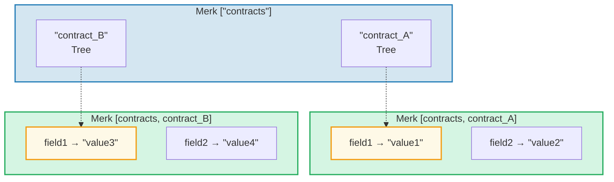
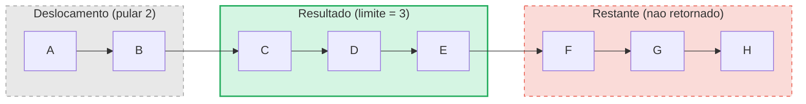

# O Sistema de Consultas

## Estrutura PathQuery

As consultas do GroveDB usam o tipo `PathQuery`, que combina um caminho (onde buscar)
com uma consulta (o que selecionar):

```rust
pub struct PathQuery {
    pub path: Vec<Vec<u8>>,         // Caminho inicial no grove
    pub query: SizedQuery,          // O que selecionar
}

pub struct SizedQuery {
    pub query: Query,               // Os criterios de selecao
    pub limit: Option<u16>,         // Numero maximo de resultados
    pub offset: Option<u16>,        // Pular os primeiros N resultados
}
```

## O Tipo Query

```rust
pub struct Query {
    pub items: Vec<QueryItem>,              // O que corresponder
    pub default_subquery_branch: SubqueryBranch,
    pub conditional_subquery_branches: Option<IndexMap<QueryItem, SubqueryBranch>>,
    pub left_to_right: bool,                // Direcao de iteracao
    pub add_parent_tree_on_subquery: bool,  // Incluir elemento da arvore pai nos resultados (v2)
}
```

> **`add_parent_tree_on_subquery`** (v2): Quando `true`, o elemento da arvore pai (por exemplo,
> uma CountTree ou SumTree) e incluido nos resultados da consulta junto com os valores
> dos filhos. Isso permite recuperar tanto valores agregados quanto elementos individuais
> em uma unica consulta.

## QueryItems — O que Selecionar

Cada `QueryItem` especifica uma chave ou faixa para corresponder:

```rust
pub enum QueryItem {
    Key(Vec<u8>),                           // Correspondencia exata de chave
    Range(Range<Vec<u8>>),                  // Faixa exclusiva [inicio..fim)
    RangeInclusive(RangeInclusive<Vec<u8>>),// Faixa inclusiva [inicio..=fim]
    RangeFull(RangeFull),                   // Todas as chaves
    RangeFrom(RangeFrom<Vec<u8>>),          // [inicio..)
    RangeTo(RangeTo<Vec<u8>>),              // [..fim)
    RangeToInclusive(RangeToInclusive<Vec<u8>>), // [..=fim]
    RangeAfter(RangeFrom<Vec<u8>>),         // (inicio..) inicio exclusivo
    RangeAfterTo(Range<Vec<u8>>),           // (inicio..fim) ambos exclusivos
    RangeAfterToInclusive(RangeInclusive<Vec<u8>>), // (inicio..=fim]
}
```

Exemplos de consultas:

Arvore Merk (ordenada): `alice  bob  carol  dave  eve  frank`

| Consulta | Selecao | Resultado |
|----------|---------|-----------|
| `Key("bob")` | alice **[bob]** carol dave eve frank | bob |
| `RangeInclusive("bob"..="dave")` | alice **[bob carol dave]** eve frank | bob, carol, dave |
| `RangeAfter("carol"..)` | alice bob carol **[dave eve frank]** | dave, eve, frank |
| `RangeFull`, limit=2 | **[alice bob]** carol dave eve frank *(parado pelo limite)* | alice, bob |
| `RangeFull`, limit=2, direita-para-esquerda | alice bob carol dave **[eve frank]** *(parado pelo limite)* | frank, eve |

## Subconsultas e Ramificacoes Condicionais

O verdadeiro poder das consultas do GroveDB sao as **subconsultas** — quando uma consulta
encontra um elemento Tree, a consulta pode automaticamente descer para essa subarvore:



> **PathQuery:** `path: ["contracts"], query: RangeFull` com `default_subquery: Key("field1")`
>
> **Execucao:**
> 1. `RangeFull` em ["contracts"] → corresponde a contract_A, contract_B
> 2. Ambos sao elementos Tree → descer com subconsulta `Key("field1")`
> 3. contract_A → "value1", contract_B → "value3"
>
> **Resultado:** `["value1", "value3"]`

**Subconsultas condicionais** permitem aplicar subconsultas diferentes com base em qual
chave foi correspondida:

```rust
conditional_subquery_branches: Some(indexmap! {
    QueryItem::Key(b"contract_A".to_vec()) => SubqueryBranch {
        subquery: Some(Query { items: vec![Key(b"field1".to_vec())] }),
        ..
    },
    QueryItem::Key(b"contract_B".to_vec()) => SubqueryBranch {
        subquery: Some(Query { items: vec![Key(b"field2".to_vec())] }),
        ..
    },
})
```

Isso obteria `field1` de `contract_A` mas `field2` de `contract_B`.

## Consultas Dimensionadas — Limite e Deslocamento

O wrapper `SizedQuery` adiciona paginacao:



> `SizedQuery { query: RangeFull, limit: Some(3), offset: Some(2) }` → Resultado: **[C, D, E]**

Quando combinado com `left_to_right: false`, a iteracao e invertida:

```text
    SizedQuery {
        query: Query { items: [RangeFull], left_to_right: false, .. },
        limit: Some(3),
        offset: None
    }

    Resultado: [H, G, F]
```

## Mesclagem de Consultas

Multiplas PathQueries podem ser mescladas em uma unica consulta para eficiencia. O
algoritmo de mesclagem encontra prefixos de caminho comuns e combina os itens de consulta:

```text
    Consulta A: path=["users"], query=Key("alice")
    Consulta B: path=["users"], query=Key("bob")

    Mesclada:   path=["users"], query=items=[Key("alice"), Key("bob")]
```

---
