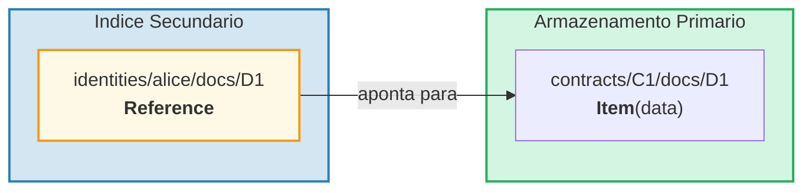
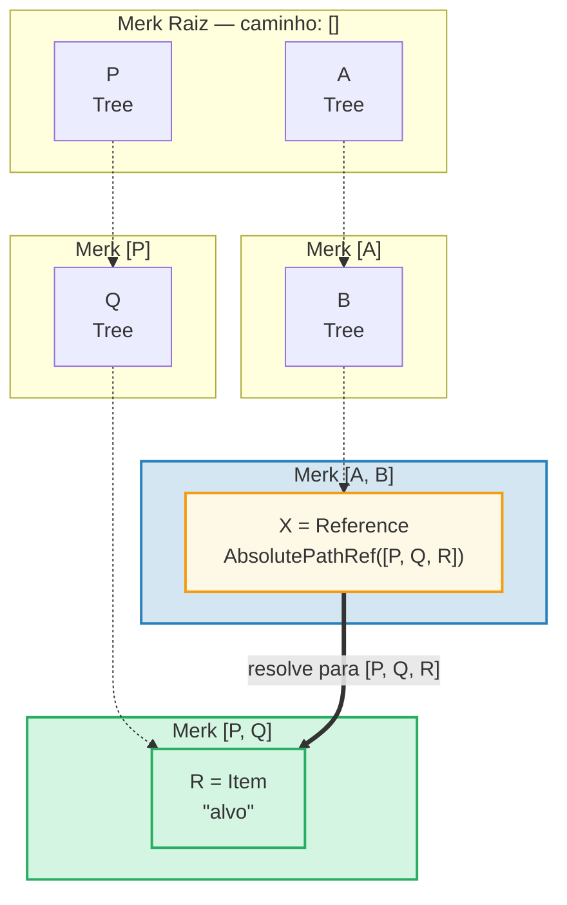
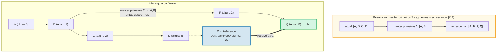
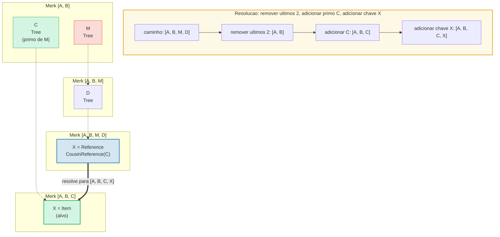
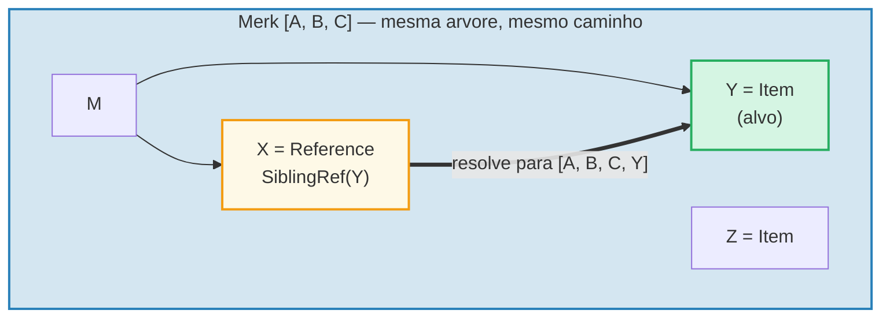
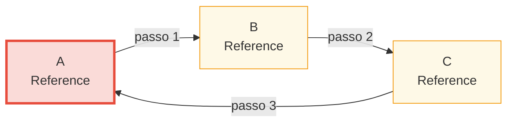

# O Sistema de Referencias

## Por que Referencias Existem

Em um banco de dados hierarquico, frequentemente voce precisa dos mesmos dados acessiveis
a partir de multiplos caminhos. Por exemplo, documentos podem ser armazenados sob seu
contrato mas tambem consultaveis por identidade do proprietario. **Referencias** sao a
resposta do GroveDB — sao ponteiros de um local para outro, semelhantes a links
simbolicos em um sistema de arquivos.



Propriedades-chave:
- As referencias sao **autenticadas** — o value_hash da referencia inclui tanto a
  referencia em si quanto o elemento referenciado
- As referencias podem ser **encadeadas** — uma referencia pode apontar para outra referencia
- A deteccao de ciclos previne loops infinitos
- Um limite de saltos configuravel previne esgotamento de recursos

## Os Sete Tipos de Referencia

```rust
// grovedb-element/src/reference_path/mod.rs
pub enum ReferencePathType {
    AbsolutePathReference(Vec<Vec<u8>>),
    UpstreamRootHeightReference(u8, Vec<Vec<u8>>),
    UpstreamRootHeightWithParentPathAdditionReference(u8, Vec<Vec<u8>>),
    UpstreamFromElementHeightReference(u8, Vec<Vec<u8>>),
    CousinReference(Vec<u8>),
    RemovedCousinReference(Vec<Vec<u8>>),
    SiblingReference(Vec<u8>),
}
```

Vamos percorrer cada um com diagramas.

### AbsolutePathReference

O tipo mais simples. Armazena o caminho completo ate o alvo:



> X armazena o caminho absoluto completo `[P, Q, R]`. Nao importa onde X esta localizado, ele sempre resolve para o mesmo alvo.

### UpstreamRootHeightReference

Mantem os primeiros N segmentos do caminho atual e entao acrescenta um novo caminho:



### UpstreamRootHeightWithParentPathAdditionReference

Como UpstreamRootHeight, mas re-acrescenta o ultimo segmento do caminho atual:

```text
    Referencia no caminho [A, B, C, D, E] chave=X
    UpstreamRootHeightWithParentPathAdditionReference(2, [P, Q])

    Caminho atual:     [A, B, C, D, E]
    Manter primeiros 2: [A, B]
    Acrescentar [P, Q]: [A, B, P, Q]
    Re-acrescentar ultimo: [A, B, P, Q, E]   ← "E" do caminho original adicionado de volta

    Util para: indices onde a chave pai deve ser preservada
```

### UpstreamFromElementHeightReference

Descarta os ultimos N segmentos e entao acrescenta:

```text
    Referencia no caminho [A, B, C, D] chave=X
    UpstreamFromElementHeightReference(1, [P, Q])

    Caminho atual:      [A, B, C, D]
    Descartar ultimo 1: [A, B, C]
    Acrescentar [P, Q]: [A, B, C, P, Q]
```

### CousinReference

Substitui apenas o pai imediato por uma nova chave:



> O "primo" (cousin) e uma subarvore irma do avo da referencia. A referencia navega dois niveis acima e entao desce para a subarvore prima.

### RemovedCousinReference

Como CousinReference mas substitui o pai por um caminho de multiplos segmentos:

```text
    Referencia no caminho [A, B, C, D] chave=X
    RemovedCousinReference([M, N])

    Caminho atual:     [A, B, C, D]
    Remover pai C:     [A, B]
    Acrescentar [M, N]: [A, B, M, N]
    Adicionar chave X:  [A, B, M, N, X]
```

### SiblingReference

A referencia relativa mais simples — apenas muda a chave dentro do mesmo pai:



> O tipo de referencia mais simples. X e Y sao irmaos na mesma arvore Merk — a resolucao apenas muda a chave mantendo o mesmo caminho.

## Seguimento de Referencias e o Limite de Saltos

Quando o GroveDB encontra um elemento Reference, ele deve **segui-lo** para encontrar o
valor real. Como referencias podem apontar para outras referencias, isso envolve um loop:

```rust
// grovedb/src/reference_path.rs
pub const MAX_REFERENCE_HOPS: usize = 10;

pub fn follow_reference(...) -> CostResult<ResolvedReference, Error> {
    let mut hops_left = MAX_REFERENCE_HOPS;
    let mut visited = HashSet::new();

    while hops_left > 0 {
        // Resolver caminho da referencia para caminho absoluto
        let target_path = current_ref.absolute_qualified_path(...);

        // Verificar ciclos
        if !visited.insert(target_path.clone()) {
            return Err(Error::CyclicReference);
        }

        // Buscar elemento no alvo
        let element = Element::get(target_path);

        match element {
            Element::Reference(next_ref, ..) => {
                // Ainda e uma referencia — continuar seguindo
                current_ref = next_ref;
                hops_left -= 1;
            }
            other => {
                // Encontrou o elemento real!
                return Ok(ResolvedReference { element: other, ... });
            }
        }
    }

    Err(Error::ReferenceLimit)  // Excedeu 10 saltos
}
```

## Deteccao de Ciclos

O HashSet `visited` rastreia todos os caminhos que ja vimos. Se encontrarmos um caminho
que ja visitamos, temos um ciclo:



> **Rastreamento de deteccao de ciclo:**
>
> | Passo | Seguir | conjunto visited | Resultado |
> |-------|--------|------------------|-----------|
> | 1 | Comecar em A | { A } | A e Ref → seguir |
> | 2 | A → B | { A, B } | B e Ref → seguir |
> | 3 | B → C | { A, B, C } | C e Ref → seguir |
> | 4 | C → A | A ja esta em visited! | **Error::CyclicRef** |
>
> Sem deteccao de ciclo, isso entraria em loop infinito. `MAX_REFERENCE_HOPS = 10` tambem limita a profundidade de travessia para cadeias longas.

## Referencias na Merk — Hashes de Valor Combinados

Quando uma Reference e armazenada em uma arvore Merk, seu `value_hash` deve autenticar
tanto a estrutura da referencia quanto os dados referenciados:

```rust
// merk/src/tree/kv.rs
pub fn update_hashes_using_reference_value_hash(
    mut self,
    reference_value_hash: CryptoHash,
) -> CostContext<Self> {
    // Hash dos proprios bytes do elemento de referencia
    let actual_value_hash = value_hash(self.value_as_slice());

    // Combinar: H(bytes_da_referencia) ⊕ H(dados_referenciados)
    let combined = combine_hash(&actual_value_hash, &reference_value_hash);

    self.value_hash = combined;
    self.hash = kv_digest_to_kv_hash(self.key(), self.value_hash());
    // ...
}
```

Isso significa que alterar tanto a referencia em si QUANTO os dados para os quais ela
aponta mudara o hash raiz — ambos sao vinculados criptograficamente.

---
