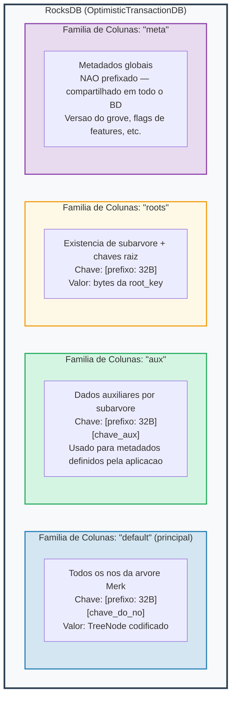
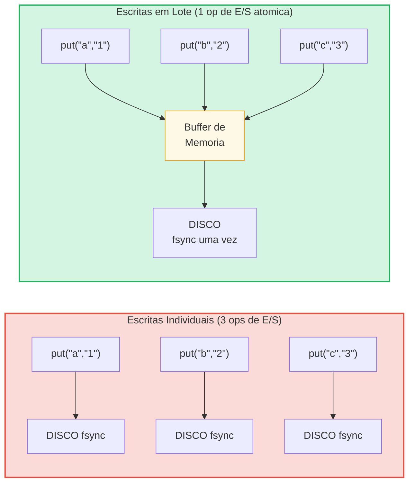

# A Camada de Armazenamento

## RocksDB com OptimisticTransactionDB

O GroveDB usa **RocksDB** como seu backend de armazenamento, especificamente a variante
`OptimisticTransactionDB` que suporta transacoes:

```rust
// storage/src/rocksdb_storage/storage.rs
pub(crate) type Db = OptimisticTransactionDB;
pub(crate) type Tx<'db> = Transaction<'db, Db>;

pub struct RocksDbStorage {
    db: OptimisticTransactionDB,
}
```

**Transacoes otimistas** funcionam assumindo que nao havera conflitos. Se duas
transacoes modificam os mesmos dados, a segunda a ser commitada falhara e pode ser
retentada. Isso e mais eficiente que o travamento pessimista para cargas de trabalho
onde conflitos sao raros.

As opcoes do RocksDB sao ajustadas para a carga de trabalho do GroveDB:

```rust
lazy_static! {
    static ref DEFAULT_OPTS: rocksdb::Options = {
        let mut opts = rocksdb::Options::default();
        opts.create_if_missing(true);
        opts.increase_parallelism(num_cpus::get() as i32);
        opts.set_allow_mmap_writes(true);
        opts.set_allow_mmap_reads(true);
        opts.create_missing_column_families(true);
        opts.set_atomic_flush(true);
        opts
    };
}
```

## Quatro Familias de Colunas

As familias de colunas do RocksDB atuam como namespaces chave-valor separados dentro de
um unico banco de dados. O GroveDB usa quatro:



> **Exemplo:** A chave `[ab3fc2...][6e616d65]` na CF "default" mapeia para `TreeNode{key:"name", val:"Al"}`, onde `ab3fc2...` e `Blake3(path)` e `6e616d65` e `"name"` em bytes.

```rust
pub(crate) const AUX_CF_NAME: &str = "aux";
pub(crate) const ROOTS_CF_NAME: &str = "roots";
pub(crate) const META_CF_NAME: &str = "meta";
// Dados principais usam a familia de colunas default
```

## Contextos de Armazenamento Prefixados

Cada subarvore recebe seu proprio **contexto de armazenamento prefixado** — um wrapper
que automaticamente prefixa todas as chaves com o prefixo Blake3 de 32 bytes:

```text
    Caminho da subarvore: ["identities", "alice"]
    Prefixo: Blake3(path) = [0xab, 0x3f, 0xc2, ...]  (32 bytes)

    Quando a subarvore armazena chave "name" com valor "Alice":

    Chave RocksDB:  [0xab 0x3f 0xc2 ... (32 bytes) | 0x6e 0x61 0x6d 0x65]
                     \_________prefixo________/       \_____"name"_____/

    Valor RocksDB: [TreeNode codificado com valor "Alice"]
```

Os tipos de contexto:

```text
    Sem transacao:
    PrefixedRocksDbImmediateStorageContext
    └── Leitura/escrita diretamente no BD com prefixo

    Com transacao:
    PrefixedRocksDbTransactionContext
    └── Leitura/escrita atraves de uma Transaction com prefixo
```

Ambos implementam a trait `StorageContext`:

```rust
pub trait StorageContext<'db> {
    fn get(&self, key: &[u8]) -> CostResult<Option<Vec<u8>>, Error>;
    fn get_aux(&self, key: &[u8]) -> CostResult<Option<Vec<u8>>, Error>;
    fn get_root(&self, key: &[u8]) -> CostResult<Option<Vec<u8>>, Error>;
    fn get_meta(&self, key: &[u8]) -> CostResult<Option<Vec<u8>>, Error>;
    fn put(&self, key: &[u8], value: &[u8], ...) -> CostResult<(), Error>;
    fn put_aux(&self, key: &[u8], value: &[u8], ...) -> CostResult<(), Error>;
    fn put_root(&self, key: &[u8], value: &[u8], ...) -> CostResult<(), Error>;
    fn put_meta(&self, key: &[u8], value: &[u8], ...) -> CostResult<(), Error>;
    fn delete(&self, key: &[u8], ...) -> CostResult<(), Error>;
    // ...
}
```

## Lotes de Escrita e Modelo de Transacao

Para desempenho, o GroveDB acumula escritas em lotes:



> 3 syncs de disco vs 1 sync de disco = ~3x mais rapido. Escritas em lote tambem sao **atomicas** (tudo ou nada).

O `StorageBatch` acumula operacoes que sao descarregadas juntas:

```rust
pub struct StorageBatch {
    operations: RefCell<Vec<AbstractBatchOperation>>,
}
```

## O Padrao Critico commit_local()

Ao usar transacoes, ha um padrao critico que deve ser seguido. Escritas dentro de uma
transacao sao armazenadas em buffer — nao sao visiveis ate serem commitadas:

```rust
// Padrao CORRETO:
{
    let tx = db.start_transaction();
    let storage_ctx = db.get_transactional_storage_context(path, &tx);

    storage_ctx.put(key, value);  // Escreve no buffer da transacao

    drop(storage_ctx);            // Libera o emprestimo no tx
    tx.commit_local();            // Descarrega a transacao no BD
}

// INCORRETO — dados sao perdidos:
{
    let tx = db.start_transaction();
    let storage_ctx = db.get_transactional_storage_context(path, &tx);

    storage_ctx.put(key, value);  // Escreve no buffer da transacao

    // tx e descartado aqui sem commit_local()!
    // Todas as escritas sao REVERTIDAS!
}
```

Isso e especialmente importante porque o `storage_ctx` pega emprestado a transacao.
Voce deve fazer `drop(storage_ctx)` antes de poder chamar `tx.commit_local()`.

---
