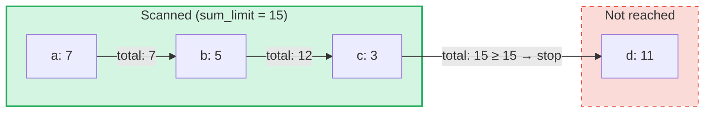

# Агрегатные запросы сумм

## Обзор

Агрегатные запросы сумм — это специализированный тип запросов, предназначенный для **SumTrees** в GroveDB.
В отличие от обычных запросов, которые извлекают элементы по ключу или диапазону, агрегатные запросы сумм
перебирают элементы и накапливают их значения сумм до достижения **предела суммы**.

Это полезно для таких вопросов, как:
- "Выдай мне транзакции, пока нарастающий итог не превысит 1000"
- "Какие элементы вносят вклад в первые 500 единиц значения в этом дереве?"
- "Собери элементы сумм до бюджета N"

## Основные концепции

### Отличия от обычных запросов

| Характеристика | PathQuery | AggregateSumPathQuery |
|---------|-----------|----------------------|
| **Цель** | Любой тип элемента | Элементы SumItem / ItemWithSumItem |
| **Условие остановки** | Лимит (количество) или конец диапазона | Предел суммы (нарастающий итог) **и/или** лимит элементов |
| **Возвращает** | Элементы или ключи | Пары ключ-значение суммы |
| **Подзапросы** | Да (спуск в поддеревья) | Нет (только один уровень дерева) |
| **Ссылки** | Разрешаются на уровне GroveDB | Опционально следование или игнорирование |

### Структура AggregateSumQuery

```rust
pub struct AggregateSumQuery {
    pub items: Vec<QueryItem>,              // Keys or ranges to scan
    pub left_to_right: bool,                // Iteration direction
    pub sum_limit: u64,                     // Stop when running total reaches this
    pub limit_of_items_to_check: Option<u16>, // Max number of matching items to return
}
```

Запрос оборачивается в `AggregateSumPathQuery` для указания места поиска в роще:

```rust
pub struct AggregateSumPathQuery {
    pub path: Vec<Vec<u8>>,                 // Path to the SumTree
    pub aggregate_sum_query: AggregateSumQuery,
}
```

### Предел суммы — нарастающий итог

`sum_limit` — это центральная концепция. По мере сканирования элементов их значения сумм
накапливаются. Как только нарастающий итог достигает или превышает предел суммы, итерация останавливается:



> **Результат:** `[(a, 7), (b, 5), (c, 3)]` — итерация останавливается, потому что 7 + 5 + 3 = 15 >= sum_limit

Поддерживаются отрицательные значения сумм. Отрицательное значение увеличивает оставшийся бюджет:

```text
sum_limit = 12, elements: a(10), b(-3), c(5)

a: total = 10, remaining = 2
b: total =  7, remaining = 5  ← negative value gave us more room
c: total = 12, remaining = 0  ← stop

Result: [(a, 10), (b, -3), (c, 5)]
```

## Параметры запроса

Структура `AggregateSumQueryOptions` управляет поведением запроса:

```rust
pub struct AggregateSumQueryOptions {
    pub allow_cache: bool,                              // Use cached reads (default: true)
    pub error_if_intermediate_path_tree_not_present: bool, // Error on missing path (default: true)
    pub error_if_non_sum_item_found: bool,              // Error on non-sum elements (default: true)
    pub ignore_references: bool,                        // Skip references (default: false)
}
```

### Обработка элементов, не являющихся суммами

SumTrees могут содержать смесь типов элементов: `SumItem`, `Item`, `Reference`, `ItemWithSumItem`
и другие. По умолчанию обнаружение элемента, не являющегося суммой или ссылкой, приводит к ошибке.

Когда `error_if_non_sum_item_found` установлен в `false`, элементы, не являющиеся суммами,
**молча пропускаются** без расходования слота пользовательского лимита:

```text
Tree contents: a(SumItem=7), b(Item), c(SumItem=3)
Query: sum_limit=100, limit_of_items_to_check=2, error_if_non_sum_item_found=false

Scan: a(7) → returned, limit=1
      b(Item) → skipped, limit still 1
      c(3) → returned, limit=0 → stop

Result: [(a, 7), (c, 3)]
```

Примечание: элементы `ItemWithSumItem` **всегда** обрабатываются (никогда не пропускаются), поскольку
они содержат значение суммы.

### Обработка ссылок

По умолчанию элементы `Reference` **разрешаются** — запрос следует по цепочке ссылок
(до 3 промежуточных переходов), чтобы найти значение суммы целевого элемента:

```text
Tree contents: a(SumItem=7), ref_b(Reference → a)
Query: sum_limit=100

ref_b is followed → resolves to a(SumItem=7)

Result: [(a, 7), (ref_b, 7)]
```

Когда `ignore_references` установлен в `true`, ссылки молча пропускаются без расходования слота
лимита, аналогично тому, как пропускаются элементы, не являющиеся суммами.

Цепочки ссылок глубиной более 3 промежуточных переходов приводят к ошибке `ReferenceLimit`.

## Тип результата

Запросы возвращают `AggregateSumQueryResult`:

```rust
pub struct AggregateSumQueryResult {
    pub results: Vec<(Vec<u8>, i64)>,       // Key-sum value pairs
    pub hard_limit_reached: bool,           // True if system limit truncated results
}
```

Флаг `hard_limit_reached` указывает, был ли достигнут системный жёсткий лимит сканирования
(по умолчанию: 1024 элемента) до естественного завершения запроса. Когда значение `true`,
за пределами возвращённых результатов могут существовать дополнительные данные.

## Две системы лимитов

Агрегатные запросы сумм имеют **три** условия остановки:

| Лимит | Источник | Что считает | Эффект при достижении |
|-------|--------|---------------|-------------------|
| **sum_limit** | Пользователь (запрос) | Нарастающий итог значений сумм | Останавливает итерацию |
| **limit_of_items_to_check** | Пользователь (запрос) | Возвращённые совпавшие элементы | Останавливает итерацию |
| **Жёсткий лимит сканирования** | Система (GroveVersion, по умолчанию 1024) | Все просканированные элементы (включая пропущенные) | Останавливает итерацию, устанавливает `hard_limit_reached` |

Жёсткий лимит сканирования предотвращает неограниченную итерацию при отсутствии пользовательского
лимита. Пропущенные элементы (элементы, не являющиеся суммами, при `error_if_non_sum_item_found=false`,
или ссылки при `ignore_references=true`) учитываются в жёстком лимите сканирования, но **не** в
пользовательском `limit_of_items_to_check`.

## Использование API

### Простой запрос

```rust
use grovedb::AggregateSumPathQuery;
use grovedb_merk::proofs::query::AggregateSumQuery;

// "Give me items from this SumTree until the total reaches 1000"
let query = AggregateSumQuery::new(1000, None);
let path_query = AggregateSumPathQuery {
    path: vec![b"my_tree".to_vec()],
    aggregate_sum_query: query,
};

let result = db.query_aggregate_sums(
    &path_query,
    true,   // allow_cache
    true,   // error_if_intermediate_path_tree_not_present
    None,   // transaction
    grove_version,
).unwrap().expect("query failed");

for (key, sum_value) in &result.results {
    println!("{}: {}", String::from_utf8_lossy(key), sum_value);
}
```

### Запрос с параметрами

```rust
use grovedb::{AggregateSumPathQuery, AggregateSumQueryOptions};
use grovedb_merk::proofs::query::AggregateSumQuery;

// Skip non-sum items and ignore references
let query = AggregateSumQuery::new(1000, Some(50));
let path_query = AggregateSumPathQuery {
    path: vec![b"mixed_tree".to_vec()],
    aggregate_sum_query: query,
};

let result = db.query_aggregate_sums_with_options(
    &path_query,
    AggregateSumQueryOptions {
        error_if_non_sum_item_found: false,  // skip Items, Trees, etc.
        ignore_references: true,              // skip References
        ..AggregateSumQueryOptions::default()
    },
    None,
    grove_version,
).unwrap().expect("query failed");

if result.hard_limit_reached {
    println!("Warning: results may be incomplete (hard limit reached)");
}
```

### Запросы по ключам

Вместо сканирования диапазона можно запрашивать конкретные ключи:

```rust
// Check the sum value of specific keys
let query = AggregateSumQuery::new_with_keys(
    vec![b"alice".to_vec(), b"bob".to_vec(), b"carol".to_vec()],
    u64::MAX,  // no sum limit
    None,      // no item limit
);
```

### Запросы в обратном порядке

Итерация от наибольшего ключа к наименьшему:

```rust
let query = AggregateSumQuery::new_descending(500, Some(10));
// Or: query.left_to_right = false;
```

## Справочник конструкторов

| Конструктор | Описание |
|-------------|-------------|
| `new(sum_limit, limit)` | Полный диапазон, по возрастанию |
| `new_descending(sum_limit, limit)` | Полный диапазон, по убыванию |
| `new_single_key(key, sum_limit)` | Поиск по одному ключу |
| `new_with_keys(keys, sum_limit, limit)` | Несколько конкретных ключей |
| `new_with_keys_reversed(keys, sum_limit, limit)` | Несколько ключей, по убыванию |
| `new_single_query_item(item, sum_limit, limit)` | Один QueryItem (ключ или диапазон) |
| `new_with_query_items(items, sum_limit, limit)` | Несколько QueryItems |

---
