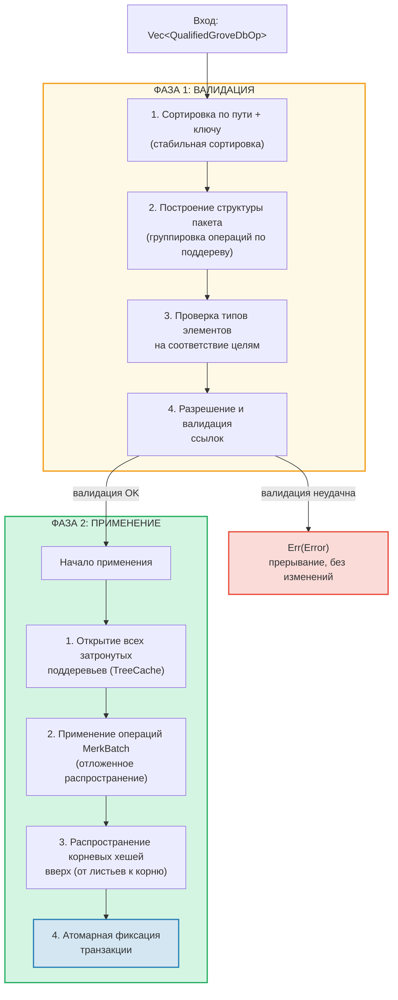
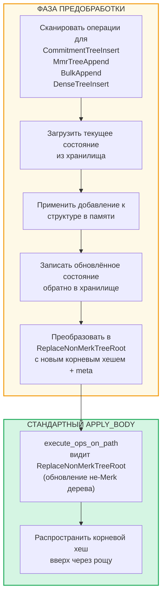

# Пакетные операции на уровне рощи

## Варианты GroveOp

На уровне GroveDB операции представлены как `GroveOp`:

```rust
pub enum GroveOp {
    // User-facing operations:
    InsertOnly { element: Element },
    InsertOrReplace { element: Element },
    Replace { element: Element },
    Patch { element: Element, change_in_bytes: i32 },
    RefreshReference { reference_path_type, max_reference_hop, flags, trust_refresh_reference },
    Delete,
    DeleteTree(TreeType),                          // Parameterized by tree type

    // Non-Merk tree append operations (user-facing):
    CommitmentTreeInsert { cmx: [u8; 32], payload: Vec<u8> },
    MmrTreeAppend { value: Vec<u8> },
    BulkAppend { value: Vec<u8> },
    DenseTreeInsert { value: Vec<u8> },

    // Internal operations (created by preprocessing/propagation, rejected by from_ops):
    ReplaceTreeRootKey { hash, root_key, aggregate_data },
    InsertTreeWithRootHash { hash, root_key, flags, aggregate_data },
    ReplaceNonMerkTreeRoot { hash: [u8; 32], meta: NonMerkTreeMeta },
    InsertNonMerkTree { hash, root_key, flags, aggregate_data, meta: NonMerkTreeMeta },
}
```

**NonMerkTreeMeta** несёт типоспецифичное состояние дерева через обработку пакета:

```rust
pub enum NonMerkTreeMeta {
    CommitmentTree { total_count: u64, chunk_power: u8 },
    MmrTree { mmr_size: u64 },
    BulkAppendTree { total_count: u64, chunk_power: u8 },
    DenseTree { count: u16, height: u8 },
}
```

Каждая операция обёрнута в `QualifiedGroveDbOp`, включающий путь:

```rust
pub struct QualifiedGroveDbOp {
    pub path: KeyInfoPath,           // Where in the grove
    pub key: Option<KeyInfo>,        // Which key (None for append-only tree ops)
    pub op: GroveOp,                 // What to do
}
```

> **Примечание:** Поле `key` имеет тип `Option<KeyInfo>` — оно равно `None` для операций деревьев «только добавление» (`CommitmentTreeInsert`, `MmrTreeAppend`, `BulkAppend`, `DenseTreeInsert`), где ключ дерева является последним сегментом `path`.

## Двухфазная обработка

Пакетные операции обрабатываются в две фазы:



## TreeCache и отложенное распространение

Во время применения пакета GroveDB использует **TreeCache** для откладывания распространения корневого хеша до завершения всех операций в поддереве:

```mermaid
graph TD
    subgraph without["БЕЗ TreeCache (наивный подход)"]
        w1["Оп 1: Вставка A в X"]
        w1p["Распространение X → родитель → корень"]
        w2["Оп 2: Вставка B в X"]
        w2p["Распространение X → родитель → корень"]
        w3["Оп 3: Вставка C в X"]
        w3p["Распространение X → родитель → корень"]
        w1 --> w1p --> w2 --> w2p --> w3 --> w3p
    end

    subgraph with_tc["С TreeCache (отложенный подход)"]
        t1["Оп 1: Вставка A в X<br/>→ буферизация"]
        t2["Оп 2: Вставка B в X<br/>→ буферизация"]
        t3["Оп 3: Вставка C в X<br/>→ буферизация"]
        tp["Распространение X → родитель → корень<br/>(обход вверх ОДИН раз)"]
        t1 --> t2 --> t3 --> tp
    end

    style without fill:#fadbd8,stroke:#e74c3c,stroke-width:2px
    style with_tc fill:#d5f5e3,stroke:#27ae60,stroke-width:2px
    style w1p fill:#fadbd8,stroke:#e74c3c
    style w2p fill:#fadbd8,stroke:#e74c3c
    style w3p fill:#fadbd8,stroke:#e74c3c
    style tp fill:#d5f5e3,stroke:#27ae60,stroke-width:2px
```



> **3 распространения × O(глубина)** против **1 распространение × O(глубина)** = в 3 раза быстрее для этого поддерева.

Это значительная оптимизация, когда много операций направлены на одно поддерево.

## Атомарные операции между поддеревьями

Ключевое свойство пакетов GroveDB — **атомарность между поддеревьями**. Один пакет может модифицировать элементы в нескольких поддеревьях, и либо все изменения фиксируются, либо ни одно:

```text
    Пакет:
    1. Удалить ["balances", "alice"]       (удалить баланс)
    2. Вставить ["balances", "bob"] = 100   (добавить баланс)
    3. Обновить ["identities", "bob", "rev"] = 2  (обновить ревизию)

    Затронуты три поддерева: balances, identities, identities/bob

    Если ЛЮБАЯ операция завершится ошибкой → ВСЕ операции откатываются
    Если ВСЕ успешны → ВСЕ фиксируются атомарно
```

Обработчик пакетов реализует это, выполняя:
1. Сбор всех затронутых путей
2. Открытие всех необходимых поддеревьев
3. Применение всех операций
4. Распространение всех корневых хешей в порядке зависимостей
5. Фиксацию всей транзакции

## Предобработка пакетов для не-Merk деревьев

Операции CommitmentTree, MmrTree, BulkAppendTree и DenseAppendOnlyFixedSizeTree требуют доступа к контекстам хранения за пределами Merk, который недоступен внутри стандартного метода `execute_ops_on_path` (у него есть доступ только к Merk). Эти операции используют **паттерн предобработки**: перед основной фазой `apply_body` точки входа сканируют не-Merk операции деревьев и конвертируют их в стандартные внутренние операции.

```rust
pub enum GroveOp {
    // ... standard ops ...

    // Non-Merk tree operations (user-facing):
    CommitmentTreeInsert { cmx: [u8; 32], payload: Vec<u8> },
    MmrTreeAppend { value: Vec<u8> },
    BulkAppend { value: Vec<u8> },
    DenseTreeInsert { value: Vec<u8> },

    // Internal ops (produced by preprocessing):
    ReplaceNonMerkTreeRoot { hash: [u8; 32], meta: NonMerkTreeMeta },
}
```



**Зачем нужна предобработка?** Функция `execute_ops_on_path` работает с единственным поддеревом Merk и не имеет доступа к `self.db` или более широким контекстам хранения. Предобработка в точках входа (`apply_batch_with_element_flags_update`, `apply_partial_batch_with_element_flags_update`) имеет полный доступ к базе данных, поэтому может загружать/сохранять данные, а затем передать простой `ReplaceNonMerkTreeRoot` стандартному механизму пакетной обработки.

Каждый метод предобработки следует одному паттерну:
1. **`preprocess_commitment_tree_ops`** — Загружает фронтир и BulkAppendTree из хранилища данных, добавляет в оба, сохраняет обратно, преобразует в `ReplaceNonMerkTreeRoot` с обновлённым комбинированным корнем и метаданными `CommitmentTree { total_count, chunk_power }`
2. **`preprocess_mmr_tree_ops`** — Загружает MMR из хранилища данных, добавляет значения, сохраняет обратно, преобразует в `ReplaceNonMerkTreeRoot` с обновлённым корнем MMR и метаданными `MmrTree { mmr_size }`
3. **`preprocess_bulk_append_ops`** — Загружает BulkAppendTree из хранилища данных, добавляет значения (может вызвать компактификацию чанков), сохраняет обратно, преобразует в `ReplaceNonMerkTreeRoot` с обновлённым корнем состояния и метаданными `BulkAppendTree { total_count, chunk_power }`
4. **`preprocess_dense_tree_ops`** — Загружает DenseFixedSizedMerkleTree из хранилища данных, вставляет значения последовательно, пересчитывает корневой хеш, сохраняет обратно, преобразует в `ReplaceNonMerkTreeRoot` с обновлённым корневым хешем и метаданными `DenseTree { count, height }`

Операция `ReplaceNonMerkTreeRoot` несёт новый корневой хеш и перечисление `NonMerkTreeMeta`, чтобы элемент мог быть полностью восстановлен после обработки.

---
