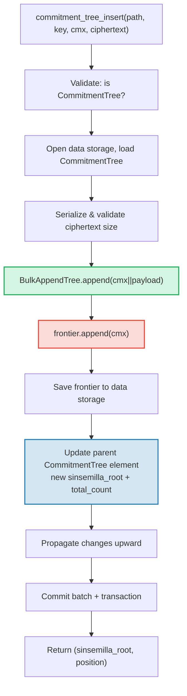

# CommitmentTree — Якоря Sinsemilla-коммитментов

**CommitmentTree** — это мост GroveDB между аутентифицированным хранилищем и
системами доказательств с нулевым разглашением (zero-knowledge). Он объединяет **BulkAppendTree** (Глава 14) для
эффективного чанк-компактного хранения данных с **фронтиром Sinsemilla** в
пространстве данных для ZK-совместимых якорей. Как и MmrTree с BulkAppendTree, он
**не имеет дочернего Merk** — комбинированный корневой хеш передаётся как дочерний хеш Merk.
И записи BulkAppendTree, и фронтир Sinsemilla хранятся в **пространстве данных** (data namespace).

Эта глава охватывает хеш-функцию Sinsemilla и её значение для схем с нулевым
разглашением, структуру данных фронтира и её компактную сериализацию, архитектуру
хранения в двух пространствах имён, операции GroveDB, предобработку пакетов,
генерацию свидетельств (witness) на стороне клиента и работу доказательств.

## Зачем нужно ZK-дружественное дерево?

Стандартные деревья GroveDB используют хеширование Blake3. Blake3 быстр программно, но
**дорог внутри ZK-схем** (zero-knowledge circuits). Когда плательщик должен доказать
«Я знаю ноту в позиции P дерева коммитментов», не раскрывая P, ему нужно
вычислить хеш-функцию Меркла 32 раза (по разу на уровень дерева) внутри
ZK-схемы.

Sinsemilla (определена в ZIP-244 для протокола Zcash Orchard) спроектирована
именно для этого случая — она обеспечивает **эффективное хеширование внутри схемы** на
эллиптической кривой Pallas, одной из двух кривых цикла Pasta, используемого системой
доказательств Halo 2.

| Свойство | Blake3 | Sinsemilla |
|----------|--------|------------|
| **Стоимость в схеме** | ~25 000 ограничений на хеш | ~800 ограничений на хеш |
| **Программная скорость** | Очень быстро (~2 ГБ/с) | Медленно (~10 000 хешей/с) |
| **Алгебраическая структура** | Отсутствует (побитовая) | Операции на кривой Pallas |
| **Основное назначение** | Общее хеширование, деревья Меркла | Доказательства Меркла внутри схемы |
| **Используется в** | Деревья Merk GroveDB, MMR, Bulk | Протокол Orchard с экранированием |
| **Размер выхода** | 32 байта | 32 байта (элемент поля Pallas) |

CommitmentTree использует Sinsemilla для дерева Меркла, о котором рассуждают ZK-схемы,
продолжая при этом использовать Blake3 для иерархии Merk GroveDB над ним.
Элементы, вставляемые в дерево, хранятся через BulkAppendTree в пространстве данных
(чанк-компактное хранение, извлечение по позиции) и одновременно добавляются
во фронтир Sinsemilla (создавая ZK-доказуемый якорь).

## Архитектура хранения в пространстве данных

CommitmentTree хранит **все данные в пространстве данных** (data namespace) по одному пути
поддерева. Как и MmrTree с BulkAppendTree, он **не имеет дочернего Merk** (нет поля `root_key` —
типоспецифичный корень передаётся как дочерний хеш Merk). Записи BulkAppendTree и фронтир
Sinsemilla сосуществуют в пространстве данных с различными префиксами ключей:

```text
┌──────────────────────────────────────────────────────────────┐
│                       CommitmentTree                          │
│                                                               │
│  ┌─────────────────────────────────────────────────────────┐  │
│  │  Data Namespace                                         │  │
│  │                                                         │  │
│  │  BulkAppendTree storage (Chapter 14):                   │  │
│  │    Buffer entries → chunk blobs → chunk MMR             │  │
│  │    value = cmx (32 bytes) || ciphertext (216 bytes)     │  │
│  │                                                         │  │
│  │  Sinsemilla Frontier (~1KB):                            │  │
│  │    key: b"__ct_data__" (COMMITMENT_TREE_DATA_KEY)       │  │
│  │    Depth-32 incremental Merkle tree                     │  │
│  │    Stores only the rightmost path (leaf + ommers)       │  │
│  │    O(1) append, O(1) root computation                   │  │
│  │    Produces Orchard-compatible Anchor for ZK proofs     │  │
│  └─────────────────────────────────────────────────────────┘  │
│                                                               │
│  sinsemilla_root embedded in Element bytes                    │
│    → flows through Merk value_hash → GroveDB state root      │
└──────────────────────────────────────────────────────────────┘
```

**Зачем две структуры?** BulkAppendTree обеспечивает эффективное, чанк-компактное
хранение и извлечение потенциально миллионов зашифрованных нот. Фронтир Sinsemilla
предоставляет ZK-совместимые якоря, доказуемые внутри схемы Halo 2.
Обе обновляются синхронно при каждом добавлении.

Сравнение с другими нестандартными типами деревьев:

| | CommitmentTree | MmrTree | BulkAppendTree |
|---|---|---|---|
| **Дочерний Merk** | Нет | Нет | Нет |
| **Пространство данных** | Записи BulkAppendTree + фронтир | Узлы MMR | Буфер + чанки + MMR |
| **Пространство aux** | — | — | — |
| **Элементы запрашиваемы** | Через V1-доказательства | Через V1-доказательства | Через V1-доказательства |
| **Хеш-функция** | Sinsemilla + Blake3 | Blake3 | Blake3 |

## Фронтир Sinsemilla

Фронтир — это инкрементальное дерево Меркла глубиной 32, реализованное типом
`Frontier<MerkleHashOrchard, 32>` из крейта `incrementalmerkletree`. Вместо хранения
всех 2^32 возможных листьев он хранит лишь информацию, необходимую для
**добавления следующего листа и вычисления текущего корня**: крайний правый лист и
его оммеры (хеши соседних узлов, необходимые для вычисления корня).

```text
                         root (level 32)
                        /               \
                      ...               ...
                     /                     \
                  (level 2)             (level 2)
                  /     \               /     \
              (level 1) (level 1)   (level 1)  ?
              /    \    /    \      /    \
             L0    L1  L2    L3   L4    ?     ← frontier stores L4
                                              + ommers at levels
                                              where left sibling exists
```

Фронтир хранит:
- **leaf**: последнее добавленное значение (элемент поля Pallas)
- **ommers**: хеши левых соседей на каждом уровне, где путь фронтира идёт вправо
  (не более 32 оммеров для дерева глубиной 32)
- **position**: 0-индексированная позиция листа

Ключевые свойства:
- **O(1) добавление**: вставить новый лист, обновить оммеры, пересчитать корень
- **O(1) вычисление корня**: обход хранимых оммеров от листа к корню
- **~1КБ постоянный размер**: независимо от количества добавленных листьев
- **Детерминированность**: два фронтира с одинаковой последовательностью добавлений
  дают одинаковый корень

Константа `EMPTY_SINSEMILLA_ROOT` — это корень пустого дерева глубиной 32,
предвычисленный как `MerkleHashOrchard::empty_root(Level::from(32)).to_bytes()`:

```text
0xae2935f1dfd8a24aed7c70df7de3a668eb7a49b1319880dde2bbd9031ae5d82f
```

## Как работает добавление — Каскад оммеров

Когда новый коммитмент добавляется в позицию N, количество оммеров, которые нужно
обновить, равно `trailing_ones(N)` — числу завершающих единичных битов в двоичном
представлении N. Это тот же паттерн, что и каскад слияния MMR (§13.4), но оперирующий
оммерами вместо пиков.

**Разбор примера — добавление 4 листьев:**

```text
Position 0 (binary: 0, trailing_ones: 0):
  frontier = { leaf: L0, ommers: [], position: 0 }
  Sinsemilla hashes: 32 (root computation) + 0 (no ommer merges) = 32

Position 1 (binary: 1, trailing_ones: 0 of PREVIOUS position 0):
  Before: position 0 has trailing_ones = 0
  frontier = { leaf: L1, ommers: [H(L0,L1) at level 1], position: 1 }
  Sinsemilla hashes: 32 + 0 = 32

Position 2 (binary: 10, trailing_ones: 0 of PREVIOUS position 1):
  Before: position 1 has trailing_ones = 1
  frontier = { leaf: L2, ommers: [level1_hash], position: 2 }
  Sinsemilla hashes: 32 + 1 = 33

Position 3 (binary: 11, trailing_ones: 0 of PREVIOUS position 2):
  Before: position 2 has trailing_ones = 0
  frontier = { leaf: L3, ommers: [level1_hash, level2_hash], position: 3 }
  Sinsemilla hashes: 32 + 0 = 32
```

**Общее количество хешей Sinsemilla** на добавление:

```text
32 (root computation always traverses all 32 levels)
+ trailing_ones(current_position)  (ommer cascade)
```

В среднем `trailing_ones` равно ~1 (геометрическое распределение), поэтому средняя
стоимость составляет **~33 хеша Sinsemilla на добавление**. Наихудший случай (в позиции
2^32 - 1, где все биты равны 1) — **64 хеша**.

## Формат сериализации фронтира

Фронтир хранится в пространстве данных по ключу `b"__ct_data__"`. Формат:

```text
┌──────────────────────────────────────────────────────────────────┐
│ has_frontier: u8                                                  │
│   0x00 → empty tree (no more fields)                             │
│   0x01 → non-empty (fields follow)                               │
├──────────────────────────────────────────────────────────────────┤
│ position: u64 BE (8 bytes)      — 0-indexed leaf position        │
├──────────────────────────────────────────────────────────────────┤
│ leaf: [u8; 32]                  — Pallas field element bytes     │
├──────────────────────────────────────────────────────────────────┤
│ ommer_count: u8                 — number of ommers (0..=32)      │
├──────────────────────────────────────────────────────────────────┤
│ ommers: [ommer_count × 32 bytes] — Pallas field elements        │
└──────────────────────────────────────────────────────────────────┘
```

**Анализ размера:**

| Состояние | Размер | Разбивка |
|-----------|--------|-----------|
| Пустое | 1 байт | только флаг `0x00` |
| 1 лист, 0 оммеров | 42 байта | 1 + 8 + 32 + 1 |
| ~16 оммеров (среднее) | 554 байта | 1 + 8 + 32 + 1 + 16×32 |
| 32 оммера (максимум) | 1 066 байт | 1 + 8 + 32 + 1 + 32×32 |

Размер фронтира ограничен ~1,1КБ независимо от того, сколько миллионов коммитментов
было добавлено. Это делает цикл загрузка→модификация→сохранение очень дешёвым
(1 seek на чтение, 1 seek на запись).

## Представление элемента

```rust
CommitmentTree(
    u64,                  // total_count: number of appended items
    u8,                   // chunk_power: dense tree height for BulkAppendTree buffer
    Option<ElementFlags>, // flags: optional metadata
)
```

Параметр `chunk_power` управляет высотой плотного дерева буфера BulkAppendTree;
`chunk_power` должен быть в диапазоне 1..=16 (см. §14.1 и §16).

**Идентификаторы типа:**

| Идентификатор | Значение |
|---|---|
| Дискриминант элемента | 11 |
| `TreeType` | `CommitmentTree = 7` |
| `ElementType` | 11 |
| `COMMITMENT_TREE_COST_SIZE` | 12 байт (8 total_count + 1 chunk_power + 1 дискриминант + 2 накладные расходы) |

Корень Sinsemilla НЕ хранится в Element. Он передаётся как дочерний хеш Merk
через механизм `insert_subtree`. Когда родительский Merk вычисляет свой
`combined_value_hash`, корень, полученный из Sinsemilla, включается как дочерний хеш:

```text
combined_value_hash = blake3(value_hash || child_hash)
                                           ↑ sinsemilla/BulkAppendTree combined root
```

Это означает, что любое изменение фронтира Sinsemilla автоматически распространяется
через иерархию Merk GroveDB до корня состояния.

**Методы-конструкторы:**

| Метод | Создаёт |
|---|---|
| `Element::empty_commitment_tree(chunk_power)` | Пустое дерево, count=0, без флагов |
| `Element::empty_commitment_tree_with_flags(chunk_power, flags)` | Пустое дерево с флагами |
| `Element::new_commitment_tree(total_count, chunk_power, flags)` | Все поля явно |

## Архитектура хранения

CommitmentTree хранит все свои данные в одном **пространстве данных** (data namespace) по пути
поддерева. Записи BulkAppendTree и фронтир Sinsemilla сосуществуют в одной колонке
с различными префиксами ключей. Пространство aux не используется.

```text
┌──────────────────────────────────────────────────────────────────┐
│  Data Namespace (all CommitmentTree storage)                      │
│                                                                   │
│  BulkAppendTree storage keys (see §14.7):                         │
│    b"m" || pos (u64 BE)  → MMR node blobs                        │
│    b"b" || index (u64 BE)→ buffer entries (cmx || ciphertext)     │
│    b"e" || chunk (u64 BE)→ chunk blobs (compacted buffer)         │
│    b"M"                  → BulkAppendTree metadata                │
│                                                                   │
│  Sinsemilla frontier:                                             │
│    b"__ct_data__"        → serialized CommitmentFrontier (~1KB)   │
│                                                                   │
│  No Merk nodes — this is a non-Merk tree.                         │
│  Data authenticated via BulkAppendTree state_root (Blake3).       │
│  Sinsemilla root authenticates all cmx values via Pallas curve.   │
└──────────────────────────────────────────────────────────────────┘
```

**Паттерн загрузка→модификация→сохранение**: Каждая мутирующая операция загружает
фронтир из хранилища данных, модифицирует его в памяти и записывает обратно. Поскольку
фронтир занимает не более ~1КБ, это недорогая пара операций ввода-вывода (1 seek на чтение,
1 seek на запись). Одновременно загружается, дополняется и сохраняется BulkAppendTree.

**Распространение корневого хеша**: При вставке элемента изменяются две вещи:
1. Состояние BulkAppendTree (новая запись в буфере или компактификация чанка)
2. Корень Sinsemilla (новый коммитмент во фронтире)

Оба фиксируются в обновлённом элементе `CommitmentTree`. Хеш узла родительского Merk
становится:

```text
combined_hash = combine_hash(
    value_hash(element_bytes),    ← includes total_count + chunk_power
    child_hash(combined_root)     ← sinsemilla/BulkAppendTree combined root
)
```

Как и для MmrTree и BulkAppendTree, типоспецифичный корень передаётся как дочерний хеш
Merk. Вся аутентификация данных проходит через эту привязку дочернего хеша.

**Последствия хранения данных не-Merk**: Поскольку пространство данных содержит
ключи BulkAppendTree (не узлы Merk), операции, итерирующие хранилище как элементы
Merk — такие как `find_subtrees`, `is_empty_tree` и `verify_merk_and_submerks` —
должны обрабатывать CommitmentTree (и другие типы не-Merk деревьев) как особый случай.
Помощник `uses_non_merk_data_storage()` на `Element` и `TreeType` идентифицирует
эти типы деревьев. Операции удаления очищают пространство данных напрямую вместо
его итерации, а `verify_grovedb` пропускает рекурсию в дочерние Merk для этих типов.

## Операции GroveDB

CommitmentTree предоставляет четыре операции. Операция вставки обобщена по
`M: MemoSize` (из крейта `orchard`), контролирующему валидацию размера полезной нагрузки
шифротекста. По умолчанию `M = DashMemo` даёт 216-байтовую полезную нагрузку
(32 epk + 104 enc + 80 out).

```rust
// Insert a commitment (typed) — returns (sinsemilla_root, position)
// M controls ciphertext size validation
db.commitment_tree_insert::<_, _, M>(path, key, cmx, ciphertext, tx, version)

// Insert a commitment (raw bytes) — validates payload.len() == ciphertext_payload_size::<DashMemo>()
db.commitment_tree_insert_raw(path, key, cmx, payload_vec, tx, version)

// Get the current Orchard Anchor
db.commitment_tree_anchor(path, key, tx, version)

// Retrieve a value by global position
db.commitment_tree_get_value(path, key, position, tx, version)

// Get the current item count
db.commitment_tree_count(path, key, tx, version)
```

Типизированный `commitment_tree_insert` принимает `TransmittedNoteCiphertext<M>` и
сериализует его внутренне. Сырой `commitment_tree_insert_raw` (pub(crate))
принимает `Vec<u8>` и используется при предобработке пакетов, где полезные нагрузки
уже сериализованы.

### commitment_tree_insert

Операция вставки обновляет и BulkAppendTree, и фронтир Sinsemilla в одной
атомарной операции:

```text
Step 1: Validate element at path/key is a CommitmentTree
        → extract total_count, chunk_power, flags

Step 2: Build ct_path = path ++ [key]

Step 3: Open data storage context at ct_path
        Load CommitmentTree (frontier + BulkAppendTree)
        Serialize ciphertext → validate payload size matches M
        Append cmx||ciphertext to BulkAppendTree
        Append cmx to Sinsemilla frontier → get new sinsemilla_root
        Track Blake3 + Sinsemilla hash costs

Step 4: Save updated frontier to data storage

Step 5: Open parent Merk at path
        Write updated CommitmentTree element:
          new total_count, same chunk_power, same flags
        Child hash = combined_root (sinsemilla + bulk state)

Step 6: Propagate changes from parent upward through Merk hierarchy

Step 7: Commit storage batch and local transaction
        Return (sinsemilla_root, position)
```



> **Красный** = операции Sinsemilla. **Зелёный** = операции BulkAppendTree.
> **Синий** = обновление элемента, связывающее оба.

### commitment_tree_anchor

Операция получения якоря — это запрос только для чтения:

```text
Step 1: Validate element at path/key is a CommitmentTree
Step 2: Build ct_path = path ++ [key]
Step 3: Load frontier from data storage
Step 4: Return frontier.anchor() as orchard::tree::Anchor
```

Тип `Anchor` — это нативное представление корня Sinsemilla в Orchard, пригодное
для передачи непосредственно в `orchard::builder::Builder` при построении
доказательств авторизации трат.

### commitment_tree_get_value

Извлекает сохранённое значение (cmx || payload) по его глобальной позиции:

```text
Step 1: Validate element at path/key is a CommitmentTree
        → extract total_count, chunk_power
Step 2: Build ct_path = path ++ [key]
Step 3: Open data storage context, wrap in CachedBulkStore
Step 4: Load BulkAppendTree, call get_value(position)
Step 5: Return Option<Vec<u8>>
```

Это следует тому же паттерну, что и `bulk_get_value` (§14.9) — BulkAppendTree
прозрачно извлекает данные из буфера или компактифицированного блоба чанка в зависимости
от того, где находится позиция.

### commitment_tree_count

Возвращает общее количество элементов, добавленных в дерево:

```text
Step 1: Read element at path/key
Step 2: Verify it is a CommitmentTree
Step 3: Return total_count from element fields
```

Это простое чтение поля элемента — доступ к хранилищу за пределами родительского Merk не требуется.

## Пакетные операции

CommitmentTree поддерживает пакетные вставки через вариант `GroveOp::CommitmentTreeInsert`:

```rust
GroveOp::CommitmentTreeInsert {
    cmx: [u8; 32],      // extracted note commitment
    payload: Vec<u8>,    // serialized ciphertext (216 bytes for DashMemo)
}
```

Два конструктора создают эту операцию:

```rust
// Raw constructor — caller serializes payload manually
QualifiedGroveDbOp::commitment_tree_insert_op(path, cmx, payload_vec)

// Typed constructor — serializes TransmittedNoteCiphertext<M> internally
QualifiedGroveDbOp::commitment_tree_insert_op_typed::<M>(path, cmx, &ciphertext)
```

Несколько вставок, нацеленных на одно дерево, допускаются в одном пакете. Поскольку
`execute_ops_on_path` не имеет доступа к хранилищу данных, все операции CommitmentTree
должны быть предобработаны до `apply_body`.

**Конвейер предобработки** (`preprocess_commitment_tree_ops`):

```text
Input: [CTInsert{cmx1}, Insert{...}, CTInsert{cmx2}, CTInsert{cmx3}]
                                       ↑ same (path,key) as cmx1

Step 1: Group CommitmentTreeInsert ops by (path, key)
        group_1: [cmx1, cmx2, cmx3]

Step 2: For each group:
        a. Read existing element → verify CommitmentTree, extract chunk_power
        b. Open transactional storage context at ct_path
        c. Load CommitmentTree from data storage (frontier + BulkAppendTree)
        d. For each (cmx, payload):
           - ct.append_raw(cmx, payload) — validates size, appends to both
        e. Save updated frontier to data storage

Step 3: Replace all CTInsert ops with one ReplaceNonMerkTreeRoot per group
        carrying: hash=bulk_state_root (combined root),
                  meta=NonMerkTreeMeta::CommitmentTree {
                      total_count: new_count,
                      chunk_power,
                  }

Output: [ReplaceNonMerkTreeRoot{...}, Insert{...}]
```

Первая операция CommitmentTreeInsert в каждой группе заменяется на
`ReplaceNonMerkTreeRoot`; последующие операции для того же (path, key) отбрасываются.
Стандартный механизм пакетной обработки затем выполняет обновление элемента и
распространение корневого хеша.

## Обобщение MemoSize и обработка шифротекста

Структура `CommitmentTree<S, M>` обобщена по `M: MemoSize` (из крейта `orchard`).
Это контролирует размер зашифрованных нотных шифротекстов, хранящихся вместе с каждым
коммитментом.

```rust
pub struct CommitmentTree<S, M: MemoSize = DashMemo> {
    frontier: CommitmentFrontier,
    pub bulk_tree: BulkAppendTree<S>,
    _memo: PhantomData<M>,
}
```

Значение по умолчанию `M = DashMemo` означает, что существующий код, не заботящийся о
размере мемо (например, `verify_grovedb`, `commitment_tree_anchor`, `commitment_tree_count`),
работает без указания `M`.

**Формат хранимой записи**: Каждая запись в BulkAppendTree — это
`cmx (32 байта) || ciphertext_payload`, где формат полезной нагрузки:

```text
epk_bytes (32) || enc_ciphertext (variable by M) || out_ciphertext (80)
```

Для `DashMemo`: `32 + 104 + 80 = 216 байт` полезной нагрузки, итого каждая запись
`32 + 216 = 248 байт`.

**Вспомогательные функции сериализации** (публичные свободные функции):

| Функция | Описание |
|----------|-------------|
| `ciphertext_payload_size::<M>()` | Ожидаемый размер полезной нагрузки для данного `MemoSize` |
| `serialize_ciphertext::<M>(ct)` | Сериализация `TransmittedNoteCiphertext<M>` в байты |
| `deserialize_ciphertext::<M>(data)` | Десериализация байтов обратно в `TransmittedNoteCiphertext<M>` |

**Валидация полезной нагрузки**: Метод `append_raw()` проверяет, что
`payload.len() == ciphertext_payload_size::<M>()`, и возвращает
`CommitmentTreeError::InvalidPayloadSize` при несовпадении. Типизированный метод `append()`
сериализует внутренне, поэтому размер всегда корректен по построению.

## Генерация свидетельств на стороне клиента

Крейт `grovedb-commitment-tree` предоставляет **клиентское** дерево для кошельков
и тестовых окружений, которым нужно генерировать пути свидетельств Меркла (Merkle witness paths)
для траты нот. Включите функцию `client` для использования:

```toml
grovedb-commitment-tree = { version = "4", features = ["client"] }
```

```rust
pub struct ClientMemoryCommitmentTree {
    inner: ShardTree<MemoryShardStore<MerkleHashOrchard, u32>, 32, 4>,
}
```

`ClientMemoryCommitmentTree` оборачивает `ShardTree` — полное дерево коммитментов
(не только фронтир), хранящее полную историю в памяти. Это позволяет генерировать
пути аутентификации для любого помеченного листа, что фронтир сам по себе не может.

**API:**

| Метод | Описание |
|---|---|
| `new(max_checkpoints)` | Создать пустое дерево с лимитом хранения контрольных точек |
| `append(cmx, retention)` | Добавить коммитмент с политикой хранения |
| `checkpoint(id)` | Создать контрольную точку в текущем состоянии |
| `max_leaf_position()` | Позиция последнего добавленного листа |
| `witness(position, depth)` | Сгенерировать `MerklePath` для траты ноты |
| `anchor()` | Текущий корень как `orchard::tree::Anchor` |

**Политики хранения** (Retention) управляют тем, какие листья могут быть засвидетельствованы позже:

| Retention | Значение |
|---|---|
| `Retention::Ephemeral` | Лист не может быть засвидетельствован (чужие ноты) |
| `Retention::Marked` | Лист может быть засвидетельствован (ваши ноты) |
| `Retention::Checkpoint { id, marking }` | Создать контрольную точку, опционально пометить |

**Сравнение серверной и клиентской стороны:**

| | `CommitmentFrontier` (сервер) | `ClientMemoryCommitmentTree` (клиент) | `ClientPersistentCommitmentTree` (sqlite) |
|---|---|---|---|
| **Хранение** | ~1КБ фронтир в хранилище данных | Полное дерево в памяти | Полное дерево в SQLite |
| **Может свидетельствовать** | Нет | Да (только помеченные листья) | Да (только помеченные листья) |
| **Может вычислить якорь** | Да | Да | Да |
| **Якорь совпадает** | Одинаковая последовательность → одинаковый якорь | Одинаковая последовательность → одинаковый якорь | Одинаковая последовательность → одинаковый якорь |
| **Переживает перезапуск** | Да (хранилище данных GroveDB) | Нет (теряется при drop) | Да (база данных SQLite) |
| **Применение** | Отслеживание якорей на стороне сервера GroveDB | Тестирование, эфемерные кошельки | Продакшн-кошельки |
| **Feature-флаг** | `server` | `client` | `sqlite` |

Все три создают **идентичные якоря** для одинаковой последовательности добавлений. Это
проверяется тестом `test_frontier_and_client_same_root`.

### Персистентный клиент — генерация свидетельств с SQLite

`ClientMemoryCommitmentTree` в памяти теряет всё состояние при drop. Для
продакшн-кошельков, которые должны переживать перезапуски без повторного сканирования
всего блокчейна, крейт предоставляет `ClientPersistentCommitmentTree` на основе SQLite.
Включите функцию `sqlite`:

```toml
grovedb-commitment-tree = { version = "4", features = ["sqlite"] }
```

```rust
pub struct ClientPersistentCommitmentTree {
    inner: ShardTree<SqliteShardStore, 32, 4>,
}
```

**Три режима конструктора:**

| Конструктор | Описание |
|---|---|
| `open(conn, max_checkpoints)` | Принимает владение существующим `rusqlite::Connection` |
| `open_on_shared_connection(arc, max_checkpoints)` | Разделяет `Arc<Mutex<Connection>>` с другими компонентами |
| `open_path(path, max_checkpoints)` | Удобный — открывает/создаёт базу SQLite по указанному пути |

Конструкторы с предоставлением соединения (`open`, `open_on_shared_connection`)
позволяют кошельку использовать свою **существующую базу данных** для хранения дерева
коммитментов. `SqliteShardStore` создаёт таблицы с префиксом `commitment_tree_`,
поэтому он безопасно сосуществует с другими таблицами приложения.

**API** идентичен `ClientMemoryCommitmentTree`:

| Метод | Описание |
|---|---|
| `append(cmx, retention)` | Добавить коммитмент с политикой хранения |
| `checkpoint(id)` | Создать контрольную точку в текущем состоянии |
| `max_leaf_position()` | Позиция последнего добавленного листа |
| `witness(position, depth)` | Сгенерировать `MerklePath` для траты ноты |
| `anchor()` | Текущий корень как `orchard::tree::Anchor` |

**Схема SQLite** (4 таблицы, создаются автоматически):

```sql
commitment_tree_shards                -- Shard data (serialized prunable trees)
commitment_tree_cap                   -- Tree cap (single-row, top of shard tree)
commitment_tree_checkpoints           -- Checkpoint metadata (position or empty)
commitment_tree_checkpoint_marks_removed  -- Marks removed per checkpoint
```

**Пример персистентности:**

```rust
use grovedb_commitment_tree::{ClientPersistentCommitmentTree, Retention, Position};

// First session: append notes and close
let mut tree = ClientPersistentCommitmentTree::open_path("wallet.db", 100)?;
tree.append(cmx_0, Retention::Marked)?;
tree.append(cmx_1, Retention::Ephemeral)?;
let anchor_before = tree.anchor()?;
drop(tree);

// Second session: reopen, state is preserved
let tree = ClientPersistentCommitmentTree::open_path("wallet.db", 100)?;
let anchor_after = tree.anchor()?;
assert_eq!(anchor_before, anchor_after);  // same anchor, no re-scan needed
```

**Пример разделяемого соединения** (для кошельков с существующей базой SQLite):

```rust
use std::sync::{Arc, Mutex};
use grovedb_commitment_tree::rusqlite::Connection;

let conn = Arc::new(Mutex::new(Connection::open("wallet.db")?));
// conn is also used by other wallet components...
let mut tree = ClientPersistentCommitmentTree::open_on_shared_connection(
    conn.clone(), 100
)?;
```

Крейт `grovedb-commitment-tree` реэкспортирует `rusqlite` под feature-флагом `sqlite`,
поэтому потребителям не нужно добавлять `rusqlite` как отдельную зависимость.

**Внутренности SqliteShardStore:**

`SqliteShardStore` реализует все 18 методов трейта `ShardStore`. Деревья шардов
сериализуются компактным бинарным форматом:

```text
Nil:    [0x00]                                     — 1 byte
Leaf:   [0x01][hash: 32][flags: 1]                 — 34 bytes
Parent: [0x02][has_ann: 1][ann?: 32][left][right]  — recursive
```

`LocatedPrunableTree` добавляет префикс адреса: `[level: 1][index: 8][tree_bytes]`.

`ConnectionHolder` абстрагирует собственные и разделяемые соединения:

```rust
enum ConnectionHolder {
    Owned(Connection),                    // exclusive access
    Shared(Arc<Mutex<Connection>>),       // shared with other components
}
```

Все операции с базой данных получают соединение через помощник `with_conn`,
прозрачно обрабатывающий оба режима, блокируя мьютекс только при разделяемом режиме.

## Интеграция с доказательствами

CommitmentTree поддерживает два пути доказательств:

**1. Доказательство якоря Sinsemilla (ZK-путь):**

```text
GroveDB root hash
  ↓ Merk proof (V0, standard)
Parent Merk node
  ↓ value_hash includes CommitmentTree element bytes
CommitmentTree element bytes
  ↓ contains sinsemilla_root field
Sinsemilla root (Orchard Anchor)
  ↓ ZK proof (Halo 2 circuit, off-chain)
Note commitment at position P
```

1. Доказательство родительского Merk демонстрирует, что элемент `CommitmentTree` существует
   по заявленному пути/ключу с определёнными байтами.
2. Эти байты содержат поле `sinsemilla_root`.
3. Клиент (кошелёк) независимо строит свидетельство Меркла (Merkle witness) в
   дереве Sinsemilla, используя `ClientMemoryCommitmentTree::witness()` (тестирование) или
   `ClientPersistentCommitmentTree::witness()` (продакшн, на основе SQLite).
4. ZK-схема проверяет свидетельство относительно якоря (sinsemilla_root).

**2. Доказательство извлечения элемента (V1-путь):**

Отдельные элементы (cmx || payload) могут запрашиваться по позиции и доказываться с помощью
V1-доказательств (§9.6) — тем же механизмом, что используется автономным BulkAppendTree.
V1-доказательство включает путь аутентификации BulkAppendTree для запрошенной позиции,
связанный с доказательством родительского Merk для элемента CommitmentTree.

## Отслеживание затрат

CommitmentTree вводит отдельное поле затрат для операций Sinsemilla:

```rust
pub struct OperationCost {
    pub seek_count: u32,
    pub storage_cost: StorageCost,
    pub storage_loaded_bytes: u64,
    pub hash_node_calls: u32,
    pub sinsemilla_hash_calls: u32,   // ← new field for CommitmentTree
}
```

Поле `sinsemilla_hash_calls` отделено от `hash_node_calls`, поскольку хеши Sinsemilla
значительно дороже Blake3 как по времени CPU, так и по стоимости ZK-схемы.

**Разбивка затрат на одно добавление:**

| Компонент | Средний случай | Наихудший случай |
|---|---|---|
| Хеши Sinsemilla | 33 (32 корня + 1 оммер в среднем) | 64 (32 корня + 32 оммера) |
| I/O операции фронтира | 2 (get + put) | 2 |
| Загруженные байты фронтира | 554 (~16 оммеров) | 1 066 (32 оммера) |
| Записанные байты фронтира | 554 | 1 066 |
| Хеши BulkAppendTree | ~5 Blake3 (амортизированные, см. §14.15) | O(chunk_size) при компактификации |
| I/O BulkAppendTree | 2-3 seek (метаданные + буфер) | +2 при компактификации чанка |

**Константы оценки затрат** (из `average_case_costs.rs` и `worst_case_costs.rs`):

```rust
// Average case
const AVG_FRONTIER_SIZE: u32 = 554;    // ~16 ommers
const AVG_SINSEMILLA_HASHES: u32 = 33; // 32 root levels + 1 avg ommer

// Worst case
const MAX_FRONTIER_SIZE: u32 = 1066;   // 32 ommers (max depth)
const MAX_SINSEMILLA_HASHES: u32 = 64; // 32 root levels + 32 ommers
```

Стоимость компонента BulkAppendTree отслеживается вместе со стоимостью Sinsemilla,
объединяя хеши Blake3 (от операций буфера/чанков BulkAppendTree) и хеши Sinsemilla
(от добавления во фронтир) в единый `OperationCost`.

## Иерархия ключей Orchard и реэкспорты

Крейт `grovedb-commitment-tree` реэкспортирует полный API Orchard, необходимый для
построения и верификации экранированных транзакций. Это позволяет коду Platform
импортировать всё из одного крейта.

**Типы управления ключами:**

```text
SpendingKey
  ├── SpendAuthorizingKey → SpendValidatingKey
  └── FullViewingKey
        ├── IncomingViewingKey (decrypt received notes)
        ├── OutgoingViewingKey (decrypt sent notes)
        └── Address (= PaymentAddress, derive recipient addresses)
```

**Типы нот:**

| Тип | Назначение |
|---|---|
| `Note` | Полная нота с суммой, получателем, случайностью |
| `ExtractedNoteCommitment` | `cmx`, извлечённый из ноты (32 байта) |
| `Nullifier` | Уникальный тег, помечающий ноту как потраченную |
| `Rho` | Вход для вывода нуллификатора (связывает трату с предыдущей нотой) |
| `NoteValue` | 64-битная сумма ноты |
| `ValueCommitment` | Коммитмент Педерсена к сумме ноты |

**Типы доказательств и бандлов:**

| Тип | Назначение |
|---|---|
| `ProvingKey` | Ключ доказательства Halo 2 для схем Orchard |
| `VerifyingKey` | Ключ верификации Halo 2 для схем Orchard |
| `BatchValidator` | Пакетная верификация нескольких бандлов Orchard |
| `Bundle<T, V>` | Набор Actions, формирующих экранированный перевод |
| `Action` | Одна пара spend/output внутри бандла |
| `Authorized` | Состояние авторизации бандла (подписи + ZK-доказательство) |
| `Flags` | Флаги бандла (траты включены, выходы включены) |
| `Proof` | Доказательство Halo 2 внутри авторизованного бандла |

**Типы построителя:**

| Тип | Назначение |
|---|---|
| `Builder` | Конструирует бандл Orchard из трат и выходов |
| `BundleType` | Настраивает стратегию заполнения бандла |

**Типы дерева:**

| Тип | Назначение |
|---|---|
| `Anchor` | Корень Sinsemilla как нативный тип Orchard |
| `MerkleHashOrchard` | Хеш-узел Sinsemilla в дереве коммитментов |
| `MerklePath` | 32-уровневый путь аутентификации для генерации свидетельства |

## Файлы реализации

| Файл | Назначение |
|------|---------|
| `grovedb-commitment-tree/src/lib.rs` | Структура `CommitmentFrontier`, сериализация, `EMPTY_SINSEMILLA_ROOT`, реэкспорты |
| `grovedb-commitment-tree/src/commitment_tree/mod.rs` | Структура `CommitmentTree<S, M>`, типизированное/сырое добавление, хелперы сериализации шифротекста |
| `grovedb-commitment-tree/src/commitment_frontier/mod.rs` | `CommitmentFrontier` (фронтир Sinsemilla, обёртка над `Frontier`) |
| `grovedb-commitment-tree/src/error.rs` | `CommitmentTreeError` (включая `InvalidPayloadSize`) |
| `grovedb-commitment-tree/src/client/mod.rs` | `ClientMemoryCommitmentTree`, генерация свидетельств в памяти |
| `grovedb-commitment-tree/src/client/sqlite_store.rs` | `SqliteShardStore`, реализация `ShardStore` поверх SQLite, сериализация деревьев |
| `grovedb-commitment-tree/src/client/client_persistent_commitment_tree.rs` | `ClientPersistentCommitmentTree`, генерация свидетельств на основе SQLite |
| `grovedb-commitment-tree/Cargo.toml` | Feature-флаги: `server`, `client`, `sqlite` |
| `grovedb-element/src/element/mod.rs` | Вариант `Element::CommitmentTree` (3 поля: `u64, u8, Option<ElementFlags>`) |
| `grovedb-element/src/element/constructor.rs` | `empty_commitment_tree(chunk_power)`, `new_commitment_tree_with_all()` |
| `grovedb-element/src/element/helpers.rs` | Помощник `uses_non_merk_data_storage()` |
| `merk/src/tree_type/costs.rs` | `COMMITMENT_TREE_COST_SIZE = 12` |
| `merk/src/tree_type/mod.rs` | `TreeType::CommitmentTree = 7`, `uses_non_merk_data_storage()` |
| `grovedb/src/operations/commitment_tree.rs` | Операции GroveDB: типизированная вставка, сырая вставка, якорь, get_value, count, предобработка пакетов |
| `grovedb/src/operations/delete/mod.rs` | Обработка удаления для не-Merk типов деревьев |
| `grovedb/src/batch/mod.rs` | `GroveOp::CommitmentTreeInsert`, конструктор `commitment_tree_insert_op_typed` |
| `grovedb/src/batch/estimated_costs/average_case_costs.rs` | Модель средних затрат |
| `grovedb/src/batch/estimated_costs/worst_case_costs.rs` | Модель наихудших затрат |
| `grovedb/src/tests/commitment_tree_tests.rs` | 32 интеграционных теста |

## Сравнение с другими типами деревьев

| | CommitmentTree | MmrTree | BulkAppendTree | DenseTree |
|---|---|---|---|---|
| **Дискриминант элемента** | 11 | 12 | 13 | 14 |
| **TreeType** | 7 | 8 | 9 | 10 |
| **Имеет дочерний Merk** | Нет | Нет | Нет | Нет |
| **Пространство данных** | Записи BulkAppendTree + фронтир Sinsemilla | Узлы MMR | Буфер + чанки + MMR | Значения по позиции |
| **Хеш-функция** | Sinsemilla + Blake3 | Blake3 | Blake3 | Blake3 |
| **Тип доказательства** | V1 (Bulk) + ZK (Sinsemilla) | V1 (доказательство MMR) | V1 (доказательство Bulk) | V1 (доказательство DenseTree) |
| **Хешей на добавление** | ~33 Sinsemilla + ~5 Blake3 | ~2 Blake3 | ~5 Blake3 (амортизированные) | O(n) Blake3 |
| **Размер стоимости** | 12 байт | 11 байт | 12 байт | 6 байт |
| **Ёмкость** | Неограниченная | Неограниченная | Неограниченная | Фиксированная (2^h - 1) |
| **ZK-совместимость** | Да (Halo 2) | Нет | Нет | Нет |
| **Компактификация чанков** | Да (настраиваемый chunk_power) | Нет | Да | Нет |
| **Применение** | Экранированные коммитменты нот | Журналы событий/транзакций | Высокопроизводительные массовые журналы | Малые ограниченные структуры |

Выбирайте CommitmentTree, когда вам нужны ZK-доказуемые якоря для экранированных
протоколов с эффективным чанк-компактным хранением. Выбирайте MmrTree, когда нужен
простой журнал «только для добавления» с доказательствами отдельных листьев. Выбирайте
BulkAppendTree, когда нужны высокопроизводительные запросы диапазонов с чанк-снимками.
Выбирайте DenseAppendOnlyFixedSizeTree, когда нужна компактная структура фиксированной
ёмкости, где каждая позиция хранит значение, а корневой хеш всегда пересчитывается
на лету.

---
