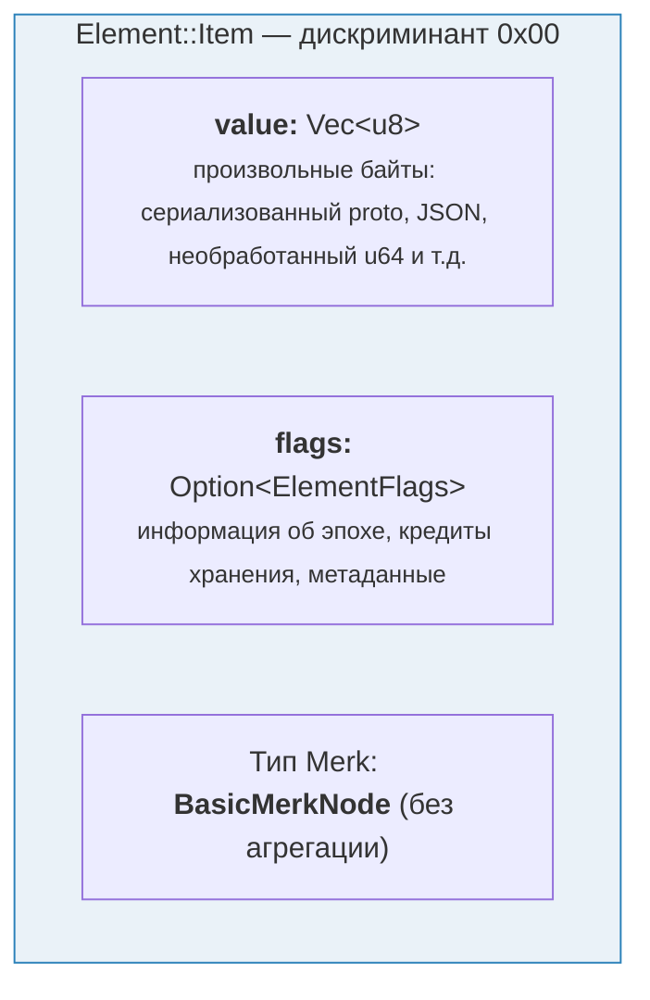
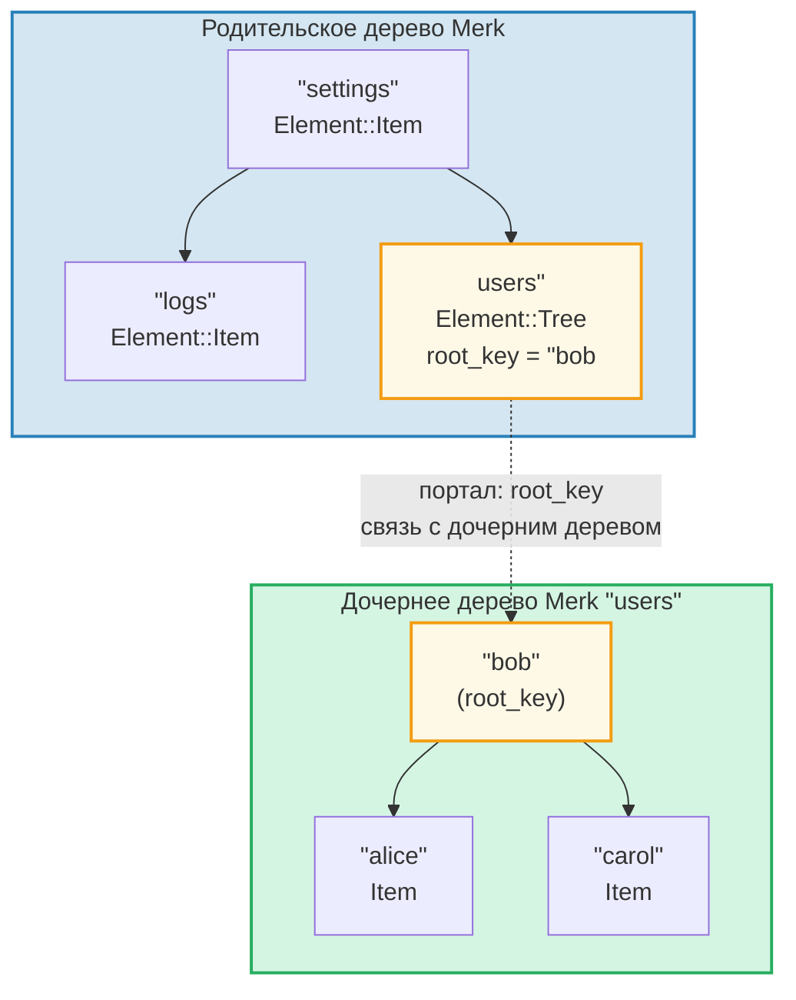
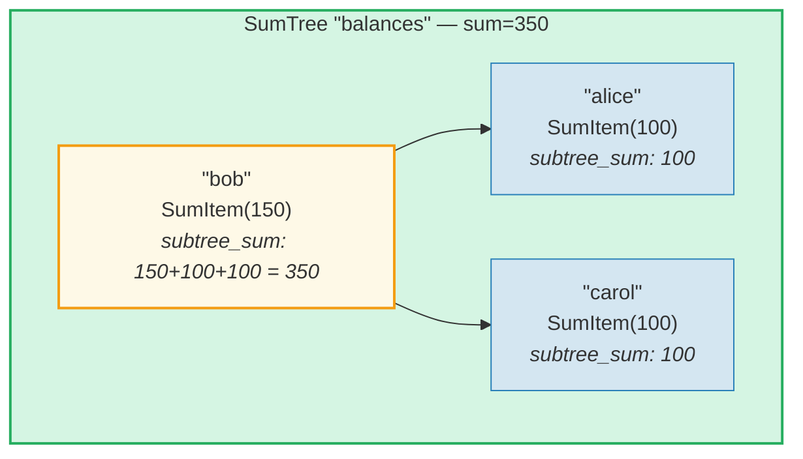
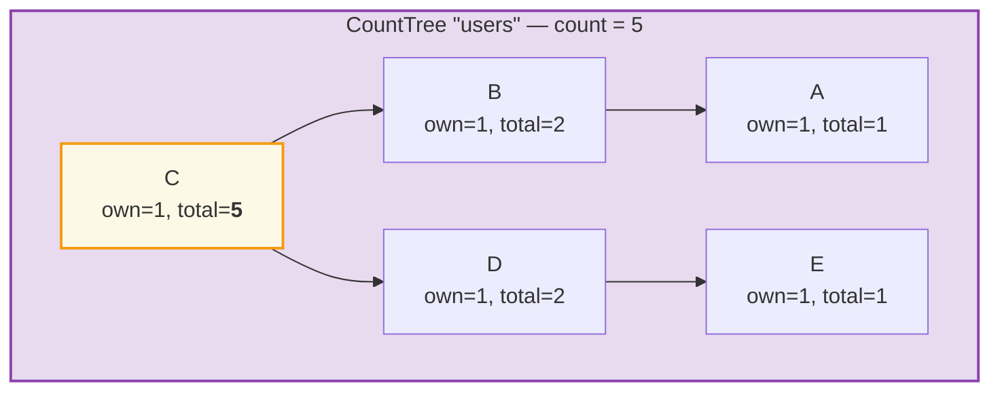
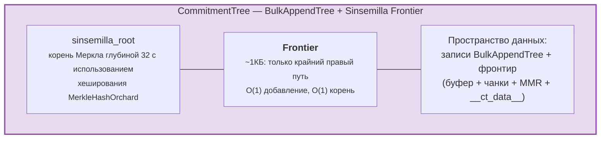

# Система элементов

В то время как Merk работает с необработанными парами «ключ-значение», GroveDB оперирует на более высоком уровне, используя **элементы** (Elements) — типизированные значения, несущие семантический смысл. Каждое значение, хранимое в GroveDB, является элементом.

## Перечисление Element

```rust
// grovedb-element/src/element/mod.rs
pub enum Element {
    Item(Vec<u8>, Option<ElementFlags>),                                    // [0]
    Reference(ReferencePathType, MaxReferenceHop, Option<ElementFlags>),    // [1]
    Tree(Option<Vec<u8>>, Option<ElementFlags>),                           // [2]
    SumItem(SumValue, Option<ElementFlags>),                               // [3]
    SumTree(Option<Vec<u8>>, SumValue, Option<ElementFlags>),              // [4]
    BigSumTree(Option<Vec<u8>>, BigSumValue, Option<ElementFlags>),        // [5]
    CountTree(Option<Vec<u8>>, CountValue, Option<ElementFlags>),          // [6]
    CountSumTree(Option<Vec<u8>>, CountValue, SumValue, Option<ElementFlags>), // [7]
    ProvableCountTree(Option<Vec<u8>>, CountValue, Option<ElementFlags>),  // [8]
    ItemWithSumItem(Vec<u8>, SumValue, Option<ElementFlags>),              // [9]
    ProvableCountSumTree(Option<Vec<u8>>, CountValue, SumValue,
                         Option<ElementFlags>),                            // [10]
    CommitmentTree(u64, u8, Option<ElementFlags>),                         // [11]
    MmrTree(u64, Option<ElementFlags>),                                    // [12]
    BulkAppendTree(u64, u8, Option<ElementFlags>),                         // [13]
    DenseAppendOnlyFixedSizeTree(u16, u8, Option<ElementFlags>),           // [14]
}
```

Номера дискриминантов (показаны в скобках) используются при сериализации.

Псевдонимы типов, используемые повсеместно:

```rust
pub type ElementFlags = Vec<u8>;        // Arbitrary metadata per element
pub type MaxReferenceHop = Option<u8>;  // Optional hop limit for references
pub type SumValue = i64;                // 64-bit signed sum
pub type BigSumValue = i128;            // 128-bit signed sum
pub type CountValue = u64;              // 64-bit unsigned count
```

## Item — Базовое хранилище «ключ-значение»

Простейший элемент. Хранит произвольные байты:

```rust
Element::Item(value: Vec<u8>, flags: Option<ElementFlags>)
```



Конструкторы:

```rust
Element::new_item(b"hello world".to_vec())
Element::new_item_with_flags(b"data".to_vec(), Some(vec![0x01, 0x02]))
```

Элементы Item участвуют в суммарной агрегации: внутри SumTree элемент Item вносит значение суммы по умолчанию равное 0. SumItem вносит своё явное значение.

## Tree — Контейнеры для поддеревьев

Элемент Tree — это **портал** к другому дереву Merk. Он хранит корневой ключ дочернего дерева (если есть):

```rust
Element::Tree(root_key: Option<Vec<u8>>, flags: Option<ElementFlags>)
```



> Элемент Tree в родительском Merk хранит `root_key` дочернего дерева Merk. Это создаёт **портал** — связь из одного дерева Merk в другое.

Когда дерево пусто, `root_key` равен `None`. Конструктор `Element::empty_tree()` создаёт `Element::Tree(None, None)`.

## SumItem / SumTree — Агрегированные суммы

**SumTree** (дерево сумм) автоматически поддерживает сумму вкладов всех своих непосредственных потомков:

```rust
Element::SumTree(root_key: Option<Vec<u8>>, sum: SumValue, flags: Option<ElementFlags>)
Element::SumItem(value: SumValue, flags: Option<ElementFlags>)
```



> **Формула агрегации:** `node_sum = own_value + left_child_sum + right_child_sum`
> Bob: 150 + 100 (alice) + 100 (carol) = **350**. Корневая сумма (350) хранится в элементе SumTree родителя.

Сумма поддерживается на уровне Merk через тип `TreeFeatureType::SummedMerkNode(i64)`. При распространении по дереву агрегированные данные каждого узла пересчитываются:

```text
aggregate_sum = own_sum + left_child_sum + right_child_sum
```

## CountTree, CountSumTree, BigSumTree

Дополнительные типы деревьев с агрегацией:

| Тип элемента | Тип Merk | Агрегирует |
|---|---|---|
| `CountTree` | `CountedMerkNode(u64)` | Количество элементов |
| `CountSumTree` | `CountedSummedMerkNode(u64, i64)` | И количество, и сумму |
| `BigSumTree` | `BigSummedMerkNode(i128)` | 128-битная сумма для больших значений |
| `ProvableCountTree` | `ProvableCountedMerkNode(u64)` | Количество включено в хеш |
| `ProvableCountSumTree` | `ProvableCountedSummedMerkNode(u64, i64)` | Количество в хеше + сумма |

**ProvableCountTree** особенный: его счётчик включается в вычисление `node_hash` (через `node_hash_with_count`), поэтому доказательство может подтвердить количество без раскрытия каких-либо значений.

## Сериализация элементов

Элементы сериализуются с использованием **bincode** с порядком байтов big-endian:

```rust
pub fn serialize(&self, grove_version: &GroveVersion) -> Result<Vec<u8>, ElementError> {
    let config = config::standard().with_big_endian().with_no_limit();
    bincode::encode_to_vec(self, config)
}
```

Первый байт — это **дискриминант**, позволяющий определить тип за O(1):

```rust
pub fn from_serialized_value(value: &[u8]) -> Option<ElementType> {
    match value.first()? {
        0 => Some(ElementType::Item),
        1 => Some(ElementType::Reference),
        2 => Some(ElementType::Tree),
        3 => Some(ElementType::SumItem),
        // ... и т.д.
    }
}
```

## TreeFeatureType и поток агрегированных данных

Перечисление `TreeFeatureType` связывает элементы GroveDB и узлы Merk:

```rust
pub enum TreeFeatureType {
    BasicMerkNode,                              // No aggregation
    SummedMerkNode(i64),                       // Sum aggregation
    BigSummedMerkNode(i128),                   // Large sum
    CountedMerkNode(u64),                      // Count
    CountedSummedMerkNode(u64, i64),           // Count + sum
    ProvableCountedMerkNode(u64),              // Count in hash
    ProvableCountedSummedMerkNode(u64, i64),   // Count in hash + sum
}
```

Агрегированные данные распространяются **вверх** по дереву:



> **Таблица агрегации:** Агрегат каждого узла = own(1) + left_aggregate + right_aggregate
>
> | Узел | own | left_agg | right_agg | total |
> |------|-----|----------|-----------|-------|
> | A | 1 | 0 | 0 | 1 |
> | B | 1 | 1 (A) | 0 | 2 |
> | E | 1 | 0 | 0 | 1 |
> | D | 1 | 0 | 1 (E) | 2 |
> | C | 1 | 2 (B) | 2 (D) | **5** (корень) |

Счётчик, хранимый в каждом узле, представляет общее количество в поддереве с корнем в этом узле, включая сам узел. Счётчик корневого узла — это общее количество для всего дерева.

Перечисление `AggregateData` передаёт данные через систему связей:

```rust
pub enum AggregateData {
    NoAggregateData,
    Sum(i64),
    BigSum(i128),
    Count(u64),
    CountAndSum(u64, i64),
    ProvableCount(u64),
    ProvableCountAndSum(u64, i64),
}
```

## CommitmentTree — Дерево обязательств Sinsemilla

**CommitmentTree** предоставляет дерево Меркла Sinsemilla глубиной 32 для отслеживания якорей обязательств нот, как используется в протоколе Orchard (экранированный протокол Zcash). Оно оборачивает `incrementalmerkletree::Frontier<MerkleHashOrchard, 32>` для операций добавления и вычисления корня за O(1):

```rust
Element::CommitmentTree(
    total_count: u64,               // Number of commitments appended
    chunk_power: u8,                // BulkAppendTree compaction size (chunk_size = 2^chunk_power)
    flags: Option<ElementFlags>,
)                                   // discriminant [11]
```

> **Примечание:** Корневой хеш фронтира Sinsemilla НЕ хранится в элементе.
> Он сохраняется в хранилище данных и передаётся через механизм дочернего хеша Merk
> (параметр `subtree_root_hash` метода `insert_subtree`). Любое изменение фронтира
> автоматически распространяется вверх через иерархию Merk GroveDB.



**Архитектура:**
- *Фронтир* (крайний правый путь дерева Меркла, постоянный размер ~1КБ) хранится в **пространстве данных** с ключом `COMMITMENT_TREE_DATA_KEY`
- Фактические данные нот (`cmx || ciphertext`) хранятся через **BulkAppendTree** в **пространстве данных** — с компактированием в чанки, извлекаемые по позиции
- Исторические якоря отслеживаются Platform в отдельном доказуемом дереве
- Корень Sinsemilla НЕ хранится в элементе — он передаётся как дочерний хеш Merk через иерархию хешей GroveDB

**Операции:**
- `commitment_tree_insert(path, key, cmx, ciphertext, tx)` — Типизированное добавление, принимающее `TransmittedNoteCiphertext<M>`; возвращает `(new_root, position)`
- `commitment_tree_anchor(path, key, tx)` — Получить текущий Orchard Anchor
- `commitment_tree_get_value(path, key, position, tx)` — Извлечь значение по позиции
- `commitment_tree_count(path, key, tx)` — Получить общее количество элементов

**Обобщение по MemoSize:** `CommitmentTree<S, M: MemoSize = DashMemo>` проверяет, что полезная нагрузка шифртекста соответствует ожидаемому размеру для `M`. Для Dash (36-байтовые мемо): `epk_bytes (32) + enc_ciphertext (104) + out_ciphertext (80) = 216 байт`.

**Отслеживание затрат:** Операции хеширования Sinsemilla отслеживаются через `cost.sinsemilla_hash_calls`. Вычисление корня всегда проходит 32 уровня. Слияния оммеров каскадируются через `trailing_ones()` предыдущей позиции. Операции BulkAppendTree добавляют затраты хеширования Blake3.

## MmrTree — Merkle Mountain Range

**MmrTree** хранит данные в дереве Merkle Mountain Range (MMR, диапазон горных хребтов Меркла) с режимом «только добавление», используя хеширование Blake3. Узлы MMR хранятся в столбце **data** (так же, как узлы Merk), а не в дочернем поддереве Merk. Подробнее см. **[Главу 13](#chapter-13-the-mmr-tree--append-only-authenticated-logs)**.

```rust
Element::MmrTree(
    mmr_size: u64,                  // Internal MMR size (nodes, not leaves)
    flags: Option<ElementFlags>,
)                                   // discriminant [12]
```

> **Примечание:** Корневой хеш MMR НЕ хранится в элементе. Он передаётся как
> дочерний хеш Merk через параметр `subtree_root_hash` метода `insert_subtree`.

**Операции:** `mmr_tree_append`, `mmr_tree_root_hash`, `mmr_tree_get_value`,
`mmr_tree_leaf_count`. **Доказательства:** V1 (см. раздел 9.6 и 13.9).

## BulkAppendTree — Двухуровневая структура «только добавление»

**BulkAppendTree** комбинирует буфер на основе плотного дерева Меркла с MMR на уровне чанков для эффективного высокопроизводительного добавления с доказуемыми диапазонными запросами. Это не-Merk дерево — данные хранятся в пространстве **data**, а не в дочернем поддереве Merk. Подробнее см. **[Главу 14](#chapter-14-the-bulkappendtree--high-throughput-append-only-storage)**.

```rust
Element::BulkAppendTree(
    total_count: u64,               // Total values appended
    chunk_power: u8,                // Dense tree height (buffer capacity = 2^chunk_power - 1)
    flags: Option<ElementFlags>,
)                                   // discriminant [13]
```

> **Примечание:** Корень состояния (`blake3("bulk_state" || mmr_root || dense_tree_root)`)
> НЕ хранится в элементе. Он передаётся как дочерний хеш Merk через параметр
> `subtree_root_hash` метода `insert_subtree`.

**Операции:** `bulk_append`, `bulk_get_value`, `bulk_get_chunk`,
`bulk_get_buffer`, `bulk_count`, `bulk_chunk_count`.
**Доказательства:** V1 диапазонные доказательства (см. раздел 9.6 и 14.10).

## DenseAppendOnlyFixedSizeTree — Плотное хранилище фиксированной ёмкости

**DenseAppendOnlyFixedSizeTree** — это полное бинарное дерево фиксированной высоты *h*, где каждый узел (внутренний и листовой) хранит значение данных. Позиции заполняются в порядке обхода по уровням (BFS). Корневой хеш пересчитывается на лету — промежуточные хеши не сохраняются. Подробнее см. **[Главу 16](#chapter-16-the-denseappendonlyfixedsizetree--dense-fixed-capacity-merkle-storage)**.

```rust
Element::DenseAppendOnlyFixedSizeTree(
    count: u16,                     // Number of values stored (max 65,535)
    height: u8,                     // Tree height (1..=16, immutable), capacity = 2^h - 1
    flags: Option<ElementFlags>,
)                                   // discriminant [14]
```

> **Примечание:** Корневой хеш НЕ хранится в элементе — он пересчитывается на лету и передаётся как дочерний хеш Merk. Поле `count` имеет тип `u16` (не u64), ограничивая деревья 65 535 позициями. Высота ограничена диапазоном 1..=16.

**Операции:** `dense_tree_insert`, `dense_tree_get`, `dense_tree_root_hash`,
`dense_tree_count`.
**Доказательства:** Только на уровне элементов (подзапросы пока не поддерживаются).

## Не-Merk деревья — Общие паттерны

CommitmentTree, MmrTree, BulkAppendTree и DenseAppendOnlyFixedSizeTree имеют общий архитектурный паттерн, отличающий их от деревьев на основе Merk (Tree, SumTree, CountTree и т.д.):

| Свойство | Деревья на основе Merk | Не-Merk деревья |
|----------|----------------------|-------------------|
| Дочернее поддерево Merk | Да (`root_key = Some(...)`) | Нет (нет поля root_key) |
| Хранение данных | Пары «ключ-значение» Merk | Блобы в столбце данных (не-Merk ключи) |
| Привязка корневого хеша | `combine_hash(elem_hash, child_root_hash)` | `combine_hash(elem_hash, type_specific_root)` |
| Типоспецифичный корень | Поддерживается АВЛ-деревом Merk | Передаётся как дочерний хеш Merk (НЕ в байтах элемента) |
| Формат доказательства | V0 (послойный Merk) | V1 (типоспецифичное доказательство) |
| TreeFeatureType | BasicMerkNode (без агрегации) | BasicMerkNode |

> **Примечание о столбце хранения:** Все четыре типа не-Merk деревьев (MmrTree,
> CommitmentTree, BulkAppendTree, DenseAppendOnlyFixedSizeTree) хранят свои данные
> в столбце **data** с использованием не-Merk ключей. CommitmentTree хранит свой
> фронтир Sinsemilla вместе с записями BulkAppendTree в том же столбце **data**
> (ключ `b"__ct_data__"`).

Типоспецифичный корень (корень sinsemilla, корень MMR, корень состояния или корневой хеш плотного дерева) НЕ хранится в элементе. Вместо этого он передаётся как **дочерний хеш** Merk через параметр `subtree_root_hash` метода `insert_subtree`. Комбинированный combined_value_hash в Merk становится `combine_hash(value_hash(element_bytes), type_specific_root)`. Любое изменение типоспецифичного корня изменяет дочерний хеш, что изменяет combined_value_hash, который распространяется вверх через иерархию хешей GroveDB — поддерживая криптографическую целостность.

---
