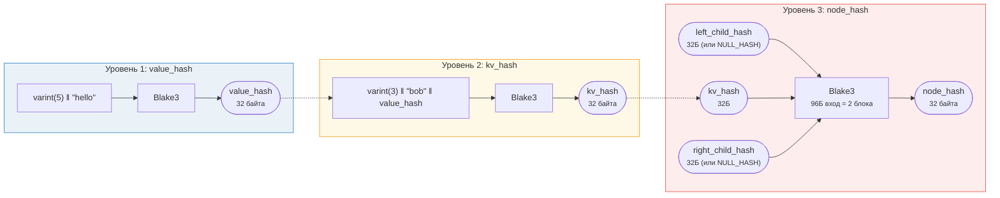
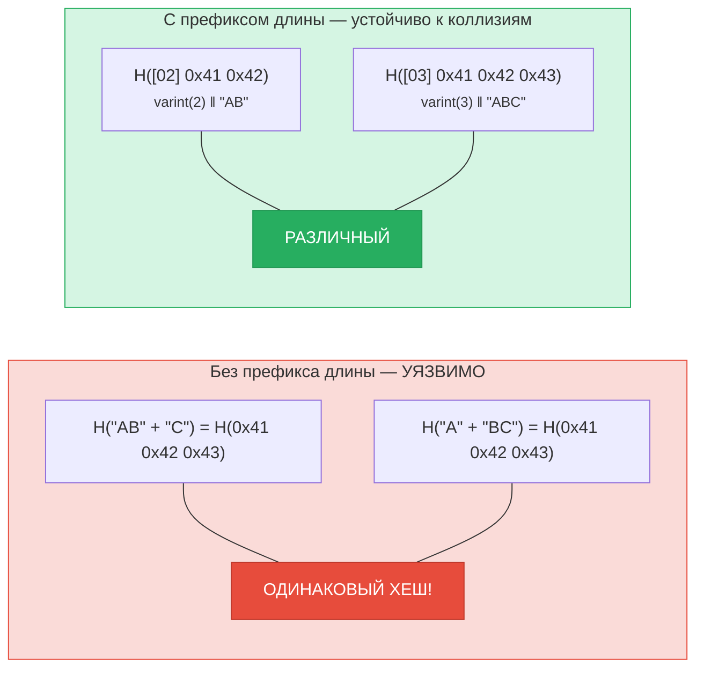
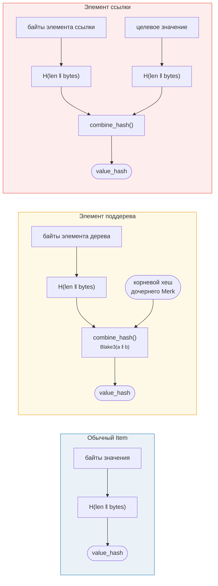

# Хеширование — Криптографическая целостность

Каждый узел в дереве Merk хешируется для создания **корневого хеша** — единственного 32-байтового значения, аутентифицирующего всё дерево. Любое изменение любого ключа, значения или структурной связи приводит к другому корневому хешу.

## Трёхуровневая иерархия хешей

Merk использует трёхуровневую схему хеширования, от внутреннего к внешнему:

Пример: key = `"bob"` (3 байта), value = `"hello"` (5 байт):



> КОРЕНЬ дерева = `node_hash` корневого узла — аутентифицирует **каждый** ключ, значение и структурную связь. Отсутствующие потомки используют `NULL_HASH = [0x00; 32]`.

### Уровень 1: value_hash

```rust
// merk/src/tree/hash.rs
pub fn value_hash(value: &[u8]) -> CostContext<CryptoHash> {
    let mut hasher = blake3::Hasher::new();
    let val_length = value.len().encode_var_vec();  // Varint encoding
    hasher.update(val_length.as_slice());
    hasher.update(value);
    // ...
}
```

Длина значения кодируется в формате **varint** и добавляется в начало. Это критически важно для устойчивости к коллизиям — без этого `H("AB" ‖ "C")` было бы равно `H("A" ‖ "BC")`.

### Уровень 2: kv_hash

```rust
pub fn kv_hash(key: &[u8], value: &[u8]) -> CostContext<CryptoHash> {
    let mut hasher = blake3::Hasher::new();
    let key_length = key.len().encode_var_vec();
    hasher.update(key_length.as_slice());
    hasher.update(key);
    let vh = value_hash(value);
    hasher.update(vh.as_slice());  // Nested hash
    // ...
}
```

Это привязывает ключ к значению. Для верификации доказательств существует также вариант, принимающий предвычисленный value_hash:

```rust
pub fn kv_digest_to_kv_hash(key: &[u8], value_hash: &CryptoHash) -> CostContext<CryptoHash>
```

Используется, когда верификатор уже имеет value_hash (например, для поддеревьев, где value_hash является комбинированным хешем).

### Уровень 3: node_hash

```rust
pub fn node_hash(
    kv: &CryptoHash,
    left: &CryptoHash,
    right: &CryptoHash,
) -> CostContext<CryptoHash> {
    let mut hasher = blake3::Hasher::new();
    hasher.update(kv);       // 32 bytes
    hasher.update(left);     // 32 bytes
    hasher.update(right);    // 32 bytes — total 96 bytes
    // Always exactly 2 hash operations (96 bytes / 64-byte block = 2)
}
```

Если потомок отсутствует, его хеш — это **NULL_HASH** — 32 нулевых байта:

```rust
pub const NULL_HASH: CryptoHash = [0; HASH_LENGTH];  // [0u8; 32]
```

## Blake3 как хеш-функция

GroveDB использует **Blake3** для всего хеширования. Ключевые свойства:

- **256-битный выход** (32 байта)
- **Размер блока**: 64 байта
- **Скорость**: ~в 3 раза быстрее SHA-256 на современном оборудовании
- **Потоковая обработка**: можно инкрементально подавать данные

Стоимость операции хеширования рассчитывается на основе количества обрабатываемых 64-байтовых блоков:

```rust
let hashes = 1 + (hasher.count() - 1) / 64;  // Number of hash operations
```

## Кодирование длины для устойчивости к коллизиям

Каждый вход переменной длины предваряется своей длиной с использованием **кодирования varint**:



> **Вход value_hash**: `[varint(value.len)] [байты значения]`
> **Вход kv_hash**: `[varint(key.len)] [байты ключа] [value_hash: 32 байта]`

Без префиксов длины злоумышленник мог бы создать разные пары ключ-значение, хешируемые в один и тот же дайджест. Префикс длины делает это криптографически невозможным.

## Комбинированное хеширование для специальных элементов

Для **поддеревьев** и **ссылок** `value_hash` вычисляется не просто как `H(value)`. Вместо этого используется **комбинированный хеш**, привязывающий элемент к его цели:



> **Поддерево:** привязывает корневой хеш дочернего Merk к родителю. **Ссылка:** привязывает и путь ссылки, И целевое значение. Изменение любого из них изменяет корневой хеш.

Функция `combine_hash`:

```rust
pub fn combine_hash(hash_one: &CryptoHash, hash_two: &CryptoHash) -> CostContext<CryptoHash> {
    let mut hasher = blake3::Hasher::new();
    hasher.update(hash_one);   // 32 bytes
    hasher.update(hash_two);   // 32 bytes — total 64 bytes, exactly 1 hash op
    // ...
}
```

Именно это позволяет GroveDB аутентифицировать всю иерархию через единственный корневой хеш — value_hash каждого родительского дерева для элемента-поддерева включает корневой хеш дочернего дерева.

## Агрегированное хеширование для ProvableCountTree

Узлы `ProvableCountTree` включают агрегированный счётчик в хеш узла:

```rust
pub fn node_hash_with_count(
    kv: &CryptoHash,
    left: &CryptoHash,
    right: &CryptoHash,
    count: u64,
) -> CostContext<CryptoHash> {
    let mut hasher = blake3::Hasher::new();
    hasher.update(kv);                        // 32 bytes
    hasher.update(left);                      // 32 bytes
    hasher.update(right);                     // 32 bytes
    hasher.update(&count.to_be_bytes());      // 8 bytes — total 104 bytes
    // Still exactly 2 hash ops (104 < 128 = 2 × 64)
}
```

Это означает, что доказательство количества не требует раскрытия фактических данных — счётчик заложен в криптографическое обязательство.

---
