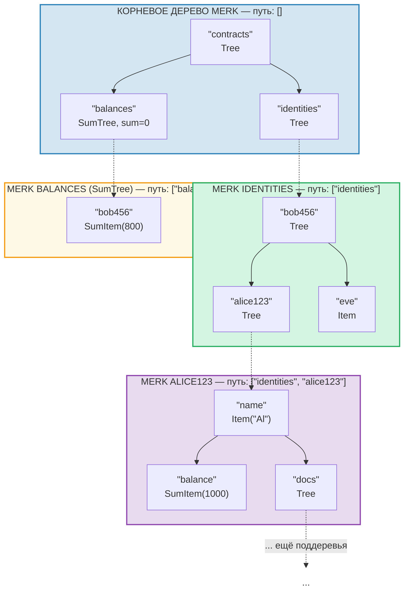
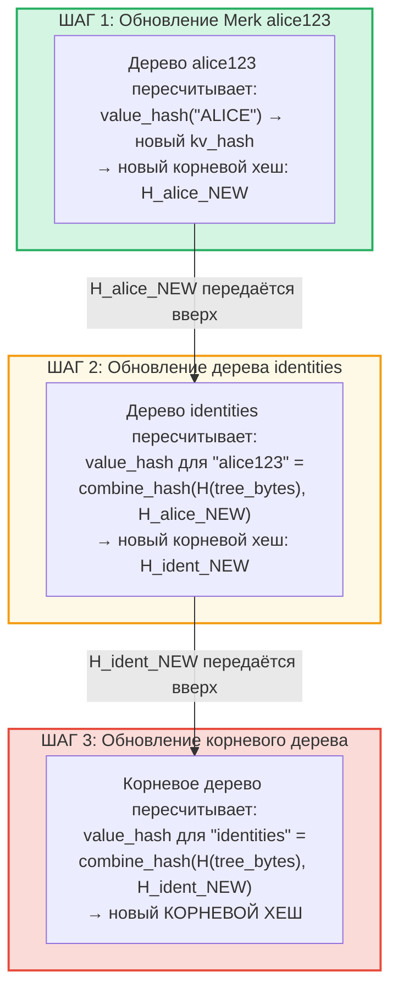
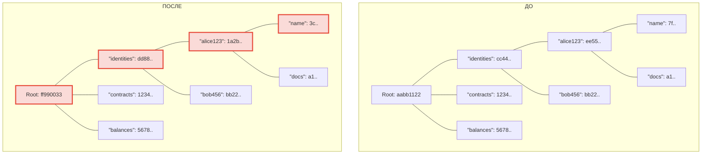
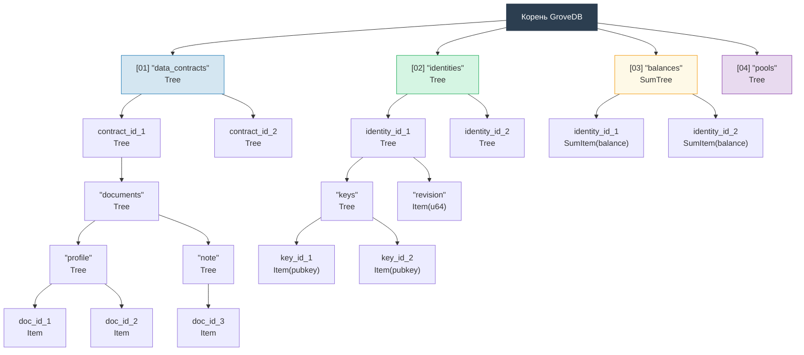

# Иерархическая роща — Дерево деревьев

## Как поддеревья вкладываются в родительские деревья

Определяющая особенность GroveDB заключается в том, что дерево Merk может содержать элементы, которые сами являются деревьями Merk. Это создаёт **иерархическое пространство имён**:



> Каждый цветной блок — это отдельное дерево Merk. Пунктирные стрелки представляют связи-порталы из элементов Tree к их дочерним деревьям Merk. Путь к каждому Merk показан в его метке.

## Система адресации по путям

Каждый элемент в GroveDB адресуется **путём** (path) — последовательностью байтовых строк, которые ведут от корня через поддеревья к целевому ключу:

```text
    Путь: ["identities", "alice123", "name"]

    Шаг 1: В корневом дереве ищем "identities" → элемент Tree
    Шаг 2: Открываем поддерево identities, ищем "alice123" → элемент Tree
    Шаг 3: Открываем поддерево alice123, ищем "name" → Item("Alice")
```

Пути представляются как `Vec<Vec<u8>>` или с использованием типа `SubtreePath` для эффективной работы без аллокаций:

```rust
// The path to the element (all segments except the last)
let path: &[&[u8]] = &[b"identities", b"alice123"];
// The key within the final subtree
let key: &[u8] = b"name";
```

## Генерация префиксов Blake3 для изоляции хранилища

Каждое поддерево в GroveDB получает собственное **изолированное пространство имён** в RocksDB. Пространство имён определяется хешированием пути через Blake3:

```rust
pub type SubtreePrefix = [u8; 32];

// The prefix is computed by hashing the path segments
// storage/src/rocksdb_storage/storage.rs
```

Например:

```text
    Путь: ["identities", "alice123"]
    Префикс: Blake3(["identities", "alice123"]) = [0xab, 0x3f, ...]  (32 байта)

    В RocksDB ключи для этого поддерева хранятся как:
    [prefix: 32 байта][original_key]

    Таким образом, "name" в этом поддереве становится:
    [0xab, 0x3f, ...][0x6e, 0x61, 0x6d, 0x65]  ("name")
```

Это обеспечивает:
- Отсутствие коллизий ключей между поддеревьями (32-байтовый префикс = 256-битная изоляция)
- Эффективное вычисление префикса (один хеш Blake3 по байтам пути)
- Колокация данных поддерева в RocksDB для эффективности кеша

## Распространение корневого хеша через иерархию

Когда значение изменяется глубоко в роще, изменение должно **распространиться вверх** для обновления корневого хеша:

```text
    Изменение: Обновить "name" на "ALICE" в identities/alice123/

    Шаг 1: Обновить значение в дереве Merk alice123
            → дерево alice123 получает новый корневой хеш: H_alice_new

    Шаг 2: Обновить элемент "alice123" в дереве identities
            → value_hash дерева identities для "alice123" =
              combine_hash(H(tree_element_bytes), H_alice_new)
            → дерево identities получает новый корневой хеш: H_ident_new

    Шаг 3: Обновить элемент "identities" в корневом дереве
            → value_hash корневого дерева для "identities" =
              combine_hash(H(tree_element_bytes), H_ident_new)
            → КОРНЕВОЙ ХЕШ меняется
```



**До и после** — изменённые узлы выделены красным:



> Пересчитываются только узлы на пути от изменённого значения до корня. Соседние узлы и другие ветви остаются неизменными.

Распространение реализовано через `propagate_changes_with_transaction`, который обходит путь от изменённого поддерева до корня, обновляя хеш элемента каждого родителя по ходу.

## Пример многоуровневой структуры рощи

Вот полный пример, показывающий, как Dash Platform структурирует своё состояние:



Каждый блок — это отдельное дерево Merk, аутентифицированное вплоть до единственного корневого хеша, на котором сходятся валидаторы.

---
