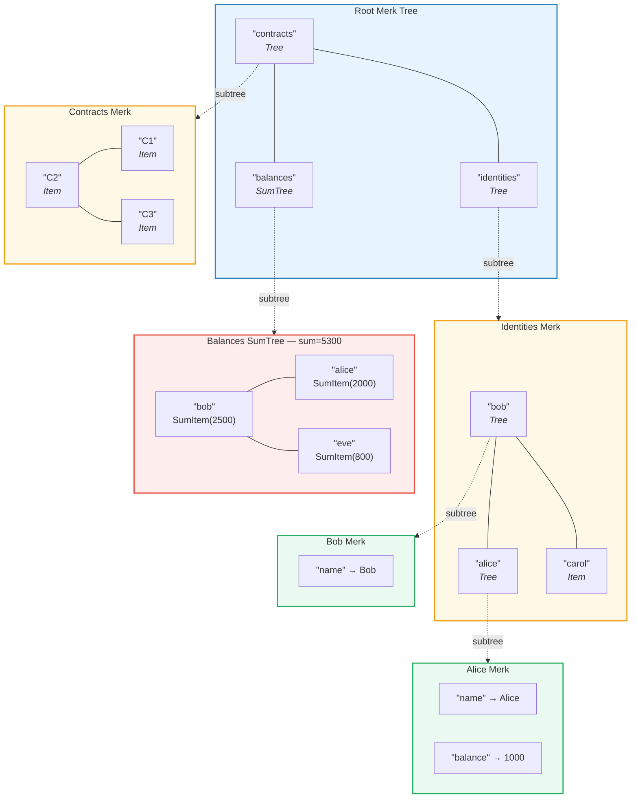
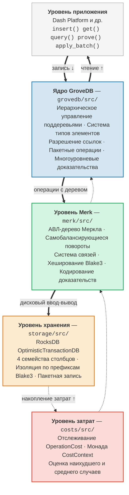

# Введение — Что такое GroveDB?

## Основная идея

GroveDB — это **иерархическая аутентифицированная структура данных** — по сути, *роща* (дерево деревьев), построенная на АВЛ-деревьях Меркла. Каждый узел в базе данных является частью криптографически аутентифицированного дерева, и каждое дерево может содержать другие деревья в качестве дочерних элементов, формируя глубокую иерархию верифицируемого состояния.

> Каждый цветной блок — это **отдельное дерево Merk**. Пунктирные стрелки показывают связь поддеревьев — элемент Tree в родительском дереве содержит корневой ключ дочернего дерева Merk.

В традиционной базе данных данные могут храниться в плоском хранилище «ключ-значение» с единственным деревом Меркла поверх него для аутентификации. GroveDB использует другой подход: дерево Меркла вложено в другие деревья Меркла. Это обеспечивает:

1. **Эффективные вторичные индексы** — запросы по любому пути, а не только по первичному ключу
2. **Компактные криптографические доказательства** — подтверждение существования (или отсутствия) любых данных
3. **Агрегированные данные** — деревья могут автоматически суммировать, подсчитывать или иным образом агрегировать дочерние элементы
4. **Атомарные операции между деревьями** — пакетные операции охватывают несколько поддеревьев

## Зачем нужна GroveDB

GroveDB была спроектирована для **Dash Platform** — децентрализованной платформы приложений, где каждый элемент состояния должен быть:

- **Аутентифицированным**: любой узел может доказать любой элемент состояния лёгкому клиенту
- **Детерминированным**: каждый узел вычисляет ровно тот же корневой хеш состояния
- **Эффективным**: операции должны укладываться в ограничения времени блока
- **Запрашиваемым**: приложениям нужны сложные запросы, а не только поиск по ключу

Традиционные подходы не справляются:

| Подход | Проблема |
|--------|----------|
| Простое дерево Меркла | Поддерживает только поиск по ключу, без диапазонных запросов |
| Ethereum MPT | Дорогая перебалансировка, большой размер доказательств |
| Плоское хранилище «ключ-значение» + одно дерево | Нет иерархических запросов, одно доказательство покрывает всё |
| B-дерево | Не является естественно меркелизированным, сложная аутентификация |

GroveDB решает эти проблемы, комбинируя **проверенные гарантии балансировки АВЛ-деревьев** с **иерархическим вложением** и **развитой системой типов элементов**.

## Обзор архитектуры

GroveDB организована в отдельные уровни, каждый с чёткой зоной ответственности:

Данные проходят **вниз** через эти уровни при записи и **вверх** при чтении. Каждая операция накапливает затраты по мере прохождения стека, обеспечивая точный учёт ресурсов.

---
