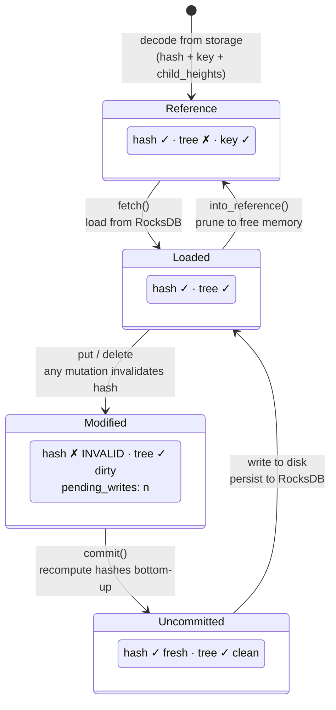
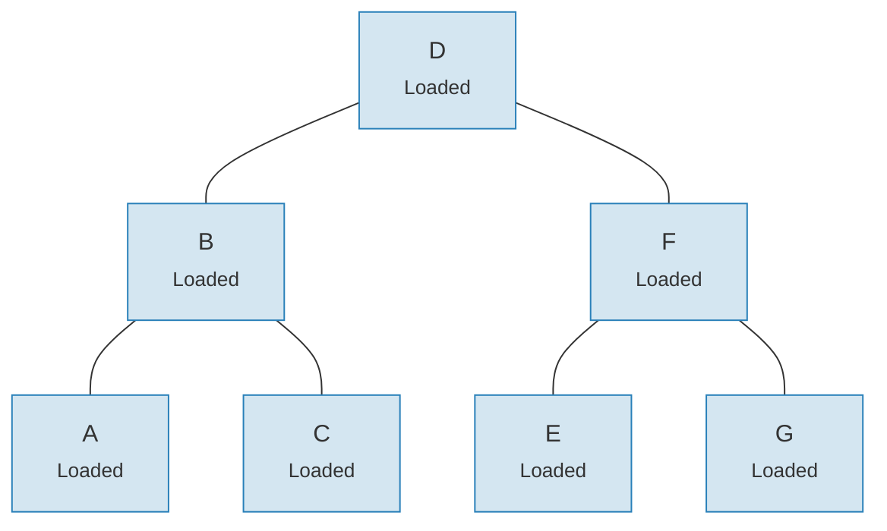
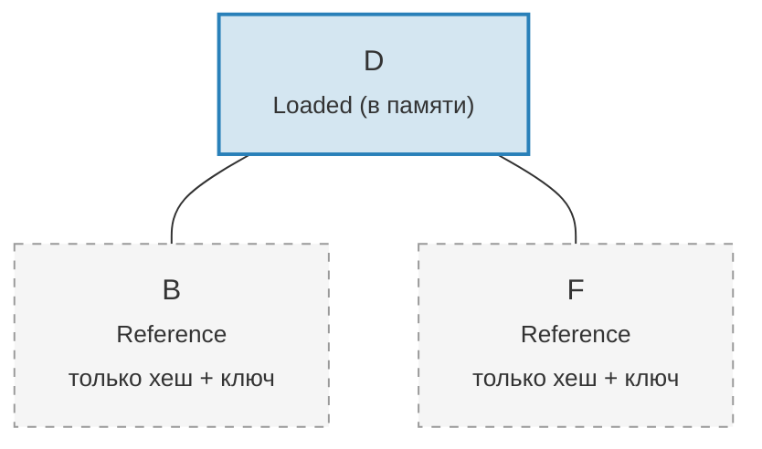

# Система связей — Архитектура ленивой загрузки

Загрузка всего дерева Merk в память была бы чрезмерно затратной для больших деревьев. Система связей (Link system) решает эту проблему, представляя дочерние соединения в четырёх возможных состояниях, что обеспечивает **ленивую загрузку** (lazy loading) — потомки извлекаются из хранилища только при реальной необходимости.

## Четыре состояния связи

```rust
// merk/src/tree/link.rs
pub enum Link {
    Reference {                    // Pruned: only metadata, no tree in memory
        hash: CryptoHash,
        child_heights: (u8, u8),
        key: Vec<u8>,
        aggregate_data: AggregateData,
    },
    Modified {                     // Recently changed, hash not yet computed
        pending_writes: usize,
        child_heights: (u8, u8),
        tree: TreeNode,
    },
    Uncommitted {                  // Hashed but not yet persisted to storage
        hash: CryptoHash,
        child_heights: (u8, u8),
        tree: TreeNode,
        aggregate_data: AggregateData,
    },
    Loaded {                       // Fully loaded from storage
        hash: CryptoHash,
        child_heights: (u8, u8),
        tree: TreeNode,
        aggregate_data: AggregateData,
    },
}
```

## Диаграмма переходов состояний



## Что хранит каждое состояние

| Состояние | Хеш? | Дерево в памяти? | Назначение |
|-----------|-------|------------------|------------|
| **Reference** | Да | Нет | Компактное представление на диске. Хранит только ключ, хеш, высоты потомков и агрегированные данные. |
| **Modified** | Нет | Да | После любой мутации. Отслеживает счётчик `pending_writes` для оптимизации пакетной обработки. |
| **Uncommitted** | Да | Да | После вычисления хеша, но до записи в хранилище. Промежуточное состояние при фиксации. |
| **Loaded** | Да | Да | Полностью материализовано. Готово к чтению или дальнейшей модификации. |

Поле `pending_writes` в `Modified` заслуживает внимания:

```rust
// Computed as: 1 + left_pending_writes + right_pending_writes
pending_writes: 1 + tree.child_pending_writes(true)
                  + tree.child_pending_writes(false),
```

Этот счётчик помогает фазе фиксации определить порядок записей для оптимальной производительности.

## Паттерн обратного вызова Fetch

Система связей использует **трейт Fetch** для абстрагирования способа загрузки дочерних узлов:

```rust
pub trait Fetch {
    fn fetch(
        &self,
        link: &Link,
        value_defined_cost_fn: Option<&impl Fn(&[u8], &GroveVersion) -> Option<ValueDefinedCostType>>,
        grove_version: &GroveVersion,
    ) -> CostResult<TreeNode, Error>;
}
```

Различные реализации Fetch служат разным целям:

- **StorageFetch**: загрузка из RocksDB (обычный путь)
- **PanicSource**: используется в тестах, где загрузка не должна происходить
- **MockSource**: возвращает контролируемые тестовые данные

Этот паттерн позволяет операциям с деревом быть **независимыми от хранилища** — одна и та же логика балансировки и мутации работает вне зависимости от источника данных.

## Паттерн Walker

`Walker` оборачивает `TreeNode` с источником `Fetch`, обеспечивая безопасный обход дерева с автоматической ленивой загрузкой (`merk/src/tree/walk/mod.rs`):

```rust
pub struct Walker<S: Fetch + Sized + Clone> {
    tree: Owner<TreeNode>,
    source: S,
}
```

Walker предоставляет три ключевые операции:

**walk()** — Отсоединить потомка, преобразовать его и присоединить обратно:

```rust
pub fn walk<F, T>(self, left: bool, f: F, ...) -> CostResult<Self, Error>
where
    F: FnOnce(Option<Self>) -> CostResult<Option<T>, Error>,
    T: Into<TreeNode>,
```

**detach()** — Удалить потомка, загружая его из хранилища при необходимости:

```rust
pub fn detach(self, left: bool, ...) -> CostResult<(Self, Option<Self>), Error>
```

Если потомок находится в состоянии `Link::Reference` (обрезан), detach вызовет `fetch()` для его загрузки. Если потомок уже в памяти (`Modified`, `Uncommitted`, `Loaded`), он просто извлекается.

**attach()** — Присоединить потомка к родителю:

```rust
pub fn attach(self, left: bool, maybe_child: Option<Self>) -> Self
```

Присоединение всегда создаёт `Link::Modified`, поскольку связь родитель-потомок изменилась.

## Экономия памяти через обрезку

После фиксации изменений дерево может **обрезать** загруженные поддеревья обратно до `Link::Reference`, высвобождая память, но сохраняя хеш, необходимый для генерации доказательств:

**До обрезки** — все 7 узлов в памяти:



**После обрезки** — только корень в памяти, потомки в состоянии `Link::Reference` (только хеш + ключ):



> **Link::Loaded** содержит `hash + child_heights + tree (TreeNode)`. **Link::Reference** содержит только `hash + child_heights + key` — TreeNode освобождается из памяти.

Преобразование простое:

```rust
pub fn into_reference(self) -> Link {
    Link::Reference {
        hash: self.hash(),
        child_heights: self.child_heights(),
        key: self.key().to_vec(),
        aggregate_data: self.aggregate_data(),
    }
}
```

Это критически важно для ограничения потребления памяти в больших деревьях — только активно используемые узлы должны находиться в памяти.

---
