# Дерево Merk — АВЛ-дерево Меркла

Дерево Merk является фундаментальным строительным блоком GroveDB. Каждое поддерево в роще — это дерево Merk: самобалансирующееся бинарное дерево поиска, в котором каждый узел криптографически хешируется, создавая единственный корневой хеш, аутентифицирующий всё содержимое дерева.

## Что такое узел Merk?

В отличие от многих реализаций деревьев Меркла, где данные хранятся только в листьях, в дереве Merk **каждый узел содержит пару «ключ-значение»**. Это означает, что нет «пустых» внутренних узлов — дерево одновременно является и структурой поиска, и хранилищем данных.

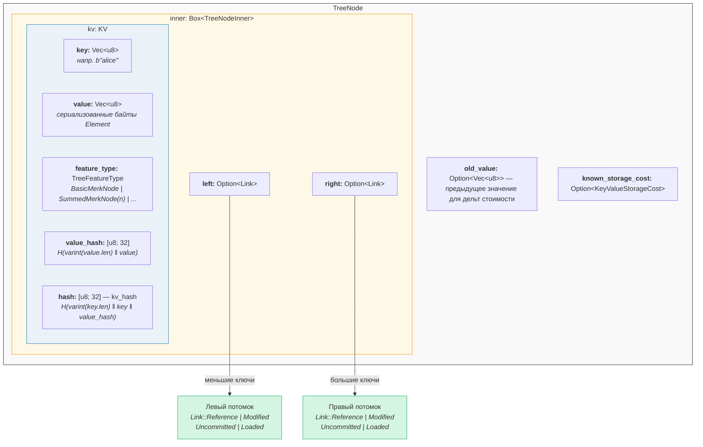

В коде (`merk/src/tree/mod.rs`):

```rust
pub struct TreeNode {
    pub(crate) inner: Box<TreeNodeInner>,
    pub(crate) old_value: Option<Vec<u8>>,        // Previous value for cost tracking
    pub(crate) known_storage_cost: Option<KeyValueStorageCost>,
}

pub struct TreeNodeInner {
    pub(crate) left: Option<Link>,    // Left child (smaller keys)
    pub(crate) right: Option<Link>,   // Right child (larger keys)
    pub(crate) kv: KV,               // The key-value payload
}
```

`Box<TreeNodeInner>` размещает узел в куче, что необходимо, поскольку дочерние связи могут рекурсивно содержать целые экземпляры `TreeNode`.

## Структура KV

Структура `KV` хранит как необработанные данные, так и их криптографические дайджесты (`merk/src/tree/kv.rs`):

```rust
pub struct KV {
    pub(super) key: Vec<u8>,                        // The lookup key
    pub(super) value: Vec<u8>,                      // The stored value
    pub(super) feature_type: TreeFeatureType,       // Aggregation behavior
    pub(crate) value_defined_cost: Option<ValueDefinedCostType>,
    pub(super) hash: CryptoHash,                    // kv_hash
    pub(super) value_hash: CryptoHash,              // H(value)
}
```

Два важных момента:

1. **Ключи не хранятся на диске как часть закодированного узла.** Они хранятся как ключ RocksDB. При декодировании узла из хранилища ключ подставляется извне. Это позволяет избежать дублирования байтов ключа.

2. **Поддерживаются два поля хешей.** `value_hash` — это `H(value)`, а `hash` (kv_hash) — это `H(key, value_hash)`. Наличие обоих позволяет системе доказательств выбирать, какую информацию раскрывать.

## Полубалансная природа — как АВЛ «раскачивается»

Дерево Merk — это **АВЛ-дерево** — классическое самобалансирующееся бинарное дерево поиска, изобретённое Адельсоном-Вельским и Ландисом. Ключевой инвариант:

> Для каждого узла разница высот между его левым и правым поддеревьями составляет не более 1.

Это выражается как **фактор баланса** (balance factor):

```text
balance_factor = right_height - left_height
```

Допустимые значения: **{-1, 0, 1}**

```rust
// merk/src/tree/mod.rs
pub const fn balance_factor(&self) -> i8 {
    let left_height = self.child_height(true) as i8;
    let right_height = self.child_height(false) as i8;
    right_height - left_height
}
```

Однако здесь есть тонкий момент: хотя каждый отдельный узел может отклоняться лишь на один уровень, эти отклонения могут **накапливаться** по всему дереву. Именно поэтому дерево называется «полубалансным» — оно не идеально сбалансировано, как полное бинарное дерево.

Рассмотрим дерево из 10 узлов. Идеально сбалансированное дерево имело бы высоту 4 (⌈log₂(10+1)⌉). Но АВЛ-дерево может иметь высоту 5:

**Идеально сбалансированное (высота 4)** — каждый уровень полностью заполнен:

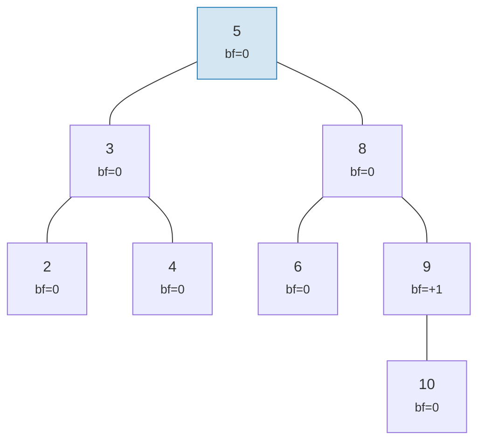

**Допустимое «раскачивание» АВЛ (высота 5)** — каждый узел наклонён максимум на 1, но эффект накапливается:

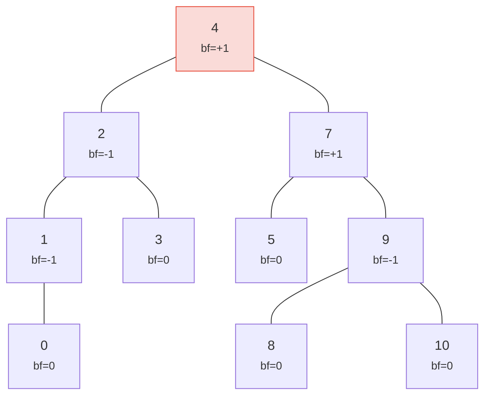

> Высота 5 против идеальной 4 — это и есть «раскачивание». Наихудший случай: h ≤ 1,44 × log₂(n+2).

Оба дерева являются допустимыми АВЛ-деревьями! Максимальная высота АВЛ-дерева в наихудшем случае:

```text
h ≤ 1.4404 × log₂(n + 2) − 0.3277
```

Для **n = 1 000 000** узлов:
- Идеальная балансировка: высота 20
- Наихудший случай АВЛ: высота ≈ 29

Это ~44% накладных расходов — цена простых правил поворотов АВЛ. На практике случайные вставки создают деревья, гораздо более близкие к идеально сбалансированным.

Вот как выглядят допустимые и недопустимые деревья:

**ДОПУСТИМОЕ** — все факторы баланса в {-1, 0, +1}:

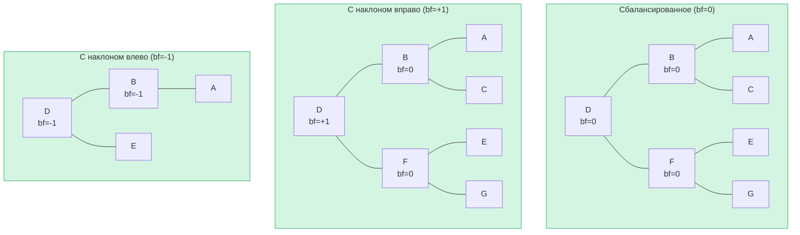

**НЕДОПУСТИМОЕ** — фактор баланса = +2 (необходим поворот!):

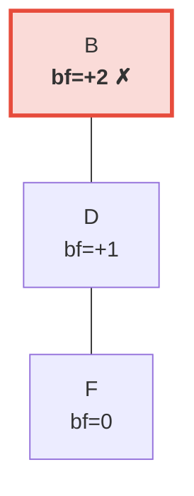

> Правое поддерево на 2 уровня выше левого (которое пусто). Это вызывает **левый поворот** для восстановления инварианта АВЛ.

## Повороты — Восстановление баланса

Когда вставка или удаление приводит к тому, что фактор баланса достигает ±2, дерево необходимо **повернуть** для восстановления инварианта АВЛ. Существует четыре случая, сводимых к двум фундаментальным операциям.

### Одинарный левый поворот

Используется, когда узел **перевешивает вправо** (bf = +2), а его правый потомок **перевешивает вправо или сбалансирован** (bf ≥ 0):

**До** (bf=+2):

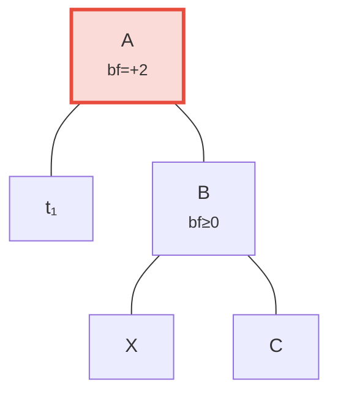

**После** левого поворота — B продвинут на место корня:

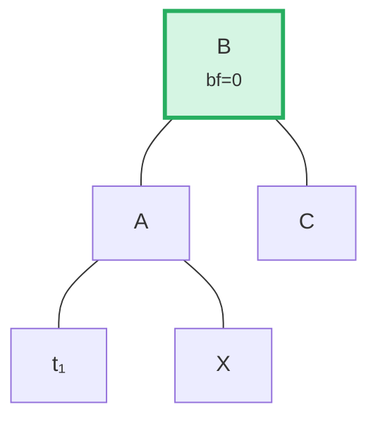

> **Шаги:** (1) Отсоединить B от A. (2) Отсоединить X (левый потомок B). (3) Присоединить X как правый потомок A. (4) Присоединить A как левый потомок B. Поддерево с корнем B теперь сбалансировано.

В коде (`merk/src/tree/ops.rs`):

```rust
fn rotate<V>(self, left: bool, ...) -> CostResult<Self, Error> {
    // Detach child on the heavy side
    let (tree, child) = self.detach_expect(left, ...);
    // Detach grandchild from opposite side of child
    let (child, maybe_grandchild) = child.detach(!left, ...);

    // Attach grandchild to original root
    tree.attach(left, maybe_grandchild)
        .maybe_balance(...)
        .flat_map_ok(|tree| {
            // Attach original root as child of promoted node
            child.attach(!left, Some(tree))
                .maybe_balance(...)
        })
}
```

Обратите внимание, что `maybe_balance` вызывается рекурсивно — сам поворот может создать новые дисбалансы, требующие дальнейшей коррекции.

### Двойной поворот (Лево-Правый)

Используется, когда узел **перевешивает влево** (bf = -2), но его левый потомок **перевешивает вправо** (bf > 0). Одинарный поворот не исправит ситуацию:

**Шаг 0: До** — C перевешивает влево (bf=-2), но его левый потомок A наклонён вправо (bf=+1). Одинарный поворот не поможет:

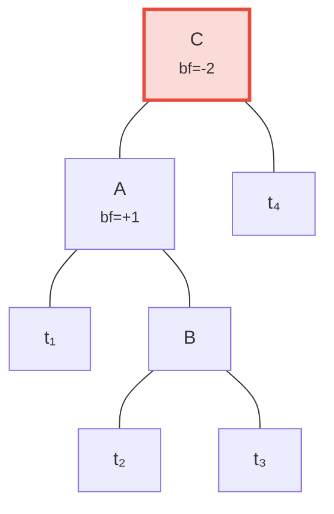

**Шаг 1: Левый поворот потомка A** — теперь и C, и B наклонены влево, что исправляется одинарным поворотом:

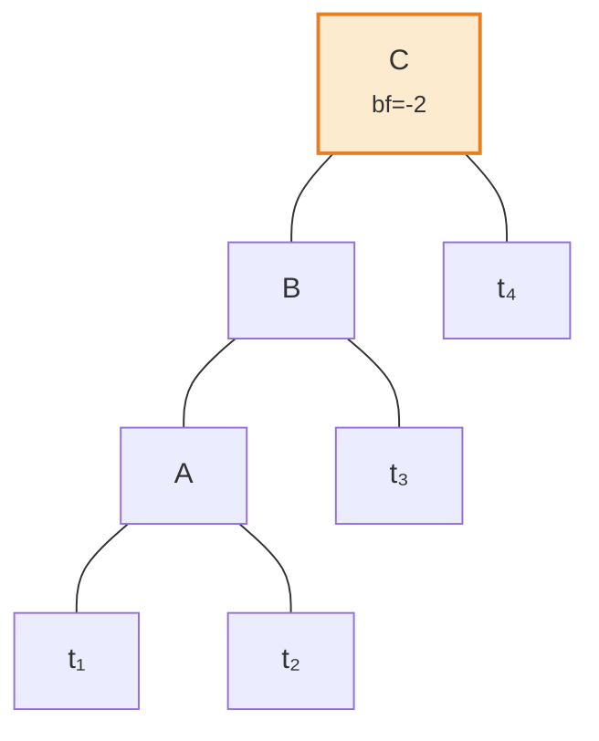

**Шаг 2: Правый поворот корня C** — сбалансировано!

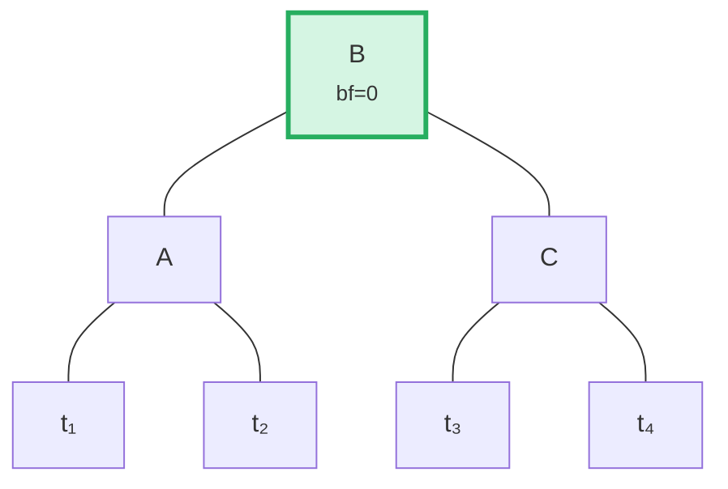

Алгоритм определяет этот случай, сравнивая направление наклона родителя с фактором баланса потомка:

```rust
fn maybe_balance<V>(self, ...) -> CostResult<Self, Error> {
    let balance_factor = self.balance_factor();
    if balance_factor.abs() <= 1 {
        return Ok(self);  // Already balanced
    }

    let left = balance_factor < 0;  // true if left-heavy

    // Double rotation needed when child leans opposite to parent
    let tree = if left == (self.tree().link(left).unwrap().balance_factor() > 0) {
        // First rotation: rotate child in opposite direction
        self.walk_expect(left, |child|
            child.rotate(!left, ...).map_ok(Some), ...
        )
    } else {
        self
    };

    // Second (or only) rotation
    tree.rotate(left, ...)
}
```

## Пакетные операции — Построение и применение

Вместо вставки элементов по одному, Merk поддерживает пакетные операции (batch operations), которые применяют несколько изменений за один проход. Это критически важно для эффективности: пакет из N операций над деревом из M элементов занимает **O((M + N) log(M + N))** времени против O(N log M) для последовательных вставок.

### Тип MerkBatch

```rust
type MerkBatch<K> = [(K, Op)];

enum Op {
    Put(Vec<u8>, TreeFeatureType),  // Insert or update with value and feature type
    PutWithSpecializedCost(...),     // Insert with predefined cost
    PutCombinedReference(...),       // Insert reference with combined hash
    Replace(Vec<u8>, TreeFeatureType),
    Patch { .. },                    // Partial value update
    Delete,                          // Remove key
    DeleteLayered,                   // Remove with layered cost
    DeleteMaybeSpecialized,          // Remove with optional specialized cost
}
```

### Стратегия 1: build() — Построение с нуля

Когда дерево пусто, `build()` создаёт сбалансированное дерево непосредственно из отсортированного пакета с помощью алгоритма **разделения по медиане**:

Входной пакет (отсортированный): `[A, B, C, D, E, F, G]` — выбираем средний (D) как корень, рекурсивно обрабатываем каждую половину:

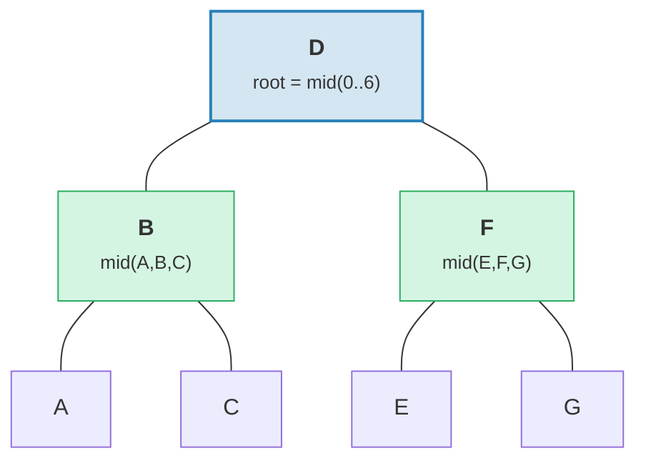

> Результат: идеально сбалансированное дерево с высотой = 3 = ⌈log₂(7)⌉.

```rust
fn build(batch: &MerkBatch<K>, ...) -> CostResult<Option<TreeNode>, Error> {
    let mid_index = batch.len() / 2;
    let (mid_key, mid_op) = &batch[mid_index];

    // Create root node from middle element
    let mid_tree = TreeNode::new(mid_key.clone(), value.clone(), None, feature_type)?;

    // Recursively build left and right subtrees
    let left = Self::build(&batch[..mid_index], ...);
    let right = Self::build(&batch[mid_index + 1..], ...);

    // Attach children
    mid_tree.attach(true, left).attach(false, right)
}
```

Это создаёт дерево с высотой ⌈log₂(n)⌉ — идеально сбалансированное.

### Стратегия 2: apply_sorted() — Слияние с существующим деревом

Когда дерево уже содержит данные, `apply_sorted()` использует **бинарный поиск** для определения места каждой пакетной операции, а затем рекурсивно применяет операции к левому и правому поддеревьям:

Существующее дерево с пакетом `[(B, Put), (F, Delete)]`:

Бинарный поиск: B < D (идём влево), F > D (идём вправо).

**До:**
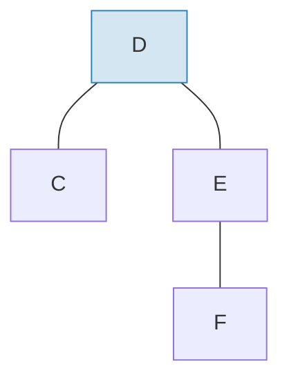

**После** применения пакета и перебалансировки:
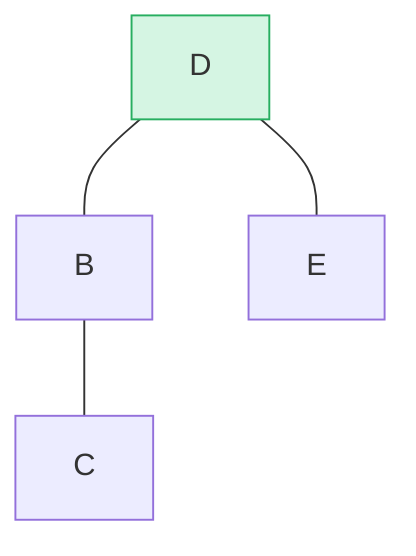

> B вставлен как левое поддерево, F удалён из правого поддерева. `maybe_balance()` подтверждает bf(D) = 0.

```rust
fn apply_sorted(self, batch: &MerkBatch<K>, ...) -> CostResult<...> {
    let search = batch.binary_search_by(|(key, _)| key.cmp(self.tree().key()));

    match search {
        Ok(index) => {
            // Key matches this node — apply operation directly
            // (Put replaces value, Delete removes node)
        }
        Err(mid) => {
            // Key not found — mid is the split point
            // Recurse on left_batch[..mid] and right_batch[mid..]
        }
    }

    self.recurse(batch, mid, exclusive, ...)
}
```

Метод `recurse` разделяет пакет и обходит левую и правую части:

```rust
fn recurse(self, batch: &MerkBatch<K>, mid: usize, ...) {
    let left_batch = &batch[..mid];
    let right_batch = &batch[mid..];  // or mid+1 if exclusive

    // Apply left batch to left subtree
    let tree = self.walk(true, |maybe_left| {
        Self::apply_to(maybe_left, left_batch, ...)
    });

    // Apply right batch to right subtree
    let tree = tree.walk(false, |maybe_right| {
        Self::apply_to(maybe_right, right_batch, ...)
    });

    // Re-balance after modifications
    tree.maybe_balance(...)
}
```

### Удаление узла

При удалении узла с двумя потомками Merk продвигает **крайний узел** из более высокого поддерева. Это минимизирует вероятность необходимости дополнительных поворотов:

**До** — удаление D (имеет двух потомков, высота правого поддерева ≥ левого):

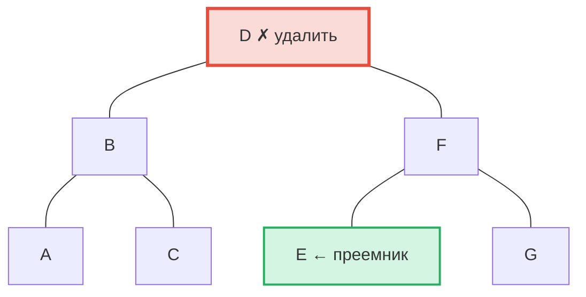

**После** — E (самый левый в правом поддереве = преемник по порядку) продвинут на позицию D:

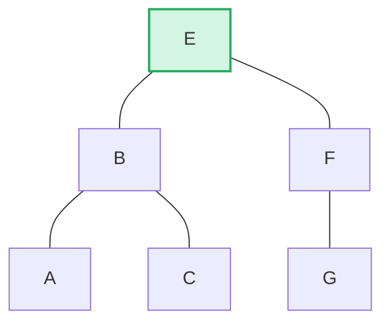

> **Правило:** Если высота левого > правого → продвигаем правый крайний элемент левого поддерева. Если высота правого ≥ левого → продвигаем левый крайний элемент правого поддерева. Это минимизирует перебалансировку после удаления.

```rust
pub fn remove(self, ...) -> CostResult<Option<Self>, Error> {
    let has_left = tree.link(true).is_some();
    let has_right = tree.link(false).is_some();
    let left = tree.child_height(true) > tree.child_height(false);

    if has_left && has_right {
        // Two children: promote edge of taller child
        let (tree, tall_child) = self.detach_expect(left, ...);
        let (_, short_child) = tree.detach_expect(!left, ...);
        tall_child.promote_edge(!left, short_child, ...)
    } else if has_left || has_right {
        // One child: promote it directly
        self.detach_expect(left, ...).1
    } else {
        // Leaf node: just remove
        None
    }
}
```

---
