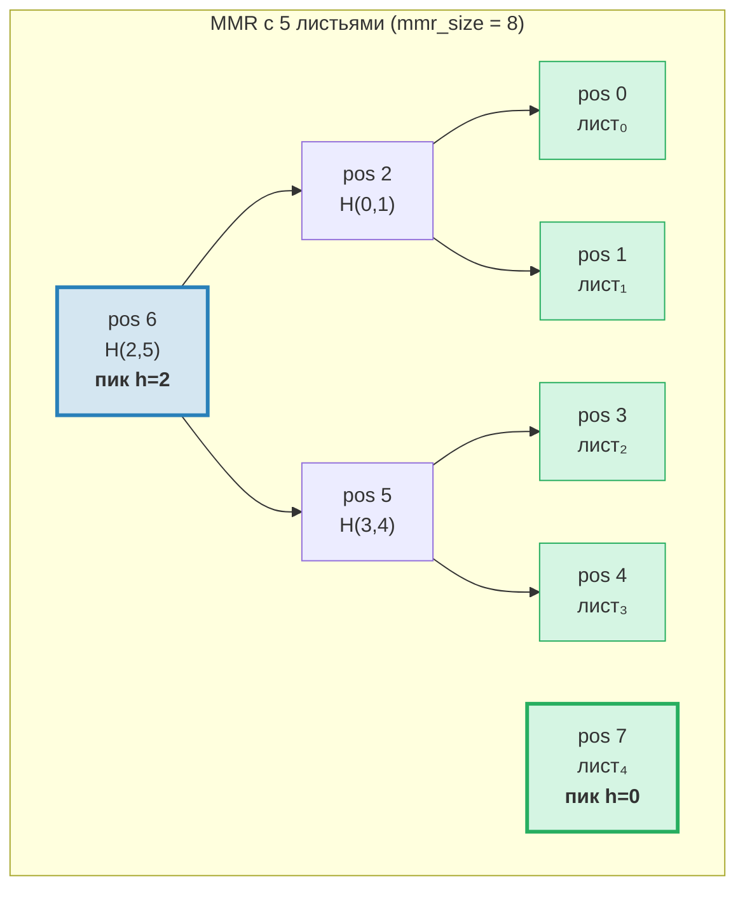
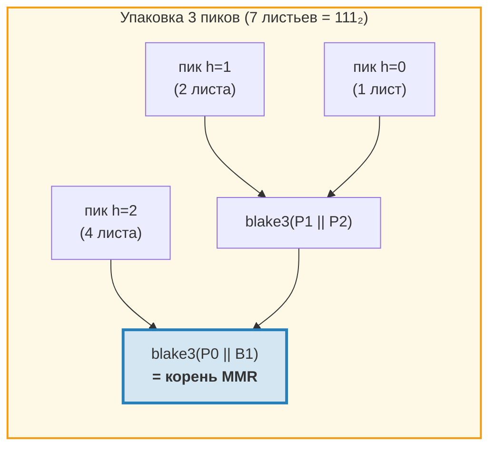
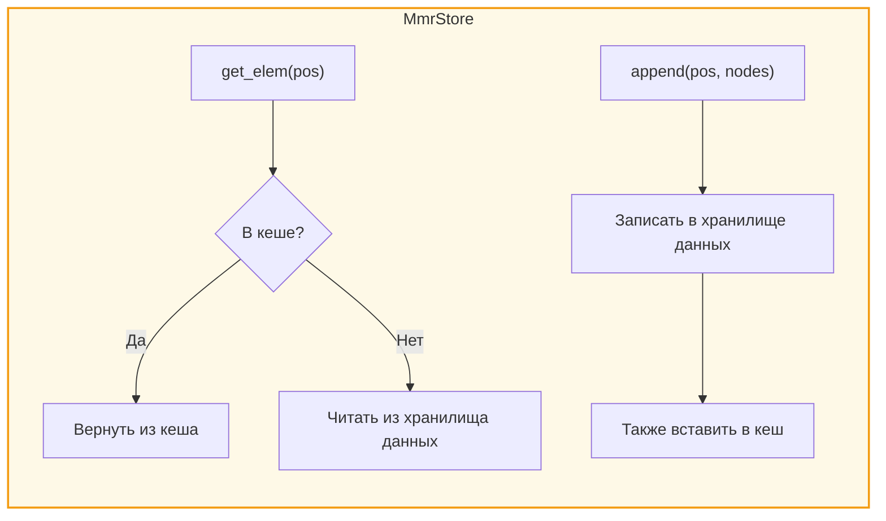
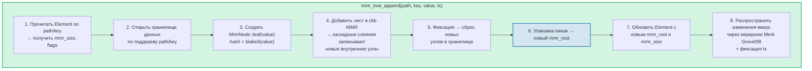
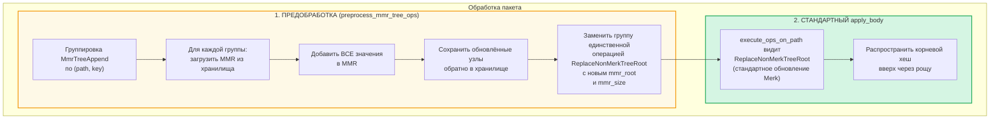
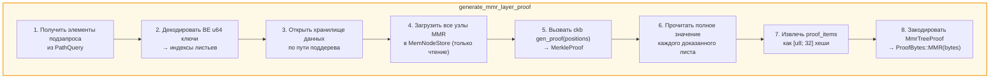
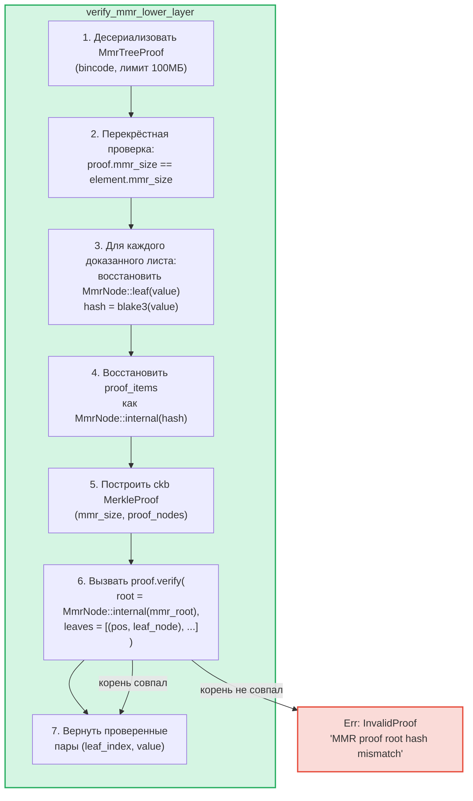

# MMR-дерево — Аутентифицированные журналы «только добавление»

**MmrTree** — это структура данных GroveDB для аутентификации в режиме «только добавление», построенная на Merkle Mountain Range (MMR, диапазон горных хребтов Меркла) с хешированием Blake3. В то время как АВЛ-деревья Merk (глава 2) превосходны для операций со случайными ключами и значениями с O(log N) обновлений, MMR специально созданы для случая «только добавление»: они обеспечивают нулевые повороты, амортизированную стоимость хеширования O(1) на добавление и последовательные паттерны ввода-вывода.

Эта глава подробно рассматривает структуру данных MMR — как она растёт, как хранятся узлы, как каскадируются добавления, и как система доказательств позволяет любой третьей стороне проверить, что конкретное значение было добавлено на конкретной позиции.

## Зачем нужен отдельный тип дерева?

Стандартные деревья Merk в GroveDB хорошо обрабатывают упорядоченные данные «ключ-значение», но журналы «только добавление» имеют другие требования:

| Свойство | АВЛ-дерево Merk | MMR |
|----------|--------------|-----|
| Операции | Вставка, обновление, удаление | Только добавление |
| Перебалансировка | O(log N) поворотов на запись | Нет |
| Паттерн ввода-вывода | Случайный (перебалансировка затрагивает многие узлы) | Последовательный (новые узлы всегда в конце) |
| Всего хешей для N вставок | O(N log N) | O(N) |
| Структура | Определяется порядком вставки | Определяется только количеством листьев |
| Доказательства | Путь от корня к листу | Соседние + пиковые хеши |

Для таких случаев, как журналы транзакций, потоки событий или любые монотонно растущие данные, MMR строго лучше: проще, быстрее и предсказуемее.

## Структура данных MMR

MMR — это **лес совершенных бинарных деревьев** (называемых «пиками»), который растёт слева направо. Каждый пик — это полное бинарное дерево некоторой высоты *h*, содержащее ровно 2^h листьев.

Ключевое наблюдение: **двоичное представление количества листьев определяет структуру пиков**. Каждый единичный бит в двоичной форме соответствует одному пику:

```text
Кол-во листьев  Двоичное  Пики
──────────────  ────────  ────
1               1         один пик h=0
2               10        один пик h=1
3               11        пики h=1, h=0
4               100       один пик h=2
5               101       пики h=2, h=0
6               110       пики h=2, h=1
7               111       пики h=2, h=1, h=0
8               1000      один пик h=3
```

Это означает, что структура MMR полностью определяется единственным числом — количеством листьев. Два MMR с одинаковым количеством листьев всегда имеют одинаковую форму, независимо от добавленных значений.

## Как заполняется MMR

Каждый узел в MMR имеет **позицию** (с индексацией от 0). Листья и внутренние узлы чередуются в определённом порядке. Вот пошаговый рост:

**После 1 листа (mmr_size = 1):**
```text
pos:  0
      leaf₀        ← один пик высоты 0
```

**После 2 листьев (mmr_size = 3):**
```text
pos:     2          ← внутренний: blake3(leaf₀.hash || leaf₁.hash)
        / \
       0   1        ← листья

Один пик высоты 1. Позиции 0 и 1 — листья, позиция 2 — внутренний.
```
Когда лист₁ был добавлен, он создал пик высоты 0. Но уже существовал пик высоты 0 (лист₀), поэтому они **слились** в пик высоты 1.

**После 3 листьев (mmr_size = 4):**
```text
pos:     2     3    ← пик h=1, пик h=0
        / \
       0   1

Два пика. Слияние не произошло — высоты 1 и 0 различаются.
(Двоичное: 3 = 11₂ → один пик на каждый единичный бит)
```

**После 4 листьев (mmr_size = 7):**
```text
pos:         6              ← внутренний: слияние узлов 2 и 5
           /   \
         2       5          ← внутренние узлы
        / \     / \
       0   1   3   4        ← листья

Один пик высоты 2.
```
Здесь становится интересно. Добавление листа₃ (позиция 4) создаёт узел₅ (слияние позиций 3 и 4). Но теперь узел₅ (высота 1) и узел₂ (высота 1) — это соседние пики одной высоты, поэтому они сливаются в узел₆. **Каскад из двух слияний от одного добавления.**

**После 5 листьев (mmr_size = 8):**
```text
pos:         6         7    ← пик h=2, пик h=0
           /   \
         2       5
        / \     / \
       0   1   3   4

Два пика. (Двоичное: 5 = 101₂)
```

**После 7 листьев (mmr_size = 11):**
```text
pos:         6         10    ← пик h=2, пик h=1, пик h=0
           /   \      / \
         2       5   8   9    7
        / \     / \
       0   1   3   4

Три пика. (Двоичное: 7 = 111₂)
```

**После 8 листьев (mmr_size = 15):**
```text
pos:              14                     ← единственный пик h=3
               /      \
            6            13
          /   \        /    \
        2       5    9       12
       / \     / \  / \     / \
      0   1   3  4 7   8  10  11

Один пик высоты 3. Три каскадных слияния от добавления листа₇.
```



> **Синий** = пики (корни совершенных бинарных поддеревьев). **Зелёный** = листовые узлы.

## Каскад слияний

При добавлении нового листа может сработать цепочка слияний. Количество слияний равно числу **завершающих единичных битов** в двоичном представлении текущего количества листьев:

| Кол-во листьев (до push) | Двоичное | Завершающие 1 | Слияния | Всего хешей |
|--------------------------|--------|-------------|--------|--------------|
| 0 | `0` | 0 | 0 | 1 (только лист) |
| 1 | `1` | 1 | 1 | 2 |
| 2 | `10` | 0 | 0 | 1 |
| 3 | `11` | 2 | 2 | 3 |
| 4 | `100` | 0 | 0 | 1 |
| 5 | `101` | 1 | 1 | 2 |
| 6 | `110` | 0 | 0 | 1 |
| 7 | `111` | 3 | 3 | 4 |

**Всего хешей на push** = `1 + trailing_ones(leaf_count)`:
- 1 хеш для самого листа: `blake3(value)`
- N хешей для каскада слияний: `blake3(left.hash || right.hash)` для каждого слияния

Вот как GroveDB отслеживает затраты хеширования для каждого добавления. Реализация:
```rust
pub fn hash_count_for_push(leaf_count: u64) -> u32 {
    1 + leaf_count.trailing_ones()
}
```

## Размер MMR и количество листьев

MMR хранит и листья, и внутренние узлы в плоском пространстве позиций, поэтому `mmr_size` всегда больше количества листьев. Точное соотношение:

```text
mmr_size = 2 * leaf_count - popcount(leaf_count)
```

где `popcount` — количество единичных битов (т.е. количество пиков). Каждый внутренний узел объединяет два поддерева, уменьшая счётчик узлов на один за слияние.

Обратное вычисление — количество листьев по mmr_size — использует позиции пиков:

```rust
fn mmr_size_to_leaf_count(mmr_size: u64) -> u64 {
    // Each peak at height h contains 2^h leaves
    get_peaks(mmr_size).iter()
        .map(|&peak_pos| 1u64 << pos_height_in_tree(peak_pos))
        .sum()
}
```

| mmr_size | leaf_count | пики |
|----------|-----------|-------|
| 0 | 0 | (пусто) |
| 1 | 1 | h=0 |
| 3 | 2 | h=1 |
| 4 | 3 | h=1, h=0 |
| 7 | 4 | h=2 |
| 8 | 5 | h=2, h=0 |
| 10 | 6 | h=2, h=1 |
| 11 | 7 | h=2, h=1, h=0 |
| 15 | 8 | h=3 |

GroveDB хранит `mmr_size` в элементе (а не количество листьев), потому что библиотека ckb MMR использует позиции внутренне. Операция `mmr_tree_leaf_count` вычисляет количество листьев на лету.

## Корневой хеш MMR — Упаковка пиков

У MMR несколько пиков (по одному на каждый единичный бит в количестве листьев). Для получения единственного 32-байтового корневого хеша пики **«упаковываются»** справа налево:

```text
root = bag_rhs_peaks(peaks):
    начать с самого правого пика
    свёртка влево: blake3(left_peak || accumulated_right)
```

С 1 пиком корень — это просто хеш этого пика. С 3 пиками:



> Корневой хеш меняется при **каждом** добавлении, даже когда слияний не происходит, потому что самый правый пик меняется и упаковку нужно пересчитать.

## Структура узла и сериализация

Каждый узел MMR — это `MmrNode`:

```rust
struct MmrNode {
    hash: [u8; 32],           // Blake3 hash
    value: Option<Vec<u8>>,   // Some for leaves, None for internal nodes
}
```

**Листовой узел:** `hash = blake3(value_bytes)`, `value = Some(value_bytes)`
**Внутренний узел:** `hash = blake3(left.hash || right.hash)`, `value = None`

Функция слияния проста — конкатенировать два 32-байтовых хеша и вычислить Blake3 от результата:

```rust
fn blake3_merge(left: &[u8; 32], right: &[u8; 32]) -> [u8; 32] {
    let mut input = [0u8; 64];
    input[..32].copy_from_slice(left);
    input[32..].copy_from_slice(right);
    *blake3::hash(&input).as_bytes()
}
```

> **Примечание о PartialEq:** `MmrNode` реализует `PartialEq`, сравнивая **только поле hash**, а не value. Это критически важно для верификации доказательств: верификатор ckb сравнивает реконструированный корень (value = None) с ожидаемым корнем. Если бы PartialEq сравнивал поле value, доказательства для MMR с одним листом всегда бы терпели неудачу, потому что лист имеет `value: Some(...)`, но реконструкция корня даёт `value: None`.

**Формат сериализации:**
```text
Внутренний: [0x00] [hash: 32 байта]                                = 33 байта
Лист:       [0x01] [hash: 32 байта] [value_len: 4 BE] [value...]   = 37 + len байт
```

Флаговый байт различает внутренние узлы от листьев. Десериализация проверяет точную длину — хвостовые байты не допускаются.

## Архитектура хранения

MmrTree хранит свои узлы в столбце **data** (то же семейство столбцов, что и узлы Merk), а не в дочернем поддереве Merk. Элемент не имеет поля `root_key` — корневой хеш MMR передаётся как **дочерний хеш** Merk через `insert_subtree(subtree_root_hash)`, аутентифицируя состояние MMR.

**Ключи хранения** основаны на позициях:
```text
key = 'm' || position_as_be_u64    (9 байт: префикс + u64 BE)
```

Так позиция 42 хранится по ключу `[0x6D, 0x00, 0x00, 0x00, 0x00, 0x00, 0x00, 0x00, 0x2A]`.

Поиск листа *i* требует сначала вычисления позиции MMR: `pos = leaf_index_to_pos(i)`, затем чтения ключа данных `m{pos}`.

**Сквозной кеш записи:** При добавлениях вновь записанные узлы должны быть немедленно доступны для последующих слияний в рамках того же push. Поскольку транзакционное хранилище GroveDB откладывает записи в пакет (они не видны для чтения до фиксации), адаптер `MmrStore` оборачивает контекст хранения кешем `HashMap` в памяти:



Это гарантирует, что когда добавление листа₃ вызывает каскад слияний (создавая внутренние узлы на позициях 5 и 6), узел₅ немедленно доступен при вычислении узла₆, даже если узел₅ ещё не зафиксирован в RocksDB.

**Распространение корневого хеша к корню состояния GroveDB:**

```text
combined_value_hash = blake3(
    blake3(varint(len) || element_bytes),   ← value_hash из сериализованного Element
    mmr_root_hash                           ← child_hash = типоспецифичный корень
)
```

Корневой хеш MMR передаётся как дочерний хеш Merk через `insert_subtree`. Любое изменение состояния MMR создаёт другой `combined_value_hash`, который распространяется вверх через родительскую иерархию Merk до корня состояния GroveDB.

## Операции GroveDB

MmrTree предоставляет четыре операции:

```rust
// Append a value — returns (new_mmr_root, leaf_index)
db.mmr_tree_append(path, key, value, tx, version)

// Read the current root hash (from Element, no storage access)
db.mmr_tree_root_hash(path, key, tx, version)

// Get a leaf value by 0-based index
db.mmr_tree_get_value(path, key, leaf_index, tx, version)

// Get the number of leaves appended
db.mmr_tree_leaf_count(path, key, tx, version)
```

### Поток добавления

Операция добавления наиболее сложна и выполняет 8 шагов:



Шаг 4 может записать 1 узел (только лист) или 1 + N узлов (лист + N внутренних узлов слияния). Шаг 5 вызывает `mmr.commit()`, который сбрасывает MemStore ckb в MmrStore. Шаг 7 вызывает `insert_subtree` с новым корнем MMR как дочерним хешем (через `subtree_root_hash`), поскольку MmrTree не имеет дочернего Merk.

### Операции чтения

`mmr_tree_root_hash` вычисляет корень из данных MMR в хранилище. `mmr_tree_leaf_count` выводит количество листьев из `mmr_size` в Element. Доступ к хранилищу данных не требуется.

`mmr_tree_get_value` вычисляет `pos = leaf_index_to_pos(leaf_index)`, читает единственную запись хранилища данных по ключу `m{pos}`, десериализует `MmrNode` и возвращает `node.value`.

## Пакетные операции

Несколько добавлений в MMR можно объединить в пакет через `GroveOp::MmrTreeAppend { value }`. Поскольку стандартная пакетная функция `execute_ops_on_path` имеет доступ только к Merk (а не к контексту хранения MMR), добавления в MMR используют **фазу предобработки**:



Пример: пакет с 3 добавлениями в один MMR:
```rust
vec![
    QualifiedGroveDbOp { path: p, key: k, op: MmrTreeAppend { value: v1 } },
    QualifiedGroveDbOp { path: p, key: k, op: MmrTreeAppend { value: v2 } },
    QualifiedGroveDbOp { path: p, key: k, op: MmrTreeAppend { value: v3 } },
]
```

Предобработка загружает MMR один раз, добавляет v1, v2, v3 (создавая все промежуточные узлы), сохраняет всё в хранилище данных, затем выпускает единственный `ReplaceNonMerkTreeRoot` с финальным `mmr_root` и `mmr_size`. Стандартный механизм пакетной обработки делает остальное.

## Генерация доказательств

Доказательства MMR — это **доказательства V1**: они используют вариант `ProofBytes::MMR` в многоуровневой структуре доказательств (см. раздел 9.6). Доказательство демонстрирует, что конкретные значения листьев существуют на конкретных позициях в MMR и что их хеши согласуются с `mmr_root`, хранящимся в родительском элементе.

### Кодирование запросов

Ключи запроса кодируют позиции как **big-endian u64 байты**. Это сохраняет лексикографический порядок сортировки (поскольку BE-кодирование монотонно), позволяя всем стандартным вариантам `QueryItem` работать:

```text
QueryItem::Key([0,0,0,0,0,0,0,5])            → индекс листа 5
QueryItem::RangeInclusive([..2]..=[..7])      → индексы листьев [2, 3, 4, 5, 6, 7]
QueryItem::RangeFrom([..10]..)                → индексы листьев [10, 11, ..., N-1]
QueryItem::RangeFull                          → все листья [0..leaf_count)
```

Защитное ограничение в **10 000 000 индексов** предотвращает исчерпание памяти от неограниченных диапазонных запросов. Пустой MMR (ноль листьев) возвращает пустое доказательство.

### Структура MmrTreeProof

```rust
struct MmrTreeProof {
    mmr_size: u64,                 // MMR size at proof time
    leaves: Vec<(u64, Vec<u8>)>,   // (leaf_index, value) for each proved leaf
    proof_items: Vec<[u8; 32]>,    // Sibling/peak hashes for verification
}
```

`proof_items` содержат минимальный набор хешей, необходимых для реконструкции путей от доказанных листьев до корня MMR. Это соседние узлы на каждом уровне и хеши незадействованных пиков.

### Поток генерации



Шаг 4 использует `MemNodeStore` — BTreeMap только для чтения, предзагружающий все узлы MMR из хранилища данных. Генератору доказательств ckb нужен произвольный доступ, поэтому все узлы должны быть в памяти.

Шаг 5 — это место, где библиотека ckb выполняет основную работу: по размеру MMR и позициям для доказательства она определяет, какие соседние и пиковые хеши необходимы.

### Разобранный пример

**Доказательство листа 2 в MMR с 5 листьями (mmr_size = 8):**

```text
Структура MMR:
pos:         6         7
           /   \
         2       5
        / \     / \
       0   1   3   4

Индекс листа 2 → MMR позиция 3

Для проверки листа на позиции 3:
  1. Хешировать заявленное значение: leaf_hash = blake3(value)
  2. Сосед на позиции 4:  node₅ = blake3(leaf_hash || proof[pos 4])
  3. Сосед на позиции 2:  node₆ = blake3(proof[pos 2] || node₅)
  4. Пик на позиции 7:     root  = bag(node₆, proof[pos 7])
  5. Сравнить: root == expected mmr_root ✓

proof_items = [hash(pos 4), hash(pos 2), hash(pos 7)]
leaves = [(2, original_value_bytes)]
```

Размер доказательства для этого примера: 3 хеша (96 байт) + 1 значение листа + метаданные. В общем случае доказательство K листьев из N-листового MMR требует O(K * log N) соседних хешей.

## Верификация доказательств

Верификация **чистая** — она не требует доступа к базе данных. Верификатору нужны только байты доказательства и ожидаемый корневой хеш MMR (который он извлекает из родительского элемента, доказанного на уровне Merk выше).

### Шаги верификации



Функция ckb `MerkleProof::verify` реконструирует корень из листьев и элементов доказательства, затем сравнивает его (используя `PartialEq`, которая проверяет только хеш) с ожидаемым корнем.

### Цепочка доверия

Полная цепочка от корня состояния GroveDB до проверенного значения листа:

```text
Корень состояния GroveDB (известный/доверенный)
│
├─ Доказательство V0 Merk уровня 0: доказывает существование поддерева в корне
│   └─ root_hash совпадает с state_root ✓
│
├─ Доказательство V0 Merk уровня 1: доказывает элемент MmrTree по path/key
│   └─ Узел KVValueHash: element_bytes содержат mmr_root
│   └─ combined_hash = combine_hash(H(element_bytes), mmr_root)
│   └─ root_hash совпадает с родительским уровнем ✓
│
└─ Доказательство V1 MMR: доказывает, что значения листьев есть в MMR
    └─ Восстановить пути от листьев через соседей к пикам
    └─ Упаковать пики → восстановленный корень
    └─ восстановленный корень == mmr_root из element_bytes ✓
    └─ Результат: лист₂ = [проверенные байты значения]
```

### Свойства безопасности

- **Перекрёстная проверка mmr_size:** `mmr_size` доказательства должен совпадать с `mmr_size` элемента. Несовпадение указывает, что доказательство сгенерировано для другого состояния, и отклоняется.
- **Лимит размера bincode:** Десериализация использует лимит в 100МБ для предотвращения огромных аллокаций из-за специально сконструированных заголовков длины.
- **Учёт лимитов:** Каждый доказанный лист уменьшает общий лимит запроса на 1 с использованием `saturating_sub` для предотвращения переполнения снизу.
- **Возврат дочернего хеша:** Верификатор возвращает вычисленный корень MMR как дочерний хеш для вычисления combine_hash на родительском уровне.
- **Отклонение V0:** Попытка подзапроса в MmrTree с доказательствами V0 возвращает `Error::NotSupported`. Только доказательства V1 могут спускаться в не-Merk деревья.

## Отслеживание затрат

Операции MMR отслеживают затраты с точностью:

| Операция | Вызовы хеширования | Операции с хранилищем |
|-----------|-----------|-------------------|
| Добавление 1 листа | `1 + trailing_ones(leaf_count)` | 1 запись листа + N записей внутренних узлов |
| Корневой хеш | 0 (кеширован в Element) | 1 чтение Element |
| Получение значения | 0 | 1 чтение Element + 1 чтение данных |
| Количество листьев | 0 | 1 чтение Element |

Формула количества хешей `1 + trailing_ones(N)` даёт точное количество вызовов Blake3: 1 для хеша листа плюс один хеш слияния на уровень каскада.

**Амортизированный анализ:** За N добавлений общее количество хешей:

```text
Σ (1 + trailing_ones(i)) для i = 0..N-1
= N + Σ trailing_ones(i) для i = 0..N-1
= N + (N - popcount(N))
≈ 2N
```

Таким образом, амортизированная стоимость за добавление составляет приблизительно **2 вызова хеширования Blake3** — константа, не зависящая от размера дерева. Сравните с АВЛ-деревьями Merk, где каждая вставка требует O(log N) хешей для пути плюс потенциальные хеши поворотов.

**Стоимость хранения:** Каждое добавление записывает 1 листовой узел (37 + value_len байт) плюс от 0 до log₂(N) внутренних узлов (33 байта каждый). Амортизированная запись хранения на добавление составляет приблизительно 33 + 37 + value_len ≈ 70 + value_len байт.

## Файлы реализации

| Файл | Назначение |
|------|---------|
| `grovedb-mmr/src/node.rs` | Структура `MmrNode`, слияние Blake3, сериализация |
| `grovedb-mmr/src/grove_mmr.rs` | Обёртка `GroveMmr` вокруг ckb MMR |
| `grovedb-mmr/src/util.rs` | `mmr_node_key`, `hash_count_for_push`, `mmr_size_to_leaf_count` |
| `grovedb-mmr/src/proof.rs` | Генерация и верификация `MmrTreeProof` |
| `grovedb-mmr/src/dense_merkle.rs` | Плотные корни Меркла (используются BulkAppendTree) |
| `grovedb/src/operations/mmr_tree.rs` | Операции GroveDB + адаптер `MmrStore` + предобработка пакетов |
| `grovedb/src/operations/proof/generate.rs` | Генерация доказательств V1: `generate_mmr_layer_proof`, `query_items_to_leaf_indices` |
| `grovedb/src/operations/proof/verify.rs` | Верификация доказательств V1: `verify_mmr_lower_layer` |
| `grovedb/src/tests/mmr_tree_tests.rs` | 28 интеграционных тестов |

## Сравнение с другими аутентифицированными структурами

| | MMR (MmrTree) | АВЛ Merk (Tree) | Sinsemilla (CommitmentTree) |
|---|---|---|---|
| **Применение** | Журналы «только добавление» | Хранилище «ключ-значение» | ZK-совместимые обязательства |
| **Хеш-функция** | Blake3 | Blake3 | Sinsemilla (кривая Pallas) |
| **Операции** | Добавление, чтение по индексу | Вставка, обновление, удаление, запрос | Добавление, свидетельство |
| **Амортизированные хеши/запись** | ~2 | O(log N) | ~33 (32 уровня + оммеры) |
| **Тип доказательства** | V1 (соседние хеши MMR) | V0 (путь Merk) | Свидетельство (путь аутентификации Меркла) |
| **ZK-совместимость** | Нет | Нет | Да (схемы Halo 2) |
| **Перебалансировка** | Нет | Повороты АВЛ | Нет |
| **Поддержка удаления** | Нет | Да | Нет |

---
