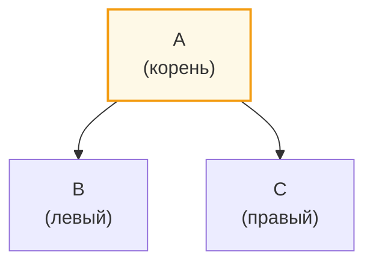
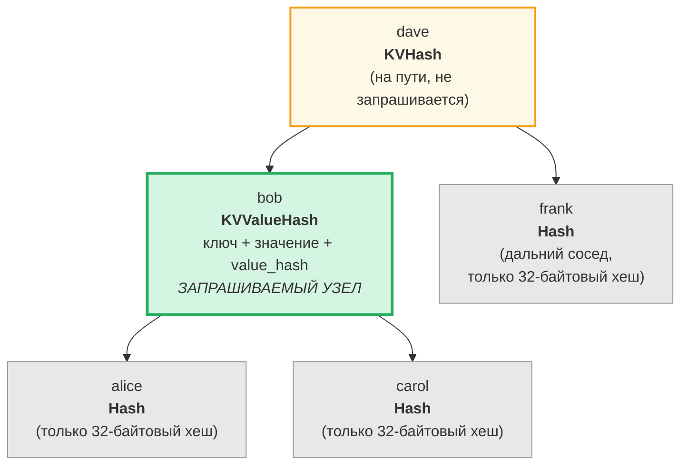
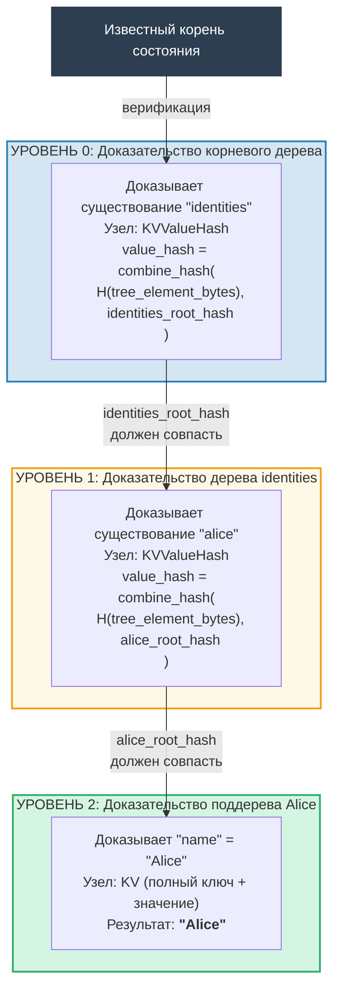
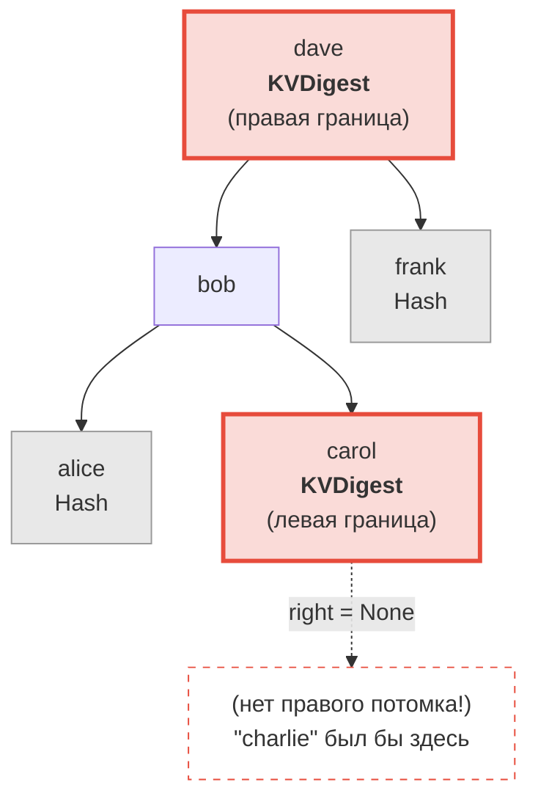
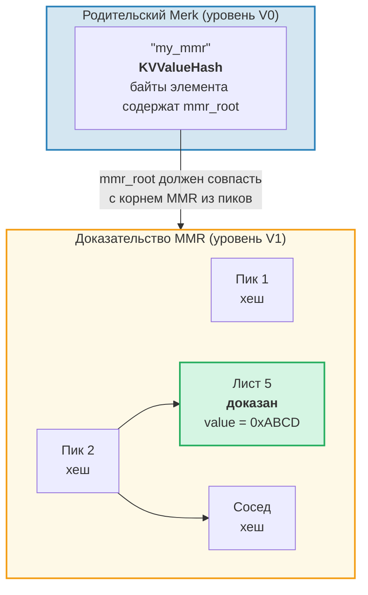
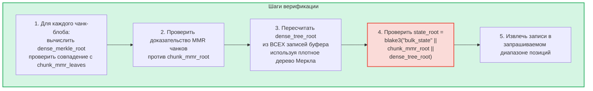
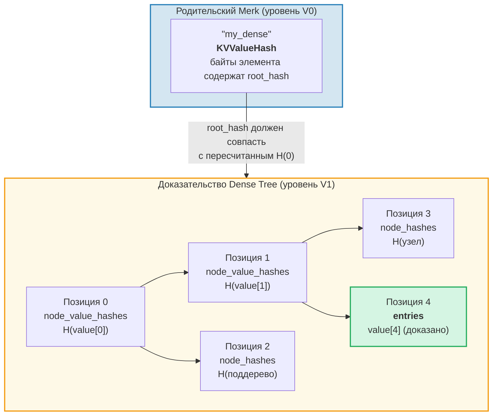

# Система доказательств

Система доказательств GroveDB позволяет любой стороне проверить корректность результатов запроса без наличия полной базы данных. Доказательство — это компактное представление соответствующей структуры дерева, позволяющее восстановить корневой хеш.

## Стековые операции доказательств

Доказательства кодируются как последовательность **операций**, восстанавливающих частичное дерево с помощью стековой машины:

```rust
// merk/src/proofs/mod.rs
pub enum Op {
    Push(Node),        // Push a node onto the stack (ascending key order)
    PushInverted(Node),// Push a node (descending key order)
    Parent,            // Pop parent, pop child → attach child as LEFT of parent
    Child,             // Pop child, pop parent → attach child as RIGHT of parent
    ParentInverted,    // Pop parent, pop child → attach child as RIGHT of parent
    ChildInverted,     // Pop child, pop parent → attach child as LEFT of parent
}
```

Выполнение использует стек:

Операции доказательства: `Push(B), Push(A), Parent, Push(C), Child`

| Шаг | Операция | Стек (вершина→справа) | Действие |
|------|-----------|-------------------|--------|
| 1 | Push(B) | [ B ] | Помещаем B на стек |
| 2 | Push(A) | [ B , A ] | Помещаем A на стек |
| 3 | Parent | [ A{left:B} ] | Извлекаем A (родитель), B (потомок), B → ЛЕВЫЙ от A |
| 4 | Push(C) | [ A{left:B} , C ] | Помещаем C на стек |
| 5 | Child | [ A{left:B, right:C} ] | Извлекаем C (потомок), A (родитель), C → ПРАВЫЙ от A |

Итоговый результат — одно дерево на стеке:



> Верификатор вычисляет `node_hash(A) = Blake3(kv_hash_A || node_hash_B || node_hash_C)` и проверяет совпадение с ожидаемым корневым хешем.

Это функция `execute` (`merk/src/proofs/tree.rs`):

```rust
pub fn execute<I, F>(ops: I, collapse: bool, mut visit_node: F) -> CostResult<Tree, Error>
where
    I: IntoIterator<Item = Result<Op, Error>>,
    F: FnMut(&Node) -> Result<(), Error>,
{
    let mut stack: Vec<Tree> = Vec::with_capacity(32);

    for op in ops {
        match op? {
            Op::Parent => {
                let (mut parent, child) = (try_pop(&mut stack), try_pop(&mut stack));
                parent.left = Some(Child { tree: Box::new(child), hash: child.hash() });
                stack.push(parent);
            }
            Op::Child => {
                let (child, mut parent) = (try_pop(&mut stack), try_pop(&mut stack));
                parent.right = Some(Child { tree: Box::new(child), hash: child.hash() });
                stack.push(parent);
            }
            Op::Push(node) => {
                visit_node(&node)?;
                stack.push(Tree::from(node));
            }
            // ... Inverted variants swap left/right
        }
    }
    // Final item on stack is the root
}
```

## Типы узлов в доказательствах

Каждый `Push` содержит `Node` с информацией, достаточной для верификации:

```rust
pub enum Node {
    // Minimum info — just the hash. Used for distant siblings.
    Hash(CryptoHash),

    // KV hash for nodes on the path but not queried.
    KVHash(CryptoHash),

    // Full key-value for queried items.
    KV(Vec<u8>, Vec<u8>),

    // Key, value, and pre-computed value_hash.
    // Used for subtrees where value_hash = combine_hash(...)
    KVValueHash(Vec<u8>, Vec<u8>, CryptoHash),

    // KV with feature type — for ProvableCountTree or chunk restoration.
    KVValueHashFeatureType(Vec<u8>, Vec<u8>, CryptoHash, TreeFeatureType),

    // Reference: key, dereferenced value, hash of reference element.
    KVRefValueHash(Vec<u8>, Vec<u8>, CryptoHash),

    // For items in ProvableCountTree.
    KVCount(Vec<u8>, Vec<u8>, u64),

    // KV hash + count for non-queried ProvableCountTree nodes.
    KVHashCount(CryptoHash, u64),

    // Reference in ProvableCountTree.
    KVRefValueHashCount(Vec<u8>, Vec<u8>, CryptoHash, u64),

    // For boundary/absence proofs in ProvableCountTree.
    KVDigestCount(Vec<u8>, CryptoHash, u64),

    // Key + value_hash for absence proofs (regular trees).
    KVDigest(Vec<u8>, CryptoHash),
}
```

Выбор типа Node определяет, какая информация нужна верификатору:

**Запрос: «Получить значение для ключа 'bob'»**



> Зелёный = запрашиваемый узел (данные раскрыты полностью). Жёлтый = на пути (только kv_hash). Серый = соседи (только 32-байтовые хеши узлов).

Закодировано как операции доказательства:

| # | Операция | Эффект |
|---|----|----|
| 1 | Push(Hash(alice_node_hash)) | Помещаем хеш alice |
| 2 | Push(KVValueHash("bob", value, value_hash)) | Помещаем bob с полными данными |
| 3 | Parent | alice становится левым потомком bob |
| 4 | Push(Hash(carol_node_hash)) | Помещаем хеш carol |
| 5 | Child | carol становится правым потомком bob |
| 6 | Push(KVHash(dave_kv_hash)) | Помещаем kv_hash dave |
| 7 | Parent | поддерево bob становится левым от dave |
| 8 | Push(Hash(frank_node_hash)) | Помещаем хеш frank |
| 9 | Child | frank становится правым потомком dave |

## Генерация многоуровневых доказательств

Поскольку GroveDB — это дерево деревьев, доказательства охватывают несколько уровней. Каждый уровень доказывает соответствующую часть одного дерева Merk, и уровни связаны механизмом комбинированного value_hash:

**Запрос:** `Get ["identities", "alice", "name"]`



> **Цепочка доверия:** `известный_корень_состояния → верификация уровня 0 → верификация уровня 1 → верификация уровня 2 → "Alice"`. Восстановленный корневой хеш каждого уровня должен совпасть с value_hash из уровня выше.

Верификатор проверяет каждый уровень, подтверждая что:
1. Доказательство уровня восстанавливается в ожидаемый корневой хеш
2. Корневой хеш совпадает с value_hash из родительского уровня
3. Корневой хеш верхнего уровня совпадает с известным корнем состояния

## Верификация доказательств

Верификация следует уровням доказательства снизу вверх или сверху вниз, используя функцию `execute` для восстановления дерева каждого уровня. Метод `Tree::hash()` в дереве доказательства вычисляет хеш на основе типа узла:

```rust
impl Tree {
    pub fn hash(&self) -> CostContext<CryptoHash> {
        match &self.node {
            Node::Hash(hash) => *hash,  // Already a hash, return directly

            Node::KVHash(kv_hash) =>
                node_hash(kv_hash, &self.child_hash(true), &self.child_hash(false)),

            Node::KV(key, value) =>
                kv_hash(key, value)
                    .flat_map(|kv_hash| node_hash(&kv_hash, &left, &right)),

            Node::KVValueHash(key, _, value_hash) =>
                kv_digest_to_kv_hash(key, value_hash)
                    .flat_map(|kv_hash| node_hash(&kv_hash, &left, &right)),

            Node::KVValueHashFeatureType(key, _, value_hash, feature_type) => {
                let kv = kv_digest_to_kv_hash(key, value_hash);
                match feature_type {
                    ProvableCountedMerkNode(count) =>
                        node_hash_with_count(&kv, &left, &right, *count),
                    _ => node_hash(&kv, &left, &right),
                }
            }

            Node::KVRefValueHash(key, referenced_value, ref_element_hash) => {
                let ref_value_hash = value_hash(referenced_value);
                let combined = combine_hash(ref_element_hash, &ref_value_hash);
                let kv = kv_digest_to_kv_hash(key, &combined);
                node_hash(&kv, &left, &right)
            }
            // ... other variants
        }
    }
}
```

## Доказательства отсутствия

GroveDB может доказать, что ключ **не существует**. Для этого используются граничные узлы — узлы, которые были бы соседями отсутствующего ключа, если бы он существовал:

**Доказать:** "charlie" НЕ существует



> **Бинарный поиск:** alice < bob < carol < **"charlie"** < dave < frank. "charlie" находился бы между carol и dave. Правый потомок carol равен `None`, доказывая, что между carol и dave ничего нет. Следовательно, "charlie" не может существовать в этом дереве.

Для диапазонных запросов доказательства отсутствия показывают, что в запрашиваемом диапазоне нет ключей, не включённых в результирующий набор.

## Доказательства V1 — Не-Merk деревья

Система доказательств V0 работает исключительно с поддеревьями Merk, спускаясь уровень за уровнем через иерархию рощи. Однако элементы **CommitmentTree**, **MmrTree**, **BulkAppendTree** и **DenseAppendOnlyFixedSizeTree** хранят свои данные вне дочернего дерева Merk. У них нет дочернего Merk для спуска — их типоспецифичный корневой хеш передаётся как дочерний хеш Merk.

**Формат доказательств V1** расширяет V0 для работы с этими не-Merk деревьями с помощью типоспецифичных структур доказательств:

```rust
/// Which proof format a layer uses.
pub enum ProofBytes {
    Merk(Vec<u8>),            // Standard Merk proof ops
    MMR(Vec<u8>),             // MMR membership proof
    BulkAppendTree(Vec<u8>),  // BulkAppendTree range proof
    DenseTree(Vec<u8>),       // Dense tree inclusion proof
    CommitmentTree(Vec<u8>),  // Sinsemilla root (32 bytes) + BulkAppendTree proof
}

/// One layer of a V1 proof.
pub struct LayerProof {
    pub merk_proof: ProofBytes,
    pub lower_layers: BTreeMap<Vec<u8>, LayerProof>,
}
```

**Правило выбора V0/V1:** Если каждый уровень доказательства — стандартное дерево Merk, `prove_query` создаёт `GroveDBProof::V0` (обратная совместимость). Если любой уровень содержит MmrTree, BulkAppendTree или DenseAppendOnlyFixedSizeTree, создаётся `GroveDBProof::V1`.

### Как доказательства не-Merk деревьев привязываются к корневому хешу

Родительское дерево Merk доказывает сериализованные байты элемента через стандартный узел доказательства Merk (`KVValueHash`). Типоспецифичный корень (например, `mmr_root` или `state_root`) передаётся как **дочерний хеш** Merk — он НЕ встроен в байты элемента:

```text
combined_value_hash = combine_hash(
    Blake3(varint(len) || element_bytes),   ← содержит count, height и т.д.
    type_specific_root                      ← mmr_root / state_root / dense_root
)
```

Затем типоспецифичное доказательство подтверждает, что запрашиваемые данные согласуются с типоспецифичным корнем, использованным в качестве дочернего хеша.

### Доказательства MMR Tree

Доказательство MMR демонстрирует, что конкретные листья существуют на известных позициях внутри MMR, и что корневой хеш MMR совпадает с дочерним хешем, хранящимся в родительском узле Merk:

```rust
pub struct MmrProof {
    pub mmr_size: u64,
    pub proof: MerkleProof,  // ckb_merkle_mountain_range::MerkleProof
    pub leaves: Vec<MmrProofLeaf>,
}

pub struct MmrProofLeaf {
    pub position: u64,       // MMR position
    pub leaf_index: u64,     // Logical leaf index
    pub hash: [u8; 32],      // Leaf hash
    pub value: Vec<u8>,      // Leaf value bytes
}
```



**Ключи запроса — это позиции:** Элементы запроса кодируют позиции как big-endian u64 байты (что сохраняет порядок сортировки). `QueryItem::RangeInclusive` с BE-кодированными начальной/конечной позициями выбирает непрерывный диапазон листьев MMR.

**Верификация:**
1. Восстановить листья `MmrNode` из доказательства
2. Проверить ckb `MerkleProof` против ожидаемого корня MMR из дочернего хеша родительского Merk
3. Перекрёстно проверить, что `proof.mmr_size` совпадает с размером, хранящимся в элементе
4. Вернуть доказанные значения листьев

### Доказательства BulkAppendTree

Доказательства BulkAppendTree сложнее, поскольку данные хранятся в двух местах: запечатанных чанк-блобах и текущем буфере. Доказательство диапазона должно вернуть:

- **Полные чанк-блобы** для каждого завершённого чанка, перекрывающего диапазон запроса
- **Отдельные записи буфера** для позиций, всё ещё находящихся в буфере

```rust
pub struct BulkAppendTreeProof {
    pub chunk_power: u8,
    pub total_count: u64,
    pub chunk_blobs: Vec<(u64, Vec<u8>)>,       // (chunk_index, blob_bytes)
    pub chunk_mmr_size: u64,
    pub chunk_mmr_proof_items: Vec<[u8; 32]>,    // MMR sibling hashes
    pub chunk_mmr_leaves: Vec<(u64, [u8; 32])>,  // (mmr_pos, dense_merkle_root)
    pub buffer_entries: Vec<Vec<u8>>,             // ALL current buffer (dense tree) entries
    pub chunk_mmr_root: [u8; 32],
}
```



> **Зачем включать ВСЕ записи буфера?** Буфер — это плотное дерево Меркла, корневой хеш которого фиксирует каждую запись. Для проверки `dense_tree_root` верификатор должен перестроить дерево из всех записей. Поскольку буфер ограничен `capacity` записями (максимум 65 535), это приемлемо.

**Учёт лимитов:** Каждое отдельное значение (внутри чанка или буфера) учитывается в лимите запроса, а не каждый чанк-блоб целиком. Если запрос имеет `limit: 100`, а чанк содержит 1024 записи, из которых 500 попадают в диапазон, все 500 записей учитываются в лимите.

### Доказательства DenseAppendOnlyFixedSizeTree

Доказательство плотного дерева демонстрирует, что определённые позиции содержат определённые значения, аутентифицированные относительно корневого хеша дерева (который передаётся как дочерний хеш Merk). Все узлы используют `blake3(H(value) || H(left) || H(right))`, поэтому узлам-предкам на пути аутентификации нужен только их 32-байтовый **хеш значения**, а не полное значение.

```rust
pub struct DenseTreeProof {
    pub entries: Vec<(u16, Vec<u8>)>,            // proved (position, value)
    pub node_value_hashes: Vec<(u16, [u8; 32])>, // ancestor value hashes on auth path
    pub node_hashes: Vec<(u16, [u8; 32])>,       // precomputed sibling subtree hashes
}
```

> `height` и `count` берутся из родительского Element (аутентифицированного иерархией Merk), а не из доказательства.



**Верификация** — чистая функция, не требующая хранилища:
1. Построить справочные таблицы из `entries`, `node_value_hashes` и `node_hashes`
2. Рекурсивно пересчитать корневой хеш от позиции 0:
   - Позиция имеет предвычисленный хеш в `node_hashes` → использовать напрямую
   - Позиция со значением в `entries` → `blake3(blake3(value) || H(left) || H(right))`
   - Позиция с хешем в `node_value_hashes` → `blake3(hash || H(left) || H(right))`
   - Позиция `>= count` или `>= capacity` → `[0u8; 32]`
3. Сравнить вычисленный корень с ожидаемым корневым хешем из родительского элемента
4. Вернуть доказанные записи при успехе

**Доказательства нескольких позиций** объединяют перекрывающиеся пути аутентификации: общие предки и их значения присутствуют только один раз, делая их компактнее независимых доказательств.

---
