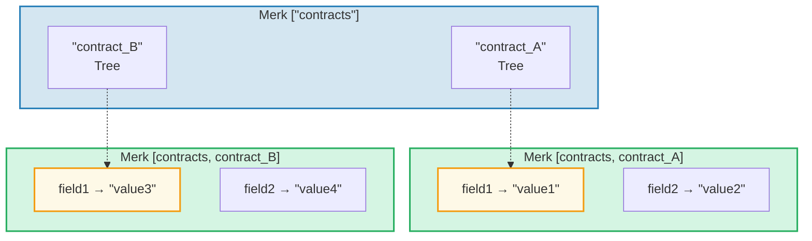
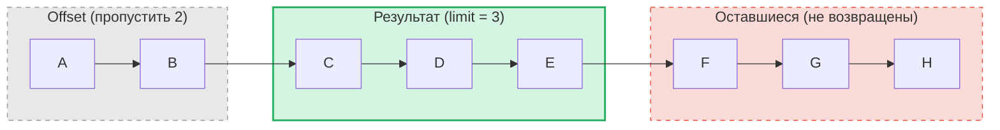

# Система запросов

## Структура PathQuery

Запросы GroveDB используют тип `PathQuery`, комбинирующий путь (где искать) с запросом (что выбрать):

```rust
pub struct PathQuery {
    pub path: Vec<Vec<u8>>,         // Starting path in the grove
    pub query: SizedQuery,          // What to select
}

pub struct SizedQuery {
    pub query: Query,               // The selection criteria
    pub limit: Option<u16>,         // Maximum number of results
    pub offset: Option<u16>,        // Skip first N results
}
```

## Тип Query

```rust
pub struct Query {
    pub items: Vec<QueryItem>,              // What to match
    pub default_subquery_branch: SubqueryBranch,
    pub conditional_subquery_branches: Option<IndexMap<QueryItem, SubqueryBranch>>,
    pub left_to_right: bool,                // Iteration direction
    pub add_parent_tree_on_subquery: bool,  // Include parent tree element in results (v2)
}
```

> **`add_parent_tree_on_subquery`** (v2): Когда `true`, элемент родительского дерева (например, CountTree или SumTree) включается в результаты запроса вместе со значениями его потомков. Это позволяет получить и агрегированные значения, и отдельные элементы в одном запросе.

## QueryItems — Что выбирать

Каждый `QueryItem` определяет ключ или диапазон для сопоставления:

```rust
pub enum QueryItem {
    Key(Vec<u8>),                           // Exact key match
    Range(Range<Vec<u8>>),                  // Exclusive range [start..end)
    RangeInclusive(RangeInclusive<Vec<u8>>),// Inclusive range [start..=end]
    RangeFull(RangeFull),                   // All keys
    RangeFrom(RangeFrom<Vec<u8>>),          // [start..)
    RangeTo(RangeTo<Vec<u8>>),              // [..end)
    RangeToInclusive(RangeToInclusive<Vec<u8>>), // [..=end]
    RangeAfter(RangeFrom<Vec<u8>>),         // (start..) exclusive start
    RangeAfterTo(Range<Vec<u8>>),           // (start..end) exclusive both
    RangeAfterToInclusive(RangeInclusive<Vec<u8>>), // (start..=end]
}
```

Примеры запросов:

Дерево Merk (отсортировано): `alice  bob  carol  dave  eve  frank`

| Запрос | Выборка | Результат |
|--------|---------|-----------|
| `Key("bob")` | alice **[bob]** carol dave eve frank | bob |
| `RangeInclusive("bob"..="dave")` | alice **[bob carol dave]** eve frank | bob, carol, dave |
| `RangeAfter("carol"..)` | alice bob carol **[dave eve frank]** | dave, eve, frank |
| `RangeFull`, limit=2 | **[alice bob]** carol dave eve frank *(остановлено лимитом)* | alice, bob |
| `RangeFull`, limit=2, справа-налево | alice bob carol dave **[eve frank]** *(остановлено лимитом)* | frank, eve |

## Подзапросы и условные ветви

Настоящая мощь запросов GroveDB — это **подзапросы** (subqueries). Когда запрос совпадает с элементом Tree, запрос может автоматически спуститься в это поддерево:



> **PathQuery:** `path: ["contracts"], query: RangeFull` с `default_subquery: Key("field1")`
>
> **Выполнение:**
> 1. `RangeFull` на ["contracts"] → совпадает contract_A, contract_B
> 2. Оба являются элементами Tree → спускаемся с подзапросом `Key("field1")`
> 3. contract_A → "value1", contract_B → "value3"
>
> **Результат:** `["value1", "value3"]`

**Условные подзапросы** позволяют применять разные подзапросы в зависимости от совпавшего ключа:

```rust
conditional_subquery_branches: Some(indexmap! {
    QueryItem::Key(b"contract_A".to_vec()) => SubqueryBranch {
        subquery: Some(Query { items: vec![Key(b"field1".to_vec())] }),
        ..
    },
    QueryItem::Key(b"contract_B".to_vec()) => SubqueryBranch {
        subquery: Some(Query { items: vec![Key(b"field2".to_vec())] }),
        ..
    },
})
```

Это получит `field1` из `contract_A`, но `field2` из `contract_B`.

## Размерные запросы — Limit и Offset

Обёртка `SizedQuery` добавляет пагинацию:



> `SizedQuery { query: RangeFull, limit: Some(3), offset: Some(2) }` → Результат: **[C, D, E]**

В сочетании с `left_to_right: false` итерация разворачивается:

```text
    SizedQuery {
        query: Query { items: [RangeFull], left_to_right: false, .. },
        limit: Some(3),
        offset: None
    }

    Результат: [H, G, F]
```

## Объединение запросов

Несколько PathQuery можно объединить в один запрос для эффективности. Алгоритм объединения находит общие префиксы путей и комбинирует элементы запросов:

```text
    Запрос A: path=["users"], query=Key("alice")
    Запрос B: path=["users"], query=Key("bob")

    Объединённый: path=["users"], query=items=[Key("alice"), Key("bob")]
```

---
